```{r setup, include=FALSE}
knitr::opts_chunk$set(echo = TRUE, warning = FALSE, message = FALSE)
options(kableExtra.auto_format = FALSE)
library("boot")
library("Cairo")
library("cmdstanr")
library("data.table")
library("doParallel")
library("ggdist")
library("ggplot2")
library("ggpubr")
library("ggrepel")
library("kableExtra")
library("knitr")
library("mixtools")
library("parallel")
library("readxl")
library("rnaturalearth")
library("rnaturalearthdata")
library("rstan")
library("sf")
library("zoolog")
#setting resources to do simulations with multicore processing (on Windows)
num_cores <- detectCores(logical = T)
cl <- makeCluster(num_cores - 4) #creating a virtual cluster
registerDoParallel(cl) #registering the cluster
```
\newpage

## ABSTRACT

Understanding the ontogenetic age and sex composition of zooarchaeological assemblages can reveal details about past human hunting and herding strategies as well as past animal morphology and behavior. As such, the accuracy of our estimates underlies our ability to ascertain details about site formation and gain insights into how people interacted with different animals in the past. Unfortunately, our estimates typically rely on only a small number of bones, limiting our ability to fruitfully use these estimates to make meaningful comparisons to theoretical expectations or even between multiple assemblages. This paper describes a method to use zooarchaeological remains with standard biometric measurements to estimate the ontogenetic age and sex composition of the assemblage, focused on immature, adult-sized female, and adult-sized male specimens. The model uses a Bayesian framework to ensure that the parameter estimates are biologically meaningful. Simulated assemblages show that the model can accurately estimate the biometry and composition of zooarchaeological assemblages. Two archaeological case studies also show how the model can be applied to produce tangible insights. The first, focused on sheep from Neolithic Pinarbaşı B, highlights the model’s ability to elucidate site formation and function. The second, focused on cattle remains from four assemblages from 7th-6th Millennium BCE northwestern Anatolia, showcases how to use the mixture modeling results to compare assemblages to one another and to specific hypotheses. This modeling framework provides a new avenue for investigating long-term trajectories in animal biometry alongside contextual analyses of past human choices in butchery and consumption.

**Keywords**: *Zooarchaeology, Biometry, Logarithmic size index (LSI), Domestication, Bayesian statistics*.

\newpage

\linenumbers

## 1. INTRODUCTION

Different hunting and herding strategies target specific classes of animals among a herd that are determined by the animal’s ontogenetic age and sex [@dahl_hjort_1976;@stiner_1990]. In addition to human-driven goals, sex differences in habitat use, diet quality, and reproductive capabilities among ungulate prey species contribute to the susceptibility and desirability of males and females at different ages to human exploitation [@corti_shackleton_2002; @post_etal_2001; @ruckstuhl_neuhaus_2002; @ruckstuhl_2007; @said_etal_2011]. These factors impact the formation of bone assemblages by affecting the probabilities that bones from different classes of animals (e.g., immature, adult female, or adult male animals) are deposited before being mediated by other taphonomic processes [@lyman_2008]. The ontogenetic age and sex composition of zooarchaeological assemblages can therefore reflect anthropologically-relevant aspects of past hunting strategies—like seasonal site use and scale of exploitation [@speth_2013]—or general management goals of past herding strategies [e.g., @payne_1973; @redding_1984].

Reconstructing the ontogenetic age and sex composition of a zooarchaeological assemblage can enrich our understanding of past human-animal interactions by complementing mortality profiles and inter-assemblage comparisons. However, the disaggregated nature of faunal assemblages complicates efforts to conclusively identify the ontogenetic age and sex of a specimen. Because articulated remains are rare, zooarchaeologists typically cannot relate elements that are morphologically distinct between the sexes (e.g., the pelvis) to other elements that can provide information about the animal’s age-at-death (e.g., limb bones or mandibles). We can, though, take advantage of the general pattern of sexual dimorphism among ungulate taxa by using size differences in limb bones to distinguish between males and females.

### *1.1 Morphometric Sex Determination in Zooarchaeology*

Some biometric methods to determine the sex of an animal bone are multivariate—using combinations of measurements with bivariate plots or discriminant functions to predict the sex of archaeological specimens based on distributions of known-sex specimens [e.g., @munro_etal_2011; @speth_1983; @widga_2006]. These methods typically combine dimensions from different planes of an element (e.g., the breadth and depth of a distal articular end) to produce patterns that can be separated by a ‘cut point’ between males and females, either visually in the case of bivariate plots or algorithmically in the case of discriminant functions. The analytical requirement that multiple dimensions of a bone be preserved in measurable condition, even on the same end of an element, may make it difficult to apply these methods to more heavily processed assemblages. Further, specimens from animals that died before reaching adult body size may be misclassified as females, particularly for dimensions affected by post-fusion growth [@popkin_etal_2012].

Other sex determination methods are univariate—they use a single measurement from a specimen and typically use size index methods to associate those measurements from different elements together [e.g., @weinstock_2006; @zeder_lemoine_2020]. This approach allows general descriptions of the sex ratio in an assemblage that can be used to identify changes in these sex ratios or overall biometry over time [e.g., @arbuckle_atici_2013; @grigson_1989]. @zeder_lemoine_2020 go further by using inter-quartile ranges of log size index (LSI) values from their reference population to create ‘cut-off’ values between immature, female, and male specimens to calculate specific ontogenetic age and sex ratios for elements and assemblages.

Regardless of whether the method uses multivariate or univariate data, these sex determination methods tend to have the same weaknesses. Practically, these methods rely on direct comparisons with reference populations (typically, but not always, modern populations of known sex). Thus, the analysis implies that the biometry of the archaeological population is the same as the reference population. However, this implication is an untenable one in most cases, as animal biometry typically varies spatially and temporally due to population-level intra-taxonomic genetic differences caused by adaptation to local climates and ecologies [e.g., @koch_1986; @davis_1982; @wright_vinerdaniels_2015; @hill_etal_2008; @lebenzon_munro_2022]. Biometric variation in wild and domesticated taxa have also been attributed to anthropogenic pressures as a result of herding decisions or hunting pressure [e.g., @arbuckle_kassebaum_2021; @manning_etal_2015; @trentacoste_etal_2021; @grausologestoa_albarella_2019], though harvest pressure has also been attributed to biometric changes in wild taxa [e.g., @wolverton_2008; @munro_etal_2022]. These environmental and anthropogenic pressures may affect males and females differently [e.g., @tchernov_horwitz_1991; @zohary_etal_1998]; pressures that reduce sexual dimorphism could interfere with analyses, as more specimens may be indeterminate or misclassified. Biometric variation between populations can complicate efforts to estimate changes in the demographic (ontogenetic age and sex) composition of assemblages over time. Further, efforts to control for ontogenetic age (e.g., removing unfused specimens or those from early-fusing elements) distorts the relationship between the analyzed specimens and the rest of the assemblage, decreasing our ability to make reliable inferences about the entire assemblage [@zeder_hesse_2000].

Philosophically, sex determinations made by these methods tend to be absolutist: specimens are identified as male or female (or immature) or are marked as indeterminate. As in taxonomic identifications, the use of absolutist determinations masks any underlying uncertainty in the determination [@wolfhagen_price_2017]. Removing indeterminate specimens from consideration artificially reduces sample sizes and inflates reported accuracy rates. This produces a false sense of confidence in the sex determination results, especially when those results are then used to characterize the entire assemblage. More critically, any nuances or caveats in the sex determinations of an assemblage are lost when the results are used in synthetic analyses at larger spatial and temporal scales. What is necessary is a way to estimate the ontogenetic age and sex composition of a faunal assemblage that preserves the uncertainty inherent in the process.

### *1.2 Mixture Modeling in Zooarchaeology*

Mixture modeling provides just such a method, producing probabilistic sex identifications rather than absolute ones by describing an assemblage of faunal measurements as a mixture of specimens from different animal groups (generally termed “mixture components”) like male and female specimens—described by parameters for the proportion of the overall assemblage ($\pi$), average size ($\mu$), and size variability ($\sigma$) of each animal group. A mixture model allows researchers to not only describe the overall composition of the assemblage but to also estimate the probabilities that a specific specimen belongs to a particular animal group [@dong_1997; @monchot_lechelle_2002]. Additionally, mixture modeling does not rely on a reference population, allowing biometric variation between populations and even changes in the extent of sexual dimorphism [e.g., @helmer_etal_2005]. These features allow mixture models the flexibility to track both biometric and demographic variation across assemblages over time and space [e.g., @arbuckle_etal_2016; @arbuckle_kassebaum_2021].

```{r mixture model example, include = FALSE, eval = TRUE}
set.seed(987654321) #remove this line to generalize across iterations
zeder_data <- data.table(read_excel("./Data/1-s2.0-S0305440320300388-mmc2.xlsx", sheet = "Table S4", skip = 2)) #from Zeder and Lemoine (2022)
zeder_tibia_data <- zeder_data[Element %in% "Tibia" & `Age Stage` %in% "Adult" & !is.na(as.numeric(M4)), .(Specimen_ID = paste0(Museum, ".", Specimen), Sex, Locality, Element, Portion, Side = `Side/ Position`, `Proximal Fusion`, `Distal Fusion` = `Distal. Fusion`, M1 = as.numeric(M1), M2 = as.numeric(M2), M3 = as.numeric(M3), M4 = as.numeric(M4))]

#extract standard measurements from zoolog package (Hongo and Meadow 2000)
pig_tibia_standard_measurement <- data.table(referencesDatabase$`Sus scrofa`$Hongo)[EL %in% "Tibia"] #standard value for Tibia Bd is 33.5

#calculate the LSI values
zeder_tibia_data[, LSI := log(M4 / pig_tibia_standard_measurement[Measure %in% "Bd", Standard])]

#run the mixture modeling (# of groups k = 2)
zeder_tibia_normal_mix <- normalmixEM(zeder_tibia_data[, LSI], k = 2)
female_marker <- which.min(zeder_tibia_normal_mix$mu)
male_marker <- which.max(zeder_tibia_normal_mix$mu)
female_parameters <- c(zeder_tibia_normal_mix$lambda[female_marker], zeder_tibia_normal_mix$mu[female_marker], zeder_tibia_normal_mix$sigma[female_marker])
male_parameters <- c(zeder_tibia_normal_mix$lambda[male_marker], zeder_tibia_normal_mix$mu[male_marker], zeder_tibia_normal_mix$sigma[male_marker])

#Create baseline histograms for the composite figure
zeder_tibia_histogram <- ggplot() +
  geom_histogram(data = zeder_tibia_data[, .(Sex, LSI)], binwidth = 0.02, aes(x = LSI, fill = Sex), position = "stack", alpha = 0.8) +
  labs(x = "LSI Value", y = "Frequency", title = "Adult Pig Tibia Bd") +
  theme_classic()
zeder_tibia_noID_histogram <- ggplot() +
  geom_histogram(data = zeder_tibia_data[, .(Sex, LSI)], binwidth = 0.02, aes(x = LSI), fill = "grey", position = "stack", alpha = 0.8) +
  labs(x = "LSI Value", y = "Frequency", title = "Adult Pig Tibia Bd") +
  theme_classic()

#calculate the likelihood values at different LSI values for being male or female
zeder_normal_mix_values <- data.table(
  Sex = rep(c("Female", "Male", "Total"), each = 1000),
  X_Value = rep(seq(-0.1, 0.15, length.out = 1000), 3),
  Fit_Value = c(female_parameters[1] * dnorm(seq(-0.1, 0.15, length.out = 1000), female_parameters[2], female_parameters[3]), male_parameters[1] * dnorm(seq(-0.1, 0.15, length.out = 1000), male_parameters[2], male_parameters[3]), female_parameters[1] * dnorm(seq(-0.1, 0.15, length.out = 1000), female_parameters[2], female_parameters[3]) + male_parameters[1] * dnorm(seq(-0.1, 0.15, length.out = 1000), male_parameters[2], male_parameters[3]))
)

#modify to max out at the max value of the histogram
zeder_normal_mix_values[, Scaled_Fit := .(Fit_Value * (max(layer_data(zeder_tibia_histogram)$count) / max(Fit_Value)))]

#calculate the specimen probabilities of being female (at a given LSI)
female_prob_calc <- function(LSI, female_parameters, male_parameters) {
  #calculates the probability that a specimen with a given LSI value is female based on the mixture model parameters (for a two-member mixture model)
  female_fit <- female_parameters[1] * dnorm(LSI, female_parameters[2], female_parameters[3])
  male_fit <- male_parameters[1] * dnorm(LSI, male_parameters[2], male_parameters[3])
  female_prob <- female_fit / (female_fit + male_fit)
  female_prob
}
zeder_tibia_data[, Prob_Female := female_prob_calc(LSI, female_parameters, male_parameters), paste0(Specimen_ID, ".", Side)]

#calculations for values in the text
example_LSI <- 0.06
zeder_tibia_example_values <- list(
  N_tibia = zeder_tibia_data[, .N],
  example_LSI = example_LSI,
  example_LSI_femaleprob = paste0(100 * round(female_prob_calc(example_LSI, female_parameters, male_parameters), 2), "%"),
  large_LSI = 0.173,
  large_mm = round(exp(0.173) * pig_tibia_standard_measurement[EL %in% "Tibia" & Measure %in% "Bd", Standard], 2),
  large_female_prob = paste0(100 * round(female_prob_calc(0.173, female_parameters, male_parameters), 2), "%")
)

#Table 1: model parameters for the pig tibia Bd mixture model#
zeder_tibia_mixmod_results <- data.table(rbind(signif(female_parameters, 2), signif(male_parameters, 2)))
zeder_tibia_mixmod_results[, Group := c("Female", "Male")]

#run the simulations based on the probability of being female
zeder_tibia_data[, Sim1_Female := rbinom(1,1,prob = Prob_Female), paste0(Specimen_ID, ".", Side)]
zeder_tibia_data[, Sim2_Female := rbinom(1,1,prob = Prob_Female), paste0(Specimen_ID, ".", Side)]
zeder_tibia_data[, Sim3_Female := rbinom(1,1,prob = Prob_Female), paste0(Specimen_ID, ".", Side)]
zeder_tibia_data[, Sim4_Female := rbinom(1,1,prob = Prob_Female), paste0(Specimen_ID, ".", Side)]

#making Figure 1 (mixture model example)
#Figure 1A: histogram with known identities (rescaled to same x scale as 1B)
final_zeder_tibia_histogram <- zeder_tibia_histogram +
  geom_line(data = zeder_normal_mix_values[Sex %in% c("Male", "Female")], aes(x = X_Value, y = Scaled_Fit), color = NA, lwd = 1, linetype = "dashed") +
  scale_color_manual(name = "Sex", values = c("blue", "red"), labels = c("Female", "Male")) +
  scale_fill_manual(name = "Sex", values = c("blue", "red"), labels = c("Female", "Male")) +
  labs(x = "LSI Value", y = "Frequency", title = "Adult Pig Tibia Bd (Known Identities)") +
  theme_classic()

#Figure 1B: fitted histogram with annotations
fitted_zeder_tibia_histogram <-
  zeder_tibia_noID_histogram +
  # geom_rect(data = tibia_histogram_data, aes(xmin = box_min, xmax = box_max, ymin = 0, ymax = Total)) +
  geom_line(data = zeder_normal_mix_values[Sex %in% c("Male", "Female")], aes(x = X_Value, y = Scaled_Fit, color = Sex), lwd = 1, linetype = "dashed") +
  geom_segment(data = data.table(Sex = c("Female", "Male"), Mean = c(female_parameters[2], male_parameters[2]), Fit_Value = c(female_parameters[1] * dnorm(female_parameters[2], female_parameters[2], female_parameters[3]), male_parameters[1] * dnorm(male_parameters[2], male_parameters[2], male_parameters[3])) * zeder_normal_mix_values[, (max(layer_data(zeder_tibia_histogram)$count) / max(Fit_Value))]), aes(x = Mean, xend = Mean, y = 0, yend = Fit_Value, col = Sex), lwd = 1, linetype = "dashed") +
  labs(x = "LSI Value", y = "Frequency", title = "Adult Pig Tibia Bd") +
  scale_color_manual(name = "Sex", values = c("blue", "red"), labels = c("Female", "Male")) +
  scale_fill_manual(name = "Sex", values = c("blue", "red"), labels = c("Female", "Male")) +
  theme_classic() +
  coord_cartesian(ylim = c(0, 6)) +
  labs(title = "Mixture Model Fit") +
  annotate("text", x = -0.10, y = 6, hjust = 0, label = "Mixture~model~formula:~pi[1] %*% Normal(LSI, mu[1], sigma[1]) + pi[2] %*% Normal(LSI, mu[2], sigma[2])", parse = T) +
  # annotate("text", x = -0.10, y = 5.5, hjust = 0, label = paste0("Mixture~model~formula:~", round(female_parameters[1], 2), "%*% Normal(LSI, ", round(female_parameters[2], 2), ", ", round(female_parameters[3], 2), ") + ", round(male_parameters[1], 2), " %*% Normal(LSI, ", round(male_parameters[2], 2), ", ", round(male_parameters[3], 2), ")"), parse = T) +
  #adding an identification
  annotate("segment", x = 0.06, xend = 0.06, y = 0, yend = 4.5, linetype = "dotted") +
  annotate("point", x = 0.06, y = 4.5) +
  annotate("text", x = 0.0625, y = 4.5, hjust = 0, label = paste0("P(Female) = ", 100 * round(female_prob_calc(0.06, female_parameters, male_parameters), 2), "%"))

#Figure 1C: simulations based on the specimen probabilities
sim1_plot <- ggplot() +
  geom_histogram(data = zeder_tibia_data[, .(Sex = ifelse(Sim1_Female == 1, "Female", "Male"), LSI)], binwidth = 0.02, aes(x = LSI, fill = Sex), position = "stack", alpha = 0.8) +
  geom_line(data = zeder_normal_mix_values[Sex %in% c("Male", "Female")], aes(x = X_Value, y = Scaled_Fit), color = NA, lwd = 1, linetype = "dashed") +
  scale_color_manual(name = "Sex", values = c("blue", "red"), labels = c("Female", "Male")) +
  scale_fill_manual(name = "Sex", values = c("blue", "red"), labels = c("Female", "Male")) +
  labs(x = "LSI Value", y = "Frequency") +
  theme_classic() +
  theme(axis.title = element_blank())
#
sim2_plot <- ggplot() +
  geom_histogram(data = zeder_tibia_data[, .(Sex = ifelse(Sim2_Female == 1, "Female", "Male"), LSI)], binwidth = 0.02, aes(x = LSI, fill = Sex), position = "stack", alpha = 0.8) +
  geom_line(data = zeder_normal_mix_values[Sex %in% c("Male", "Female")], aes(x = X_Value, y = Scaled_Fit), color = NA, lwd = 1, linetype = "dashed") +
  scale_color_manual(name = "Sex", values = c("blue", "red"), labels = c("Female", "Male")) +
  scale_fill_manual(name = "Sex", values = c("blue", "red"), labels = c("Female", "Male")) +
  labs(x = "LSI Value", y = "Frequency") +
  theme_classic() +
  theme(axis.title = element_blank())
#
sim3_plot <- ggplot() +
  geom_histogram(data = zeder_tibia_data[, .(Sex = ifelse(Sim3_Female == 1, "Female", "Male"), LSI)], binwidth = 0.02, aes(x = LSI, fill = Sex), position = "stack", alpha = 0.8) +
  geom_line(data = zeder_normal_mix_values[Sex %in% c("Male", "Female")], aes(x = X_Value, y = Scaled_Fit), color = NA, lwd = 1, linetype = "dashed") +
  scale_color_manual(name = "Sex", values = c("blue", "red"), labels = c("Female", "Male")) +
  scale_fill_manual(name = "Sex", values = c("blue", "red"), labels = c("Female", "Male")) +
  labs(x = "LSI Value", y = "Frequency") +
  theme_classic() +
  theme(axis.title = element_blank())
#
sim4_plot <- ggplot() +
  geom_histogram(data = zeder_tibia_data[, .(Sex = ifelse(Sim4_Female == 1, "Female", "Male"), LSI)], binwidth = 0.02, aes(x = LSI, fill = Sex), position = "stack", alpha = 0.8) +
  geom_line(data = zeder_normal_mix_values[Sex %in% c("Male", "Female")], aes(x = X_Value, y = Scaled_Fit), color = NA, lwd = 1, linetype = "dashed") +
  scale_color_manual(name = "Sex", values = c("blue", "red"), labels = c("Female", "Male")) +
  scale_fill_manual(name = "Sex", values = c("blue", "red"), labels = c("Female", "Male")) +
  labs(x = "LSI Value", y = "Frequency") +
  theme_classic() +
  theme(axis.title = element_blank())
#
simulated_zeder_tibia_histograms <- ggarrange(sim1_plot, sim2_plot, sim3_plot, sim4_plot, nrow = 2, ncol = 2, common.legend = T, legend = "none")
simulated_zeder_tibia_histograms <- annotate_figure(simulated_zeder_tibia_histograms, top = "Simulated Histograms")
figure_1 <- ggarrange(final_zeder_tibia_histogram, fitted_zeder_tibia_histogram, simulated_zeder_tibia_histograms, nrow = 3, ncol = 1, common.legend = T, legend = "bottom", labels = c("A", "B", "C"))

Cairo(width = 8, height = 8, units = "in", file = "./Output/Figures/figure_1.png", type = "png", dpi = 600)
figure_1
dev.off()
```

Conceptually, a mixture model can be thought of as a “latent state” or “missing data” problem: we know that measured specimens come from particular animal groups, but that information has been lost [@marin_etal_2005]. If we knew every specimen’s group identity, then the calculation of the mixture model parameters (mixture proportion, average body size, and size variability for each animal group) would be trivial. In archaeological contexts, however, we cannot directly observe those group identities; we must therefore use probabilities of group membership and calculate group-specific parameters from those resulting probabilities [@monchot_lechelle_2002]. Figure 1 describes a schematic example of a mixture model: Figure 1A shows the distribution of LSI values from a reference population of `r zeder_tibia_example_values$N_tibia` adult pig (*Sus domesticus*) tibia distal breadths [Tibia Bd: @vondendriesch_1976] described in @zeder_lemoine_2020, with specimens colored by their known identity (females = blue, males = red). Figure 1B shows the results of fitting a two-component (females and males) mixture model to the data using standard approaches [e.g., @monchot_lechelle_2002; @arbuckle_kassebaum_2021], ignoring those true identities.

```{r figure_1, echo = FALSE, warning = FALSE, fig.align = "center", out.width = "\\textwidth", fig.cap = "Walkthrough of the mixture modeling procedure using pig Tibia Bd measurements from Zeder and Lemoine (2022). A: the distribution of Tibia Bd LSI values (standard value: 33.5 mm; Hongo and Meadow 2000) of adult specimens, shaded by known sex (females = blue, males = red). B: The result of a standard (non-Bayesian) mixture model analysis on the LSI values, ignoring sex. Vertical lines show the estimated means for females and males; curves show the relative probability densities for the two distributions. C: Four simulations using the membership probabilities of each specimen based on the mixture model results."}
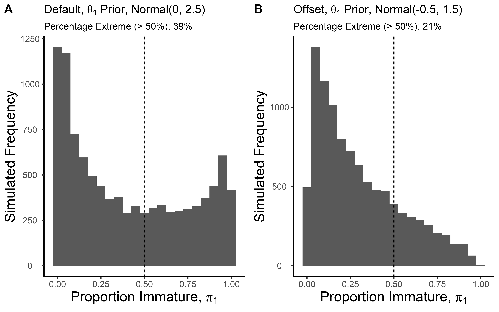
```

The mixture model describes the assemblage as a mixture of the two ‘mixture components’ (males and females): each component is described with three parameters: a proportion ($\pi$), an average size ($\mu$), and a standard deviation ($\sigma$). Taken together, these parameters determine a specimen’s probability of being in one of the groups, as shown in Figure 1B; a specimen with an $\operatorname{LSI}_{e}$ value of `r zeder_tibia_example_values$example_LSI` has a `r zeder_tibia_example_values$example_LSI_femaleprob` probability of being female based on the model. This results in `r zeder_tibia_example_values$N_tibia` sets of probabilities, one for each specimen; Figure 1C shows four plausible simulated assemblages that result from the mixture model; every specimen’s membership probability is used to simulate a ‘true’ identity. Importantly, by leaving the mixture model results as specimen-specific probabilities of being female or male, mixture model results retain the uncertainty of the sex determination process: that is, a specimen with a 51% probability of being female is not treated as equivalent to one with a 95% probability of being female.

The previous example showcases the benefits of mixture modeling as a flexible probabilistic sex determination method. First, the model does not require comparison to a reference population to estimate differences between female and male specimens. Second, the model produces parametric estimates of body size and size variability that can be used for inter-site comparisons, rather than just determinations for the included specimens. Finally, the model produces probabilistic estimates for every specimen, rather than leaving some specimens indeterminate and obscuring variation in the confidence of the sex assignments. These theoretical and practical advantages of mixture modeling and its potentials for zooarchaeology have been apparent since its introduction to the field [e.g., @dong_1997; @monchot_lechelle_2002; @monchot_etal_2005], though its application has been piecemeal over the past two decades despite the existence of free scientific software that can perform the analysis [e.g., PAST: @PAST; R packages “mixtools” and “mclust”: @mixtools; @mclust].

The reasons for the patchy application of mixture modeling in zooarchaeology are less straightforward. High-profile early case studies of mixture modeling report size variability parameters (standard deviation $\sigma$) that vary widely and include very small values for some groups [e.g., @decupere_etal_2005; @monchot_etal_2005; @vigne_2011]. These results suggest that the very flexibility that is a great strength of mixture modeling is actually identifying ‘groups’ that are not necessarily consistent with biological expectations (e.g., that the results are “overfitted” to the observed data). Such extreme differences in the standard deviation of different groups can result in counterintuitive implications: specimens may be considered more likely to come from the broad distribution (the one with the larger 𝜎 parameter) than the narrow distribution even when the value is more extreme than the narrow distribution’s mean (e.g., is larger than a larger mean or smaller than a smaller mean). Returning to the mixture model example in Figure 1 can explain this issue more clearly. Table 1 shows the mixture model parameters for the two components: the standard deviation ($\sigma$) for females is more than twice the standard deviation for males ($\sigma_{1}$ = `r zeder_tibia_mixmod_results[Group %in% "Female", V3]`, $\sigma_{2}$ = `r zeder_tibia_mixmod_results[Group %in% "Male", V3]`). As such, higher numbers beyond the observed range will be considered likely females: an $\operatorname{LSI}_{e}$ value of `r zeder_tibia_example_values$large_LSI` (Tibia Bd value: `r zeder_tibia_example_values$large_mm` mm) is more likely to be a female than a male using the mixture model’s results (probability of being female: `r zeder_tibia_example_values$large_female_prob`).

```{r table_1, echo = FALSE}
kbl(zeder_tibia_mixmod_results[, .(Group, V1, V2, V3)],
    col.names = c("Group", "Mixture Component $\\pi$", "Average Size $\\mu$", "Size Variability $\\sigma$"),
    caption = "Mixture model parameter estimates for the pig distal tibia Bd example. Estimates calculated using maximum-likelihood approaches.",
    booktabs = T, escape = FALSE, linesep = c('')) %>%
  kable_styling(latex_options = c("HOLD_position")) %>%
  column_spec(1, border_right = T) %>%
  row_spec(0, align = "c")
```

Published mixture model examples show this issue, as well. @decupere_etal_2005[Table 2] report three groups of chicken carpometacarpus lengths from bones with medullary bone, providing the full set of mixture model parameters (Group 1: proportion $\pi$ = 0.285, mean $\mu$ = 33.337, standard deviation $\sigma$ = 0.3; Group 2: $\pi$ = 0.608, $\mu$ = 35.416, $\sigma$ = 0.433; Group 3: $\pi$ = 0.107, $\mu$ = 37.866, $\sigma$ = 0.094). According to @decupere_etal_2005[Figure 3], there is one carpometacarpus with a medullary bone whose greatest length is roughly 41.5 mm. Counterintuitively, the analysis would suggest that this specimen is most likely to be a member of Group 2; it even determines that the specimen is more likely to be a member of Group 1 than Group 3. @vigne_2011[Table 3A] reports mixture modeling results of $\operatorname{LSI}_{10}$ values from cattle recovered from Neolithic Shillourokambos, Cyprus to estimate females and males, using PAST [@PAST]. The reported values for the Recentes phase (Female $\pi$ = 0.75, $\mu$ = 0.120, $\sigma$ = 0.042; Male $\pi$ = 0.25, $\mu$ = 0.163, $\sigma$ = 0.007) produce counterintuitive results: a specimen with an LSI value of 0.176—within the range of LSI values from this phase [@vigne_2011: Figure 2]—would be considered more likely to be female than male. These issues extend to more recent publications. @arbuckle_etal_2016[Figure 5] report sex-specific $\operatorname{LSI}_{10}$ average sizes for cattle in the Eastern Fertile Crescent during the early-mid Holocene; because they report their $\operatorname{LSI}_{10}$ data in a supplement, it can be shown that the smallest measurement from Ganj Dareh ($\operatorname{LSI}_{10}$ = -0.044, modeled female mean = -0.019, modeled male mean = 0.024) is considered more likely to be male than female due to the extreme differences in standard deviations.

These examples highlight the difficulties researchers face when interpreting the results of mixture analyses of zooarchaeological data. While mixture modeling provides the flexibility to model data from a pre-specified or unknown number of groups, there is no guarantee that the identified ‘groups’ are biologically meaningful. Analysts may identify inconsistent results from mixture analyses and exclude the analysis from reports, leaving only mixture analyses that appear to have interpretable results [the “file drawer problem”: @rosenthal_1979]. As these examples show, however, mixture analyses applied to more abstract quantities, like LSI values, or interpreted in light of less easily interpreted biological groups, like breeds, can have counterintuitive implications. These examples are not meant to highlight the errors; on the contrary, the fact that the authors report their full model results and/or data mean that such errors could be identified, highlighting the importance of open scientific reporting and publishing [@marwick_2017; @ram_marwick_2018].

Zooarchaeologists have a wealth of reference information that can inform them about the impacts of diet, sex, castration, and other factors on the size and variability of animal bones. These reference populations provide raw measurements from several taxa and generally include specimens of known age-at-death and sex, though sometimes these include archaeological data of (relatively) complete individuals that can be assigned to sex [e.g., sheep: @popkin_etal_2012; @davis_1996; @davis_2000; pigs: @zeder_lemoine_2020; @payne_bull_1988; aurochsen/cattle: @degerbol_1970; bison: @speth_1983; @todd_1983]. These data can provide useful information that could be relevant for interpreting a mixture model analysis; ideally, one could take advantage of relevant information from reference populations while still maintaining some aspects of a mixture model’s flexibility. Unfortunately, standard mixture modeling algorithms do not provide a straightforward way to ensure that the model parameters ($\mu$ and $\sigma$) for the groups accord with our understanding of these parameters from reference populations. Bayesian inference, however, does provide a way to do this very thing by using data from reference populations to create prior distributions for mixture model parameters. Using prior distributions improves overall model performance because the analyst can use these sources of ‘prior knowledge’ to inform them about the data that they have on-hand [@otarolacastillo_etal_2022].

This paper describes a Bayesian approach to the mixture model analysis of faunal measurements that addresses these weaknesses of mixture modeling as currently applied. The model uses informative priors derived from a ‘prior assemblage’ of known age-at-death and sex individuals to constrain population parameter estimates to be biologically interpretable [@popkin_etal_2012]. It also uses multilevel modeling to take advantage of partial pooling and address aggregation issues to directly estimate parameters for each measured dimension in the analysis [@gelman_2006_hierarchical_modeling; @wolfhagen_2020]. In addition to modeling females and males, the model includes a third group consisting of “immature” specimens that died before reaching adult body size. The model also emphasizes inference of the entire assemblage rather than just the measured specimens by incorporating observations of the sex ratio (from morphological data) and the proportion of immature specimens (from fusion data) to inform population parameters of the proportions of these different groups. The model is used on sixteen simulated assemblages derived from the @popkin_etal_2012 Shetland sheep (*Ovis aries*) population to test its ability to accurately estimate the age and sex composition of assemblages. Two archaeological case studies then show the applicability of the model to archaeological assemblages for reconstructing the age and sex composition of assemblages and to highlight the importance of incorporating immature specimens into mixture modeling analyses.

## 2. A BAYESIAN MULTILEVEL MIXTURE MODEL FOR ZOOARCHAEOLOGICAL MEASUREMENTS

The Bayesian model developed for this paper improves on standard mixture modeling for zooarchaeological measurements in four distinct ways. First, it addresses complications caused by measurements from unfused specimens and post-fusion growth by modeling three groups within the mixture: immature animals, (adult-sized) females, and (adult-sized) males, each with distinct size parameters. Second, the multilevel structure allows the model to balance bias due to aggregation and overfitting from small sample sizes. Third, the Bayesian foundation of the model provides an avenue for synthesizing information about the ontogenetic age and sex composition of the assemblage from non-metrical data (e.g., fusion rates, sex ratios based on morphological data) to inform the results of the mixture model. Finally, researchers can create prior distributions for mixture model parameters from prior assemblages or other sources, ensuring that the mixture model results are biologically interpretable. This section outlines these benefits; specific details of the model are described in a Model Supplement and in the analytical code (available at the project’s [GitHub page](https://github.com/wolfhagenj/ZooarchMixMod)).

Observed measurements from different dimensions [e.g., humerus distal breadth "Humerus Bd", radius proximal breadth "Radius Bp", abbreviations following @vondendriesch_1976] are first converted to logarithmic size index (LSI) values using a natural logarithm base to take advantage of the normalization LSI standardization provides [@meadow_1999; @wolfhagen_2020]. The model uses a single LSI value per specimen, so any specimens with multiple observed dimensions are first summarized by estimating the mean LSI value from the observed dimensions; these specimen-level LSI values are the basis for the mixture model. These specimen-level LSI values can be clustered into different element portions—partial or complete elements that are the basic categorical unit of an analysis [e.g., “distal humerus” or “first phalanx”; compare to “skeletal part type” in @breslawski_2022]. Table 2 provides a glossary of the key terms used in this text.

```{r table_2: make definitions table, echo = FALSE}
definitions <- data.table(
  Term = c("Element Portion", "Dimension", "Measured Assemblage", "Modeled Assemblage", "Full Assemblage"),
  Definition = c('A complete or partial skeletal element defined by the zooarchaeologist, used as the foundation of the multilevel model (e.g., "distal humerus"). Model produces parameter estimates for all defined element portions, so element portions must be non-overlapping. Analogous to "skeletal part type" in Breslawski (2022).',
                 'Specific type of observed measurement (e.g., "humerus distal breadth") on a specimen. Dimension definitions typically follow von den Driesch (1976).',
                 'Assemblage of measured specimens from a defined number of element portions of a specific taxon.',
                 'Assemblage of specimens from a defined number of element portions of a specific taxon. Includes measured and non-measured specimens, though all element portions must have some number of measured specimens. Measurability is assumed to be effectively random (i.e., unrelated to whether the specimen came from an immature, female, or male individual).',
                 'Assemblage of specimens from a defined number of element portions of a specific taxon. Includes element portions that do not have any observed measurements. Measurability is assumed to be effectively random (i.e., unrelated to whether a specimen came from an immature, female, or male individual).')
)

kbl(definitions,
    col.names = c("Term", "Definition"),
    caption = "Definitions of key terms used in this paper",
    booktabs = T, linesep = c('\\addlinespace')) %>%
  kable_styling(latex_options = c("HOLD_position")) %>%
  column_spec(1, border_right = T, width = "12em", bold = T) %>%
  column_spec(2, width = "35em") %>%
  row_spec(0, bold = T)
```

### *2.1 Benefits of the Bayesian Multilevel Mixture Model*

Body size is affected by both ontogenetic age and sex; animals killed before reaching adult body size pose a complication for most sex determination models, which exclusively focus on distinguishing between (adult-size) female and male animals [but see @zeder_lemoine_2020]. Measurements from known age-at-death Shetland sheep show that specimens killed younger than one year of age are significantly smaller than those killed at older ages, regardless of fusion status and sex; after one year of age, size is no longer significantly impacted by age [@popkin_etal_2012]. Thus, any measurement from an unfused epiphysis or from an element portion that does not fuse or exhibits significant post-fusion growth should be considered potentially immature and needs to be modeled with a three-member mixture model (Group 1 = immature, Group 2 = adult female, and Group 3 = adult males). On the other hand, the model excludes the possibility that measurements from specimens that are conclusively not immature due to their fusion status could be from the immature group ($\pi_{1} = 0$), effectively fitting a two-member mixture model (adult females and adult males).

Typically, biometric analyses aggregate LSI values from different element portions [e.g., @vigne_2011; @sasson_arter_2020; @arbuckle_kassebaum_2021]; aggregation produces bias because it assumes that every element portion has the same parameter value [@wolfhagen_2020]. Multilevel modeling uses partial pooling to allow the cluster-specific parameters to vary between clusters while reducing overfitting caused by small sample sizes [@mcelreath_2020_rethinkingbook; @fernee_trimmis_2021]. In the case of this mixture models, element portions are the relevant clusters—the multilevel model produces a set of mixture model parameters for each element portion (a set of $\pi$, $\mu$, and $\sigma$ parameters for each of the three animal groups). These cluster-specific parameters are related to each other through “hyper-parameters” that describe the average value of the mixture model parameters and the variability of model parameters across element portions [@wolfhagen_2020]. This structure reduces overfitting caused by small sample sizes among some clusters while also avoiding the bias caused by aggregating all clusters together.

Of course, biometric data are not the only source of information on an assemblage’s ontogenetic age and sex composition. Fusion rates of elements that fuse around the age that animals reach adult body size can provide relevant information on the proportion of immature specimens in the assemblage [e.g., first and second phalanges in sheep: @popkin_etal_2012], just as sex ratios derived from morphologically distinct adult elements provide information about the adult sex ratio in an assemblage [e.g., fully fused pelvises: @stiner_etal_2022; horn cores: @twiss_russell_2009]. These estimates of assemblage composition do not supersede those produced by a mixture model, but they are also not irrelevant to the composition from a mixture model. Unlike other sex determination methods, the multilevel structure of the Bayesian multilevel mixture model allows the analyst to inform their model results with relevant fusion and morphological sex data from the assemblage. These data do not determine the proportion of immature animals and the adult sex ratio of the mixture model, but they do help the model make more precise estimates of the ontogenetic age and sex composition of the assemblage than possible with the measurement data alone.

Relevant information from a prior distribution can inform an analyst about reasonable values for the model’s hyper-parameters, which can be summarized as prior distributions. Creating informed prior distributions allows the model to ensure that the hyper-parameters have biologically interpretable results (e.g., average size and size variability parameters for a measurement that align with reasonable expectations for a taxon). The multilevel structure of the model then ensures that mixture model parameters can vary between different element portions while still being informed by these hyper-parameters to maintain biological interpretability, even with small numbers of observations. Prior distributions draw explicit links between our sources of prior knowledge (e.g., reference populations, ethnographic data, ecological data) and our archaeological data. Unlike absolutist models, we can define the prior distributions used in the Bayesian multilevel mixture model to be less specifically focused on the parameter values of the prior assemblage. Increasing the uncertainty of assemblage-derived prior distributions allows the mixture model to adjust to biometric differences between the prior assemblage and the assemblage being fit by the model. Care must still be taken to ensure that prior distribution definitions are at appropriate scales for the observations and not so broad as to include values that are known to be physically impossible [e.g., @gabry_etal_2019].

### *2.2 Developing Prior Distributions from a Prior Assemblage*

Prior distributions are central to Bayesian inference and describe one’s prior beliefs in potential values of a model parameter. Prior distributions can be likened to a ‘filter’ from which parameter values are drawn to evaluate their fit with the data [@smith_gelfand_1992]. Several approaches exist for deciding how to describe this prior belief, ranging from ‘objective’ priors that provide equal weight to all possible values of a parameter to distinct distributions defined by a synthesis of previous or related research [@gelman_2006_priors]. Objective priors poorly reflect our intuition about phenomena we are modeling, waste computing effort by sampling parameter values that poorly fit the data, and can introduce errors into our analyses [@gabry_etal_2019]; instead, ‘weakly informative priors’ or ‘reference priors’ use transformations of parameter values—like centering and scaling element portion-specific parameters—to describe variation in parameter values within reasonable values, with small deviations being more likely than large deviations [@gelman_etal_2008]. Informative priors are derived from relevant knowledge, be it the results of earlier studies on the same subject, the quantification of expert opinion, or parameter values for related subjects [@mccarthy_masters_2005; @otarolacastillo_etal_2022]. Regardless of the distribution’s source, it is important to evaluate how well the distribution reflects your prior knowledge about the system under study because the prior distributions influence the results of the analysis.

The mixture proportions summarize the composition of the assemblage and mediate the relative likelihoods of the different animal groups, adjusting a specimen’s membership probabilities. Prior distributions for the mixture components reflect our prior beliefs about the relative proportions of immature, adult-sized females, and adult-sized males in the assemblage. Instead of estimating the prior belief for each of these three related categories, the model uses two prior distributions to estimate independent variables: the proportion of immature animals ($\pi_{1}$) and the adult sex ratio estimated through the relative proportion of adult females ($\frac{\pi_2}{\pi_2 + \pi_3}$) (see Model Supplement for more details). The following examples show some of the flexibility researchers have when describing their prior belief about the proportion of immature animals or the adult sex ratio in an assemblage; the Model Supplement shows the mathematical details necessary to create relevant prior distributions for a model.

```{r simulating different priors of demographic variables, include = FALSE, eval = TRUE}
#simulate a demographic variable from three distributions
#definitely not the extremes but uncertain otherwise
theta_rare_extremes <- rnorm(1e5, 0, 1.25)
#likely one of the two extremes, unlikely in between
theta_common_extremes <- rnorm(1e5, 0, 7)
#precisely near a specific value (0.67)
theta_precise <- rnorm(1e5, 0.7, 0.15)

#plot out the distributions
theta_rare_extremes_plot <- 
  ggplot(data.frame(pi = boot::inv.logit(theta_rare_extremes))) + aes(x = pi) +
  geom_histogram(binwidth = 0.05) +
  geom_vline(xintercept = c(0.1, 0.9), linetype = "dashed") +
  labs(title = expression(paste('"Rare Extremes" ', theta, " Prior, Normal(0, 1.25)")), subtitle = paste0("Percentage Extreme (> 90% or < 10%): ", round(100 * mean(boot::inv.logit(theta_rare_extremes) < 0.1 | boot::inv.logit(theta_rare_extremes) > 0.9), 0), "%"), x = expression(paste("Proportion")), y = "Simulated Frequency") +
  theme_classic() + theme(legend.text = element_text(size = 10), legend.position = "bottom", legend.justification = c("center"), legend.box.just = "right", legend.margin = margin(6, 6, 6, 6), axis.text.x = element_text(size = 10), axis.title = element_text(size = 16), axis.text.y = element_text(angle = 0, size = 10, hjust = 0.5))
#
theta_common_extremes_plot <- 
  ggplot(data.frame(pi = boot::inv.logit(theta_common_extremes))) + aes(x = pi) +
  geom_histogram(binwidth = 0.05) +
  geom_vline(xintercept = c(0.1, 0.9), linetype = "dashed") +
  labs(title = expression(paste('"Common Extremes" ', theta, " Prior, Normal(0, 7)")), subtitle = paste0("Percentage Extreme (> 90% or < 10%): ", round(100 * mean(boot::inv.logit(theta_common_extremes) < 0.1 | boot::inv.logit(theta_common_extremes) > 0.9), 0), "%"), x = expression(paste("Proportion")), y = "Simulated Frequency") +
  theme_classic() + theme(legend.text = element_text(size = 10), legend.position = "bottom", legend.justification = c("center"), legend.box.just = "right", legend.margin = margin(6, 6, 6, 6), axis.text.x = element_text(size = 10), axis.title = element_text(size = 16), axis.text.y = element_text(angle = 0, size = 10, hjust = 0.5))
#
theta_precise_plot <- 
  ggplot(data.frame(pi = boot::inv.logit(theta_precise))) + aes(x = pi) +
  geom_histogram(binwidth = 0.05) +
  geom_vline(xintercept = c(0.67), linetype = "dashed") +
  coord_cartesian(xlim = c(0, 1)) +
  labs(title = expression(paste('"Precise" ', theta, " Prior, Normal(0.7, 0.15)")), subtitle = paste0("95% Quantiles: ", round(100 * quantile(boot::inv.logit(theta_precise), 0.025), 0), "-", round(100 * quantile(boot::inv.logit(theta_precise), 0.975), 0), "%"), x = expression(paste("Proportion")), y = "Simulated Frequency") +
  theme_classic() + theme(legend.text = element_text(size = 10), legend.position = "bottom", legend.justification = c("center"), legend.box.just = "right", legend.margin = margin(6, 6, 6, 6), axis.text.x = element_text(size = 10), axis.title = element_text(size = 16), axis.text.y = element_text(angle = 0, size = 10, hjust = 0.5))

#
figure_2 <- ggarrange(theta_rare_extremes_plot, theta_common_extremes_plot, theta_precise_plot, nrow = 3, ncol = 1, common.legend = T, legend = "bottom", labels = c("A", "B", "C"))
#
Cairo(width = 10, height = 10, units = "in", file = "./Output/Figures/figure_2.png", type = "png", dpi = 600)
figure_2
dev.off()
```

```{r prior distributions for biological parameters, include = FALSE, eval = TRUE}
####SET SEED: REMOVE TO GENERALIZE####
set.seed(1234567890)
#Import data
sheep_data <- fread("./Data/1-s2.0-S0305440312000301-mmc1.csv", nrows = 356) #accessible from https://doi.org/10.1016/j.jas.2012.01.018 supplementary table, resaved as a .CSV

#Make variable for immature animals (`Days at Death` <= 365), female animals (not-immature), and male/castrated animals (not-immature)
sheep_data[, Immature := ifelse(`Days at Death` <= 365, 1, 0)]
sheep_data[, Female := ifelse(`Days at Death` > 365 & Sex %in% "Female", 1, 0)]
sheep_data[, Male := ifelse(`Days at Death` > 365 & Sex %in% c("Castrate", "Male"), 1, 0)]

#Reframe the sheep data to be set in a long format
sheep_longdata <- melt(sheep_data, id.vars = c("Accession  no", "Sex", "Immature", "Female", "Male", "Sca_coracoid_fus", "Hum_prox_fus", "Hum_dist_fus", "Rad_prox_fus", "Rad_dist_fus", "Mtc_dist_fus", "Pel_acetabulum_fus", "Fem_caput_fus", "Fem_dist_fus", "Tib_prox_fus", "Tib_dist_fus", "Mtt_dist_fus", "Cal_prox_fus"), measure.vars = names(sheep_data[, Sca_GLP:Cal_GDde]), variable.name = "Measurement", value.name = "Measurement_value")
sheep_longdata[, Element := tstrsplit(Measurement, "_")[1]]

#Get the standard animal from zoolog
sheep_standard_animal <- data.table(referencesDatabase$`Ovis orientalis`$Uerpmann)

#Keep only limb breadth bone measurements for the mixture model
sheep_mixmod_data <- sheep_longdata[Measurement %in% c("Sca_GLP", "Hum_Bd", "Hum_BT", "Rad_Bp", "Rad_Bd", "Mtc_Bp", "Mtc_BFd", "Fem_Bd", "Tib_Bd", "Ast_Bd", "Mtt_Bp", "Mtt_BFd")]

#Rename standard animal measurements to match the names in the dataset
sheep_standard_animal[EL %in% "Scapula", c("Element", "Measurement") := .("Sca", paste("Sca", Measure, sep = "_"))]
sheep_standard_animal[EL %in% "Humerus", c("Element", "Measurement") := .("Hum", paste("Hum", Measure, sep = "_"))]
sheep_standard_animal[EL %in% "Radius", c("Element", "Measurement") := .("Rad", paste("Rad", Measure, sep = "_"))]
sheep_standard_animal[EL %in% "Metacarpus", c("Element", "Measurement") := .("Mtc", paste("Mtc", Measure, sep = "_"))]
sheep_standard_animal[EL %in% "Femur", c("Element", "Measurement") := .("Fem", paste("Fem", Measure, sep = "_"))]
sheep_standard_animal[EL %in% "Tibia", c("Element", "Measurement") := .("Tib", paste("Tib", Measure, sep = "_"))]
sheep_standard_animal[EL %in% "Astragalus", c("Element", "Measurement") := .("Ast", paste("Ast", Measure, sep = "_"))]
sheep_standard_animal[EL %in% "Metatarsus", c("Element", "Measurement") := .("Mtt", paste("Mtt", Measure, sep = "_"))]

#Rename some measurement name mismatches
sheep_mixmod_data[Measurement %in% "Mtc_BFd", Measurement := "Mtc_Bd"]
sheep_mixmod_data[Measurement %in% "Mtt_BFd", Measurement := "Mtt_Bd"]

#Join the standard animal reference to the dataset (allows for easier identification of relevant standard measurement)
sheep_mixmod_data <- sheep_mixmod_data[sheep_standard_animal[, .(Measurement, Reference_value = Standard)], on = "Measurement"][!is.na(`Accession  no`)]

#Create "element portion" and "measurement set" numbers for the model (needs numeric labels)
#note that, by default, these are ordered alphabetically. Can also assign specific orders if desirable
sheep_mixmod_data[, c("Dimension", "Element_Portion") := .(as.numeric(as.factor(Measurement)), as.numeric(as.factor(Element)))]

#Create "specimen" labels to link meausrements from the same bone specimen (model needs numeric labels)
sheep_mixmod_data[, "Specimen_No" := as.numeric(as.factor(paste(`Accession  no`, Element, sep = "_")))]
sheep_mixmod_data[, "Individual_No" := as.numeric(as.factor(`Accession  no`))]

#Calculate measurement error for observed measurements and reference data (2%, based on Breslawksi and Byers 2015)
sheep_mixmod_data[, c("Measurement_sd", "Reference_sd") := .((Measurement_value * 0.01), (Reference_value * 0.01))]

#Summarize the Popkin, et al. (2012) sheep data
popkin_sheep_summary <- list(
  total_individual_n = sheep_mixmod_data[, .N, .(Individual_No)][, .N],
  immature_individual_n = sheep_mixmod_data[, .N, .(Individual_No, Immature, Female, Male)][, sum(Immature)],
  female_individual_n = sheep_mixmod_data[, .N, .(Individual_No, Immature, Female, Male)][, sum(Female)],
  male_individual_n = sheep_mixmod_data[, .N, .(Individual_No, Immature, Female, Male)][, sum(Male)],
  total_specimen_n = sheep_mixmod_data[, .N, .(Specimen_No)][, .N],
  immature_age_range = sheep_data[Immature %in% 1, max(`Days at Death`) - min(`Days at Death`)]
)

#Subsampling the measurements for measurement error since this may be causing an issue
subsample_n <- 150
mixmod_data_msrmnt_error <- rbind(
  sheep_mixmod_data[Specimen_No %in% sheep_mixmod_data[Immature %in% 1, .N, Specimen_No][, sample(Specimen_No, subsample_n, replace = F)]],
  sheep_mixmod_data[Specimen_No %in% sheep_mixmod_data[Female %in% 1, .N, Specimen_No][, sample(Specimen_No, subsample_n, replace = F)]],
  sheep_mixmod_data[Specimen_No %in% sheep_mixmod_data[Male %in% 1, .N, Specimen_No][, sample(Specimen_No, subsample_n, replace = F)]]
)
mixmod_data_msrmnt_error[, Dimension := as.numeric(as.factor(Dimension))]
mixmod_data_msrmnt_error[, Element_Portion := as.numeric(as.factor(Element_Portion))]
mixmod_data_msrmnt_error[, Specimen_No := as.numeric(as.factor(Specimen_No))]

####Chunk 6####
#Set up the data for Stan modeling
shetland_sheep_mixmod_standata_msrmnt_error <- list(
  N_Specimens = mixmod_data_msrmnt_error[, .N, Specimen_No][, .N],
  N_Measurements = mixmod_data_msrmnt_error[, .N],
  N_Element_Portions = mixmod_data_msrmnt_error[, .N, Element_Portion][, .N],
  N_Dimensions = mixmod_data_msrmnt_error[, .N, Dimension][, .N],
  Element_Portion = mixmod_data_msrmnt_error[, .N, .(Element_Portion, Specimen_No)][order(Specimen_No), Element_Portion],
  Group = mixmod_data_msrmnt_error[, .N, .(Specimen_No, Group = ifelse(Immature %in% 1, 1, ifelse(Female %in% 1, 2, 3)))][order(Specimen_No), Group],
  Immature = mixmod_data_msrmnt_error[, .N, .(Immature, Female, Male, Specimen_No)][order(Specimen_No), Immature],
  Female = mixmod_data_msrmnt_error[, .N, .(Immature, Female, Male, Specimen_No)][order(Specimen_No), Female],
  Male = mixmod_data_msrmnt_error[, .N, .(Immature, Female, Male, Specimen_No)][order(Specimen_No), Male],
  Measurement_obs = mixmod_data_msrmnt_error[, Measurement_value],
  Measurement_sd = mixmod_data_msrmnt_error[, Measurement_sd],
  Reference_obs = mixmod_data_msrmnt_error[, .N, .(Reference_value, Reference_sd, Dimension)][order(Dimension), Reference_value],
  Reference_sd = mixmod_data_msrmnt_error[, .N, .(Reference_value, Reference_sd, Dimension)][order(Dimension), Reference_sd],
  Dimension = mixmod_data_msrmnt_error[, Dimension],
  Specimen = mixmod_data_msrmnt_error[, Specimen_No]
)

#Run the Stan model
reference_pop_msrmnt_error_LSI_model <- cmdstan_model("./Scripts/LSI_known_specimens.stan")
shetland_sheep_samples <- reference_pop_msrmnt_error_LSI_model$sample(
  data = shetland_sheep_mixmod_standata_msrmnt_error,
  chains = 4,
  parallel_chains = 4,
  refresh = 250,
  adapt_delta = 0.80,
  seed = 122839029, #remove this line to generalize/if changing the random seed for the dataset
  max_treedepth = 15
)

#Save the posterior results
shetland_sheep_stanfit <- rstan::read_stan_csv(shetland_sheep_samples$output_files())
shetland_sheep_post <- extract(shetland_sheep_stanfit)
```

```{r known-specimen posterior analysis, include = FALSE, eval = TRUE}
#posterior summaries of the distribution
posterior_results <- list(
  mu2_mean = mean(shetland_sheep_post$grand_mu_female),
  mu2_sd = sd(shetland_sheep_post$grand_mu_female),
  logdelta1_mean = mean(shetland_sheep_post$grand_logdelta_immature),
  logdelta1_sd = sd(shetland_sheep_post$grand_logdelta_immature),
  logdelta2_mean = mean(shetland_sheep_post$grand_logdelta_male),
  logdelta2_sd = sd(shetland_sheep_post$grand_logdelta_male),
  logsigma1_mean = mean(shetland_sheep_post$grand_logsigma_immature),
  logsigma1_sd = sd(shetland_sheep_post$grand_logsigma_immature),
  logsigma2_mean = mean(shetland_sheep_post$grand_logsigma_female),
  logsigma2_sd = sd(shetland_sheep_post$grand_logsigma_female),
  logsigma3_mean = mean(shetland_sheep_post$grand_logsigma_male),
  logsigma3_sd = sd(shetland_sheep_post$grand_logsigma_male)
)

#make 10,000 samples from the posterior distributions (normal approximations)
mu2_fit_samples <- rnorm(1e4, posterior_results$mu2_mean, posterior_results$mu2_sd)
mu2_prior_samples <- rnorm(1e4, 0, 0.1)
mu2_data <- data.table(quantity = rep(c("Shetland Sheep Sample", "Proposed Prior"), each = 1e4), value = c(mu2_fit_samples, mu2_prior_samples))
logdelta1_fit_samples <- rnorm(1e4, posterior_results$logdelta1_mean, posterior_results$logdelta1_sd)
logdelta1_prior_samples <- rnorm(1e4, -3.5, 0.4)
logdelta1_data <- data.table(quantity = rep(c("Shetland Sheep Sample", "Proposed Prior"), each = 1e4), value = c(logdelta1_fit_samples, logdelta1_prior_samples))
logdelta2_fit_samples <- rnorm(1e4, posterior_results$logdelta2_mean, posterior_results$logdelta2_sd)
logdelta2_prior_samples <- rnorm(1e4, -2.7, 0.1)
logdelta2_data <- data.table(quantity = rep(c("Shetland Sheep Sample", "Proposed Prior"), each = 1e4), value = c(logdelta2_fit_samples, logdelta2_prior_samples))
#
logsigma1_fit_samples <- rnorm(1e4, posterior_results$logsigma1_mean, posterior_results$logsigma1_sd)
logsigma1_prior_samples <- rnorm(1e4, -3.05, 0.1)
logsigma1_data <- data.table(quantity = rep(c("Shetland Sheep Sample", "Proposed Prior"), each = 1e4), value = c(logsigma1_fit_samples, logsigma1_prior_samples))
logsigma2_fit_samples <- rnorm(1e4, posterior_results$logsigma2_mean, posterior_results$logsigma2_sd)
logsigma2_prior_samples <- rnorm(1e4, -3.1, 0.1)
logsigma2_data <- data.table(quantity = rep(c("Shetland Sheep Sample", "Proposed Prior"), each = 1e4), value = c(logsigma2_fit_samples, logsigma2_prior_samples))
logsigma3_fit_samples <- rnorm(1e4, posterior_results$logsigma3_mean, posterior_results$logsigma3_sd)
logsigma3_prior_samples <- rnorm(1e4, -3.1, 0.1)
logsigma3_data <- data.table(quantity = rep(c("Shetland Sheep Sample", "Proposed Prior"), each = 1e4), value = c(logsigma3_fit_samples, logsigma3_prior_samples))
```

```{r make figure_3, include = FALSE, eval = TRUE}
#Put the figure together: sample fit (white/clear) and proposed prior (black)
mu2_plot <-
  ggplot(mu2_data) + aes(x = value, y = quantity) +
  stat_slab(normalize = "groups", aes(fill = quantity, fill_ramp = stat(cut_cdf_qi(cdf, .width = c(1, 0.95, 0.80), labels = scales::percent_format())))) +
  stat_pointinterval(.width = c(0.8, 0.95), aes(color = quantity), position = position_dodge(width = 0.2, preserve = "single")) +
  annotate(geom = "text", label = paste0("Normal(", round(posterior_results$mu2_mean, 2), ",", round(posterior_results$mu2_sd, 2), ")"), x = min(mu2_data$value), y = 1.5, hjust = 0, size = 3) +
  annotate(geom = "text", label = paste0("Normal(", 0, ",", 0.1, ")"), x = min(mu2_data$value), y = 2.5, hjust = 0, color = "red", size = 3) +
  scale_fill_ramp_discrete(name = "Interval", range = c(0.7, 0.2), na.translate = F) +
  scale_color_manual(name = "", values = c("red", "black"), na.translate = F) +
  scale_fill_manual(name = "", values = c("red", "black"), na.translate = F) +
  scale_y_discrete(limits = c("Shetland Sheep Sample", "Proposed Prior")) +
  labs(subtitle = expression(paste("Average Female LSI, ", mu[2])), x = "LSI Value", y = "") +
  theme_classic() + theme(plot.title = element_text(size = 14), legend.text = element_text(size = 10), legend.position = "bottom", legend.justification = c("center"), legend.box.just = "right", legend.margin = margin(6, 6, 6, 6), axis.text.x = element_text(size = 10), axis.title = element_text(size = 14), axis.text.y = element_blank(), axis.ticks.y = element_blank())
#
delta1_log_plot <-
  ggplot(logdelta1_data) + aes(x = value, y = quantity) +
  stat_slab(normalize = "groups", aes(fill = quantity, fill_ramp = stat(cut_cdf_qi(cdf, .width = c(1, 0.95, 0.80), labels = scales::percent_format())))) +
  stat_pointinterval(.width = c(0.8, 0.95), aes(color = quantity), position = position_dodge(width = 0.2, preserve = "single")) +
  annotate(geom = "text", label = paste0("Normal(", round(posterior_results$logdelta1_mean, 1), ",", round(posterior_results$logdelta1_sd, 1), ")"), x = min(logdelta1_data$value), y = 1.5, hjust = 0, size = 3) +
  annotate(geom = "text", label = paste0("Normal(", -3.5, ",", 0.4, ")"), x = min(logdelta1_data$value), y = 2.5, hjust = 0, color = "red", size = 3) +
  scale_fill_ramp_discrete(name = "Interval", range = c(0.7, 0.2), na.translate = F) +
  scale_color_manual(name = "", values = c("red", "black"), na.translate = F) +
  scale_fill_manual(name = "", values = c("red", "black"), na.translate = F) +
  scale_y_discrete(limits = c("Shetland Sheep Sample", "Proposed Prior")) +
  labs(subtitle = expression(paste("Immature Size Penalty (Log-Transformed), ", log(delta[1]))), x = "Parameter Value", y = "") +
  theme_classic() + theme(plot.title = element_text(size = 14), legend.text = element_text(size = 10), legend.position = "bottom", legend.justification = c("center"), legend.box.just = "right", legend.margin = margin(6, 6, 6, 6), axis.text.x = element_text(size = 10), axis.title = element_text(size = 14), axis.text.y = element_blank(), axis.ticks.y = element_blank())

delta1_lsi_plot <-
  ggplot(logdelta1_data) + aes(x = exp(value), y = quantity) +
  stat_slab(normalize = "groups", aes(fill = quantity, fill_ramp = stat(cut_cdf_qi(cdf, .width = c(1, 0.95, 0.80), labels = scales::percent_format())))) +
  stat_pointinterval(.width = c(0.8, 0.95), aes(color = quantity), position = position_dodge(width = 0.2, preserve = "single")) +
  scale_fill_ramp_discrete(name = "Interval", range = c(0.7, 0.2), na.translate = F) +
  scale_color_manual(name = "", values = c("red", "black"), na.translate = F) +
  scale_fill_manual(name = "", values = c("red", "black"), na.translate = F) +
  scale_y_discrete(limits = c("Shetland Sheep Sample", "Proposed Prior")) +
  labs(subtitle = expression(paste("Immature Size Penalty (LSI), ", delta[1])), x = "LSI Value", y = "") +
  theme_classic() + theme(plot.title = element_text(size = 14), legend.text = element_text(size = 10), legend.position = "bottom", legend.justification = c("center"), legend.box.just = "right", legend.margin = margin(6, 6, 6, 6), axis.text.x = element_text(size = 10), axis.title = element_text(size = 14), axis.text.y = element_blank(), axis.ticks.y = element_blank())
#
delta2_log_plot <-
  ggplot(logdelta2_data) + aes(x = value, y = quantity) +
  stat_slab(normalize = "groups", aes(fill = quantity, fill_ramp = stat(cut_cdf_qi(cdf, .width = c(1, 0.95, 0.80), labels = scales::percent_format())))) +
  stat_pointinterval(.width = c(0.8, 0.95), aes(color = quantity), position = position_dodge(width = 0.2, preserve = "single")) +
  annotate(geom = "text", label = paste0("Normal(", round(posterior_results$logdelta2_mean, 1), ",", round(posterior_results$logdelta2_sd, 1), ")"), x = min(logdelta2_data$value), y = 1.5, hjust = 0, size = 3) +
  annotate(geom = "text", label = paste0("Normal(", -2.7, ",", 0.1, ")"), x = min(logdelta2_data$value), y = 2.5, hjust = 0, color = "red", size = 3) +
  scale_fill_ramp_discrete(name = "Interval", range = c(0.7, 0.2), na.translate = F) +
  scale_color_manual(name = "", values = c("red", "black"), na.translate = F) +
  scale_fill_manual(name = "", values = c("red", "black"), na.translate = F) +
  scale_y_discrete(limits = c("Shetland Sheep Sample", "Proposed Prior")) +
  labs(subtitle = expression(paste("Index of Sexual Dimorphism (Log-Transformed), ", log(delta[2]))), x = "Parameter Value", y = "") +
  theme_classic() + theme(plot.title = element_text(size = 14), legend.text = element_text(size = 10), legend.position = "bottom", legend.justification = c("center"), legend.box.just = "right", legend.margin = margin(6, 6, 6, 6), axis.text.x = element_text(size = 10), axis.title = element_text(size = 14), axis.text.y = element_blank(), axis.ticks.y = element_blank())

delta2_lsi_plot <-
  ggplot(logdelta2_data) + aes(x = exp(value), y = quantity) +
  stat_slab(normalize = "groups", aes(fill = quantity, fill_ramp = stat(cut_cdf_qi(cdf, .width = c(1, 0.95, 0.80), labels = scales::percent_format())))) +
  stat_pointinterval(.width = c(0.8, 0.95), aes(color = quantity), position = position_dodge(width = 0.2, preserve = "single")) +
  scale_fill_ramp_discrete(name = "Interval", range = c(0.7, 0.2), na.translate = F) +
  scale_color_manual(name = "", values = c("red", "black"), na.translate = F) +
  scale_fill_manual(name = "", values = c("red", "black"), na.translate = F) +
  scale_y_discrete(limits = c("Shetland Sheep Sample", "Proposed Prior")) +
  labs(subtitle = expression(paste("Index of Sexual Dimorphism (LSI), ", delta[2])), x = "LSI Value", y = "") +
  theme_classic() + theme(plot.title = element_text(size = 14), legend.text = element_text(size = 10), legend.position = "bottom", legend.justification = c("center"), legend.box.just = "right", legend.margin = margin(6, 6, 6, 6), axis.text.x = element_text(size = 10), axis.title = element_text(size = 14), axis.text.y = element_blank(), axis.ticks.y = element_blank())
#
sigma1_log_plot <-
  ggplot(logsigma1_data) + aes(x = value, y = quantity) +
  stat_slab(normalize = "groups", aes(fill = quantity, fill_ramp = stat(cut_cdf_qi(cdf, .width = c(1, 0.95, 0.80), labels = scales::percent_format())))) +
  stat_pointinterval(.width = c(0.8, 0.95), aes(color = quantity), position = position_dodge(width = 0.2, preserve = "single")) +
  annotate(geom = "text", label = paste0("Normal(", round(posterior_results$logsigma1_mean, 2), ",", round(posterior_results$logsigma1_sd, 2), ")"), x = min(logsigma1_data$value), y = 1.5, hjust = 0, size = 3) +
  annotate(geom = "text", label = paste0("Normal(", -3.05, ",", 0.1, ")"), x = min(logsigma1_data$value), y = 2.5, hjust = 0, color = "red", size = 3) +
  scale_fill_ramp_discrete(name = "Interval", range = c(0.7, 0.2), na.translate = F) +
  scale_color_manual(name = "", values = c("red", "black"), na.translate = F) +
  scale_fill_manual(name = "", values = c("red", "black"), na.translate = F) +
  scale_y_discrete(limits = c("Shetland Sheep Sample", "Proposed Prior")) +
  labs(subtitle = expression(paste("Immature Variability (Log-Transformed), ", log(sigma[1]))), x = "Parameter Value", y = "") +
  theme_classic() + theme(plot.title = element_text(size = 14), legend.text = element_text(size = 10), legend.position = "bottom", legend.justification = c("center"), legend.box.just = "right", legend.margin = margin(6, 6, 6, 6), axis.text.x = element_text(size = 10), axis.title = element_text(size = 14), axis.text.y = element_blank(), axis.ticks.y = element_blank())

sigma1_lsi_plot <-
  ggplot(logsigma1_data) + aes(x = exp(value), y = quantity) +
  stat_slab(normalize = "groups", aes(fill = quantity, fill_ramp = stat(cut_cdf_qi(cdf, .width = c(1, 0.95, 0.80), labels = scales::percent_format())))) +
  stat_pointinterval(.width = c(0.8, 0.95), aes(color = quantity), position = position_dodge(width = 0.2, preserve = "single")) +
  scale_fill_ramp_discrete(name = "Interval", range = c(0.7, 0.2), na.translate = F) +
  scale_color_manual(name = "", values = c("red", "black"), na.translate = F) +
  scale_fill_manual(name = "", values = c("red", "black"), na.translate = F) +
  scale_y_discrete(limits = c("Shetland Sheep Sample", "Proposed Prior")) +
  labs(subtitle = expression(paste("Immature Variability (LSI), ", sigma[1])), x = "LSI Value", y = "") +
  theme_classic() + theme(plot.title = element_text(size = 14), legend.text = element_text(size = 10), legend.position = "bottom", legend.justification = c("center"), legend.box.just = "right", legend.margin = margin(6, 6, 6, 6), axis.text.x = element_text(size = 10), axis.title = element_text(size = 14), axis.text.y = element_blank(), axis.ticks.y = element_blank())
#
sigma2_log_plot <-
  ggplot(logsigma2_data) + aes(x = value, y = quantity) +
  stat_slab(normalize = "groups", aes(fill = quantity, fill_ramp = stat(cut_cdf_qi(cdf, .width = c(1, 0.95, 0.80), labels = scales::percent_format())))) +
  stat_pointinterval(.width = c(0.8, 0.95), aes(color = quantity), position = position_dodge(width = 0.2, preserve = "single")) +
  annotate(geom = "text", label = paste0("Normal(", round(posterior_results$logsigma2_mean, 2), ",", round(posterior_results$logsigma2_sd, 2), ")"), x = min(logsigma2_data$value), y = 1.5, hjust = 0, size = 3) +
  annotate(geom = "text", label = paste0("Normal(", -3.1, ",", 0.1, ")"), x = min(logsigma2_data$value), y = 2.5, hjust = 0, color = "red", size = 3) +
  scale_fill_ramp_discrete(name = "Interval", range = c(0.7, 0.2), na.translate = F) +
  scale_color_manual(name = "", values = c("red", "black"), na.translate = F) +
  scale_fill_manual(name = "", values = c("red", "black"), na.translate = F) +
  scale_y_discrete(limits = c("Shetland Sheep Sample", "Proposed Prior")) +
  labs(subtitle = expression(paste("Female Variability (Log-Transformed), ", log(sigma[2]))), x = "Parameter Value", y = "") +
  theme_classic() + theme(plot.title = element_text(size = 14), legend.text = element_text(size = 10), legend.position = "bottom", legend.justification = c("center"), legend.box.just = "right", legend.margin = margin(6, 6, 6, 6), axis.text.x = element_text(size = 10), axis.title = element_text(size = 14), axis.text.y = element_blank(), axis.ticks.y = element_blank())

sigma2_lsi_plot <-
  ggplot(logsigma2_data) + aes(x = exp(value), y = quantity) +
  stat_slab(normalize = "groups", aes(fill = quantity, fill_ramp = stat(cut_cdf_qi(cdf, .width = c(1, 0.95, 0.80), labels = scales::percent_format())))) +
  stat_pointinterval(.width = c(0.8, 0.95), aes(color = quantity), position = position_dodge(width = 0.2, preserve = "single")) +
  scale_fill_ramp_discrete(name = "Interval", range = c(0.7, 0.2), na.translate = F) +
  scale_color_manual(name = "", values = c("red", "black"), na.translate = F) +
  scale_fill_manual(name = "", values = c("red", "black"), na.translate = F) +
  scale_y_discrete(limits = c("Shetland Sheep Sample", "Proposed Prior")) +
  labs(subtitle = expression(paste("Female Variability (LSI), ", sigma[2])), x = "LSI Value", y = "") +
  theme_classic() + theme(plot.title = element_text(size = 14), legend.text = element_text(size = 10), legend.position = "bottom", legend.justification = c("center"), legend.box.just = "right", legend.margin = margin(6, 6, 6, 6), axis.text.x = element_text(size = 10), axis.title = element_text(size = 14), axis.text.y = element_blank(), axis.ticks.y = element_blank())
#
sigma3_log_plot <-
  ggplot(logsigma3_data) + aes(x = value, y = quantity) +
  stat_slab(normalize = "groups", aes(fill = quantity, fill_ramp = stat(cut_cdf_qi(cdf, .width = c(1, 0.95, 0.80), labels = scales::percent_format())))) +
  stat_pointinterval(.width = c(0.8, 0.95), aes(color = quantity), position = position_dodge(width = 0.2, preserve = "single")) +
  annotate(geom = "text", label = paste0("Normal(", round(posterior_results$logsigma3_mean, 2), ",", round(posterior_results$logsigma3_sd, 2), ")"), x = min(logsigma3_data$value), y = 1.5, hjust = 0, size = 3) +
  annotate(geom = "text", label = paste0("Normal(", -3.1, ",", 0.1, ")"), x = min(logsigma3_data$value), y = 2.5, hjust = 0, color = "red", size = 3) +
  scale_fill_ramp_discrete(name = "Interval", range = c(0.7, 0.2), na.translate = F) +
  scale_color_manual(name = "", values = c("red", "black"), na.translate = F) +
  scale_fill_manual(name = "", values = c("red", "black"), na.translate = F) +
  scale_y_discrete(limits = c("Shetland Sheep Sample", "Proposed Prior")) +
  labs(subtitle = expression(paste("Male Variability (Log-Transformed), ", log(sigma[3]))), x = "Parameter Value", y = "") +
  theme_classic() + theme(plot.title = element_text(size = 14), legend.text = element_text(size = 10), legend.position = "bottom", legend.justification = c("center"), legend.box.just = "right", legend.margin = margin(6, 6, 6, 6), axis.text.x = element_text(size = 10), axis.title = element_text(size = 14), axis.text.y = element_blank(), axis.ticks.y = element_blank())

sigma3_lsi_plot <-
  ggplot(logsigma3_data) + aes(x = exp(value), y = quantity) +
  stat_slab(normalize = "groups", aes(fill = quantity, fill_ramp = stat(cut_cdf_qi(cdf, .width = c(1, 0.95, 0.80), labels = scales::percent_format())))) +
  stat_pointinterval(.width = c(0.8, 0.95), aes(color = quantity), position = position_dodge(width = 0.2, preserve = "single")) +
  scale_fill_ramp_discrete(name = "Interval", range = c(0.7, 0.2), na.translate = F) +
  scale_color_manual(name = "", values = c("red", "black"), na.translate = F) +
  scale_fill_manual(name = "", values = c("red", "black"), na.translate = F) +
  scale_y_discrete(limits = c("Shetland Sheep Sample", "Proposed Prior")) +
  labs(subtitle = expression(paste("Male Variability (LSI), ", sigma[3])), x = "LSI Value", y = "") +
  theme_classic() + theme(plot.title = element_text(size = 14), legend.text = element_text(size = 10), legend.position = "bottom", legend.justification = c("center"), legend.box.just = "right", legend.margin = margin(6, 6, 6, 6), axis.text.x = element_text(size = 10), axis.title = element_text(size = 14), axis.text.y = element_blank(), axis.ticks.y = element_blank())

#putting the figure together
#the transformed variables (everything but mu_2 go side-by-side to show the original (log-transformed) and LSI scales)
figure_3 <- ggarrange(
  mu2_plot,
  ggarrange(delta1_log_plot, delta1_lsi_plot, nrow = 1, ncol = 2, legend = "none"),
  ggarrange(delta2_log_plot, delta2_lsi_plot, nrow = 1, ncol = 2, legend = "none"),
  ggarrange(sigma1_log_plot, sigma1_lsi_plot, nrow = 1, ncol = 2, legend = "none"),
  ggarrange(sigma2_log_plot, sigma2_lsi_plot, nrow = 1, ncol = 2, legend = "none"),
  ggarrange(sigma3_log_plot, sigma3_lsi_plot, nrow = 1, ncol = 2, legend = "none"),
  ncol = 1, nrow = 6,
  common.legend = T, legend = "bottom",
  labels = c("A", "B", "C", "D", "E", "F"), hjust = 0.015
)
Cairo(width = 10, height = 10, units = "in", file = "./Output/Figures/figure_3.png", type = "png", dpi = 600)
figure_3
dev.off()
```

Figure 2 shows three examples of prior distributions for one of these mixture proportion concepts (proportion of immature or adult sex ratio) that reflect different expectations based on prior knowledge. Note that the Bayesian mixture model uses the observations of fusion rates and morphological sex ratios as observed data, so these prior distributions reflect knowledge prior to even those observations. Figure 2A shows a relatively broad, or uncertain, prior distribution where a researcher doesn’t believe that the proportion is extreme (i.e., that the assemblage is either dominated by or bereft of immature animals or that the sex ratio is dominated by females or males) but has little opinion otherwise. Figure 2B shows a somewhat inverse situation, where the researcher is confident that the proportion (either the proportion of immature animals or the adult sex ratio) is at either one extreme or the other but isn’t sure which extreme it is. Figure 2C displays a scenario where the researcher is confident that the proportion is centered around 67% before looking at the faunal data, presumably based on prior research or other contextual information.

```{r figure_2, echo = FALSE, message = FALSE, warning = FALSE, fig.align = "center", out.width = "\\textwidth", fig.cap = "Examples of prior distributions for demographic parameters (proportion of immature animals or adult sex ratio) with different expectations. A: A distribution where extreme values are considered unlikely but otherwise most values are about equally as likely. B: A distribution where extremely high or extremely low values are likely but indeterminate values are much less likely. C: A distribution where it is extremely likely that values are centered around $67\\%$. The last scenario would only be appropriate if there is sufficient prior knowledge about the context."}
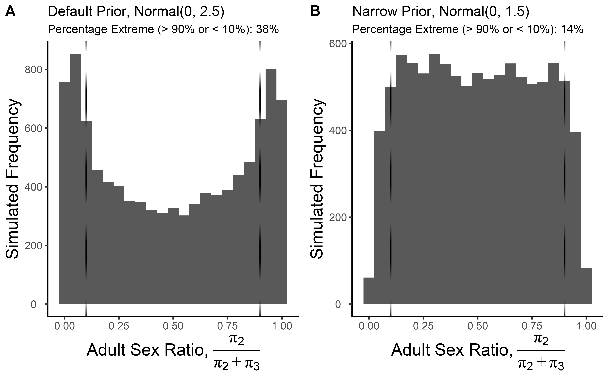
```

Prior distributions for parameters governing average body size ($\mu$) and size variability ($\sigma$) are the keys to ensuring that the mixture model produces biologically feasible and interpretable results. These prior distributions are based on analysis of a ‘prior assemblage’ created by sampling immature, adult female, and adult male/castrate Shetland sheep from the @popkin_etal_2012 population (150 specimens for each animal group; see Model Supplement for more details). Castrates were considered males for the purposes of the model, as proximal and distal bone width measurements as a whole did not vary significantly between intact males and castrates [@popkin_etal_2012: 1783-1784]. Modeling the average body size and size variability of these animal groups using a multilevel model created the starting point for prior distributions that could be used in the model. To generalize the prior distributions so that they are applicable to a variety of zooarchaeological scenarios, the results from the prior assemblage were given larger standard deviations to increase the uncertainty, which allows the model to better fit the data (see Figure 3 and Model Supplement for more details). The prior distributions act to prevent the model from accepting parameter values that are implausibly large or small given our prior knowledge about size variability and size differences between animal groups.

Prior predictive checks, shown in the Model Supplement, show the implications of the prior distribution definitions used in the model. The results show that the chosen prior distributions do not exclude the possibilities of extreme values in mixture components and cover a wide range of potential size measurements. On the other hand, these model definitions are not so broad as to include much prior weight on biologically impossible values (i.e., impossibly large measurements) that would slow down how quickly the model runs because it must evaluate the fit of extremely poorly fitting data. Such behavior could also produce biologically implausible results of actual model fits when only a small amount of data are available.

```{r figure_3, echo = FALSE, message = FALSE, warning = FALSE, fig.align = "center", out.width = "\\textwidth", fig.cap = "Posterior distributions of model hyper-parameters from a sample of known-identity sheep specimens (red) and proposed prior distributions for mixture model applications (black). Prior distributions describe (A) average female body size, in LSIe units; (B) the size difference between average immature and female animals, in log-transformed (left) and LSIe (right) units; (C) the index of sexual dimorphism—the size difference between average female and male animals, in log-transformed (left) and LSIe (right) units; size variability for (D) immature, (E) female, and (F) male animals, in log-transformed (left) and LSIe (right) units. Proposed prior distributions provide useful baseline in the absence of relevant biometric information regarding sexual dimorphism and size variability."}
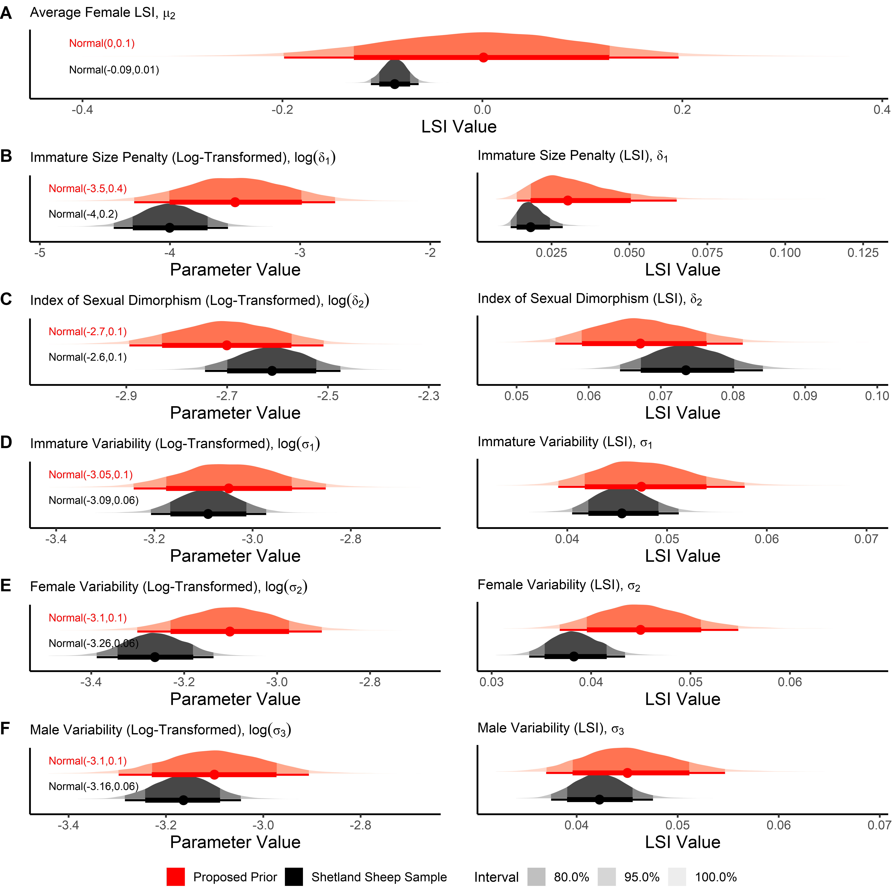
```

This section describes one approach for defining prior distributions of mixture models that are relevant for a wide range of zooarchaeological cases, particularly if researchers do not have strong preconceptions about the relevant parameters from prior research. It is important to remember that a model’s prior distributions are choices made by the researcher to fit particular research questions, regardless of whether the distributions are informed by advice on reference priors, prior assemblages, or mathematical summaries of existing research. Zooarchaeological assemblages resulting from catastrophic kills would be expected to have a different ontogenetic age and sex composition compared to assemblages derived from sustained hunting or herding take-off [e.g., @lyman_1987]. Similarly, other research contexts may provide an analyst with different prior expectations about animal size variability and overall biometry. Other reference populations, particularly those from other taxa, could also be used to create prior assemblages and help determine the limits on biological feasibility. Researchers could and should adapt their prior distributions to best reflect their intuition about likely parameter values for their research context. Regardless of the prior distributions a researcher uses, it is crucial to formally describe the prior distributions that is used in a Bayesian analysis to ensure replicability. Further, researchers should examine the implications of different candidate prior distributions while developing a Bayesian model to test a research question; prior distributions should be regularly tested even before models are fit to datasets [@gelman_etal_2020_bda3].

### *2.3 Extending the Multilevel Analysis to Multiple Sites*

The multilevel structure of the model that allows parameters to vary across element portions can also be used to extend the modeling approach to examine multiple assemblages at once. Combining multiple assemblages into a single model allows researchers to investigate regional variation in herd management strategies or outline diachronic trends in body size that may relate to population turnover [e.g., @arbuckle_atici_2013; @arbuckle_etal_2016]. It also allows researchers to model diachronic changes over the course of a multi-period site’s occupation, as each occupation layer can be defined as a separate assemblage [e.g., @hongo_etal_2009; @wolfhagen_etal_2021]. By including the assemblages in the same model, estimates share the same hyper-parameters, which improves the precision of these estimates and allows researchers to directly compare assemblage-specific parameters by using contrasts. Further, adopting this structure provides the foundation for more sophisticated analyses that test specific hypotheses about variation in biometric or compositional parameters, such as spatiotemporal autocorrelation in body size.

An important consequence of extending the model to evaluate multiple sites at once is that the interpretation of the overall hyper-parameters that the researcher inputs into the model changes. Instead of describing the overall estimates for a specific assemblage, these hyper-parameters now describe a ‘grand mean’ of the parameter value for all the included assemblages. These overall summaries could be interpretively useful if, for instance, all the assemblages come from a discrete archaeological culture or region. In other scenarios, however, the interpretation of these overall hyperparameters may be less meaningful than comparisons of assemblage-specific estimates that still account for anatomical variation within each assemblage (see Model Supplement for more details).

### *2.4 Interpreting Model Results: Measured, Modeled, and Full Assemblages*

The results of the Bayesian multilevel mixture model include specimen-specific membership probabilities ($\pi_{\operatorname{Specimen}}$) based on the mixture model parameters. While these membership probabilities can be used to calculate “critical size limits” where the largest membership probability shifts from one group to another [e.g., @monchot_lechelle_2002], they can also be used to simulate assemblages of known-group specimens to examine age/sex-stratified estimates of body part representation and sex-stratified fusion rates. Membership probabilities ($\pi_{\operatorname{Specimen}}$) are used to simulate the specimen’s identity by sampling from the probabilities using a multinomial distribution; in each posterior sample, a single simulated assemblage is created, resulting in a distribution of simulated assemblages with known age/sex assignments [@crema_2012]. The characteristics of these assemblages can then be used to summarize the overall assemblage or identify differences in composition based on element types, fusion states, sub-assemblage features, or other pertinent factors that a researcher is interested in examining in relation to the composition of the assemblage.

The usual goal of a mixture model analysis—like any sex determination analysis—is to estimate the composition of the *entire* (or *modeled*) faunal assemblage, rather than just the *measured* assemblage used by the analyst. Typical analyses elide these differences, smoothly translating the results of an analysis on a measured assemblage (i.e., the sex ratio) to describe the entire assemblage. Sometimes disparate results from different element portions require explanation, such as different butchery strategies for males and females [e.g., @speth_1983], but even in these cases the results from measured specimens are used to describe the entire set of bones from the same element portion. This elision creates a bias by ignoring the existence of unmeasured specimens in the assemblage and presents an interpretive dilemma for researchers, whose only recourse if they are unwilling to make this elision is to discount the model results as unrepresentative.

We can avoid this bias by formalizing the relationship between the *measured* and *modeled* assemblages by stating that the measured assemblage is a sample of the modeled assemblage, wherein inclusion is governed by a specimen’s *measurability*—the preservation of specific bony portions that allow for biometric measurement(s). If we assume that measurability is unrelated to a specimen’s ontogenetic age or sex, then we can assume that the measured assemblage is a random sample of the modeled assemblage. Thus, an unmeasured specimen will have the same model parameters (mixture proportions $\pi$, average size $\mu$, and size variability $\sigma$) of the measured specimens from the same element portion. Crucially, this means that we can include unmeasured specimens in our simulated assemblages by using the relevant mixture proportions $\pi$ (adjusted for the specimen’s fusion data as necessary) as that specimen’s membership probabilities ($\pi_{\operatorname{Specimen}}$). Leveraging the multilevel structure of the model further, we can assume that the overall mixture model hyper-parameters for *modeled* element portions are equally valid for *unmodeled* element portions. The Bayesian multilevel mixture model estimates hyper-parameters that describe the average value ($\mu_{\operatorname{Element}}$) and expected variability ($\sigma_{\operatorname{Element}}$) of mixture model parameters for element portions; these hyper-parameters can be used to estimate the relevant mixture model parameters of an unobserved element portion [@gelman_etal_2020_bda3; @mcelreath_2020_rethinkingbook]. The resulting parameters, then, could be used to estimate $\pi_{\operatorname{Specimen}}$ membership probabilities for the unmodeled (and unmeasured) specimens, as in the first extension, creating an estimate of the composition of the *full* assemblage.

At first blush, these extensions may seem like a departure from concrete results of a mixture analysis into proxy-upon-proxy esoterica. However, by formalizing the relationship between what data are in the mixture analysis (the measured assemblage) and what data we are interested in describing (the modeled or full assemblage), these extensions are critical for creating a principled interpretation of an assemblage based on the analysis’ results. Mixture analyses are based on the measurable sample of specimens from the modeled subset of all element portions; this does not mean that these results cannot produce useful information, but it does mean that we must contextualize those results by understanding how small the measured assemblage is in comparison with the modeled (or full) assemblage we are interested in describing. These extensions provide a way to do this—measured specimens will have much more certain membership probabilities than unmeasured or unmodeled specimens, owing to the information gained from its size. Thus, including unmeasured and unmodeled specimens will produce less ‘extreme’ results (e.g., a lower probability that a majority of the assemblage is from a single group). This will be especially clear when the measured assemblage is much smaller than the modeled or full assemblage.

### *2.5 Computational Details of the Bayesian Analysis*

The Bayesian multilevel mixture model is written in Stan, version `r cmdstan_version()` [@stan_language_2.29]. All analyses in this paper use `r version$version.string`, in Rstudio `r rstudioapi::versionInfo()$version` (`r rstudioapi::versionInfo()$release_name`) [@r_language; @rstudio]; Table 3 lists the packages, versions, and citations for the packages used in the analytical scripts. The model Stan code and analytical R code necessary to replicate and apply the analyses in this paper are freely available in a [GitHub page](https://github.com/wolfhagenj/ZooarchMixMod) and [Open Science Framework page](https://osf.io/4h9w6/). The files include a copy of the Shetland sheep data file from the supplemental files published in @popkin_etal_2012 and archaeological datasets for the case studies downloaded from OpenContext [@buitenhuis_ilipinar_data; @carruthers_pinarbasi_data; @galik_barcin_data; @gourichon_helmer_mentese_data]. The analytical code includes two script files—a script for replication and one for application. The R markdown file ("ZooarchMixMod.Rmd") file replicates the entire analytical workflow of the paper, with a specific seed set to ensure exact replicability of the submitted manuscript. Another set of scripts to standardize the analytical workflow for faunal datasets structured like the OpenContext faunal datasets used in these case studies, see the GitHub for more details. All scripts (R and Stan) are released under the MIT license and figures are released as CC-BY to encourage reuse and reproducibility [@marwick_2017; @marwick_pilaarbirch_2018].

```{r table_3, echo = FALSE}
#list the packages, uses, versions, and citations in the table
package_names <- c("boot", "data.table", "readxl", "parallel", "doParallel", "kableExtra", "knitr", "cmdstanr", "rstan", "mixtools", "zoolog", "Cairo", "ggplot2", "ggdist", "ggpubr", "ggrepel", "rnaturalearth", "rnaturalearthdata", "sf")
version_numbers <- sapply(lapply(package_names, function(x) utils::packageVersion(x)), function(y) paste(y[1], sep = "."))
package_citations <- c("Canty & Ripley, 2021; Davison & Hinkley, 1997", "Dowle & Srinivasan, 2019", "Wickham & Bryan, 2022", "Microsoft Corporation & Weston, 2022", "Microsoft Corporation & Weston, 2022", "Zhu, 2021", "Xie, 2022", "Gabry & Cešnovar, 2022", "Stan Development Team, 2022", "Benaglia, et al., 2009", "Pozo, et al., 2021", "Urbanek & Horner, 2022", "Wickham, 2016", "Kay, 2022", "Kassambara, 2020", "Slowikowski, 2021", "South, 2017a", "South, 2017b", "Pebesma, 2018")
#
table_3 <- data.table(
  Use = rep(c("Data aggregation, analysis, and multi-core processing", "Creation of RMarkdown files", "Bayesian analysis and summarization", "Mixture model analysis and standard animal measurements", "Visualization"), c(5, 2, 2, 2, 8)),
  Package = package_names,
  Version = version_numbers,
  Citation = package_citations
)
#
kbl(table_3,
    col.names = c("Use", "Package", "Version", "Citation"),
    caption = "Software packages used in the analytical script for this paper.",
    booktabs = T, linesep = c(rep('', 4), '\\addlinespace', rep(c('', '\\addlinespace'), 3), rep('', 7), '\\addlinespace')) %>%
  kable_styling(latex_options = c("HOLD_position", "scale_down")) %>%
  row_spec(0, bold = T)
```

## 3. TESTING THE BAYESIAN MULTILEVEL MIXTURE MODEL

```{r making the simulated assemblages, include = FALSE, eval = TRUE}
####SET SEED: REMOVE TO GENERALIZE####
set.seed(1234567890)

sheep_data <- fread("./Data/1-s2.0-S0305440312000301-mmc1.csv", nrows = 356) #accessible from https://doi.org/10.1016/j.jas.2012.01.018 supplementary table, resaved as a .CSV

#Make variable for immature animals (`Days at Death` <= 365), female animals (not-immature), and male/castrated animals (not-immature)
sheep_data[, is.Immature := ifelse(`Days at Death` <= 365, 1, 0)]
sheep_data[, is.Female := ifelse(`Days at Death` > 365 & Sex %in% "Female", 1, 0)]
sheep_data[, is.Male := ifelse(`Days at Death` > 365 & Sex %in% c("Castrate", "Male"), 1, 0)]

#Reframe the sheep data to be set in a long format
sheep_longdata <- melt(sheep_data, id.vars = c("Accession  no", "Sex", "is.Immature", "is.Female", "is.Male", "Sca_coracoid_fus", "Hum_prox_fus", "Hum_dist_fus", "Rad_prox_fus", "Rad_dist_fus", "Mtc_dist_fus", "Pel_acetabulum_fus", "Fem_caput_fus", "Fem_dist_fus", "Tib_prox_fus", "Tib_dist_fus", "Mtt_dist_fus", "Cal_prox_fus"), measure.vars = names(sheep_data[, Sca_GLP:Cal_GDde]), variable.name = "Measurement", value.name = "Measurement_value")
sheep_longdata[, Element := tstrsplit(Measurement, "_")[1]]

#Get the standard animal from zoolog
sheep_standard_animal <- data.table(referencesDatabase$`Ovis orientalis`$Uerpmann)

#Keep only limb breadth bone measurements for the mixture model
sheep_mixmod_data <- sheep_longdata[Measurement %in% c("Sca_GLP", "Hum_Bd", "Hum_BT", "Rad_Bp", "Rad_Bd", "Mtc_Bp", "Mtc_BFd", "Fem_Bd", "Tib_Bd", "Ast_Bd", "Mtt_Bp", "Mtt_BFd")]

#Rename standard animal measurements to match the names in the dataset
sheep_standard_animal[EL %in% "Scapula", c("Element", "Measurement") := .("Sca", paste("Sca", Measure, sep = "_"))]
sheep_standard_animal[EL %in% "Humerus", c("Element", "Measurement") := .("Hum", paste("Hum", Measure, sep = "_"))]
sheep_standard_animal[EL %in% "Radius", c("Element", "Measurement") := .("Rad", paste("Rad", Measure, sep = "_"))]
sheep_standard_animal[EL %in% "Metacarpus", c("Element", "Measurement") := .("Mtc", paste("Mtc", Measure, sep = "_"))]
sheep_standard_animal[EL %in% "Femur", c("Element", "Measurement") := .("Fem", paste("Fem", Measure, sep = "_"))]
sheep_standard_animal[EL %in% "Tibia", c("Element", "Measurement") := .("Tib", paste("Tib", Measure, sep = "_"))]
sheep_standard_animal[EL %in% "Astragalus", c("Element", "Measurement") := .("Ast", paste("Ast", Measure, sep = "_"))]
sheep_standard_animal[EL %in% "Metatarsus", c("Element", "Measurement") := .("Mtt", paste("Mtt", Measure, sep = "_"))]

#Rename some measurement name mismatches
sheep_mixmod_data[Measurement %in% "Mtc_BFd", Measurement := "Mtc_Bd"]
sheep_mixmod_data[Measurement %in% "Mtt_BFd", Measurement := "Mtt_Bd"]

#Join the standard animal reference to the dataset (allows for easier identification of relevant standard measurement)
sheep_mixmod_data <- sheep_mixmod_data[sheep_standard_animal[, .(Measurement, Reference_value = Standard)], on = "Measurement"][!is.na(`Accession  no`)]

#Create "element portion" and "measurement set" numbers for the model (needs numeric labels)
#note that, by default, these are ordered alphabetically. Can also assign specific orders if desirable
sheep_mixmod_data[, c("Dimension", "Element_Portion") := .(as.numeric(as.factor(Measurement)), as.numeric(as.factor(Element)))]

#Create "specimen" labels to link meausrements from the same bone specimen (model needs numeric labels)
sheep_mixmod_data[, "Specimen_No" := as.numeric(as.factor(paste(`Accession  no`, Element, sep = "_")))]
sheep_mixmod_data[, "Individual_No" := as.numeric(as.factor(`Accession  no`))]

#Immature: identify whether specimens COULD be immature based on element portion and fusion status, if relevant
sheep_mixmod_data[Element %in% c("Sca", "Ast"), Immature := 1] #does not fuse / subject to post-fusion growth and has no relevant fusion data to exclude immature status
sheep_mixmod_data[Element %in% c("Hum"), Immature := as.numeric(Hum_prox_fus %in% c("fu", "fg") == F)]
sheep_mixmod_data[Element %in% "Rad", Immature := as.numeric(Rad_dist_fus %in% c("fu", "fg") == F)]
sheep_mixmod_data[Element %in% "Mtc", Immature := as.numeric(Mtc_dist_fus %in% c("fu", "fg") == F)]
sheep_mixmod_data[Element %in% "Fem", Immature := as.numeric(Fem_dist_fus %in% c("fu", "fg") == F)]
sheep_mixmod_data[Element %in% "Tib", Immature := as.numeric(Tib_prox_fus %in% c("fu", "fg") == F)]
sheep_mixmod_data[Element %in% "Mtt", Immature := as.numeric(Mtt_dist_fus %in% c("fu", "fg") == F)]

#Group: category for immature vs female vs male/castrate (for checking accuracy)
sheep_mixmod_data[, Group := ifelse(is.Immature %in% 1, "Immature", ifelse(is.Female %in% 1, "Female", ifelse(is.Male %in% 1, "Male", NA)))]
#Demographic information: collecting fusion data on proximal and middle phalanges and sex data on fused pelves
sheep_phx_fusion <- melt(sheep_data[, .(`Accession  no`, is.Immature, is.Female, is.Male, Pph_fore_int_fus, Pph_fore_ext_fus, Pph_dist_int_fus, Pph_dist_ext_fus, Mph_fore_int_fus, Mph_fore_ext_fus, Mph_dist_int_fus, Mph_dist_ext_fus)], id.vars = c("Accession  no", "is.Immature", "is.Female", "is.Male"), variable.name = "Phalanx", value.name = "Fusion")[Fusion %in% "na" == F]
sheep_phx_fusion[, Element := ifelse(grepl("Pph", Phalanx), "PH1", "PH2")]

sheep_pelvis_sex <- sheep_data[Pel_acetabulum_fus %in% "fu", .(`Accession  no`, is.Immature, is.Female, is.Male)][is.Immature %in% 0, .(`Accession  no`, Sex = ifelse(is.Female %in% 1, "Female", ifelse(is.Male %in% 1, "Male", NA)))]
```

```{r simulate the datasets, include = FALSE, eval = TRUE}
#Single assemblage simulation: 150 measured element portions, probabilities remain the same as the underlying population
single_assemblage_mixmod_data <- sheep_mixmod_data[Specimen_No %in% sample(1:sheep_mixmod_data[, .N, Specimen_No][, .N], 150, replace = F)]
#Re-assign numeric codes for element portions, measurement sets, and individual specimens (to prevent mismatches/overlap)
single_assemblage_mixmod_data[, Dimension := as.numeric(as.factor(Measurement))]
single_assemblage_mixmod_data[, Element_Portion := as.numeric(as.factor(Element))]
single_assemblage_mixmod_data[, Original_Specimen_No := Specimen_No] #allows the creation of modeled assemblages without resampling
single_assemblage_mixmod_data[, Specimen_No := as.numeric(as.factor(Specimen_No))]
single_assemblage_mixmod_data[, Site_No := 1]

#Multi-site simulation: 15 sites, varying sample size, expected composition, and body size manipulations
#Sites 1-5: no variation in composition to the underlying population
#Sites 6-10: 20% immature, 70% female, 10% male
#Sites 11-15: 5% immature, 35% female, 60% male
#Size variation in Sites 3-5, 8-10, and 13-15
#Sample sizes: N = 10 element portions in Sites 2, 7, and 12 (N = 30 element portions otherwise)

#straight from the data, 30 measured specimens
site_01 <- sheep_mixmod_data[Specimen_No %in% sample(1:sheep_mixmod_data[, .N, Specimen_No][, .N], 30, replace = F)]
#straight from the data, 10 measured specimens
site_02 <- sheep_mixmod_data[Specimen_No %in% sample(1:sheep_mixmod_data[, .N, Specimen_No][, .N], 10, replace = F)]
#30 measured specimens, increase size
site_03 <- sheep_mixmod_data[Specimen_No %in% sample(1:sheep_mixmod_data[, .N, Specimen_No][, .N], 30, replace = F)]
site_03[, Measurement_value := Measurement_value * 1.20]
#30 measured specimens, decrease size
site_04 <- sheep_mixmod_data[Specimen_No %in% sample(1:sheep_mixmod_data[, .N, Specimen_No][, .N], 30, replace = F)]
site_04[, Measurement_value := Measurement_value * 0.80]
#30 measured specimens, increase sexual dimorphism
site_05 <- sheep_mixmod_data[Specimen_No %in% sample(1:sheep_mixmod_data[, .N, Specimen_No][, .N], 30, replace = F)]
site_05[is.Male %in% 1, Measurement_value := Measurement_value * 1.20]

#20% immature, 70% female, 10% male
#have to adjust probabilities of choosing based on underlying proportions of the dataset
#20% immature, 70% female, 10% male; 30 measured specimens
site_06 <- sheep_mixmod_data[Specimen_No %in% sample(1:sheep_mixmod_data[, .N, Specimen_No][, .N], 30, replace = F, prob = sheep_mixmod_data[, .N, .(Specimen_No, Group)][order(Specimen_No), ifelse(Group %in% "Immature", 0.20 / (384 / 2848), ifelse(Group %in% "Female", 0.70 / (1312 / 2848), ifelse(Group %in% "Male", 0.10 / (1152 / 2848), NA)))])]
#20% immature, 70% female, 10% male; 10 measured specimens
site_07 <- sheep_mixmod_data[Specimen_No %in% sample(1:sheep_mixmod_data[, .N, Specimen_No][, .N], 10, replace = F, prob = sheep_mixmod_data[, .N, .(Specimen_No, Group)][order(Specimen_No), ifelse(Group %in% "Immature", 0.20 / (384 / 2848), ifelse(Group %in% "Female", 0.70 / (1312 / 2848), ifelse(Group %in% "Male", 0.10 / (1152 / 2848), NA)))])]
#20% immature, 70% female, 10% male; 30 measured specimens, increased size
site_08 <- sheep_mixmod_data[Specimen_No %in% sample(1:sheep_mixmod_data[, .N, Specimen_No][, .N], 30, replace = F, prob = sheep_mixmod_data[, .N, .(Specimen_No, Group)][order(Specimen_No), ifelse(Group %in% "Immature", 0.20 / (384 / 2848), ifelse(Group %in% "Female", 0.70 / (1312 / 2848), ifelse(Group %in% "Male", 0.10 / (1152 / 2848), NA)))])]
site_08[, Measurement_value := Measurement_value * 1.20]
#20% immature, 70% female, 10% male; 30 measured specimens, decreased size
site_09 <- sheep_mixmod_data[Specimen_No %in% sample(1:sheep_mixmod_data[, .N, Specimen_No][, .N], 30, replace = F, prob = sheep_mixmod_data[, .N, .(Specimen_No, Group)][order(Specimen_No), ifelse(Group %in% "Immature", 0.20 / (384 / 2848), ifelse(Group %in% "Female", 0.70 / (1312 / 2848), ifelse(Group %in% "Male", 0.10 / (1152 / 2848), NA)))])]
site_09[, Measurement_value := Measurement_value * 0.80]
#20% immature, 70% female, 10% male; 30 measured specimens, increased sexual dimorphism
site_10 <- sheep_mixmod_data[Specimen_No %in% sample(1:sheep_mixmod_data[, .N, Specimen_No][, .N], 30, replace = F, prob = sheep_mixmod_data[, .N, .(Specimen_No, Group)][order(Specimen_No), ifelse(Group %in% "Immature", 0.20 / (384 / 2848), ifelse(Group %in% "Female", 0.70 / (1312 / 2848), ifelse(Group %in% "Male", 0.10 / (1152 / 2848), NA)))])]
site_10[is.Male %in% 1, Measurement_value := Measurement_value * 1.20]

#5% immature, 35% female, 60% male
#have to adjust probabilities of choosing based on underlying proportions of the dataset
#5% immature, 35% female, 60% male; 30 measured specimens
site_11 <- sheep_mixmod_data[Specimen_No %in% sample(1:sheep_mixmod_data[, .N, Specimen_No][, .N], 30, replace = F, prob = sheep_mixmod_data[, .N, .(Specimen_No, Group)][order(Specimen_No), ifelse(Group %in% "Immature", 0.05 / (384 / 2848), ifelse(Group %in% "Female", 0.35 / (1312 / 2848), ifelse(Group %in% "Male", 0.60 / (1152 / 2848), NA)))])]
#5% immature, 35% female, 60% male; 10 measured specimens
site_12 <- sheep_mixmod_data[Specimen_No %in% sample(1:sheep_mixmod_data[, .N, Specimen_No][, .N], 10, replace = F, prob = sheep_mixmod_data[, .N, .(Specimen_No, Group)][order(Specimen_No), ifelse(Group %in% "Immature", 0.05 / (384 / 2848), ifelse(Group %in% "Female", 0.35 / (1312 / 2848), ifelse(Group %in% "Male", 0.60 / (1152 / 2848), NA)))])]
#5% immature, 35% female, 60% male; 30 measured specimens, increased size
site_13 <- sheep_mixmod_data[Specimen_No %in% sample(1:sheep_mixmod_data[, .N, Specimen_No][, .N], 30, replace = F, prob = sheep_mixmod_data[, .N, .(Specimen_No, Group)][order(Specimen_No), ifelse(Group %in% "Immature", 0.05 / (384 / 2848), ifelse(Group %in% "Female", 0.35 / (1312 / 2848), ifelse(Group %in% "Male", 0.60 / (1152 / 2848), NA)))])]
site_13[, Measurement_value := Measurement_value * 1.20]
#5% immature, 35% female, 60% male; 30 measured specimens, decreased size
site_14 <- sheep_mixmod_data[Specimen_No %in% sample(1:sheep_mixmod_data[, .N, Specimen_No][, .N], 30, replace = F, prob = sheep_mixmod_data[, .N, .(Specimen_No, Group)][order(Specimen_No), ifelse(Group %in% "Immature", 0.05 / (384 / 2848), ifelse(Group %in% "Female", 0.35 / (1312 / 2848), ifelse(Group %in% "Male", 0.60 / (1152 / 2848), NA)))])]
site_14[, Measurement_value := Measurement_value * 0.80]
#5% immature, 35% female, 60% male; 30 measured specimens, increased sexual dimorphism
site_15 <- sheep_mixmod_data[Specimen_No %in% sample(1:sheep_mixmod_data[, .N, Specimen_No][, .N], 30, replace = F, prob = sheep_mixmod_data[, .N, .(Specimen_No, Group)][order(Specimen_No), ifelse(Group %in% "Immature", 0.05 / (384 / 2848), ifelse(Group %in% "Female", 0.35 / (1312 / 2848), ifelse(Group %in% "Male", 0.60 / (1152 / 2848), NA)))])]
site_15[is.Male %in% 1, Measurement_value := Measurement_value * 1.20]

#Bring all the assemblages together
multisite_mixmod_data <- rbind(data.table(Site_No = 1, site_01),
                               data.table(Site_No = 2, site_02),
                               data.table(Site_No = 3, site_03),
                               data.table(Site_No = 4, site_04),
                               data.table(Site_No = 5, site_05),
                               data.table(Site_No = 6, site_06),
                               data.table(Site_No = 7, site_07),
                               data.table(Site_No = 8, site_08),
                               data.table(Site_No = 9, site_09),
                               data.table(Site_No = 10, site_10),
                               data.table(Site_No = 11, site_11),
                               data.table(Site_No = 12, site_12),
                               data.table(Site_No = 13, site_13),
                               data.table(Site_No = 14, site_14),
                               data.table(Site_No = 15, site_15))

#Re-assign numeric codes for element portions, measurement sets, and individual specimens (to prevent mismatches/overlap)
multisite_mixmod_data[, Dimension := as.numeric(as.factor(Measurement))]
multisite_mixmod_data[, Element_Portion := as.numeric(as.factor(Element))]
multisite_mixmod_data[, Original_Specimen_No := Specimen_No] #allows the creation of modeled assemblages without resampling the measured specimens
multisite_mixmod_data[, Specimen_No := as.numeric(as.factor(paste(Site_No, Specimen_No, sep = ".")))]

##Demographic observations for the simulations: simulate observations from sheep_phx_fusion and sheep_pelvis_sex
#Single assemblage simulation
single_assemblage_demographic_observations <- data.table(Site = "Single Assemblage", Site_No = 1, N_Unfused = sheep_phx_fusion[sample(1:.N, 50)][Fusion %in% c("u", "fo"), .N], N_Ageable = 50, N_Female = sheep_pelvis_sex[sample(1:.N, 15)][Sex %in% "Female", .N], N_Sexable = 15)

#Multi-site simulation
multisite_demographic_observations <- rbind(
  data.table(Site = "Site 1", Site_No = 1, N_Unfused = sheep_phx_fusion[sample(1:.N, 30, replace = F)][Fusion %in% c("u", "fo"), .N], N_Ageable = 30, N_Female = sheep_pelvis_sex[sample(1:.N, 8, replace = F)][Sex %in% "Female", .N], N_Sexable = 8),
  data.table(Site = "Site 2", Site_No = 2, N_Unfused = sheep_phx_fusion[sample(1:.N, 10, replace = F)][Fusion %in% c("u", "fo"), .N], N_Ageable = 15, N_Female = sheep_pelvis_sex[sample(1:.N, 4, replace = F)][Sex %in% "Female", .N], N_Sexable = 4),
  data.table(Site = "Site 3", Site_No = 3, N_Unfused = sheep_phx_fusion[sample(1:.N, 30, replace = F)][Fusion %in% c("u", "fo"), .N], N_Ageable = 30, N_Female = sheep_pelvis_sex[sample(1:.N, 8, replace = F)][Sex %in% "Female", .N], N_Sexable = 8),
  data.table(Site = "Site 4", Site_No = 4, N_Unfused = sheep_phx_fusion[sample(1:.N, 30, replace = F)][Fusion %in% c("u", "fo"), .N], N_Ageable = 30, N_Female = sheep_pelvis_sex[sample(1:.N, 8, replace = F)][Sex %in% "Female", .N], N_Sexable = 8),
  data.table(Site = "Site 5", Site_No = 5, N_Unfused = sheep_phx_fusion[sample(1:.N, 30, replace = F)][Fusion %in% c("u", "fo"), .N], N_Ageable = 30, N_Female = sheep_pelvis_sex[sample(1:.N, 8, replace = F)][Sex %in% "Female", .N], N_Sexable = 8),
  #20% immature, 70% female, 10% male
  data.table(Site = "Site 6", Site_No = 6, N_Unfused = sheep_phx_fusion[sample(1:.N, 30, replace = F, prob = ifelse(is.Immature %in% 1, 0.2 / (384 / 2752), ifelse(is.Female %in% 1, 0.7 / (1312 / 2752), ifelse(is.Male %in% 1, 0.1 / (1056 / 2752), NA))))][Fusion %in% c("u", "fo"), .N], N_Ageable = 30, N_Female = sheep_pelvis_sex[sample(1:.N, 8, replace = F, prob = ifelse(Sex %in% "Female", (0.7 / 0.8) / (164 / 308), ifelse(Sex %in% "Male", (0.1 / 0.8) / (144 / 308), NA)))][Sex %in% "Female", .N], N_Sexable = 8),
  data.table(Site = "Site 7", Site_No = 7, N_Unfused = sheep_phx_fusion[sample(1:.N, 10, replace = F, prob = ifelse(is.Immature %in% 1, 0.2 / (384 / 2752), ifelse(is.Female %in% 1, 0.7 / (1312 / 2752), ifelse(is.Male %in% 1, 0.1 / (1056 / 2752), NA))))][Fusion %in% c("u", "fo"), .N], N_Ageable = 15, N_Female = sheep_pelvis_sex[sample(1:.N, 4, replace = F, prob = ifelse(Sex %in% "Female", (0.7 / 0.8) / (164 / 308), ifelse(Sex %in% "Male", (0.1 / 0.8) / (144 / 308), NA)))][Sex %in% "Female", .N], N_Sexable = 4),
  data.table(Site = "Site 8", Site_No = 8, N_Unfused = sheep_phx_fusion[sample(1:.N, 30, replace = F, prob = ifelse(is.Immature %in% 1, 0.2 / (384 / 2752), ifelse(is.Female %in% 1, 0.7 / (1312 / 2752), ifelse(is.Male %in% 1, 0.1 / (1056 / 2752), NA))))][Fusion %in% c("u", "fo"), .N], N_Ageable = 30, N_Female = sheep_pelvis_sex[sample(1:.N, 8, replace = F, prob = ifelse(Sex %in% "Female", (0.7 / 0.8) / (164 / 308), ifelse(Sex %in% "Male", (0.1 / 0.8) / (144 / 308), NA)))][Sex %in% "Female", .N], N_Sexable = 8),
  data.table(Site = "Site 9", Site_No = 9, N_Unfused = sheep_phx_fusion[sample(1:.N, 30, replace = F, prob = ifelse(is.Immature %in% 1, 0.2 / (384 / 2752), ifelse(is.Female %in% 1, 0.7 / (1312 / 2752), ifelse(is.Male %in% 1, 0.1 / (1056 / 2752), NA))))][Fusion %in% c("u", "fo"), .N], N_Ageable = 30, N_Female = sheep_pelvis_sex[sample(1:.N, 8, replace = F, prob = ifelse(Sex %in% "Female", (0.7 / 0.8) / (164 / 308), ifelse(Sex %in% "Male", (0.1 / 0.8) / (144 / 308), NA)))][Sex %in% "Female", .N], N_Sexable = 8),
  data.table(Site = "Site 10", Site_No = 10, N_Unfused = sheep_phx_fusion[sample(1:.N, 30, replace = F, prob = ifelse(is.Immature %in% 1, 0.2 / (384 / 2752), ifelse(is.Female %in% 1, 0.7 / (1312 / 2752), ifelse(is.Male %in% 1, 0.1 / (1056 / 2752), NA))))][Fusion %in% c("u", "fo"), .N], N_Ageable = 30, N_Female = sheep_pelvis_sex[sample(1:.N, 8, replace = F, prob = ifelse(Sex %in% "Female", (0.7 / 0.8) / (164 / 308), ifelse(Sex %in% "Male", (0.1 / 0.8) / (144 / 308), NA)))][Sex %in% "Female", .N], N_Sexable = 8),
  #5% immature, 35% female, 60% male
  data.table(Site = "Site 11", Site_No = 11, N_Unfused = sheep_phx_fusion[sample(1:.N, 30, replace = F, prob = ifelse(is.Immature %in% 1, 0.05 / (384 / 2752), ifelse(is.Female %in% 1, 0.35 / (1312 / 2752), ifelse(is.Male %in% 1, 0.60 / (1056 / 2752), NA))))][Fusion %in% c("u", "fo"), .N], N_Ageable = 30, N_Female = sheep_pelvis_sex[sample(1:.N, 8, replace = F, prob = ifelse(Sex %in% "Female", (0.35 / 0.95) / (164 / 308), ifelse(Sex %in% "Male", (0.60 / 0.95) / (144 / 308), NA)))][Sex %in% "Female", .N], N_Sexable = 8),
  data.table(Site = "Site 12", Site_No = 12, N_Unfused = sheep_phx_fusion[sample(1:.N, 10, replace = F, prob = ifelse(is.Immature %in% 1, 0.05 / (384 / 2752), ifelse(is.Female %in% 1, 0.35 / (1312 / 2752), ifelse(is.Male %in% 1, 0.60 / (1056 / 2752), NA))))][Fusion %in% c("u", "fo"), .N], N_Ageable = 15, N_Female = sheep_pelvis_sex[sample(1:.N, 4, replace = F, prob = ifelse(Sex %in% "Female", (0.35 / 0.95) / (164 / 308), ifelse(Sex %in% "Male", (0.60 / 0.95) / (144 / 308), NA)))][Sex %in% "Female", .N], N_Sexable = 4),
  data.table(Site = "Site 13", Site_No = 13, N_Unfused = sheep_phx_fusion[sample(1:.N, 30, replace = F, prob = ifelse(is.Immature %in% 1, 0.05 / (384 / 2752), ifelse(is.Female %in% 1, 0.35 / (1312 / 2752), ifelse(is.Male %in% 1, 0.60 / (1056 / 2752), NA))))][Fusion %in% c("u", "fo"), .N], N_Ageable = 30, N_Female = sheep_pelvis_sex[sample(1:.N, 8, replace = F, prob = ifelse(Sex %in% "Female", (0.35 / 0.95) / (164 / 308), ifelse(Sex %in% "Male", (0.60 / 0.95) / (144 / 308), NA)))][Sex %in% "Female", .N], N_Sexable = 8),
  data.table(Site = "Site 14", Site_No = 14, N_Unfused = sheep_phx_fusion[sample(1:.N, 30, replace = F, prob = ifelse(is.Immature %in% 1, 0.05 / (384 / 2752), ifelse(is.Female %in% 1, 0.35 / (1312 / 2752), ifelse(is.Male %in% 1, 0.60 / (1056 / 2752), NA))))][Fusion %in% c("u", "fo"), .N], N_Ageable = 30, N_Female = sheep_pelvis_sex[sample(1:.N, 8, replace = F, prob = ifelse(Sex %in% "Female", (0.35 / 0.95) / (164 / 308), ifelse(Sex %in% "Male", (0.60 / 0.95) / (144 / 308), NA)))][Sex %in% "Female", .N], N_Sexable = 8),
  data.table(Site = "Site 15", Site_No = 15, N_Unfused = sheep_phx_fusion[sample(1:.N, 30, replace = F, prob = ifelse(is.Immature %in% 1, 0.05 / (384 / 2752), ifelse(is.Female %in% 1, 0.35 / (1312 / 2752), ifelse(is.Male %in% 1, 0.60 / (1056 / 2752), NA))))][Fusion %in% c("u", "fo"), .N], N_Ageable = 30, N_Female = sheep_pelvis_sex[sample(1:.N, 8, replace = F, prob = ifelse(Sex %in% "Female", (0.35 / 0.95) / (164 / 308), ifelse(Sex %in% "Male", (0.60 / 0.95) / (144 / 308), NA)))][Sex %in% "Female", .N], N_Sexable = 8)
)

#Simulate the modeled assemblages
#single assemblage simulation
single_measured_assemblage <- single_assemblage_mixmod_data[, .N, .(Individual_No, Specimen_No, Original_Specimen_No, Element, Element_Portion, Immature, Group, Site_No)]
single_modeled_assemblage <- rbind(single_measured_assemblage,
                                   sheep_mixmod_data[Specimen_No %in% sample(sheep_mixmod_data[Specimen_No %in% single_measured_assemblage[, Original_Specimen_No] == F, .N, .(Individual_No, Specimen_No, Element_Portion)][, Specimen_No], 600, replace = F)][, .(Specimen_No = NA, Site_No = 1, .N), .(Individual_No, Original_Specimen_No = Specimen_No, Element, Element_Portion, Immature, Group)])

#multisite assemblage simulation
multisite_measured_assemblage <- multisite_mixmod_data[, .N, .(Individual_No, Specimen_No, Original_Specimen_No, Element, Element_Portion, Immature, Group, Site_No)]
multisite_modeled_assemblage <- rbind(multisite_measured_assemblage,
                                      sheep_mixmod_data[Specimen_No %in% sample(sheep_mixmod_data[Specimen_No %in% multisite_measured_assemblage[Site_No %in% 1, Original_Specimen_No] == F, .N, .(Individual_No, Specimen_No, Element_Portion)][order(Specimen_No), Specimen_No], 120, replace = F)][, .(Specimen_No = NA, Site_No = 1, .N), .(Individual_No, Original_Specimen_No = Specimen_No, Element, Element_Portion, Immature, Group)],
                                      sheep_mixmod_data[Specimen_No %in% sample(sheep_mixmod_data[Specimen_No %in% multisite_measured_assemblage[Site_No %in% 2, Original_Specimen_No] == F, .N, .(Individual_No, Specimen_No, Element_Portion)][order(Specimen_No), Specimen_No], 40, replace = F)][, .(Specimen_No = NA, Site_No = 2, .N), .(Individual_No, Original_Specimen_No = Specimen_No, Element, Element_Portion, Immature, Group)],
                                      sheep_mixmod_data[Specimen_No %in% sample(sheep_mixmod_data[Specimen_No %in% multisite_measured_assemblage[Site_No %in% 3, Original_Specimen_No] == F, .N, .(Individual_No, Specimen_No, Element_Portion)][order(Specimen_No), Specimen_No], 120, replace = F)][, .(Specimen_No = NA, Site_No = 3, .N), .(Individual_No, Original_Specimen_No = Specimen_No, Element, Element_Portion, Immature, Group)],
                                      sheep_mixmod_data[Specimen_No %in% sample(sheep_mixmod_data[Specimen_No %in% multisite_measured_assemblage[Site_No %in% 4, Original_Specimen_No] == F, .N, .(Individual_No, Specimen_No, Element_Portion)][order(Specimen_No), Specimen_No], 120, replace = F)][, .(Specimen_No = NA, Site_No = 4, .N), .(Individual_No, Original_Specimen_No = Specimen_No, Element, Element_Portion, Immature, Group)],
                                      sheep_mixmod_data[Specimen_No %in% sample(sheep_mixmod_data[Specimen_No %in% multisite_measured_assemblage[Site_No %in% 5, Original_Specimen_No] == F, .N, .(Individual_No, Specimen_No, Element_Portion)][order(Specimen_No), Specimen_No], 120, replace = F)][, .(Specimen_No = NA, Site_No = 5, .N), .(Individual_No, Original_Specimen_No = Specimen_No, Element, Element_Portion, Immature, Group)],
                                      #Sites 6-10: 20% immature, 70% female, 10% male
                                      sheep_mixmod_data[Specimen_No %in% sample(sheep_mixmod_data[Specimen_No %in% multisite_measured_assemblage[Site_No %in% 6, Original_Specimen_No] == F, .N, .(Individual_No, Specimen_No, Element_Portion)][order(Specimen_No), Specimen_No], 120, replace = F, prob = sheep_mixmod_data[Specimen_No %in% multisite_measured_assemblage[Site_No %in% 6, Original_Specimen_No] == F, .N, .(Individual_No, Specimen_No, Element_Portion, Group)][order(Specimen_No), ifelse(Group %in% "Immature", 0.20 / (384 / 2848), ifelse(Group %in% "Female", 0.70 / (1312 / 2848), ifelse(Group %in% "Male", 0.10 / (1152 / 2848), NA)))])][, .(Specimen_No = NA, Site_No = 6, .N), .(Individual_No, Original_Specimen_No = Specimen_No, Element, Element_Portion, Immature, Group)],
                                      sheep_mixmod_data[Specimen_No %in% sample(sheep_mixmod_data[Specimen_No %in% multisite_measured_assemblage[Site_No %in% 7, Original_Specimen_No] == F, .N, .(Individual_No, Specimen_No, Element_Portion)][order(Specimen_No), Specimen_No], 40, replace = F, prob = sheep_mixmod_data[Specimen_No %in% multisite_measured_assemblage[Site_No %in% 7, Original_Specimen_No] == F, .N, .(Individual_No, Specimen_No, Element_Portion, Group)][order(Specimen_No), ifelse(Group %in% "Immature", 0.20 / (384 / 2848), ifelse(Group %in% "Female", 0.70 / (1312 / 2848), ifelse(Group %in% "Male", 0.10 / (1152 / 2848), NA)))])][, .(Specimen_No = NA, Site_No = 7, .N), .(Individual_No, Original_Specimen_No = Specimen_No, Element, Element_Portion, Immature, Group)],
                                      sheep_mixmod_data[Specimen_No %in% sample(sheep_mixmod_data[Specimen_No %in% multisite_measured_assemblage[Site_No %in% 8, Original_Specimen_No] == F, .N, .(Individual_No, Specimen_No, Element_Portion)][order(Specimen_No), Specimen_No], 120, replace = F, prob = sheep_mixmod_data[Specimen_No %in% multisite_measured_assemblage[Site_No %in% 8, Original_Specimen_No] == F, .N, .(Individual_No, Specimen_No, Element_Portion, Group)][order(Specimen_No), ifelse(Group %in% "Immature", 0.20 / (384 / 2848), ifelse(Group %in% "Female", 0.70 / (1312 / 2848), ifelse(Group %in% "Male", 0.10 / (1152 / 2848), NA)))])][, .(Specimen_No = NA, Site_No = 8, .N), .(Individual_No, Original_Specimen_No = Specimen_No, Element, Element_Portion, Immature, Group)],
                                      sheep_mixmod_data[Specimen_No %in% sample(sheep_mixmod_data[Specimen_No %in% multisite_measured_assemblage[Site_No %in% 9, Original_Specimen_No] == F, .N, .(Individual_No, Specimen_No, Element_Portion)][order(Specimen_No), Specimen_No], 120, replace = F, prob = sheep_mixmod_data[Specimen_No %in% multisite_measured_assemblage[Site_No %in% 9, Original_Specimen_No] == F, .N, .(Individual_No, Specimen_No, Element_Portion, Group)][order(Specimen_No), ifelse(Group %in% "Immature", 0.20 / (384 / 2848), ifelse(Group %in% "Female", 0.70 / (1312 / 2848), ifelse(Group %in% "Male", 0.10 / (1152 / 2848), NA)))])][, .(Specimen_No = NA, Site_No = 9, .N), .(Individual_No, Original_Specimen_No = Specimen_No, Element, Element_Portion, Immature, Group)],
                                      sheep_mixmod_data[Specimen_No %in% sample(sheep_mixmod_data[Specimen_No %in% multisite_measured_assemblage[Site_No %in% 10, Original_Specimen_No] == F, .N, .(Individual_No, Specimen_No, Element_Portion)][order(Specimen_No), Specimen_No], 120, replace = F, prob = sheep_mixmod_data[Specimen_No %in% multisite_measured_assemblage[Site_No %in% 10, Original_Specimen_No] == F, .N, .(Individual_No, Specimen_No, Element_Portion, Group)][order(Specimen_No), ifelse(Group %in% "Immature", 0.20 / (384 / 2848), ifelse(Group %in% "Female", 0.70 / (1312 / 2848), ifelse(Group %in% "Male", 0.10 / (1152 / 2848), NA)))])][, .(Specimen_No = NA, Site_No = 10, .N), .(Individual_No, Original_Specimen_No = Specimen_No, Element, Element_Portion, Immature, Group)],
                                      #Sites 11-15: 5% immature, 35% female, 60% male
                                      sheep_mixmod_data[Specimen_No %in% sample(sheep_mixmod_data[Specimen_No %in% multisite_measured_assemblage[Site_No %in% 11, Original_Specimen_No] == F, .N, .(Individual_No, Specimen_No, Element_Portion)][order(Specimen_No), Specimen_No], 120, replace = F, prob = sheep_mixmod_data[Specimen_No %in% multisite_measured_assemblage[Site_No %in% 11, Original_Specimen_No] == F, .N, .(Individual_No, Specimen_No, Element_Portion, Group)][order(Specimen_No), ifelse(Group %in% "Immature", 0.05 / (384 / 2848), ifelse(Group %in% "Female", 0.35 / (1312 / 2848), ifelse(Group %in% "Male", 0.60 / (1152 / 2848), NA)))])][, .(Specimen_No = NA, Site_No = 11, .N), .(Individual_No, Original_Specimen_No = Specimen_No, Element, Element_Portion, Immature, Group)],
                                      sheep_mixmod_data[Specimen_No %in% sample(sheep_mixmod_data[Specimen_No %in% multisite_measured_assemblage[Site_No %in% 12, Original_Specimen_No] == F, .N, .(Individual_No, Specimen_No, Element_Portion)][order(Specimen_No), Specimen_No], 40, replace = F, prob = sheep_mixmod_data[Specimen_No %in% multisite_measured_assemblage[Site_No %in% 12, Original_Specimen_No] == F, .N, .(Individual_No, Specimen_No, Element_Portion, Group)][order(Specimen_No), ifelse(Group %in% "Immature", 0.05 / (384 / 2848), ifelse(Group %in% "Female", 0.35 / (1312 / 2848), ifelse(Group %in% "Male", 0.60 / (1152 / 2848), NA)))])][, .(Specimen_No = NA, Site_No = 12, .N), .(Individual_No, Original_Specimen_No = Specimen_No, Element, Element_Portion, Immature, Group)],
                                      sheep_mixmod_data[Specimen_No %in% sample(sheep_mixmod_data[Specimen_No %in% multisite_measured_assemblage[Site_No %in% 13, Original_Specimen_No] == F, .N, .(Individual_No, Specimen_No, Element_Portion)][order(Specimen_No), Specimen_No], 120, replace = F, prob = sheep_mixmod_data[Specimen_No %in% multisite_measured_assemblage[Site_No %in% 13, Original_Specimen_No] == F, .N, .(Individual_No, Specimen_No, Element_Portion, Group)][order(Specimen_No), ifelse(Group %in% "Immature", 0.05 / (384 / 2848), ifelse(Group %in% "Female", 0.35 / (1312 / 2848), ifelse(Group %in% "Male", 0.60 / (1152 / 2848), NA)))])][, .(Specimen_No = NA, Site_No = 13, .N), .(Individual_No, Original_Specimen_No = Specimen_No, Element, Element_Portion, Immature, Group)],
                                      sheep_mixmod_data[Specimen_No %in% sample(sheep_mixmod_data[Specimen_No %in% multisite_measured_assemblage[Site_No %in% 14, Original_Specimen_No] == F, .N, .(Individual_No, Specimen_No, Element_Portion)][order(Specimen_No), Specimen_No], 120, replace = F, prob = sheep_mixmod_data[Specimen_No %in% multisite_measured_assemblage[Site_No %in% 14, Original_Specimen_No] == F, .N, .(Individual_No, Specimen_No, Element_Portion, Group)][order(Specimen_No), ifelse(Group %in% "Immature", 0.05 / (384 / 2848), ifelse(Group %in% "Female", 0.35 / (1312 / 2848), ifelse(Group %in% "Male", 0.60 / (1152 / 2848), NA)))])][, .(Specimen_No = NA, Site_No = 14, .N), .(Individual_No, Original_Specimen_No = Specimen_No, Element, Element_Portion, Immature, Group)],
                                      sheep_mixmod_data[Specimen_No %in% sample(sheep_mixmod_data[Specimen_No %in% multisite_measured_assemblage[Site_No %in% 15, Original_Specimen_No] == F, .N, .(Individual_No, Specimen_No, Element_Portion)][order(Specimen_No), Specimen_No], 120, replace = F, prob = sheep_mixmod_data[Specimen_No %in% multisite_measured_assemblage[Site_No %in% 15, Original_Specimen_No] == F, .N, .(Individual_No, Specimen_No, Element_Portion, Group)][order(Specimen_No), ifelse(Group %in% "Immature", 0.05 / (384 / 2848), ifelse(Group %in% "Female", 0.35 / (1312 / 2848), ifelse(Group %in% "Male", 0.60 / (1152 / 2848), NA)))])][, .(Specimen_No = NA, Site_No = 15, .N), .(Individual_No, Original_Specimen_No = Specimen_No, Element, Element_Portion, Immature, Group)])
```

```{r summarize the simulations, include = FALSE, eval = TRUE}
#Table 4 information (included dimensions for the simulations)
table_4 <- data.table(`Element Portion` = c("Scapula", "Humerus", "Humerus", "Radius", "Radius", "Metacarpus", "Metacarpus", "Femur", "Tibia", "Astragalus", "Metatarsus", "Metatarsus"),
                      `Dimension` = c("GLP", "Bd", "BT", "Bp", "Bd", "Bp", "Bd", "Bd", "Bd", "Bd", "Bp", "Bd"))

#Summarize the simulations
simulation_summary <- list(
  single_assemblage_n_specimens = single_assemblage_mixmod_data[, .N, Specimen_No][, .N],
  single_assemblage_n_measurements = single_assemblage_mixmod_data[, .N],
  single_assemblage_n_indivudals = single_assemblage_mixmod_data[, .N, `Accession  no`][, .N],
  multi_assemblage_n_sites = multisite_mixmod_data[, .N, Site_No][, .N],
  single_assemblage_n_modeled_specimens = single_modeled_assemblage[is.na(Specimen_No), .N],
  single_assemblage_n_modeled_assemblage = single_modeled_assemblage[, .N]
)

#Table 5 information (elemental composition of the simulated assemblages)
table_5 <- dcast(rbind(single_assemblage_mixmod_data[, .(.N, Assemblage = "Single Assemblage", `Demographics` = "$13\\%$ Immature, $46\\%$ Female, $40\\%$ Male", `Size` = "1.00"), .(Specimen_No, Group)][, .N, .(Assemblage, Demographics, Size, Group)],
                       multisite_mixmod_data[, .N, .(Specimen_No, Group, Assemblage = ifelse(Site_No >= 10, paste0("Site ", Site_No), paste0("Site 0", Site_No)),
                                                        `Demographics` = ifelse(Site_No %in% 1:5, "$13\\%$ Immature, $46\\%$ Female, $40\\%$ Male", ifelse(Site_No %in% 6:10, "$20\\%$ Immature, $70\\%$ Female, $10\\%$ Male", ifelse(Site_No %in% 11:15, "$5\\%$ Immature, $35\\%$ Female, $60\\%$ Male", NA))),
                                                        `Size` = ifelse(Site_No %in% c(1:2, 6:7, 11:12), "1.00", ifelse(Site_No %in% c(3, 8, 13), "1.20", ifelse(Site_No %in% c(4, 9, 14), "0.80", ifelse(Site_No %in% c(5, 10, 15), "1.20 (Males)", NA)))))][, .N, .(Assemblage, Demographics, Size, Group)]),
                 Assemblage + `Demographics` + `Size` ~ Group, value.var = "N", fill = 0)
#add totals column
table_5[, Total := sum(.SD), Assemblage, .SDcols = names(table_5)[-(1:3)]]

#add in footnotes manually
table_5[Size %in% "1.20 (Males)", Size := paste0("1.20", footnote_marker_symbol(1, "latex"))]
```

```{r create the archaeological datasets, include = FALSE, eval = TRUE}
####1. Import the archaeological data####
#list of elements (names from OpenContext standards)
modeled_elements <- c("scapula", "humerus", "radius bone", "fused metacarpal bones 3 and 4", "femur", "tibia", "talus", "calcaneus", "fused metatarsal bones 3 and 4", "proximal phalanx")

#Barcin Hoyuk Cattle####
barcin <- fread("./Data/Barcin Hoyuk Zooarchaeology Data (OpenContext - DOI 10.678-M7MS3QN7).csv")
#Have to include element names that are not in the modeled_elements categories because they're collapsed categories of multiple metacarpal/metatarsal identifications
barcin_data <- barcin[`Has Biological Taxonomy [Label]` %in% c("Bos taurus Linnaeus, 1758", "Bos primigenius") & `Has anatomical identification [Label]` %in% c(modeled_elements, "fused metacarpal bones 3 and 4; metacarpal bone of digit 3; metacarpal bone of digit 4; metacarpal bone of digit 5", "metatarsal bone of digit 5; metatarsal bone of digit 2; fused metatarsal bones 3 and 4", "middle phalanx"), .(ID = paste("Barcin", `Label`, sep = " "), Site = "Barcin", Taxon = `Has Biological Taxonomy [Label]`, Anatomy = `Has anatomical identification [Label]`, `Proximal Fusion` = `Has fusion character [Proximal Label]`, `Distal Fusion` = `Has fusion character [Distal Label]`, GLP = `Scap_glp`, Bd = ifelse(`Has anatomical identification [Label]` %in% "talus", Tal_bd, Bd), BT = NA, Bp = Bp, BFp = Bfp, DC = NA, GB = Gb)][!is.na(GLP) | !is.na(Bd) | !is.na(BT) | !is.na(Bp) | !is.na(BFp) | !is.na(DC) | !is.na(GB)]

#Troubleshooting
barcin_data[ID %in% c("Barcin Bone 448", "Barcin Bone 358"), c("Bp") := NA] #anomalously small Bp measurements (17.2, 18.1); error in taxon coding?

#Create key between the "Anatomy" label from the original dataset and the "Element" label that will be used in the model
barcin_element_key <- data.table(`Anatomy Label` = c("scapula", "humerus", "radius bone", "fused metacarpal bones 3 and 4; metacarpal bone of digit 3; metacarpal bone of digit 4; metacarpal bone of digit 5", "femur", "tibia", "talus", "calcaneus", "metatarsal bone of digit 5; metatarsal bone of digit 2; fused metatarsal bones 3 and 4", "proximal phalanx", "middle phalanx"),
                                 `Element Label` = c("Sca", "Hum", "Rad", "Mtc", "Fem", "Tib", "Ast", "Cal", "Mtt", "PH1", "PH2"))

#Ilipinar Cattle####
ilipinar <- fread("./Data/Ilipinar Zooarchaeology Main Zooarchaeological Dataset (OpenContext - DOI 10.6078-M72R3PM2).csv")
ilipinar_data <- ilipinar[`Has Biological Taxonomy [Label]` %in% c("Bos taurus Linnaeus, 1758", "Bos", "Bos primigenius") & `Period` %in% c("X", "IX", "IX/VIII", "VIII", "VII", "VI", "VI/VA", "VA", "VB") & `Has anatomical identification [Label]` %in% c(modeled_elements, "middle phalanx"), .(ID = paste("Ilipinar", `Label`, sep = " "), Site = ifelse(`Period` %in% c("X", "IX", "IX/VIII", "VIII"), "Ilipinar 1 (Late Neolithic/Transitional)", ifelse(`Period` %in% c("VII", "VI", "VI/VA", "VA", "VB"), "Ilipinar 2 (Early Chalcolithic)", NA)), Taxon = `Has Biological Taxonomy [Label]`, Anatomy = `Has anatomical identification [Label]`, `Proximal Fusion` = `Has fusion character [Proximal Label]`, `Distal Fusion` = `Has fusion character [Distal Label]`, GLP = GLP, Bd = ifelse(`Has anatomical identification [Label]` %in% c("fused metacarpal bones 3 and 4", "fused metatarsal bones 3 and 4"), `Bd (breadth of distal end- epi)`, `Bd`), BT = BT, Bp = Bp, BFp = BFp, DC = DC, GB = GB, Taxon = `Has Biological Taxonomy [Label]`)][!is.na(GLP) | !is.na(Bd) | !is.na(BT) | !is.na(Bp) | !is.na(BFp) | !is.na(DC) | !is.na(GB)]

#Troubleshooting
ilipinar_data[ID %in% "Ilipinar Bone 8029", c("Bp", "Bd") := .(NA, 68.8)] #originally listed as Bp
ilipinar_data[ID %in% "Ilipinar Bone 2706", c("Bd") := .(61.1)] #appears to be switched with SD (44.7)
ilipinar_data[ID %in% "Ilipinar Bone 1576", c("Bd") := .(45)] #appears to be switched with GLm (64.7)
ilipinar_data[ID %in% "Ilipinar Bone 2073", c("Bd") := NA] #appears to be a copy of GLm (63.2), unclear what original measurement was
ilipinar_data[ID %in% c("Ilipinar Bone 6592", "Ilipinar Bone 31126"), c("Bp") := NA] #Bp appears to be a copy of GLpe (58.6, 65.7)
ilipinar_data[ID %in% c("Ilipinar Bone 1813"), c("Bd") := NA] #Bd appears anomalously low; possibly typo on the anatomy?
ilipinar_data[ID %in% c("Ilipinar Bone 8680"), c("Bp", "BFp") := .(NA, NA)] #values are anomalously low and distant from one another, unclear if taxon or anatomy are correct (Bp = 55.3, BFp = 36.0)
ilipinar_data[ID %in% "Ilipinar Bone 20694", c("Bp") := 38.1] #switched with GL (66)
ilipinar_data[ID %in% "Ilipinar Bone 20427", c("Bp") := NA] #remove measurement (anomalously low), unclear if typo in measurement or taxon?

#Creating key between the "Anatomy" label from the original dataset and the "Element" label that will be used in the model
ilipinar_element_key <- data.table(`Anatomy Label` = c("scapula", "humerus", "radius bone", "fused metacarpal bones 3 and 4", "femur", "tibia", "talus", "calcaneus", "fused metatarsal bones 3 and 4", "proximal phalanx", "middle phalanx"),
                                   `Element Label` = c("Sca", "Hum", "Rad", "Mtc", "Fem", "Tib", "Ast", "Cal", "Mtt", "PH1", "PH2"))

#Mentese Cattle####
mentese <- fread("./Data/Neolithic Mentese Faunal Data Table (OpenContext - DOI 10.6078-M7MG7MD8).csv")
mentese_data <- mentese[`Has Biological Taxonomy [Label]` %in% "Bos" & `Has anatomical identification [Label]` %in% c(modeled_elements, "middle phalanx"), .(ID = paste("Mentese", `Label`, sep = " "), Site = "Mentese", Taxon = `Has Biological Taxonomy [Label]`, Anatomy = `Has anatomical identification [Label]`, `Proximal Fusion` = `Has fusion character [Proximal Label]`, `Distal Fusion` = `Has fusion character [Distal Label]`, GLP = GLP, Bd = Bd, BT = BT, Bp = Bp, BFp = BFp, DC = NA, GB = GB)][!is.na(GLP) | !is.na(Bd) | !is.na(BT) | !is.na(Bp) | !is.na(BFp) | !is.na(DC) | !is.na(GB)]

#Troubleshooting
mentese_data[ID %in% "Mentese Bone 2403", Bp := 10.8] #Bp measurement is way too large relative to the Bd value (10.9); shifting to 10.8 seems more reasonable
mentese_data[Anatomy %in% "calcaneus", `Proximal Fusion` := ifelse(`Distal Fusion` %in% "Distal epiphysis unfused", "Proximal epiphysis unfused", ifelse(`Distal Fusion` %in% "Distal epiphysis fusing", "Proximal epiphysis fusing", ifelse(`Distal Fusion` %in% "Distal epiphysis fused", "Proximal epiphysis fused", ifelse(`Distal Fusion` %in% "", "", NA))))] #calcaneus fusion is listed as `Distal Fusion` but is `Proximal Fusion` in other sites/codes

#Creating key between the "Anatomy" label from the original dataset and the "Element" label that will be used in the model
mentese_element_key <- data.table(`Anatomy Label` = c("scapula", "humerus", "radius bone", "fused metacarpal bones 3 and 4", "femur", "tibia", "talus", "calcaneus", "fused metatarsal bones 3 and 4", "proximal phalanx", "middle phalanx"),
                                  `Element Label` = c("Sca", "Hum", "Rad", "Mtc", "Fem", "Tib", "Ast", "Cal", "Mtt", "PH1", "PH2"))

#Pinarbasi Sheep####
pinarbasi <- fread("./Data/Pinarbasi EOL Computational Data Challenge Revised Zooarchaeology Dataset (OpenContext - DOI 10.607-8M7X34VD1).csv")
#Have to include element names that are not in the modeled_elements categories because they're collapsed categories of multiple metacarpal/metatarsal identifications
pinarbasi_data <- pinarbasi[`Has Biological Taxonomy [Label]` %in% "Ovis" & `Context (3)` %in% "Site B" & `Has anatomical identification [Label]` %in% c(modeled_elements, "fused metacarpal bones 3 and 4; metacarpal bone of digit 1; metacarpal bone of digit 4; metacarpal bone of digit 5; metacarpal bone of digit 2; metacarpal bone; metacarpal bone of digit 3", "metatarsal bone of digit 2; metatarsal bone of digit 4; fused metatarsal bones 3 and 4; metatarsal bone of digit 3"), .(ID = paste("Pinarbasi B", `Label`, sep = " "), Site = "Pinarbasi B", Anatomy = `Has anatomical identification [Label]`, `Proximal Fusion` = ifelse(!is.na(`GB (unfused)`) | !is.na(`Bp (unfused)`), "Proximal epiphysis unfused", `Has fusion character [Proximal Label]`), `Distal Fusion` = ifelse(!is.na(`Bd (unfused)`), "Distal epiphysis unfused", `Has fusion character [Distal Label]`), GLP = NA, Bd = ifelse(!is.na(`Bd (unfused)`), `Bd (unfused)`, Bd), BT = NA, Bp = ifelse(!is.na(`Bp (unfused)`), `Bp (unfused)`, Bp), BFp = BFp, DC = NA, GB = ifelse(!is.na(`GB (unfused)`), `GB (unfused)`, GB))][!is.na(GLP) | !is.na(Bd) | !is.na(BT) | !is.na(Bp) | !is.na(BFp) | !is.na(DC) | !is.na(GB)]

#Creating key between the "Anatomy" label from the original dataset and the "Element" label that will be used in the model
pinarbasi_element_key <- data.table(`Anatomy Label` = c("scapula", "humerus", "radius bone", "fused metacarpal bones 3 and 4; metacarpal bone of digit 1; metacarpal bone of digit 4; metacarpal bone of digit 5; metacarpal bone of digit 2; metacarpal bone; metacarpal bone of digit 3", "femur", "tibia", "talus", "calcaneus", "metatarsal bone of digit 2; metatarsal bone of digit 4; fused metatarsal bones 3 and 4; metatarsal bone of digit 3", "proximal phalanx"),
                                    `Element Label` = c("Sca", "Hum", "Rad", "Mtc", "Fem", "Tib", "Ast", "Cal", "Mtt", "PH1"))


#Reference animal from `zoolog` package
sheep_standard_animal <- data.table(referencesDatabase$`Ovis orientalis`$Uerpmann) #redoing sheep even though it was done in the simulations
bos_standard_animal <- data.table(referencesDatabase$`Bos primigenius`$Degerbol)
#add in the measurement of the Scapula GLP (89.0 mm), Calcaneus GB (46.0 mm); Degerbol 1970: Table 13, Table 18
bos_standard_animal <- rbind(bos_standard_animal, data.table(TAX = rep("Bos primigenius", 2), EL = c("Scapula", "Calcaneus"), Measure = c("GLP", "GB"), Standard = c(89.0, 46)))

####2. Structuring the Datasets####

#Reference Data
#Rename standard animal measurements to match the names in the dataset
sheep_standard_animal[EL %in% "Scapula", c("Element", "Measurement") := .("Sca", paste("Sca", Measure, sep = "_"))]
sheep_standard_animal[EL %in% "Humerus", c("Element", "Measurement") := .("Hum", paste("Hum", Measure, sep = "_"))]
sheep_standard_animal[EL %in% "Radius", c("Element", "Measurement") := .("Rad", paste("Rad", Measure, sep = "_"))]
sheep_standard_animal[EL %in% "Metacarpus", c("Element", "Measurement") := .("Mtc", paste("Mtc", Measure, sep = "_"))]
sheep_standard_animal[EL %in% "Femur", c("Element", "Measurement") := .("Fem", paste("Fem", Measure, sep = "_"))]
sheep_standard_animal[EL %in% "Tibia", c("Element", "Measurement") := .("Tib", paste("Tib", Measure, sep = "_"))]
sheep_standard_animal[EL %in% "Astragalus", c("Element", "Measurement") := .("Ast", paste("Ast", Measure, sep = "_"))]
sheep_standard_animal[EL %in% "Calcaneus", c("Element", "Measurement") := .("Cal", paste("Cal", Measure, sep = "_"))]
sheep_standard_animal[EL %in% "Metatarsus", c("Element", "Measurement") := .("Mtt", paste("Mtt", Measure, sep = "_"))]
sheep_standard_animal[EL %in% "Phalanx 1 ant.", c("Element", "Measurement") := .("PH1", paste("PH1", Measure, sep = "_"))]
#
bos_standard_animal[EL %in% "Scapula", c("Element", "Measurement") := .("Sca", paste("Sca", Measure, sep = "_"))]
bos_standard_animal[EL %in% "Humerus", c("Element", "Measurement") := .("Hum", paste("Hum", Measure, sep = "_"))]
bos_standard_animal[EL %in% "Radius", c("Element", "Measurement") := .("Rad", paste("Rad", Measure, sep = "_"))]
bos_standard_animal[EL %in% "Metacarpus", c("Element", "Measurement") := .("Mtc", paste("Mtc", Measure, sep = "_"))]
bos_standard_animal[EL %in% "Femur", c("Element", "Measurement") := .("Fem", paste("Fem", Measure, sep = "_"))]
bos_standard_animal[EL %in% "Tibia", c("Element", "Measurement") := .("Tib", paste("Tib", Measure, sep = "_"))]
bos_standard_animal[EL %in% "Astragalus", c("Element", "Measurement") := .("Ast", paste("Ast", Measure, sep = "_"))]
bos_standard_animal[EL %in% "Calcaneus", c("Element", "Measurement") := .("Cal", paste("Cal", Measure, sep = "_"))]
bos_standard_animal[EL %in% "Metatarsus", c("Element", "Measurement") := .("Mtt", paste("Mtt", Measure, sep = "_"))]
bos_standard_animal[EL %in% "Phalanx 1 ant.", c("Element", "Measurement") := .("PH1", paste("PH1", Measure, sep = "_"))]
bos_standard_animal[EL %in% "Phalanx 2 ant.", c("Element", "Measurement") := .("PH1", paste("PH2", Measure, sep = "_"))]

#Function to restructure the measurement data into a format for the model
assemblage_restructure <- function(dataset, reference_dataset, element_key, included_measurements = c("Sca_GLP", "Hum_Bd", "Hum_BT", "Rad_Bp", "Rad_BFp", "Rad_Bd", "Mtc_Bp", "Mtc_Bd", "Fem_DC", "Fem_Bd", "Tib_Bp", "Tib_Bd", "Ast_Bd", "Cal_GB", "Mtt_Bp", "Mtt_Bd", "PH1_Bp")) {
  #Element: identify what end of the bone (proximal/distal) is included in the measurements (for element portions).
  #goes through element_key to change anatomical part names to the new labels
  #Note: key may have multiple Anatomy Labels that fit onto the same `Element Label`
  for(i in 1:nrow(element_key)) {
    dataset[Anatomy %in% element_key[i, `Anatomy Label`], Element := element_key[i, `Element Label`]]
    #Separate out proximal and distal element portions based on presence of later-fusing measurements (e.g., radius bone is proximal/distal based on presence of Bd measurement)
    if(element_key[i, `Element Label`] %in% c("Rad", "Mtc", "Fem", "Mtt")) {
      dataset[Anatomy %in% element_key[i, `Anatomy Label`], Element := ifelse(!is.na(Bd), paste(element_key[i, `Element Label`], "dist", sep = "_"), paste(element_key[i, `Element Label`], "prox", sep = "_"))]
    }
    if(element_key[i, `Element Label`] %in% c("Tib")) {
      dataset[Anatomy %in% element_key[i, `Anatomy Label`], Element := ifelse(!is.na(Bp), paste(element_key[i, `Element Label`], "prox", sep = "_"), paste(element_key[i, `Element Label`], "dist", sep = "_"))]
    }
  }
  #Immature: identify whether specimens COULD be immature based on element portion and fusion status, if relevant
  dataset[Element %in% c("Sca", "Ast"), Immature := 1] #does not fuse / subject to post-fusion growth and has no relevant fusion data to exclude immature status
  dataset[Element %in% c("Hum", "Cal", "PH1", "PH2"), Immature := as.numeric(`Proximal Fusion` %in% c("Proximal epiphysis fused", "Proximal epiphysis fusing") == F)]
  dataset[Element %in% c("Rad_prox", "Rad_dist", "Mtc_prox", "Mtc_dist", "Mtt_prox", "Mtt_dist"), Immature := as.numeric(`Distal Fusion` %in% c("Distal epiphysis fused", "Distal epiphysis fusing") == F)]
  dataset[Element %in% c("Fem_prox", "Fem_dist", "Tib_prox", "Tib_dist"), Immature := as.numeric((`Proximal Fusion` %in% c("Proximal epiphysis fused", "Proximal epiphysis fusing") | `Distal Fusion` %in% c("Distal epiphysis fused", "Distal epiphysis fusing")) == F)]
  #transform into long-form data
  dataset_longdata <- melt(dataset, id.vars = c("ID", "Site", "Anatomy", "Element", "Proximal Fusion", "Distal Fusion", "Immature"), measure.vars = c("GLP", "Bd", "BT", "Bp", "BFp", "DC", "GB"), variable.name = "Measure", value.name = "Measurement_value")[!is.na(Measurement_value)]
  #Measurement: combine element and measurement names (for measurement sets)
  #goes through element_key to change anatomical part names to the new labels
  #Note: key may have mlutiple Anatomy Labels that fit onto the same `Element Label`
  for(i in 1:nrow(element_key)) {
    dataset_longdata[Anatomy %in% element_key[i, `Anatomy Label`], Measurement := paste(element_key[i, `Element Label`], Measure, sep = "_")]
  }
  #bring in the reference measurement for each value (joined by measurement) and limiting the assemblage to the measurements that we're interested in modeling
  mixmod_data <- dataset_longdata[reference_dataset[, .(Reference_value = Standard, Measurement)], on = c("Measurement")][!is.na(ID) & Measurement %in% included_measurements]
  #Create numeric labels for measurement sets, element portions, and specimens (for Stan modeling)
  mixmod_data[, Dimension := as.numeric(as.factor(Measurement))]
  mixmod_data[, Element_Portion := as.numeric(as.factor(Element))]
  mixmod_data[, Specimen_No := as.numeric(as.factor(ID))]
  #return new dataset
  mixmod_data
}
#List of included measurements
measurement_list <- c("Sca_GLP", "Hum_Bd", "Hum_BT", "Rad_Bp", "Rad_BFp", "Rad_Bd", "Mtc_Bp", "Mtc_Bd", "Fem_DC", "Fem_Bd", "Tib_Bp", "Tib_Bd", "Ast_Bd", "Cal_GB", "Mtt_Bp", "Mtt_Bd", "PH1_Bp")

#Applying the function
pinarbasi_mixmod_data <- assemblage_restructure(pinarbasi_data, sheep_standard_animal, pinarbasi_element_key, included_measurements = measurement_list)
#
barcin_mixmod_data <- assemblage_restructure(barcin_data, bos_standard_animal, barcin_element_key, included_measurements = c(measurement_list, "PH2_Bp"))
ilipinar_mixmod_data <- assemblage_restructure(ilipinar_data, bos_standard_animal, ilipinar_element_key, included_measurements = c(measurement_list, "PH2_Bp"))
mentese_mixmod_data <- assemblage_restructure(mentese_data, bos_standard_animal, mentese_element_key, included_measurements = c(measurement_list, "PH2_Bp"))

####3. Collecting the demographic data####

#Pinarbasi Sheep#
#Use sheep code and sheep/goat code (being liberal, taking all that aren't conclusively goats)
#This undoubtedly includes some goats, but the biases against unfused specimens (which are much more likely to be considered sheep/goat) is judged to be a bigger issue
#This is a modeling choice, however, so can be changed depending on the context
pinarbasi_demographic_observations <- pinarbasi[`Has Biological Taxonomy [Label]` %in% c("Ovis", "Sheep/goat") & `Context (3)` %in% c("Site B"), .(Site = "Pinarbasi B", N_Unfused = sum(`Has anatomical identification [Label]` %in% c("proximal phalanx", "middle phalanx") & `Has fusion character [Proximal Label]` %in% "Proximal epiphysis unfused"), N_Ageable = sum(`Has anatomical identification [Label]` %in% c("proximal phalanx", "middle phalanx") & `Has fusion character [Proximal Label]` %in% "" == F), N_Female = sum(`Has anatomical identification [Label]` %in% "innominate bone" & `Has physiological sex determination [Label]` %in% "female organism"), N_Sexable = sum(`Has anatomical identification [Label]` %in% "innominate bone" & `Has physiological sex determination [Label]` %in% c("female organism", "male organism")))]

#NW Anatolian Cattle#
barcin_demographic_observations <- barcin[`Has Biological Taxonomy [Label]` %in% c("Bos taurus Linnaeus, 1758", "Bos primigenius"), .(Site = "Barcin Hoyuk", N_Unfused = sum(`Has anatomical identification [Label]` %in% c("proximal phalanx", "middle phalanx") & `Has fusion character [Proximal Label]` %in% "Proximal epiphysis unfused"), N_Ageable = sum(`Has anatomical identification [Label]` %in% c("proximal phalanx", "middle phalanx") & `Has fusion character [Proximal Label]` %in% "" == F), N_Female = sum(`Has anatomical identification [Label]` %in% "innominate bone" & `Has physiological sex determination [Label]` %in% "female organism"), N_Sexable = sum(`Has anatomical identification [Label]` %in% "innominate bone" & `Has physiological sex determination [Label]` %in% c("female organism", "male organism")))]
ilipinar_demographic_observations <- ilipinar[`Has Biological Taxonomy [Label]` %in% c("Bos taurus Linnaeus, 1758", "Bos primigenius", "Bos") & `Period` %in% c("X", "IX", "IX/VIII", "VIII", "VII", "VI", "VI/VA", "VA", "VB"), .(N_Unfused = sum(`Has anatomical identification [Label]` %in% c("proximal phalanx", "middle phalanx") & `Has fusion character [Proximal Label]` %in% "Proximal epiphysis unfused"), N_Ageable = sum(`Has anatomical identification [Label]` %in% c("proximal phalanx", "middle phalanx") & `Has fusion character [Proximal Label]` %in% "" == F), N_Female = sum(`Has anatomical identification [Label]` %in% "innominate bone" & `Has physiological sex determination [Label]` %in% "female organism"), N_Sexable = sum(`Has anatomical identification [Label]` %in% "innominate bone" & `Has physiological sex determination [Label]` %in% c("female organism", "male organism"))), .(Site = ifelse(`Period` %in% c("X", "IX", "IX/VIII", "VIII"), "Ilipinar 1 (Late Neolithic/Transitional)", ifelse(`Period` %in% c("VII", "VI", "VI/VA", "VA", "VB"), "Ilipinar 2 (Early Chalcolithic)", NA)))][order(Site)]
mentese_demographic_observations <- mentese[`Has Biological Taxonomy [Label]` %in% c("Bos"), .(Site = "Mentese", N_Unfused = sum(`Has anatomical identification [Label]` %in% c("proximal phalanx", "middle phalanx") & `Has fusion character [Proximal Label]` %in% "Proximal epiphysis unfused"), N_Ageable = sum(`Has anatomical identification [Label]` %in% c("proximal phalanx", "middle phalanx") & `Has fusion character [Proximal Label]` %in% "" == F), N_Female = sum(`Has anatomical identification [Label]` %in% "innominate bone" & `Has physiological sex determination [Label]` %in% "female organism"), N_Sexable = sum(`Has anatomical identification [Label]` %in% "innominate bone" & `Has physiological sex determination [Label]` %in% c("female organism", "male organism")))]


####Formatting####
#Single Assemblage analysis: add in "Site_No" field (model expects)
pinarbasi_mixmod_data[, Site_No := 1]

#Multisite analysis: Combine the site-level data together, add Site_No field
nw_anatolian_mixmod_data <- rbind(
  data.table(Site_No = 1, barcin_mixmod_data),
  data.table(Site_No = 2, ilipinar_mixmod_data[Site %in% "Ilipinar 1 (Late Neolithic/Transitional)"]),
  data.table(Site_No = 3, mentese_mixmod_data),
  data.table(Site_No = 4, ilipinar_mixmod_data[Site %in% "Ilipinar 2 (Early Chalcolithic)"])
)
#Re-assign numeric codes for element portions, measurement sets, and individual specimens (to prevent mismatches/overlap)
nw_anatolian_mixmod_data[, Dimension := as.numeric(as.factor(Measurement))]
nw_anatolian_mixmod_data[, Element_Portion := as.numeric(as.factor(Element))]
nw_anatolian_mixmod_data[, Specimen_No := as.numeric(as.factor(ID))]

#Combine the demographic data together, add Site_No field
nw_anatolian_demographic_observations <- rbind(
  data.table(Site_No = 1, barcin_demographic_observations),
  data.table(Site_No = 2, ilipinar_demographic_observations[Site %in% "Ilipinar 1 (Late Neolithic/Transitional)"]),
  data.table(Site_No = 3, mentese_demographic_observations),
  data.table(Site_No = 4, ilipinar_demographic_observations[Site %in% "Ilipinar 2 (Early Chalcolithic)"])
)

#

####Constructing modeled (and full) assemblages from OpenContext data for compositional and fusion analyses####
#gather the different assemblages: measured assemblage, assemblage of modeled elements, full assemblage (including unmodeled elements)

#Pinarbasi Sheep#
pinarbasi_additional_elements <- c("innominate bone", "middle phalanx", "ulna") #additional elements for compositional analysis
pinarbasi_measured_assemblage <- pinarbasi_mixmod_data[, .N, .(ID, Specimen_No, Anatomy, Element, Element_Portion, Immature, `Proximal Fusion`, `Distal Fusion`)]
pinarbasi_modeled_assemblage <- pinarbasi[`Has Biological Taxonomy [Label]` %in% "Ovis" & `Context (3)` %in% "Site B" & `Has anatomical identification [Label]` %in% pinarbasi_measured_assemblage[, .N, Anatomy][, Anatomy], .(ID = paste("Pinarbasi B", `Label`, sep = " "), Site = "Pinarbasi B", Anatomy = `Has anatomical identification [Label]`, `Proximal Fusion` = ifelse(!is.na(`GB (unfused)`) | !is.na(`Bp (unfused)`), "Proximal epiphysis unfused", `Has fusion character [Proximal Label]`), `Distal Fusion` = ifelse(!is.na(`Bd (unfused)`), "Distal epiphysis unfused", `Has fusion character [Distal Label]`))]
pinarbasi_full_assemblage <- pinarbasi[`Has Biological Taxonomy [Label]` %in% "Ovis" & `Context (3)` %in% "Site B" & `Has anatomical identification [Label]` %in% c(pinarbasi_measured_assemblage[, .N, Anatomy][, Anatomy], pinarbasi_additional_elements), .(ID = paste("Pinarbasi B", `Label`, sep = " "), Site = "Pinarbasi B", Anatomy = `Has anatomical identification [Label]`, `Proximal Fusion` = ifelse(!is.na(`GB (unfused)`) | !is.na(`Bp (unfused)`), "Proximal epiphysis unfused", `Has fusion character [Proximal Label]`), `Distal Fusion` = ifelse(!is.na(`Bd (unfused)`), "Distal epiphysis unfused", `Has fusion character [Distal Label]`))]

#Assign specimen numbers for the specimens that were modeled directly (measured specimens) in the modeled and full assemblages
pinarbasi_modeled_assemblage <- pinarbasi_measured_assemblage[, .(ID, Specimen_No, Element_Portion, Immature)][pinarbasi_modeled_assemblage, on = "ID"]
pinarbasi_full_assemblage <- pinarbasi_measured_assemblage[, .(ID, Specimen_No, Element_Portion, Immature)][pinarbasi_full_assemblage, on = "ID"]

#Assign the element portion numbers for specimens whose element portions were modeled
pinarbasi_full_element_key <- rbind(pinarbasi_element_key,
                                    data.table(`Anatomy Label` = c("innominate bone", "middle phalanx", "ulna"), `Element Label` = c("Pel", "PH2", "Uln")))
for(i in 1:pinarbasi_full_element_key[, .N]) {
  pinarbasi_modeled_assemblage[Anatomy %in% pinarbasi_full_element_key[i, `Anatomy Label`], Element := pinarbasi_full_element_key[i, `Element Label`]]
  pinarbasi_full_assemblage[Anatomy %in% pinarbasi_full_element_key[i, `Anatomy Label`], Element := pinarbasi_full_element_key[i, `Element Label`]]
  #Separate out proximal and distal element portions based on presence of later-fusing measurements (e.g., radius bone is proximal/distal based on presence of Bd measurement)
  if(pinarbasi_full_element_key[i, `Element Label`] %in% c("Rad", "Mtc", "Fem", "Mtt")) {
    pinarbasi_modeled_assemblage[Anatomy %in% pinarbasi_full_element_key[i, `Anatomy Label`], Element := ifelse(`Distal Fusion` %in% "" == F, paste(pinarbasi_full_element_key[i, `Element Label`], "dist", sep = "_"), paste(pinarbasi_full_element_key[i, `Element Label`], "prox", sep = "_"))]
    pinarbasi_full_assemblage[Anatomy %in% pinarbasi_full_element_key[i, `Anatomy Label`], Element := ifelse(`Distal Fusion` %in% "" == F, paste(pinarbasi_full_element_key[i, `Element Label`], "dist", sep = "_"), paste(pinarbasi_full_element_key[i, `Element Label`], "prox", sep = "_"))]
  }
  if(pinarbasi_full_element_key[i, `Element Label`] %in% c("Tib")) {
    pinarbasi_modeled_assemblage[Anatomy %in% pinarbasi_full_element_key[i, `Anatomy Label`], Element := ifelse(`Proximal Fusion` %in% "" == F, paste(pinarbasi_full_element_key[i, `Element Label`], "prox", sep = "_"), paste(pinarbasi_full_element_key[i, `Element Label`], "dist", sep = "_"))]
    pinarbasi_full_assemblage[Anatomy %in% pinarbasi_full_element_key[i, `Anatomy Label`], Element := ifelse(`Proximal Fusion` %in% "" == F, paste(pinarbasi_full_element_key[i, `Element Label`], "prox", sep = "_"), paste(pinarbasi_full_element_key[i, `Element Label`], "dist", sep = "_"))]
  }
}

#Remove unobserved element portions (Rad_prox and Mtc_prox) from modeled assemblage (we don't have direct observations of the parameters from the model)
pinarbasi_modeled_assemblage <- pinarbasi_measured_assemblage[, .N, .(Element_Portion, Element)][, .(Element_Portion, Element)][pinarbasi_modeled_assemblage, on = "Element"][!is.na(Element_Portion)]
pinarbasi_full_assemblage <- pinarbasi_measured_assemblage[, .N, .(Element_Portion, Element)][, .(Element_Portion, Element)][pinarbasi_full_assemblage, on = "Element"]

#Assign new element portion numbers for unmodeled elements (including Rad_prox and Mtc_prox)
pinarbasi_full_assemblage[Element %in% "Rad_prox", Element_Portion := 11]
pinarbasi_full_assemblage[Element %in% "Mtc_prox", Element_Portion := 12]
pinarbasi_full_assemblage[Element %in% "Pel", Element_Portion := 13]
pinarbasi_full_assemblage[Element %in% "PH2", Element_Portion := 14]
pinarbasi_full_assemblage[Element %in% "Uln", Element_Portion := 15]

#Define the Immature variable (potentially immature status based on fusion)
pinarbasi_modeled_assemblage[is.na(Immature) & Element %in% c("Sca", "Ast"), Immature := 1] #does not fuse / subject to post-fusion growth and has no relevant fusion data to exclude immature status
pinarbasi_modeled_assemblage[is.na(Immature) & Element %in% c("Hum", "Cal", "PH1"), Immature := as.numeric(`Proximal Fusion` %in% c("Proximal epiphysis fused", "Proximal epiphysis fusing") == F)]
pinarbasi_modeled_assemblage[is.na(Immature) & Element %in% c("Rad_prox", "Rad_dist", "Mtc_prox", "Mtc_dist", "Mtt_prox", "Mtt_dist"), Immature := as.numeric(`Distal Fusion` %in% c("Distal epiphysis fused", "Distal epiphysis fusing") == F)]
pinarbasi_modeled_assemblage[is.na(Immature) & Element %in% c("Fem_prox", "Fem_dist", "Tib_prox", "Tib_dist"), Immature := as.numeric((`Proximal Fusion` %in% c("Proximal epiphysis fused", "Proximal epiphysis fusing") | `Distal Fusion` %in% c("Distal epiphysis fused", "Distal epiphysis fusing")) == F)]
#
pinarbasi_full_assemblage[is.na(Immature) & Element %in% c("Sca", "Ast"), Immature := 1] #does not fuse / subject to post-fusion growth and has no relevant fusion data to exclude immature status
pinarbasi_full_assemblage[is.na(Immature) & Element %in% c("Hum", "Cal", "PH1", "PH2"), Immature := as.numeric(`Proximal Fusion` %in% c("Proximal epiphysis fused", "Proximal epiphysis fusing") == F)]
pinarbasi_full_assemblage[is.na(Immature) & Element %in% c("Rad_prox", "Rad_dist", "Mtc_prox", "Mtc_dist", "Mtt_prox", "Mtt_dist"), Immature := as.numeric(`Distal Fusion` %in% c("Distal epiphysis fused", "Distal epiphysis fusing") == F)]
pinarbasi_full_assemblage[is.na(Immature) & Element %in% c("Uln", "Pel", "Fem_prox", "Fem_dist", "Tib_prox", "Tib_dist"), Immature := as.numeric((`Proximal Fusion` %in% c("Proximal epiphysis fused", "Proximal epiphysis fusing") | `Distal Fusion` %in% c("Distal epiphysis fused", "Distal epiphysis fusing")) == F)]

#NW Anatolian Cattle#
#create full assemblage for fusion analysis
full_assemblage_maker <- function(original_data, biology_code, site_code, mixmod_data, element_list, full_elements, element_key) {
  full_assemblage <- original_data[`Has Biological Taxonomy [Label]` %in% biology_code & `Has anatomical identification [Label]` %in% full_elements, .(ID = paste(site_code, Label, sep = " "), Site = site_code, Taxon = `Has Biological Taxonomy [Label]`, Anatomy = `Has anatomical identification [Label]`, `Proximal Fusion` = `Has fusion character [Proximal Label]`, `Distal Fusion` = `Has fusion character [Distal Label]`)]
  #Assign specimen numbers for the specimens that were modeled directly (measured specimens) in the modeled and full assemblages
  full_assemblage <- mixmod_data[, .N, .(ID, Specimen_No, Immature)][full_assemblage, on = "ID"]
  #Assign the element portion labels for specimens that weren't modeled directly (no measurements)
  for(i in 1:element_key[, .N]) {
    full_assemblage[Anatomy %in% element_key[i, `Anatomy Label`], Element := element_key[i, `Element Label`]]
    #Separate out proximal and distal element portions based on presence of later-fusing measurements (e.g., radius bone is proximal/distal based on presence of Bd measurement)
    if(element_key[i, `Element Label`] %in% c("Rad", "Mtc", "Fem", "Mtt")) {
      full_assemblage[Anatomy %in% element_key[i, `Anatomy Label`], Element := ifelse(`Distal Fusion` %in% "" == F, paste(element_key[i, `Element Label`], "dist", sep = "_"), paste(element_key[i, `Element Label`], "prox", sep = "_"))]
    }
    if(element_key[i, `Element Label`] %in% c("Tib")) {
      full_assemblage[Anatomy %in% element_key[i, `Anatomy Label`], Element := ifelse(`Proximal Fusion` %in% "" == F, paste(element_key[i, `Element Label`], "prox", sep = "_"), paste(element_key[i, `Element Label`], "dist", sep = "_"))]
    }
  }
  #Assign Element_Portion values that match the original sets (and add new ones for unmodeled element portions)
  full_assemblage <- element_list[, .N, .(Element, Element_Portion)][full_assemblage, on = "Element"]
  full_assemblage[Element %in% "Pel", Element_Portion := 17]
  full_assemblage[Element %in% "Uln", Element_Portion := 18]
  #Get the Immature variable (potentially immature status based on fusion)
  full_assemblage[is.na(Immature) & Element %in% c("Sca", "Ast"), Immature := 1] #does not fuse / subject to post-fusion growth and has no relevant fusion data to exclude immature status
  full_assemblage[is.na(Immature) & Element %in% c("Hum", "Cal", "PH1", "PH2"), Immature := as.numeric(`Proximal Fusion` %in% c("Proximal epiphysis fused", "Proximal epiphysis fusing") == F)]
  full_assemblage[is.na(Immature) & Element %in% c("Rad_prox", "Rad_dist", "Mtc_prox", "Mtc_dist", "Mtt_prox", "Mtt_dist"), Immature := as.numeric(`Distal Fusion` %in% c("Distal epiphysis fused", "Distal epiphysis fusing") == F)]
  full_assemblage[is.na(Immature) & Element %in% c("Uln", "Pel", "Fem_prox", "Fem_dist", "Tib_prox", "Tib_dist"), Immature := as.numeric((`Proximal Fusion` %in% c("Proximal epiphysis fused", "Proximal epiphysis fusing") | `Distal Fusion` %in% c("Distal epiphysis fused", "Distal epiphysis fusing")) == F)]
  #
  full_assemblage[, .(ID, Specimen_No, Site, Taxon, Anatomy, Element, Element_Portion, Immature, `Proximal Fusion`, `Distal Fusion`)]
}

nw_anatolian_additional_elements <- c("innominate bone", "ulna") #additional elements for fusion analysis

barcin_full_assemblage <- full_assemblage_maker(original_data = barcin, biology_code = c("Bos taurus Linnaeus, 1758", "Bos primigenius"), site_code = "Barcin", mixmod_data = nw_anatolian_mixmod_data[Site %in% "Barcin"], element_list = nw_anatolian_mixmod_data[, .N, .(Element, Element_Portion)], full_elements = c(modeled_elements, "middle phalanx", nw_anatolian_additional_elements, "fused metacarpal bones 3 and 4; metacarpal bone of digit 3; metacarpal bone of digit 4; metacarpal bone of digit 5", "metatarsal bone of digit 5; metatarsal bone of digit 2; fused metatarsal bones 3 and 4"), element_key = rbind(barcin_element_key, data.table(`Anatomy Label` = c("innominate bone", "ulna"), `Element Label` = c("Pel", "Uln"))))
ilipinar1_full_assemblage <- full_assemblage_maker(original_data = ilipinar[Period %in% c("X", "IX", "IX/VIII", "VIII", "VII")], biology_code = c("Bos taurus Linnaeus, 1758", "Bos", "Bos primigenius"), site_code = "Ilipinar", mixmod_data = nw_anatolian_mixmod_data[Site %in% "Ilipinar 1 (Late Neolithic/Transitional)"], element_list = nw_anatolian_mixmod_data[, .N, .(Element, Element_Portion)], full_elements = c(modeled_elements, "middle phalanx", nw_anatolian_additional_elements), element_key = rbind(ilipinar_element_key, data.table(`Anatomy Label` = c("innominate bone", "ulna"), `Element Label` = c("Pel", "Uln"))))
ilipinar2_full_assemblage <- full_assemblage_maker(original_data = ilipinar[Period %in% c("VI", "VI/VA", "VA", "VB")], biology_code = c("Bos taurus Linnaeus, 1758", "Bos", "Bos primigenius"), site_code = "Ilipinar", mixmod_data = nw_anatolian_mixmod_data[Site %in% "Ilipinar 2 (Early Chalcolithic)"], element_list = nw_anatolian_mixmod_data[, .N, .(Element, Element_Portion)], full_elements = c(modeled_elements, "middle phalanx", nw_anatolian_additional_elements), element_key = rbind(ilipinar_element_key, data.table(`Anatomy Label` = c("innominate bone", "ulna"), `Element Label` = c("Pel", "Uln"))))
mentese_full_assemblage <- full_assemblage_maker(original_data = mentese, biology_code = "Bos", site_code = "Mentese", mixmod_data = nw_anatolian_mixmod_data[Site %in% "Mentese"], element_list = nw_anatolian_mixmod_data[, .N, .(Element, Element_Portion)], full_elements = c(modeled_elements, "middle phalanx", nw_anatolian_additional_elements), element_key = rbind(mentese_element_key, data.table(`Anatomy Label` = c("innominate bone", "ulna"), `Element Label` = c("Pel", "Uln"))))

#Troubleshooting
ilipinar1_full_assemblage[, Site := "Ilipinar 1 (Late Neolithic/Transitional)"]
ilipinar2_full_assemblage[, Site := "Ilipinar 2 (Early Chalcolithic)"]
mentese_full_assemblage[Anatomy %in% "calcaneus", `Proximal Fusion` := ifelse(`Distal Fusion` %in% "Distal epiphysis unfused", "Proximal epiphysis unfused", ifelse(`Distal Fusion` %in% "Distal epiphysis fusing", "Proximal epiphysis fusing", ifelse(`Distal Fusion` %in% "Distal epiphysis fused", "Proximal epiphysis fused", ifelse(`Distal Fusion` %in% "", "", NA))))] #calcaneus fusion is listed as `Distal Fusion` but is `Proximal Fusion` in other sites/codes

#Turn the full assemblages into "fusion assemblages" of specimens with fusion data#
#Key that fits specimens into fusion stages (based on fusion timing in Grigson (1989))
bos_element_stage_key <- data.table(Fusion_Element = c("Rad_prox", "Hum_dist", "Pel", "Sca", "PH1", "PH2", "Tib_dist", "Mtc_dist", "Mtt_dist", "Cal", "Fem_prox", "Fem_dist", "Uln", "Rad_dist", "Tib_prox", "Hum_prox"),
                                    Stage = c(1, 1, 1, 1, 2, 2, 3, 3, 3, 3, 4, 4, 4, 4, 4, 4))
#
fusion_assemblage_maker <- function(full_assemblage, element_stage_key) {
  full_assemblage[Element %in% "Rad_prox" & `Proximal Fusion` %in% "" == F, c("Fusion_Element", "Fusion") := .("Rad_prox", ifelse(`Proximal Fusion` %in% c("Proximal epiphysis fused", "Proximal epiphysis fusing"), "Fused", "Unfused"))]
  full_assemblage[Element %in% "Hum" & `Distal Fusion` %in% "" == F & `Proximal Fusion` %in% "", c("Fusion_Element", "Fusion") := .("Hum_dist", ifelse(`Distal Fusion` %in% c("Distal epiphysis fused", "Distal epiphysis fusing"), "Fused", "Unfused"))]
  full_assemblage[Element %in% "Pel" & (`Proximal Fusion` %in% "" == F | `Distal Fusion` %in% "" == F), c("Fusion_Element", "Fusion") := .("Pel", ifelse(`Proximal Fusion` %in% c("Proximal epiphysis fused", "Proximal epiphysis fusing") | `Distal Fusion` %in% c("Distal epiphysis fused", "Distal epiphysis fusing"), "Fused", "Unfused"))]
  full_assemblage[Element %in% "Sca" & `Distal Fusion` %in% "" == F, c("Fusion_Element", "Fusion") := .("Sca", ifelse(`Distal Fusion` %in% c("Distal epiphysis fused", "Distal epiphysis fusing"), "Fused", "Unfused"))]
  full_assemblage[Element %in% "PH1" & `Proximal Fusion` %in% "" == F, c("Fusion_Element", "Fusion") := .("PH1", ifelse(`Proximal Fusion` %in% c("Proximal epiphysis fused", "Proximal epiphysis fusing"), "Fused", "Unfused"))]
  full_assemblage[Element %in% "PH2" & `Proximal Fusion` %in% "" == F, c("Fusion_Element", "Fusion") := .("PH2", ifelse(`Proximal Fusion` %in% c("Proximal epiphysis fused", "Proximal epiphysis fusing"), "Fused", "Unfused"))]
  full_assemblage[Element %in% "Tib_dist" & `Distal Fusion` %in% "" == F, c("Fusion_Element", "Fusion") := .("Tib_dist", ifelse(`Distal Fusion` %in% c("Distal epiphysis fused", "Distal epiphysis fusing"), "Fused", "Unfused"))]
  full_assemblage[Element %in% "Mtc_dist" & `Distal Fusion` %in% "" == F, c("Fusion_Element", "Fusion") := .("Mtc_dist", ifelse(`Distal Fusion` %in% c("Distal epiphysis fused", "Distal epiphysis fusing"), "Fused", "Unfused"))]
  full_assemblage[Element %in% "Mtt_dist" & `Distal Fusion` %in% "" == F, c("Fusion_Element", "Fusion") := .("Mtt_dist", ifelse(`Distal Fusion` %in% c("Distal epiphysis fused", "Distal epiphysis fusing"), "Fused", "Unfused"))]
  full_assemblage[Element %in% "Cal" & `Proximal Fusion` %in% "" == F, c("Fusion_Element", "Fusion") := .("Cal", ifelse(`Proximal Fusion` %in% c("Proximal epiphysis fused", "Proximal epiphysis fusing"), "Fused", "Unfused"))]
  full_assemblage[Element %in% "Fem_prox" & `Proximal Fusion` %in% "" == F, c("Fusion_Element", "Fusion") := .("Fem_prox", ifelse(`Proximal Fusion` %in% c("Proximal epiphysis fused", "Proximal epiphysis fusing"), "Fused", "Unfused"))]
  full_assemblage[Element %in% "Fem_dist" & `Distal Fusion` %in% "" == F, c("Fusion_Element", "Fusion") := .("Fem_dist", ifelse(`Distal Fusion` %in% c("Distal epiphysis fused", "Distal epiphysis fusing"), "Fused", "Unfused"))]
  full_assemblage[Element %in% "Uln" & (`Proximal Fusion` %in% "" == F | `Distal Fusion` %in% "" == F), c("Fusion_Element", "Fusion") := .("Uln", ifelse(`Proximal Fusion` %in% c("Proximal epiphysis fused", "Proximal epiphysis fusing") | `Distal Fusion` %in% c("Distal epiphysis fused", "Distal epiphysis fusing"), "Fused", "Unfused"))]
  full_assemblage[Element %in% "Rad_dist" & `Distal Fusion` %in% "" == F, c("Fusion_Element", "Fusion") := .("Rad_dist", ifelse(`Distal Fusion` %in% c("Distal epiphysis fused", "Distal epiphysis fusing"), "Fused", "Unfused"))]
  full_assemblage[Element %in% "Tib_prox" & `Proximal Fusion` %in% "" == F, c("Fusion_Element", "Fusion") := .("Tib_prox", ifelse(`Proximal Fusion` %in% c("Proximal epiphysis fused", "Proximal epiphysis fusing"), "Fused", "Unfused"))]
  full_assemblage[Element %in% "Hum" & `Proximal Fusion` %in% "" == F, c("Fusion_Element", "Fusion") := .("Hum_prox", ifelse(`Proximal Fusion` %in% c("Proximal epiphysis fused", "Proximal epiphysis fusing"), "Fused", "Unfused"))]
  fusion_assemblage <- full_assemblage[, .(ID, Specimen_No, Site, Anatomy, Element, Element_Portion, Immature, `Proximal Fusion`, `Distal Fusion`, Fusion_Element, Fusion)][element_stage_key, on = "Fusion_Element"][!is.na(Fusion_Element) & !is.na(Fusion)]
  fusion_assemblage
}

#Create the fusion assemblages
barcin_fusion_assemblage <- fusion_assemblage_maker(full_assemblage = barcin_full_assemblage, element_stage_key = bos_element_stage_key)
ilipinar1_fusion_assemblage <- fusion_assemblage_maker(full_assemblage = ilipinar1_full_assemblage, element_stage_key = bos_element_stage_key)
mentese_fusion_assemblage <- fusion_assemblage_maker(full_assemblage = mentese_full_assemblage, element_stage_key = bos_element_stage_key)
ilipinar2_fusion_assemblage <- fusion_assemblage_maker(full_assemblage = ilipinar2_full_assemblage, element_stage_key = bos_element_stage_key)
```

```{r summarize the archaeological data, include = FALSE, eval = TRUE}
#Summarize the archaeological data for in-text numbers
archaeological_sites_summary <- list(
  pinarbasi_msres_N = pinarbasi_mixmod_data[, .N],
  pinarbasi_specimens_N = pinarbasi_mixmod_data[, .N, Specimen_No][, .N],
  pinarbasi_age_observation = pinarbasi_demographic_observations[, ifelse(N_Ageable > 0, paste0(N_Unfused, " / ", N_Ageable, " (", round(100 * (N_Unfused / N_Ageable), 0), "%)"), paste0(N_Unfused, " / ", N_Ageable))],
  pinarbasi_sexable_pelves_N = pinarbasi_demographic_observations[, N_Sexable],
  pinarbasi_sex_observation = pinarbasi_demographic_observations[, ifelse(N_Sexable > 0, paste0(N_Female, " / ", N_Sexable, " (", round(100 * (N_Female / N_Sexable), 0), "%)"), paste0(N_Female, " / ", N_Sexable))],
  #
  nw_anatolian_cattle_specimens_N = nw_anatolian_mixmod_data[, .N, Specimen_No][, .N],
  barcin_specimens_N = nw_anatolian_mixmod_data[Site_No %in% 1, .N, Specimen_No][, .N],
  ilipinar1_specimens_N = nw_anatolian_mixmod_data[Site_No %in% 2, .N, Specimen_No][, .N],
  mentese_specimens_N = nw_anatolian_mixmod_data[Site_No %in% 3, .N, Specimen_No][, .N],
  ilipinar2_specimens_N = nw_anatolian_mixmod_data[Site_No %in% 4, .N, Specimen_No][, .N],
  ilipinar_measured_bos_primigenius_N = ilipinar_data[Taxon %in% "Bos primigenius", .N],
  ilipinar_measured_bos_spp_N = ilipinar_data[Taxon %in% "Bos", .N],
  ilipinar_full_bos_primigenius_N = ilipinar1_full_assemblage[Taxon %in% "Bos primigenius", .N] + ilipinar2_full_assemblage[Taxon %in% "Bos primigenius", .N],
  ilipinar_full_bos_spp_N = ilipinar1_full_assemblage[Taxon %in% "Bos", .N] + ilipinar2_full_assemblage[Taxon %in% "Bos", .N],
  barcin_age_observation = nw_anatolian_demographic_observations[Site_No %in% 1, ifelse(N_Ageable > 0, paste0(N_Unfused, " / ", N_Ageable, " (", round(100 * (N_Unfused / N_Ageable), 0), "%)"), paste0(N_Unfused, " / ", N_Ageable))],
  ilipinar1_age_observation = nw_anatolian_demographic_observations[Site_No %in% 2, ifelse(N_Ageable > 0, paste0(N_Unfused, " / ", N_Ageable, " (", round(100 * (N_Unfused / N_Ageable), 0), "%)"), paste0(N_Unfused, " / ", N_Ageable))],
  mentese_age_observation = nw_anatolian_demographic_observations[Site_No %in% 3, ifelse(N_Ageable > 0, paste0(N_Unfused, " / ", N_Ageable, " (", round(100 * (N_Unfused / N_Ageable), 0), "%)"), paste0(N_Unfused, " / ", N_Ageable))],
  ilipinar2_age_observation = nw_anatolian_demographic_observations[Site_No %in% 4, ifelse(N_Ageable > 0, paste0(N_Unfused, " / ", N_Ageable, " (", round(100 * (N_Unfused / N_Ageable), 0), "%)"), paste0(N_Unfused, " / ", N_Ageable))],
  barcin_sex_observation = nw_anatolian_demographic_observations[Site_No %in% 1, ifelse(N_Sexable > 0, paste0(N_Female, " / ", N_Sexable, " (", round(100 * (N_Female / N_Sexable), 0), "%)"), paste0(N_Female, " / ", N_Sexable))],
  ilipinar1_sex_observation = nw_anatolian_demographic_observations[Site_No %in% 2, ifelse(N_Sexable > 0, paste0(N_Female, " / ", N_Sexable, " (", round(100 * (N_Female / N_Sexable), 0), "%)"), paste0(N_Female, " / ", N_Sexable))],
  mentese_sex_observation = nw_anatolian_demographic_observations[Site_No %in% 3, ifelse(N_Sexable > 0, paste0(N_Female, " / ", N_Sexable, " (", round(100 * (N_Female / N_Sexable), 0), "%)"), paste0(N_Female, " / ", N_Sexable))],
  ilipinar2_sex_observation = nw_anatolian_demographic_observations[Site_No %in% 4, ifelse(N_Sexable > 0, paste0(N_Female, " / ", N_Sexable, " (", round(100 * (N_Female / N_Sexable), 0), "%)"), paste0(N_Female, " / ", N_Sexable))]
)

####Summarize the elemental composition of the archaeological assemblages####
table_6 <- pinarbasi_mixmod_data[, .N, .(Element_Portion, Element, Measurement = tstrsplit(Measurement, "_")[[2]])][order(Element_Portion), .(`Element Portion` = c("Astragalus", "Calcaneus", "Humerus", "Metacarpal (Distal)", "Metatarsal (Distal)", "Metatarsal (Proximal)", "First Phalanx", "Radius (Distal)", "Tibia (Distal)", "Tibia (Proximal)"), Measurement, N)]

table_7 <- data.table(reshape2::dcast(nw_anatolian_mixmod_data[, .N, .(Element_Portion, Element, Site_No, Site)][order(Site_No, Element), .(Element, Site, N)], Element ~ Site, fun.aggregate = sum, value.var = "N", fill = 0, margins = "Element"))[, .(`Element Portion` = c("Astragalus", "Calcaneus", "Femur (Distal)", "Femur (Proximal)", "Humerus", "Metacarpal (Distal)", "Metacarpal (Proximal)", "Metatarsal (Distal)", "Metatarsal (Proximal)", "First Phalanx", "Second Phalanx", "Radius (Distal)", "Radius (Proximal)", "Scapula", "Tibia (Distal)", "Tibia (Proximal)", "Total"), `Barcın Höyük` = Barcin, `Ilıpınar Höyük (Late Neolithic/Transitional)` = `Ilipinar 1 (Late Neolithic/Transitional)`, `Ilıpınar Höyük (Early Chalcolithic)` = `Ilipinar 2 (Early Chalcolithic)`, `Menteşe Höyük` = Mentese)]
```

Two sets of tests are used to evaluate different aspects of the Bayesian multilevel mixture model. First, the accuracy of the model’s ability to reconstruct the age and sex composition of assemblages is tested using simulated faunal assemblages of known age and sex from the Shetland sheep population. This test evaluates both the single-assemblage model and the multi-assemblage model. Second, two archaeological case studies showcase the applicability of the model to archaeological data and the added insights gained from adopting Bayesian multilevel mixture models. The simulated assemblage case study and the single assemblage archaeological case study use sheep (*Ovis aries*) measurements, with standard measurements coming from a female wild sheep [*Ovis orientalis* FMC 57951: @uerpmann_uerpmann_1994: Table 12]. The multiple assemblage case study uses cattle (Bos taurus) measurements, with standard measurements coming from a wild female aurochs [*Bos primigenius* "Ullerslev": @degerbol_1970]. Two dimensions of the standard cow (Scapula GLP: 89 mm; and Calcaneus GB: 46 mm) were not included in the ‘zoolog’ output and were included manually, drawn from the referenced source.

### *3.1 Simulated Assemblages*

```{r table_4, echo = FALSE}
kbl(table_4, caption = "Measurements included in the simulation analyses. Dimension definitions follow von den Driesch (1976)", booktabs = T, escape = FALSE, linesep = c('\\addlinespace', rep(c('', '\\addlinespace'), 3), rep('\\addlinespace', 3), '', '\\addlinespace'))
```

A series of simulated assemblages of known age and sex composition are created from the Shetland sheep population by randomly drawing element portions (and all associated measurements) from the total assemblage without replacement. Table 4 describes the measured dimensions included in the simulation analyses from the 10 element portions. The first test, using a single-assemblage model, uses 150 element portions from the Shetland sheep population where every element portion has an equal probability of being selected. There is no guarantee, however, that the element portions have equal representation or even that all element portions are present in the simulated assemblage, which better approximates archaeological assemblages. The result of this first simulation produces an assemblage of 231 measurements from 125 individual animals. Using the same procedure, the second test creates 15 simulated assemblages that are analyzed in a single multi-assemblage model. Demographic observations for phalanx fusion rates and pelvis sex ratios were also simulated from the Shetland sheep population using the same underlying probabilities as the measurement assemblages. Table 5 describes the sample sizes of the measurement assemblages, including any manipulations to the measurement values. The specific elemental composition and measurements of the assemblages, along with the simulated demographic observations, used in both simulations can be recovered from the replication script with the recorded random seed (see also Supplemental Tables S1-S3); using another random seed would provide a conceptual replication of new assemblages drawn from the same underlying populations.

While the simulated assemblages are derived from the same Shetland sheep population that was sampled to create the ‘prior assemblage’ (see Section 2.2), there are several key justifications of this double use. First, the prior distributions used in the model differ from the results from the ‘prior assemblage’ (Figure 3); prior predictive checks of the single assemblage and multisite models show that the prior distributions are flexible enough to allow a wide range of potential assemblages (see Model Supplement). Logistically, the @popkin_etal_2012 population is the most complete fully-published assemblage of standard measurements, particularly including immature, adult female, and adult males; @davis_1996; @davis_2000 describes similar sheep, but does not include any immature specimens. Finally, the simulated assemblages vary in sample size, and some assemblages are manipulated to vary in average body size and expected composition from the original Shetland sheep population. These modifications are important to try to avoid issues of ‘prior mimicry’, as seen in survivorship modeling [e.g., @millard_2005]; this also stresses, however, the importance of developing additional sources of ‘prior assemblages’ to test or develop relevant prior distributions.

```{r table_5, echo = FALSE}
kbl(table_5[, .(Assemblage, Demographics, Size, Immature, Female, Male, Total)], caption = "Group composition of the simulated measurement assemblages (element portions)", booktabs = T, escape = FALSE, linesep = c('\\addlinespace', rep(c('', '', '', '', '\\addlinespace'), 3))) %>%
#  kable_styling("hold_position", "scale_down") %>%
  column_spec(ncol(table_5), bold = TRUE) %>%
  footnote(general = "Demographics in the Single Assemblage and Sites 01-05 reflect original Shetland sheep composition",
           symbol = c("Size increased for males only"))

```

Rather than trying to reconstruct the exact parameter values of the simulated assemblages, parametric accuracy is focused on relating the parameter distributions of the assemblage (the sample) to the respective values in the full Shetland sheep assemblage (the population from which the sample is derived), including any relevant demographic or size modifications. In this sense, the goal is not 100% accuracy: instead, the goal is being well-calibrated, wherein credible intervals about a sample parameter contain the true population values the specified percentage of the time (e.g., 95% of a model’s 95% credible intervals contain the true population values). If too few population values are contained in the interval statements, then the model has overfit to the sample and the posterior distributions are too narrow: a researcher may falsely distinguish between two assemblages from the same underlying population (i.e., a false positive). If too many population values are contained in the interval statements, then the model has underfit to the sample and the posterior distributions are too wide: a researcher may be unable to distinguish between two assemblages that derive from different underlying populations (i.e., a false negative).

Compositional accuracy does not have the same structure as parametric accuracy because there is no underlying population value for composition: there is only the true number of immature, adult female, and adult male specimens in the measured and modeled assemblages. Again, though, it is important to understand accuracy in the context of overfitting and underfitting. Overfitted results, wherein credible intervals about the number of immature, adult female, and adult male specimens contain the true abundances at a lower rate than designed (e.g., fewer than 95% of the 95% credible intervals), could lead to a researcher declaring an imbalance in the demographic composition of an element where one does not exist (or is even imbalanced in the opposite direction). Underfitted results, by contrast, would mean that a researcher is unable to identify an imbalance where one exists because the credible intervals are too wide. It is important, then, to use the simulations to understand the kinds of errors the model is prone to making so that researchers avoid overinterpretation.

Modeled assemblages were created for the single-assemblage simulation and the multi-assemblage simulation by assuming that measured specimens represent 20% of the overall assemblage and sampling more specimens from the Shetland sheep population to create the remaining 80% of the assemblage. For example, in the single-assemblage simulation with 150 measured specimens, this means sampling 600 more specimens from the Shetland sheep population to create a total modeled assemblage of 750 specimens. Specimens could not be repeatedly sampled, though multiple specimens could be from the same individual. As described in Section 2.4, unmeasured specimens use the relevant $\pi$ parameters for the element portion. For the multi-site simulation, this potentially includes element portions where there are no relevant measurements in the specific assemblage.

Because the “grand mean” parameters in the multisite simulation no longer represent the same thing as in the single assemblage model (see Model Supplement), the prior distributions must also be changed to reflect different expectations. Again, the goal of these prior distribution definitions is to prevent extreme overfitting so that parameter estimates are biologically feasible [@gelman_etal_2008]. In general, the centers of the distributions stayed the same, but the uncertainty was increased to reflect the fact that there’s less certainty about biologically feasible values for multiple populations, especially if there is size variation expected between the assemblages. These prior distributions are listed in the Model Supplement.

### *3.2 Archaeological Case Studies*

The Bayesian multilevel mixture model is applied to two archaeological case studies to showcase its utility for both interpreting a single assemblage and examining multiple assemblages. In both case studies, the sheep and cattle measurements have been previously published on OpenContext and the general zooarchaeological summaries of the assemblages have been published as well [@buitenhuis_2008; @buitenhuis_ilipinar_data; @carruthers_2005; @carruthers_pinarbasi_data; @galik_barcin_data; @gerritsen_ozbal_2019; @gourichon_helmer_2008; @gourichon_helmer_mentese_data]. Again, $\operatorname{LSI}_{e}$ values are calculated using the same standard animal as the simulation analysis for the single assemblage analysis, the *Ovis orientalis* female standard animal (FMC 57951) from @uerpmann_uerpmann_1994[Table 12] and the *Bos primigenius* female standard animal ["Ullerslev": @degerbol_1970; @grigson_1989], operationalized through ‘zoolog’ functions [@zoolog]. Alongside metric data, the OpenContext faunal tables provide demographic data that can be used to observe relevant estimates of the age and sex composition of the assemblages. The goal of applying the mixture model to these assemblages, then, is to use the metric data to improve estimates of the age and sex composition of the assemblage, biometric estimates, and sex-specific fusion rates.

### *3.2.1 Single Assemblage: Biometric Analysis of Sheep from 7th Millennium BCE Central Anatolia (Pinarbaşı B)*

The site of Pinarbaşı, located in the Konya Plain of central Turkey, consists of a series of rock shelter and open-air sites at the foothills of the Karadağ volcanic region and Lake Hotamiş and its associated wetlands [@baird_etal_2011; @kabukcu_2017]. This case study examines the Pinarbaşı B late Neolithic occupation, which is dated to the second half of the 7th millennium BCE and includes a large number of domesticated sheep and goat remains [@baird_etal_2011; @carruthers_2005]. @carruthers_2005 analyzed fauna from the 1994-1995 excavations by Trevor Watkins [@watkins_1996], interpreting the presence of fetal sheep remains and other juvenile remains in the assemblage as evidence for herders penning sheep on-site. The Neolithic assemblage was thus described as the result of seasonal occupation by sheep and goat herders during the lambing season and the fall, with culling in the spring possibly focused on young males [@carruthers_2005]. This analysis makes several claims that can be evaluated with the Bayesian multilevel mixture model: the dominance of immature remains and a female-dominated adult sex ratio.

The Bayesian multilevel mixture model for the late Neolithic Pinarbaşı B assemblage uses `r archaeological_sites_summary$pinarbasi_msres_N` sheep measurements from `r archaeological_sites_summary$pinarbasi_specimens_N` specimens (see Table 6; Supplemental Table S4). In addition to these measurements, the observed proportion of immature animals from unfused first and second phalanges is `r archaeological_sites_summary$pinarbasi_age_observation`, including specimens identified to sheep and to sheep/goat. There are `r archaeological_sites_summary$pinarbasi_sexable_pelves_N` observed sheep (or sheep/goat) pelvis bones with sex identifications; this is entered into the model by having an observed adult sex ratio for the assemblage of `r archaeological_sites_summary$pinarbasi_sex_observation` (females / females + males). All data come from the Pinarbaşı faunal assemblage uploaded to OpenContext, focusing only on specimens in the Site B Neolithic contexts [@carruthers_pinarbasi_data]. The Pinarbaşı B sheep model uses the same prior distribution definitions for the model hyper-parameters as the single assemblage simulation since both models, even though the sheep body sizes likely differ between the two populations, showcase the flexibility of the standard prior distribution definitions.

```{r table_6, echo = FALSE}
kbl(table_6, caption = "Elemental composition of the Pinarbaşı B assemblage. Dimensions definitions follow von den Driesch (1976).",
    booktabs = T, linesep = '') %>%
  kable_styling(latex_options = c("hold_position"))
```

### *3.2.2 Multiple Assemblages: Biometric Analysis of Cattle from 7th-6th Millennium BCE Northwest Anatolia (Barcın Höyük, Ilıpınar Höyük, Menteşe Höyük)*

Understanding the development of Neolithic communities in northwestern Anatolia has long been of interest for researchers interested in studying the spread of agricultural lifeways from southwest Asia into Europe [e.g., @cakirlar_2013; @karul_2019; @ozdogan_2011; @ozdogan_2019]. Agricultural communities first appear in the Marmara region in the mid-seventh millennium BCE in sites like Barcın Höyük [@gerritsen_ozbal_2019; @karul_2019]. The domestic animal economies of these Late Neolithic and Early Chalcolithic communities appears to be focused on cattle and caprine (sheep and goat) herding, rather than pig husbandry [@buitenhuis_2008; @cakirlar_2013; @gourichon_helmer_2008]. Milk residues on pottery recovered from these sites suggest these communities regularly consumed milk, potentially orienting herd management strategies of sheep, goats, and particularly cattle to specialize in milk production [@evershed_etal_2008; @thissen_etal_2010].

Four archaeological components from three sites are used in this case study, located near Lake İznik and on the Yenişehir Plain in the Bursa province of Turkey (Figure 4). The Neolithic layers from Barcın Höyük (Phase VI) is the earliest of these assemblages, with occupation roughly from 6500-6000 cal BCE; excavations revealed a subsistence economy focused on cereal agriculture and the herding of cattle, sheep, and goat [@galik_barcin_data; @gerritsen_ozbal_2019]. Menteşe Höyük is located approximately five km west of Barcın Höyük on the Yenişehir Plain; the three Neolithic layers at the site date to 5800-5600 cal BCE [@gourichon_helmer_mentese_data; @roodenberg_etal_2003]. Previous faunal analysis of the Neolithic assemblage identified animal economies that shifted from predominantly cattle to sheep herding over the course of the occupation [@gourichon_helmer_2008]. Ilıpınar Höyük is located near Lake İznik, separated from the Yenişehir Plain by a mountain ridge [@roodenberg_2012_article]. The Neolithic/Early Chalcolithic occupation of the site spanned 6200-5400 cal BCE [@buitenhuis_ilipinar_data]; the assemblage is divided into two sub-assemblages (Neolithic Ilıpınar = Phases X-VII, 6000-5700 cal BCE; Chalcolithic Ilıpınar = Phases VI-V, 5600-5400 cal BCE), marked by the introduction of mudbrick architecture and expanded storage [@roodenberg_2012_article; @roodenberg_2012_handbook]. Sheep and goat are common in the earlier assemblages of the site, with cattle becoming predominate in later phases of the site [@buitenhuis_2008; @roodenberg_2012_article]. Notably for this biometric analysis, @buitenhuis_2008 notes cattle body sizes are stable throughout site’s occupation.

```{r figure_4 (map), echo = FALSE, message = FALSE, warning = FALSE, fig.align = "center", out.width = "\\textwidth", fig.cap = "Map of archaeological sites included in this analysis"}
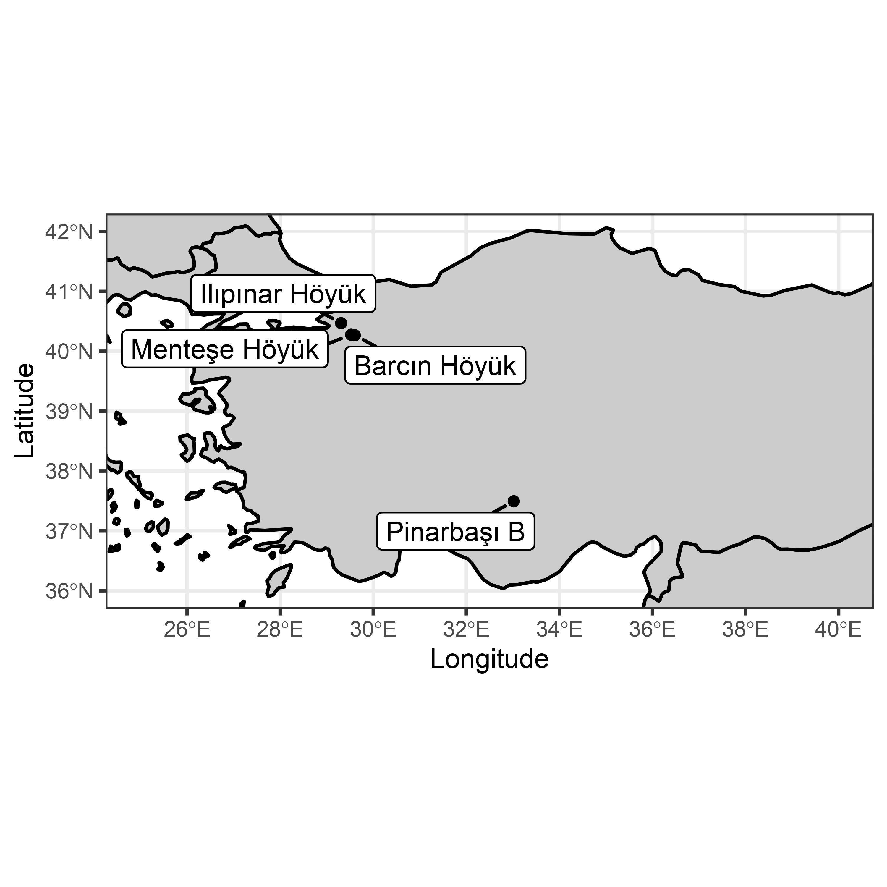
```

The Northwest Anatolian cattle bone assemblages consist of `r archaeological_sites_summary$nw_anatolian_cattle_specimens_N` measured specimens spread unevenly across the four components (Barcın Höyük N = `r archaeological_sites_summary$barcin_specimens_N`, Menteşe Höyük N = `r archaeological_sites_summary$mentese_specimens_N`, Neolithic Ilıpınar N = `r archaeological_sites_summary$ilipinar1_specimens_N`, Chalcolithic Ilıpınar N = `r archaeological_sites_summary$ilipinar2_specimens_N`; Supplemental Table S5). All measured *Bos* remains were included in the analysis, rather than separating out those identified as aurochs (*Bos primigenius*, N = `r archaeological_sites_summary$ilipinar_measured_bos_primigenius_N`) or identified only to *Bos* spp. (N = `r archaeological_sites_summary$ilipinar_measured_bos_spp_N`) in the Ilıpınar Höyük dataset; all specimens were only labeled as “*Bos*” in the Menteşe Höyük dataset. Table 7 shows the composition of the four Northwest Anatolian measurement assemblages. Demographic observations of the proportion of immature animals and the adult sex ratio for each assemblage describe these parameters. For the four Northwest Anatolian assemblages, estimates of the assemblage-level proportion of immature specimens based on the fusion rates of proximal and middle phalanges for cattle specimens are `r archaeological_sites_summary$barcin_age_observation` for Barcın Höyük, `r archaeological_sites_summary$ilipinar1_age_observation` for Neolithic Ilıpınar, `r archaeological_sites_summary$mentese_age_observation` for Menteşe Höyük, and `r archaeological_sites_summary$ilipinar2_age_observation` for Chalcolithic Ilıpınar. The observed adult sex ratios (females / females + males) based on cattle pelvis morphology are `r archaeological_sites_summary$barcin_sex_observation` for Barcın Höyük, `r archaeological_sites_summary$ilipinar1_sex_observation` for Neolithic Ilıpınar, `r archaeological_sites_summary$mentese_sex_observation` for Menteşe Höyük, and `r archaeological_sites_summary$ilipinar2_sex_observation` for Chalcolithic Ilıpınar. As in the Pinarbaşı B example, observations of 0 / 0 impart no information onto the prior distribution of the adult sex ratio. All demographic and measurement data come from the OpenContext datasets [@buitenhuis_ilipinar_data; @galik_barcin_data; @gourichon_helmer_mentese_data]; the associated RMarkdown file ("ZooarchMixMod.Rmd") includes the steps for data processing and analysis.

```{r table_7, echo = FALSE}
kbl(table_7, caption = "Elemental composition of the Northwest Anatolian cattle measurement assemblages.",
    booktabs = T, linesep = '') %>%
  kable_styling(latex_options = c("hold_position", "scale_down")) %>%
  row_spec(nrow(table_7), bold = TRUE)
```

Previous syntheses of the Late Neolithic and Early Chalcolithic animal economies in Northwest Anatolia provide several prior inferences about the age and sex structure of cattle bone assemblages that can be evaluated with the results of the Bayesian multilevel mixture model. First, the general cultural continuity of the assemblages suggests that the biometry and composition of cattle bone assemblages may be similar at the sites, having been produced by similar processes [@cakirlar_2013; @ozdogan_2019]; @buitenhuis_2008[312] explicitly states that there is no size change among cattle bones across the Ilıpınar assemblage. Second, the widespread evidence of milk consumption from pottery residue analyses from these sites and others in the region [@evershed_etal_2008; @thissen_etal_2010] has led some researchers to argue that cattle were managed for milk production [@gourichon_helmer_2008; @roodenberg_2012_article]. @gourichon_helmer_2008[440] argue that the cattle tooth eruption and wear data at Menteşe indicate exploitation focused on milk consumption; one consequence of this pattern should be female-dominated adult sex ratios, including higher fusion rates for later-fusing elements among females than males [@zeder_hesse_2000]. The multilevel modeling results can be used to evaluate the feasibility of these inferences by examining posterior distributions of relevant parameters and simulations of sex-specific fusion rates.

Because this application is a multisite model and deals with a different taxon than the original simulations, the prior distributions for the model hyper-parameters are redefined to reflect different expectations of biological feasibility. While the multisite simulation provides useful prior distribution definitions for most of the parameters, two other parameters (average body size of females $\mu_{2}$ and index of sexual dimorphism $\log_{e}(\delta_{2})$) should be changed because of different expectations modeling cattle rather than sheep. The change in the prior distribution definition of $\mu_{2}$ reflects the fact that the standard measurements for cattle come from an aurochs female [@degerbol_1970], which is expected to be larger than the domestic cattle females in the assemblages. Cattle are expected to be more sexually dimorphic than sheep, which is reflected in increasing the average expected value of $\log_{e}(\delta_{2})$, resulting in an expectation of `r round(exp(-2), 2)` $\operatorname{LSI}_{e}$ units between males and females on average. This is slightly lower than the index of sexual dimorphism seen in the @degerbol_1970 aurochs specimens [@grigson_1989: Figure 2, which uses $\operatorname{LSI}_{10}$; the equivalent size difference is `r round(log(1 + exp(-2), base = 10), 2)` on the $\operatorname{LSI}_{10}$ scale], though domestic cattle may be expected to be less sexually dimorphic than their wild counterparts [e.g., @tchernov_horwitz_1991]; these prior distribution definitions are listed in the Model Supplement.

## 4. RESULTS

Bayesian models that use Monte Carlo methods, like the ones used here, rely on convergence diagnostics to ensure that the results (posterior distributions) have converged to the target distribution—that the results are not unduly affected by the random starting position of the analysis. To do this, analysts run multiple independent chains of the model—starting from different initial values—then evaluate how similar the chains are to one another using different diagnostic criteria [e.g., @gelman_rubin_1992]. Supplemental Tables S6-S11 show the posterior estimates of the (overall and site-specific) model hyper-parameters and diagnostic criteria (R-hat and effective sample size). These results are consistent with the model successfully converging, as R-hat values are ≤ 1.01 and effective sample sizes are greater than 100x the number of chains [@vehtari_etal_2021]. Trace plots show the value of a parameter at each posterior sample, with each chain overlain on top of each other; a converged model should have no directionality across the length of the chain and the independent chains should be indistinguishable from one another. Trace plots of each model’s overall hyper-parameters are shown in Supplemental Figures S1-S4. None of the parameters show extreme deviations between chains, supporting the assertion that the model’s posterior distributions properly describe the data and prior beliefs.

### *4.1 Simulated Assemblages: testing model accuracy*

```{r single assemblage simulation stanfit, include = FALSE, eval = TRUE}
#Single Assemblage Analysis
single_assemblage_mixmod_standata <- list(
  #Sample sizes
  N_Specimens = single_assemblage_mixmod_data[, .N, Specimen_No][, .N],
  N_Measurements = single_assemblage_mixmod_data[, .N],
  N_Element_Portions = single_assemblage_mixmod_data[, .N, Element_Portion][, .N],
  N_Dimensions = single_assemblage_mixmod_data[, .N, Dimension][, .N],
  #Specimen observations
  Element_Portion = single_assemblage_mixmod_data[, .N, .(Specimen_No, Element_Portion, Immature)][order(Specimen_No), Element_Portion],
  Immature = single_assemblage_mixmod_data[, .N, .(Specimen_No, Element_Portion, Immature)][order(Specimen_No), Immature],
  Immature_Proportion = as.matrix(dcast(single_assemblage_mixmod_data[, .(Immature_Proportion = mean(Immature)), .(Site_No, Element_Portion)], Site_No ~ Element_Portion, value.var = "Immature_Proportion", fill = 0))[, 2:(single_assemblage_mixmod_data[, .N, Element_Portion][, .N] + 1)],
  #Measurement observations
  Measurement_obs = single_assemblage_mixmod_data[, Measurement_value],
  Measurement_sd = single_assemblage_mixmod_data[, Measurement_value * 0.01], #Calculate measurement error for observed measurements and reference data (1% based on data from Breslawksi and Byers 2015)
  Reference_obs = single_assemblage_mixmod_data[, .N, .(Dimension, Reference_value)][order(Dimension), Reference_value],
  Reference_sd = single_assemblage_mixmod_data[, .N, .(Dimension, Reference_value)][order(Dimension), Reference_value * 0.01],
  Dimension = single_assemblage_mixmod_data[, Dimension],
  Specimen = single_assemblage_mixmod_data[, Specimen_No],
  #Demographic observations
  Immature_obs = single_assemblage_demographic_observations[, N_Unfused],
  Immature_obs_n = single_assemblage_demographic_observations[, N_Ageable],
  Female_obs = single_assemblage_demographic_observations[, N_Female],
  Female_obs_n = single_assemblage_demographic_observations[, N_Sexable],
  #Prior distributions for hyper-parameters
  prior_theta_raw_1 = c(-0.5, 1.5),
  prior_theta_raw_2 = c(0, 1.5),
  prior_mu_female = c(0, 0.1),
  prior_logdelta_immature = c(-3.5, 0.4),
  prior_logdelta_male = c(-2.7, 0.1),
  prior_logsigma_immature = c(-3.05, 0.1),
  prior_logsigma_female = c(-3.1, 0.1),
  prior_logsigma_male = c(-3.1, 0.1)
)
singlesite_mixture_stanmodel <- cmdstan_model("./Scripts/LSI_mixture_model_singlesite.stan")
single_assemblage_samples <- singlesite_mixture_stanmodel$sample(
  data = single_assemblage_mixmod_standata,
  chains = 4,
  parallel_chains = 4,
  refresh = 250,
   seed = 1135529301, #change seed to generalize/if the data are changed
  adapt_delta = 0.90,
  max_treedepth = 15
)
single_assemblage_stanfit <- rstan::read_stan_csv(single_assemblage_samples$output_files())
single_assemblage_post <- extract(single_assemblage_stanfit)
```

```{r multisite simulation stanfit, include = FALSE, eval = TRUE}
#Multisite Analysis
multisite_mixmod_standata <- list(
  #Sample sizes
  N_Sites = multisite_mixmod_data[, .N, Site_No][, .N],
  N_Specimens = multisite_mixmod_data[, .N, Specimen_No][, .N],
  N_Measurements = multisite_mixmod_data[, .N],
  N_Element_Portions = multisite_mixmod_data[, .N, Element_Portion][, .N],
  N_Dimensions = multisite_mixmod_data[, .N, Dimension][, .N],
  #Specimen observations
  Site = multisite_mixmod_data[, .N, .(Specimen_No, Element_Portion, Site_No, Immature)][order(Specimen_No), Site_No],
  Element_Portion = multisite_mixmod_data[, .N, .(Specimen_No, Element_Portion, Site_No, Immature)][order(Specimen_No), Element_Portion],
  Immature = multisite_mixmod_data[, .N, .(Specimen_No, Element_Portion, Site_No, Immature)][order(Specimen_No), Immature],
  Immature_Proportion = as.matrix(dcast(multisite_mixmod_data[, .(Immature_Proportion = mean(Immature)), .(Site_No, Element_Portion)], Site_No ~ Element_Portion, value.var = "Immature_Proportion", fill = 0))[, 2:(multisite_mixmod_data[, .N, Element_Portion][, .N] + 1)],
  #Measurement observations
  Measurement_obs = multisite_mixmod_data[, Measurement_value],
  Measurement_sd = multisite_mixmod_data[, Measurement_value * 0.01], #Calculate measurement error for observed measurements and reference data (1% based on data from Breslawksi and Byers 2015)
  Reference_obs = multisite_mixmod_data[, .N, .(Dimension, Reference_value)][order(Dimension), Reference_value],
  Reference_sd = multisite_mixmod_data[, .N, .(Dimension, Reference_value)][order(Dimension), Reference_value * 0.01],
  Dimension = multisite_mixmod_data[, Dimension],
  Specimen = multisite_mixmod_data[, Specimen_No],
  #Demographic observations
  N_Immature_obs = multisite_demographic_observations[, .N],
  Immature_obs_site = multisite_demographic_observations[, Site_No],
  Immature_obs = multisite_demographic_observations[, N_Unfused],
  Immature_obs_n = multisite_demographic_observations[, N_Ageable],
  N_Female_obs = multisite_demographic_observations[, .N],
  Female_obs_site = multisite_demographic_observations[, Site_No],
  Female_obs = multisite_demographic_observations[, N_Female],
  Female_obs_n = multisite_demographic_observations[, N_Sexable],
  #Prior distributions for hyper-parameters
  prior_theta_raw_1 = c(-0.5, 1.5),
  prior_theta_raw_2 = c(0, 1.5),
  prior_mu_female = c(0, 0.2),
  prior_logdelta_immature = c(-3.5, 0.5),
  prior_logdelta_male = c(-2.7, 0.2),
  prior_logsigma_immature = c(-3.05, 0.1),
  prior_logsigma_female = c(-3.1, 0.1),
  prior_logsigma_male = c(-3.1, 0.1)
)
LSI_multisite_model <- cmdstan_model("./Scripts/LSI_mixture_model_multisite.stan")
multisite_samples <- LSI_multisite_model$sample(
  data = multisite_mixmod_standata,
  chains = 4,
  parallel_chains = 4,
  refresh = 250,
  adapt_delta = 0.80,
  seed = 1099252793,
  max_treedepth = 15
)
multisite_stanfit <- rstan::read_stan_csv(multisite_samples$output_files())
multisite_post <- extract(multisite_stanfit)
```

```{r posterior analysis of the simulated assemblages, include = FALSE, eval = TRUE}
#Parametric accuracy
parametric_accuracy <- function(true_values, posterior, single_assemblage = T, ci_limit = 0.95) {
  outcome_datatable <- data.table(CI_limit = ci_limit, Total = length(true_values) * true_values[, .N])
  if(single_assemblage) {
    accuracy <- sum(c(
      true_values[, p_immature] >= quantile(posterior$grand_theta[, 1], (1 - ci_limit) / 2) & true_values[, p_immature] <= quantile(posterior$grand_theta[, 1], 1 - (1 - ci_limit) / 2),
      true_values[, p_female] >= quantile(posterior$grand_theta[, 2], (1 - ci_limit) / 2) & true_values[, p_female] <= quantile(posterior$grand_theta[, 2], 1 - (1 - ci_limit) / 2),
      true_values[, p_male] >= quantile(posterior$grand_theta[, 3], (1 - ci_limit) / 2) & true_values[, p_male] <= quantile(posterior$grand_theta[, 3], 1 - (1 - ci_limit) / 2),
      #
      true_values[, mu_immature] >= quantile(posterior$grand_mu_immature, (1 - ci_limit) / 2) & true_values[, mu_immature] <= quantile(posterior$grand_mu_immature, 1 - (1 - ci_limit) / 2),
      true_values[, mu_female] >= quantile(posterior$grand_mu_female, (1 - ci_limit) / 2) & true_values[, mu_female] <= quantile(posterior$grand_mu_female, 1 - (1 - ci_limit) / 2),
      true_values[, mu_male] >= quantile(posterior$grand_mu_male, (1 - ci_limit) / 2) & true_values[, mu_male] <= quantile(posterior$grand_mu_male, 1 - (1 - ci_limit) / 2),
      #
      true_values[, sigma_immature] >= quantile(posterior$grand_sigma_immature, (1 - ci_limit) / 2) & true_values[, sigma_immature] <= quantile(posterior$grand_sigma_immature, 1 - (1 - ci_limit) / 2),
      true_values[, sigma_female] >= quantile(posterior$grand_sigma_female, (1 - ci_limit) / 2) & true_values[, sigma_female] <= quantile(posterior$grand_sigma_female, 1 - (1 - ci_limit) / 2),
      true_values[, sigma_male] >= quantile(posterior$grand_sigma_male, (1 - ci_limit) / 2) & true_values[, sigma_male] <= quantile(posterior$grand_sigma_male, 1 - (1 - ci_limit) / 2)
    ))
  }
  if(!single_assemblage) {
    accuracy <- sum(c(
      sapply(1:15, function(x) true_values[x, p_immature] >= quantile(posterior$site_theta[, 1, x], (1 - ci_limit) / 2) & true_values[x, p_immature] <= quantile(posterior$site_theta[, 1, x], 1 - (1 - ci_limit) / 2)),
      sapply(1:15, function(x) true_values[x, p_female] >= quantile(posterior$site_theta[, 2, x], (1 - ci_limit) / 2) & true_values[x, p_female] <= quantile(posterior$site_theta[, 2, x], 1 - (1 - ci_limit) / 2)),
      sapply(1:15, function(x) true_values[x, p_male] >= quantile(posterior$site_theta[, 3, x], (1 - ci_limit) / 2) & true_values[x, p_male] <= quantile(posterior$site_theta[, 3, x], 1 - (1 - ci_limit) / 2)),
      sapply(1:15, function(x) true_values[x, mu_immature] >= quantile(posterior$site_mu_immature[, x], (1 - ci_limit) / 2) & true_values[x, mu_immature] <= quantile(posterior$site_mu_immature[, x], 1 - (1 - ci_limit) / 2)),
      sapply(1:15, function(x) true_values[x, mu_female] >= quantile(posterior$site_mu_female[, x], (1 - ci_limit) / 2) & true_values[x, mu_female] <= quantile(posterior$site_mu_female[, x], 1 - (1 - ci_limit) / 2)),
      sapply(1:15, function(x) true_values[x, mu_male] >= quantile(posterior$site_mu_male[, x], (1 - ci_limit) / 2) & true_values[x, mu_male] <= quantile(posterior$site_mu_male[, x], 1 - (1 - ci_limit) / 2)),
      sapply(1:15, function(x) true_values[x, sigma_immature] >= quantile(posterior$site_sigma_immature[, x], (1 - ci_limit) / 2) & true_values[x, sigma_immature] <= quantile(posterior$site_sigma_immature[, x], 1 - (1 - ci_limit) / 2)),
      sapply(1:15, function(x) true_values[x, sigma_female] >= quantile(posterior$site_sigma_female[, x], (1 - ci_limit) / 2) & true_values[x, sigma_female] <= quantile(posterior$site_sigma_female[, x], 1 - (1 - ci_limit) / 2)),
      sapply(1:15, function(x) true_values[x, sigma_male] >= quantile(posterior$site_sigma_male[, x], (1 - ci_limit) / 2) & true_values[x, sigma_male] <= quantile(posterior$site_sigma_male[, x], 1 - (1 - ci_limit) / 2))
    ))
  }
  outcome_datatable[, c("Accurate", "Rate") := .(sum(accuracy), round(sum(accuracy) / Total, 2))]
  outcome_datatable[, .(CI_limit, Accurate, Total, Rate)]
}
#parameters are from the Popkin, et al. (2012) Shetland sheep population
true_single_assemblage_parameters <- sheep_mixmod_data[, .(LSI = mean(log(Measurement_value / Reference_value))), .(Specimen_No, Group)][, .(p_immature = mean(Group %in% "Immature"), p_female = mean(Group %in% "Female"), p_male = mean(Group %in% "Male"), mu_immature = mean(LSI[Group %in% "Immature"]), mu_female = mean(LSI[Group %in% "Female"]), mu_male = mean(LSI[Group %in% "Male"]), sigma_immature = sd(LSI[Group %in% "Immature"]), sigma_female = sd(LSI[Group %in% "Female"]), sigma_male = sd(LSI[Group %in% "Male"]))]
#
true_multisite_parameters <- data.table(
  p_immature = rep(c(true_single_assemblage_parameters[, p_immature], 0.20, 0.05), each = 5),
  p_female = rep(c(true_single_assemblage_parameters[, p_female], 0.70, 0.35), each = 5),
  p_male = rep(c(true_single_assemblage_parameters[, p_male], 0.10, 0.60), each = 5),
  mu_immature = rep(true_single_assemblage_parameters[, mu_immature], 15),
  mu_female = rep(true_single_assemblage_parameters[, mu_female], 15),
  mu_male = rep(true_single_assemblage_parameters[, mu_male], 15),
  sigma_immature = rep(true_single_assemblage_parameters[, sigma_immature], 15),
  sigma_female = rep(true_single_assemblage_parameters[, sigma_female], 15),
  sigma_male = rep(true_single_assemblage_parameters[, sigma_male], 15)
)
#size modifications for different simulated assemblages
true_multisite_parameters[c(3, 8, 13), c("mu_immature", "mu_female", "mu_male") :=
                            .(sheep_mixmod_data[, .(Specimen_No, Group, LSI = log((Measurement_value * 1.20) / Reference_value))][, .(LSI = mean(LSI)), .(Specimen_No, Group)][Group %in% "Immature", mean(LSI)],
                              sheep_mixmod_data[, .(Specimen_No, Group, LSI = log((Measurement_value * 1.20) / Reference_value))][, .(LSI = mean(LSI)), .(Specimen_No, Group)][Group %in% "Female", mean(LSI)],
                              sheep_mixmod_data[, .(Specimen_No, Group, LSI = log((Measurement_value * 1.20) / Reference_value))][, .(LSI = mean(LSI)), .(Specimen_No, Group)][Group %in% "Male", mean(LSI)])]
true_multisite_parameters[c(4, 9, 14), c("mu_immature", "mu_female", "mu_male") :=
                            .(sheep_mixmod_data[, .(Specimen_No, Group, LSI = log((Measurement_value * 0.80) / Reference_value))][, .(LSI = mean(LSI)), .(Specimen_No, Group)][Group %in% "Immature", mean(LSI)],
                              sheep_mixmod_data[, .(Specimen_No, Group, LSI = log((Measurement_value * 0.80) / Reference_value))][, .(LSI = mean(LSI)), .(Specimen_No, Group)][Group %in% "Female", mean(LSI)],
                              sheep_mixmod_data[, .(Specimen_No, Group, LSI = log((Measurement_value * 0.80) / Reference_value))][, .(LSI = mean(LSI)), .(Specimen_No, Group)][Group %in% "Male", mean(LSI)])]
true_multisite_parameters[c(5, 10, 15), c("mu_male") :=
                            .(sheep_mixmod_data[, .(Specimen_No, Group, LSI = log((Measurement_value * 1.20) / Reference_value))][, .(LSI = mean(LSI)), .(Specimen_No, Group)][Group %in% "Male", mean(LSI)])]

#calculating accuracy only for site-level means
multisite_site_mu_80CI <- sum(c(
  sapply(1:15, function(x) true_multisite_parameters[x, mu_immature] >= quantile(multisite_post$site_mu_immature[, x], (1 - 0.8) / 2) & true_multisite_parameters[x, mu_immature] <= quantile(multisite_post$site_mu_immature[, x], 1 - (1 - 0.8) / 2)),
  sapply(1:15, function(x) true_multisite_parameters[x, mu_female] >= quantile(multisite_post$site_mu_female[, x], (1 - 0.8) / 2) & true_multisite_parameters[x, mu_female] <= quantile(multisite_post$site_mu_female[, x], 1 - (1 - 0.8) / 2)),
  sapply(1:15, function(x) true_multisite_parameters[x, mu_male] >= quantile(multisite_post$site_mu_male[, x], (1 - 0.8) / 2) & true_multisite_parameters[x, mu_male] <= quantile(multisite_post$site_mu_male[, x], 1 - (1 - 0.8) / 2))
))
multisite_site_mu_95CI <- sum(c(
  sapply(1:15, function(x) true_multisite_parameters[x, mu_immature] >= quantile(multisite_post$site_mu_immature[, x], (1 - 0.95) / 2) & true_multisite_parameters[x, mu_immature] <= quantile(multisite_post$site_mu_immature[, x], 1 - (1 - 0.95) / 2)),
  sapply(1:15, function(x) true_multisite_parameters[x, mu_female] >= quantile(multisite_post$site_mu_female[, x], (1 - 0.95) / 2) & true_multisite_parameters[x, mu_female] <= quantile(multisite_post$site_mu_female[, x], 1 - (1 - 0.95) / 2)),
  sapply(1:15, function(x) true_multisite_parameters[x, mu_male] >= quantile(multisite_post$site_mu_male[, x], (1 - 0.95) / 2) & true_multisite_parameters[x, mu_male] <= quantile(multisite_post$site_mu_male[, x], 1 - (1 - 0.95) / 2))
))
```

```{r composition analysis for simulated assemblages, include = FALSE, eval = TRUE}
#equations to simulate a specimen as immature/female/male and count up the composition
ifm_sample <- function(p_immature, p_female, p_male) {
  sample(c("Immature", "Female", "Male"), 1, replace = T, prob = c(p_immature, p_female, p_male))
}
#Simulates the composition of an assemblage with Immature/Female/male probabilities
ifm_composition <- function(measured_specimens) {
  #simulate sex assignments
  measured_specimens[, Simulated_Group := sapply(1:.N, function(x) ifm_sample(p_immature[x], p_female[x], p_male[x]))]
  #counts of the different elements by group (make sure there's a 0 if a value is missing)
  melt(measured_specimens[, .(`Immature` = sum(Simulated_Group %in% "Immature"),
                              `Female` = sum(Simulated_Group %in% "Female"),
                              `Male` = sum(Simulated_Group %in% "Male")), .(Site_No, Element_Portion, Element)], id.vars = c("Site_No", "Element_Portion", "Element"), variable.name = "Simulated_Group", value.name = "N")[order(Site_No, Element_Portion, Simulated_Group)]
}

theta_finder <- function(Specimen_No, Element_Portion, Immature, Immature_Proportions, element_thetas, specimen_probs) {
  thetas <- rep(NA, 3)
  immature_proportion <- Immature_Proportions[Portion %in% Element_Portion, Immature_Proportion]
  thetas[1:3] <- ifelse(rep(!is.na(Specimen_No), 3),
                        specimen_probs[Specimen_No, 1:3],
                        ifelse(rep(Immature == 1, 3),
                               c(element_thetas[1, Element_Portion] / immature_proportion,
                                 element_thetas[2, Element_Portion] * immature_proportion,
                                 element_thetas[3, Element_Portion] * immature_proportion),
                               c(0,
                                 element_thetas[2, Element_Portion] / (1 - min(c(element_thetas[1, Element_Portion], 0.99999))), #fail-safe for extreme values
                                 element_thetas[3, Element_Portion] / (1 - min(c(element_thetas[1, Element_Portion], 0.99999)))))
  )
  list(p_immature = thetas[1] / sum(thetas), p_female = thetas[2] / sum(thetas), p_male = thetas[3] / sum(thetas))
}

#

composition_analysis <- function(composition_data, true_data, site_no = 1, site_title = "") {
  ggplot(composition_data[Site_No %in% site_no, .(N = sum(N)), .(Iteration, Simulated_Group, Element, Element_Portion)][, .(Element, Element_Portion, group = Simulated_Group, Plot_Group = paste(Element, as.numeric(Simulated_Group), sep = "."), N)]) + aes(y = N, x = Plot_Group) +
    stat_slab(normalize = "groups", slab_type = "histogram", breaks = 0:(composition_data[Site_No %in% site_no, .(N = sum(N)), .(Iteration, Simulated_Group, Element, Element_Portion)][, max(N)]), aes(fill = group, fill_ramp = stat(cut_cdf_qi(cdf, .width = c(0.80, 0.95, 1), labels = scales::percent_format())))) +
    stat_pointinterval(.width = c(0.8, 0.95), aes(color = group), position = position_dodge(width = 0.2, preserve = "single")) +
    geom_segment(data = true_data[Site_No %in% site_no, .(Count = sum(Count)), .(Element, Element_Portion, Group)][, .(Element, Element_Portion, group = Group, Plot_Group = factor(paste(Element, as.numeric(factor(Group, levels = c("Immature", "Female", "Male"))), sep = ".")), N = Count)][, .(group, Plot_Group, x = as.numeric(Plot_Group) - 0.1, xend = as.numeric(Plot_Group) + 0.75, y = N, yend = N)], aes(x = x, xend = xend, y = y, yend = yend, color = group, linetype = "solid"), lwd = 1) +
    scale_fill_ramp_discrete(name = "Interval", range = c(0.5, 0.15), na.translate = F) +
    scale_color_manual(name = "Group", values = c("black", "blue", "red"), na.translate = F) +
    scale_fill_manual(name = "Group", values = c("black", "blue", "red"), na.translate = F) +
    scale_x_discrete(name = "", breaks = composition_data[, .N, .(Element, Element_Portion)][order(Element_Portion), paste(Element, ".2", sep = "")], labels = composition_data[, .N, .(Full_Element_Name, Element_Portion)][order(Element_Portion), Full_Element_Name]) +
    scale_linetype_manual(name = "True Count", values = 1, labels = NULL) +
    scale_y_continuous(name = "Estimated Count") + coord_cartesian(expand = FALSE) +
    labs(title = site_title) +
    theme_classic() + theme(legend.text = element_text(size = 10), legend.position = "bottom", legend.justification = c("center"), legend.box.just = "right", legend.margin = margin(6, 6, 6, 6), axis.text.x = element_text(angle = 90, size = 10), axis.title = element_text(size = 16), axis.text.y = element_text(angle = 90, size = 10, hjust = 0.5))
}
```

```{r true composition of the simulated assemblages (measured and modeled), include = FALSE, eval = TRUE}
#Single Assemblage Simulation
#Determining the true composition of the measured and modeled assemblages
single_measured_assemblage_composition <- melt(dcast(single_measured_assemblage[, .N, .(Site_No, Element, Original_Specimen_No, Element_Portion, Group)], Site_No + Group ~ Element_Portion, value.var = "N", fun.aggregate = length), id.vars = c("Group", "Site_No"), variable.name = "Element_Portion", value.name = "Count")

#ensure that every combination is present (add in 0s for missing combinations)
single_measured_assemblage_composition <- single_measured_assemblage_composition[data.table(Site_No = 1, Group = rep(c("Immature", "Female", "Male"), single_assemblage_mixmod_data[, .N, Element_Portion][, .N]), Element_Portion = factor(rep(1:single_assemblage_mixmod_data[, .N, Element_Portion][, .N], each = 3)), Element = rep(single_assemblage_mixmod_data[, .N, .(Element, Element_Portion)][order(Element_Portion), Element], each = 3)), on = c("Site_No", "Group", "Element_Portion")]
single_measured_assemblage_composition[is.na(Count), Count := 0]

#Modeled (Single Assemblage)
single_modeled_assemblage_composition <- melt(dcast(single_modeled_assemblage[, .N, .(Site_No, Element, Original_Specimen_No, Element_Portion, Group)], Site_No + Group ~ Element_Portion, value.var = "N", fun.aggregate = length), id.vars = c("Group", "Site_No"), variable.name = "Element_Portion", value.name = "Count")

#ensure that every combination is present (add in 0s for missing combinations)
single_modeled_assemblage_composition <- single_modeled_assemblage_composition[data.table(Site_No = 1, Group = rep(c("Immature", "Female", "Male"), single_assemblage_mixmod_data[, .N, Element_Portion][, .N]), Element_Portion = factor(rep(1:single_assemblage_mixmod_data[, .N, Element_Portion][, .N], each = 3)), Element = rep(single_assemblage_mixmod_data[, .N, .(Element, Element_Portion)][order(Element_Portion), Element], each = 3)), on = c("Site_No", "Group", "Element_Portion")]
single_modeled_assemblage_composition[is.na(Count), Count := 0]
single_modeled_assemblage_composition

#Immature proportions
single_measured_assemblage_immature_proportions <- single_measured_assemblage[, .(Immature_Proportion = mean(Immature)), .(Portion = Element_Portion)][order(Portion)]
single_modeled_assemblage_immature_proportions <- single_modeled_assemblage[, .(Immature_Proportion = mean(Immature)), .(Portion = Element_Portion)][order(Portion)]

#Multisite Simmulation#
multisite_measured_assemblage_composition <- melt(dcast(multisite_measured_assemblage[, .N, .(Site_No, Element, Original_Specimen_No, Element_Portion, Group)], Site_No + Group ~ Element_Portion, value.var = "N", fun.aggregate = length), id.vars = c("Group", "Site_No"), variable.name = "Element_Portion", value.name = "Count")
#ensure that every combination is present (add in 0s for missing combinations)
multisite_measured_assemblage_composition <- multisite_measured_assemblage_composition[
  data.table(Site_No = rep(1:multisite_measured_assemblage[, .N, Site_No][, .N], each = 3), Group = rep(c("Immature", "Female", "Male"), multisite_measured_assemblage[, .N, Element_Portion][, .N] * multisite_measured_assemblage[, .N, Site_No][, .N]), Element_Portion = factor(rep(1:multisite_measured_assemblage[, .N, Element_Portion][, .N], each = 3 * multisite_measured_assemblage[, .N, Site_No][, .N])), Element = rep(multisite_measured_assemblage[, .N, .(Element, Element_Portion)][order(Element_Portion), Element], each = 3 * multisite_measured_assemblage[, .N, Site_No][, .N])),
  on = c("Site_No", "Group", "Element_Portion")]
multisite_measured_assemblage_composition[is.na(Count), Count := 0]

#Multisite simulation (modeled)
multisite_modeled_assemblage_composition <- melt(dcast(multisite_modeled_assemblage[, .N, .(Site_No, Element, Original_Specimen_No, Element_Portion, Group)], Site_No + Group ~ Element_Portion, value.var = "N", fun.aggregate = length), id.vars = c("Group", "Site_No"), variable.name = "Element_Portion", value.name = "Count")
#ensure that every combination is present (add in 0s for missing combinations)
multisite_modeled_assemblage_composition <- multisite_modeled_assemblage_composition[
  data.table(Site_No = rep(1:multisite_modeled_assemblage[, .N, Site_No][, .N], each = 3), Group = rep(c("Immature", "Female", "Male"), multisite_modeled_assemblage[, .N, Element_Portion][, .N] * multisite_modeled_assemblage[, .N, Site_No][, .N]), Element_Portion = factor(rep(1:multisite_modeled_assemblage[, .N, Element_Portion][, .N], each = 3 * multisite_modeled_assemblage[, .N, Site_No][, .N])), Element = rep(multisite_modeled_assemblage[, .N, .(Element, Element_Portion)][order(Element_Portion), Element], each = 3 * multisite_modeled_assemblage[, .N, Site_No][, .N])),
  on = c("Site_No", "Group", "Element_Portion")]
multisite_modeled_assemblage_composition[is.na(Count), Count := 0]

#Immature proportions
multisite_measured_assemblage_immature_proportions <- multisite_measured_assemblage[, .(Immature_Proportion = mean(Immature)), .(Site_No, Portion = Element_Portion)][order(Site_No, Portion)]
multisite_modeled_assemblage_immature_proportions <- multisite_modeled_assemblage[, .(Immature_Proportion = mean(Immature)), .(Site_No, Portion = Element_Portion)][order(Site_No, Portion)]
```

```{r composition analysis: single assemblage simulation, include = FALSE, eval = TRUE}
#Set up the virtual cluster for faster calculation
clusterExport(cl, list('data.table', 'melt', 'ifm_sample', 'theta_finder', 'ifm_composition', 'single_measured_assemblage', 'single_measured_assemblage_immature_proportions', 'single_modeled_assemblage', 'single_modeled_assemblage_immature_proportions', 'single_assemblage_post'))

single_measured_assemblage_simulated_composition <- rbindlist(parLapply(cl = cl, 1:4000, fun = function(x) ifm_composition(single_measured_assemblage[, theta_finder(Specimen_No, Element_Portion, Immature, single_measured_assemblage_immature_proportions, element_thetas = single_assemblage_post$theta[x, , ], specimen_probs = single_assemblage_post$specimen_prob[x, , ]), .(Original_Specimen_No, Specimen_No, Element, Element_Portion, Immature)][, .(Original_Specimen_No, Specimen_No, Site_No = 1, Element, Element_Portion, Immature, p_immature, p_female, p_male)])[, .(Iteration = x, Site_No, Element_Portion, Element, Simulated_Group, N)]))
single_modeled_assemblage_simulated_composition <- rbindlist(parLapply(cl = cl, 1:4000, fun = function(x) ifm_composition(single_modeled_assemblage[, theta_finder(Specimen_No, Element_Portion, Immature, single_modeled_assemblage_immature_proportions, element_thetas = single_assemblage_post$theta[x, , ], specimen_probs = single_assemblage_post$specimen_prob[x, , ]), .(Original_Specimen_No, Specimen_No, Element, Element_Portion, Immature)][, .(Original_Specimen_No, Specimen_No, Site_No = 1, Element, Element_Portion, Immature, p_immature, p_female, p_male)])[, .(Iteration = x, Site_No, Element_Portion, Element, Simulated_Group, N)]))

#Putting full element names in for plotting
single_measured_assemblage_simulated_composition[Element %in% "Ast", Full_Element_Name := "Astragalus"]
single_measured_assemblage_simulated_composition[Element %in% "Fem", Full_Element_Name := "Femur"]
single_measured_assemblage_simulated_composition[Element %in% "Hum", Full_Element_Name := "Humerus"]
single_measured_assemblage_simulated_composition[Element %in% "Mtc", Full_Element_Name := "Metacarpus"]
single_measured_assemblage_simulated_composition[Element %in% "Mtt", Full_Element_Name := "Metatarsus"]
single_measured_assemblage_simulated_composition[Element %in% "Rad", Full_Element_Name := "Radius"]
single_measured_assemblage_simulated_composition[Element %in% "Sca", Full_Element_Name := "Scapula"]
single_measured_assemblage_simulated_composition[Element %in% "Tib", Full_Element_Name := "Tibia"]
#
single_modeled_assemblage_simulated_composition[Element %in% "Ast", Full_Element_Name := "Astragalus"]
single_modeled_assemblage_simulated_composition[Element %in% "Fem", Full_Element_Name := "Femur"]
single_modeled_assemblage_simulated_composition[Element %in% "Hum", Full_Element_Name := "Humerus"]
single_modeled_assemblage_simulated_composition[Element %in% "Mtc", Full_Element_Name := "Metacarpus"]
single_modeled_assemblage_simulated_composition[Element %in% "Mtt", Full_Element_Name := "Metatarsus"]
single_modeled_assemblage_simulated_composition[Element %in% "Rad", Full_Element_Name := "Radius"]
single_modeled_assemblage_simulated_composition[Element %in% "Sca", Full_Element_Name := "Scapula"]
single_modeled_assemblage_simulated_composition[Element %in% "Tib", Full_Element_Name := "Tibia"]
```

```{r composition analysis: multisite simulation, include = FALSE, eval = TRUE}
#Set up the virtual cluster for faster calculation
clusterExport(cl, list('data.table', 'melt', 'ifm_sample', 'theta_finder', 'ifm_composition', 'multisite_measured_assemblage', 'multisite_measured_assemblage_immature_proportions', 'multisite_modeled_assemblage', 'multisite_modeled_assemblage_immature_proportions', 'multisite_post'))

multisite_measured_assemblage_simulated_composition <- rbind(
  rbindlist(parLapply(cl = cl, 1:4000, fun = function(x) ifm_composition(multisite_measured_assemblage[Site_No %in% 1, theta_finder(Specimen_No, Element_Portion, Immature, multisite_measured_assemblage_immature_proportions[Site_No %in% 1], element_thetas = multisite_post$theta[x, , 1, ], specimen_probs = multisite_post$specimen_prob[x, , ]), .(Original_Specimen_No, Specimen_No, Element, Element_Portion, Immature)][, .(Original_Specimen_No, Specimen_No, Site_No = 1, Element, Element_Portion, Immature, p_immature, p_female, p_male)])[, .(Iteration = x, Site_No, Element_Portion, Element, Simulated_Group, N)])),
  rbindlist(parLapply(cl = cl, 1:4000, fun = function(x) ifm_composition(multisite_measured_assemblage[Site_No %in% 2, theta_finder(Specimen_No, Element_Portion, Immature, multisite_measured_assemblage_immature_proportions[Site_No %in% 2], element_thetas = multisite_post$theta[x, , 2, ], specimen_probs = multisite_post$specimen_prob[x, , ]), .(Original_Specimen_No, Specimen_No, Element, Element_Portion, Immature)][, .(Original_Specimen_No, Specimen_No, Site_No = 2, Element, Element_Portion, Immature, p_immature, p_female, p_male)])[, .(Iteration = x, Site_No, Element_Portion, Element, Simulated_Group, N)])),
  rbindlist(parLapply(cl = cl, 1:4000, fun = function(x) ifm_composition(multisite_measured_assemblage[Site_No %in% 3, theta_finder(Specimen_No, Element_Portion, Immature, multisite_measured_assemblage_immature_proportions[Site_No %in% 3], element_thetas = multisite_post$theta[x, , 3, ], specimen_probs = multisite_post$specimen_prob[x, , ]), .(Original_Specimen_No, Specimen_No, Element, Element_Portion, Immature)][, .(Original_Specimen_No, Specimen_No, Site_No = 3, Element, Element_Portion, Immature, p_immature, p_female, p_male)])[, .(Iteration = x, Site_No, Element_Portion, Element, Simulated_Group, N)])),
  rbindlist(parLapply(cl = cl, 1:4000, fun = function(x) ifm_composition(multisite_measured_assemblage[Site_No %in% 4, theta_finder(Specimen_No, Element_Portion, Immature, multisite_measured_assemblage_immature_proportions[Site_No %in% 4], element_thetas = multisite_post$theta[x, , 4, ], specimen_probs = multisite_post$specimen_prob[x, , ]), .(Original_Specimen_No, Specimen_No, Element, Element_Portion, Immature)][, .(Original_Specimen_No, Specimen_No, Site_No = 4, Element, Element_Portion, Immature, p_immature, p_female, p_male)])[, .(Iteration = x, Site_No, Element_Portion, Element, Simulated_Group, N)])),
  rbindlist(parLapply(cl = cl, 1:4000, fun = function(x) ifm_composition(multisite_measured_assemblage[Site_No %in% 5, theta_finder(Specimen_No, Element_Portion, Immature, multisite_measured_assemblage_immature_proportions[Site_No %in% 5], element_thetas = multisite_post$theta[x, , 5, ], specimen_probs = multisite_post$specimen_prob[x, , ]), .(Original_Specimen_No, Specimen_No, Element, Element_Portion, Immature)][, .(Original_Specimen_No, Specimen_No, Site_No = 5, Element, Element_Portion, Immature, p_immature, p_female, p_male)])[, .(Iteration = x, Site_No, Element_Portion, Element, Simulated_Group, N)])),
  rbindlist(parLapply(cl = cl, 1:4000, fun = function(x) ifm_composition(multisite_measured_assemblage[Site_No %in% 6, theta_finder(Specimen_No, Element_Portion, Immature, multisite_measured_assemblage_immature_proportions[Site_No %in% 6], element_thetas = multisite_post$theta[x, , 6, ], specimen_probs = multisite_post$specimen_prob[x, , ]), .(Original_Specimen_No, Specimen_No, Element, Element_Portion, Immature)][, .(Original_Specimen_No, Specimen_No, Site_No = 6, Element, Element_Portion, Immature, p_immature, p_female, p_male)])[, .(Iteration = x, Site_No, Element_Portion, Element, Simulated_Group, N)])),
  rbindlist(parLapply(cl = cl, 1:4000, fun = function(x) ifm_composition(multisite_measured_assemblage[Site_No %in% 7, theta_finder(Specimen_No, Element_Portion, Immature, multisite_measured_assemblage_immature_proportions[Site_No %in% 7], element_thetas = multisite_post$theta[x, , 7, ], specimen_probs = multisite_post$specimen_prob[x, , ]), .(Original_Specimen_No, Specimen_No, Element, Element_Portion, Immature)][, .(Original_Specimen_No, Specimen_No, Site_No = 7, Element, Element_Portion, Immature, p_immature, p_female, p_male)])[, .(Iteration = x, Site_No, Element_Portion, Element, Simulated_Group, N)])),
  rbindlist(parLapply(cl = cl, 1:4000, fun = function(x) ifm_composition(multisite_measured_assemblage[Site_No %in% 8, theta_finder(Specimen_No, Element_Portion, Immature, multisite_measured_assemblage_immature_proportions[Site_No %in% 8], element_thetas = multisite_post$theta[x, , 8, ], specimen_probs = multisite_post$specimen_prob[x, , ]), .(Original_Specimen_No, Specimen_No, Element, Element_Portion, Immature)][, .(Original_Specimen_No, Specimen_No, Site_No = 8, Element, Element_Portion, Immature, p_immature, p_female, p_male)])[, .(Iteration = x, Site_No, Element_Portion, Element, Simulated_Group, N)])),
  rbindlist(parLapply(cl = cl, 1:4000, fun = function(x) ifm_composition(multisite_measured_assemblage[Site_No %in% 9, theta_finder(Specimen_No, Element_Portion, Immature, multisite_measured_assemblage_immature_proportions[Site_No %in% 9], element_thetas = multisite_post$theta[x, , 9, ], specimen_probs = multisite_post$specimen_prob[x, , ]), .(Original_Specimen_No, Specimen_No, Element, Element_Portion, Immature)][, .(Original_Specimen_No, Specimen_No, Site_No = 9, Element, Element_Portion, Immature, p_immature, p_female, p_male)])[, .(Iteration = x, Site_No, Element_Portion, Element, Simulated_Group, N)])),
  rbindlist(parLapply(cl = cl, 1:4000, fun = function(x) ifm_composition(multisite_measured_assemblage[Site_No %in% 10, theta_finder(Specimen_No, Element_Portion, Immature, multisite_measured_assemblage_immature_proportions[Site_No %in% 10], element_thetas = multisite_post$theta[x, , 10, ], specimen_probs = multisite_post$specimen_prob[x, , ]), .(Original_Specimen_No, Specimen_No, Element, Element_Portion, Immature)][, .(Original_Specimen_No, Specimen_No, Site_No = 10, Element, Element_Portion, Immature, p_immature, p_female, p_male)])[, .(Iteration = x, Site_No, Element_Portion, Element, Simulated_Group, N)])),
  rbindlist(parLapply(cl = cl, 1:4000, fun = function(x) ifm_composition(multisite_measured_assemblage[Site_No %in% 11, theta_finder(Specimen_No, Element_Portion, Immature, multisite_measured_assemblage_immature_proportions[Site_No %in% 11], element_thetas = multisite_post$theta[x, , 11, ], specimen_probs = multisite_post$specimen_prob[x, , ]), .(Original_Specimen_No, Specimen_No, Element, Element_Portion, Immature)][, .(Original_Specimen_No, Specimen_No, Site_No = 11, Element, Element_Portion, Immature, p_immature, p_female, p_male)])[, .(Iteration = x, Site_No, Element_Portion, Element, Simulated_Group, N)])),
  rbindlist(parLapply(cl = cl, 1:4000, fun = function(x) ifm_composition(multisite_measured_assemblage[Site_No %in% 12, theta_finder(Specimen_No, Element_Portion, Immature, multisite_measured_assemblage_immature_proportions[Site_No %in% 12], element_thetas = multisite_post$theta[x, , 12, ], specimen_probs = multisite_post$specimen_prob[x, , ]), .(Original_Specimen_No, Specimen_No, Element, Element_Portion, Immature)][, .(Original_Specimen_No, Specimen_No, Site_No = 12, Element, Element_Portion, Immature, p_immature, p_female, p_male)])[, .(Iteration = x, Site_No, Element_Portion, Element, Simulated_Group, N)])),
  rbindlist(parLapply(cl = cl, 1:4000, fun = function(x) ifm_composition(multisite_measured_assemblage[Site_No %in% 13, theta_finder(Specimen_No, Element_Portion, Immature, multisite_measured_assemblage_immature_proportions[Site_No %in% 13], element_thetas = multisite_post$theta[x, , 13, ], specimen_probs = multisite_post$specimen_prob[x, , ]), .(Original_Specimen_No, Specimen_No, Element, Element_Portion, Immature)][, .(Original_Specimen_No, Specimen_No, Site_No = 13, Element, Element_Portion, Immature, p_immature, p_female, p_male)])[, .(Iteration = x, Site_No, Element_Portion, Element, Simulated_Group, N)])),
  rbindlist(parLapply(cl = cl, 1:4000, fun = function(x) ifm_composition(multisite_measured_assemblage[Site_No %in% 14, theta_finder(Specimen_No, Element_Portion, Immature, multisite_measured_assemblage_immature_proportions[Site_No %in% 14], element_thetas = multisite_post$theta[x, , 14, ], specimen_probs = multisite_post$specimen_prob[x, , ]), .(Original_Specimen_No, Specimen_No, Element, Element_Portion, Immature)][, .(Original_Specimen_No, Specimen_No, Site_No = 14, Element, Element_Portion, Immature, p_immature, p_female, p_male)])[, .(Iteration = x, Site_No, Element_Portion, Element, Simulated_Group, N)])),
  rbindlist(parLapply(cl = cl, 1:4000, fun = function(x) ifm_composition(multisite_measured_assemblage[Site_No %in% 15, theta_finder(Specimen_No, Element_Portion, Immature, multisite_measured_assemblage_immature_proportions[Site_No %in% 15], element_thetas = multisite_post$theta[x, , 15, ], specimen_probs = multisite_post$specimen_prob[x, , ]), .(Original_Specimen_No, Specimen_No, Element, Element_Portion, Immature)][, .(Original_Specimen_No, Specimen_No, Site_No = 15, Element, Element_Portion, Immature, p_immature, p_female, p_male)])[, .(Iteration = x, Site_No, Element_Portion, Element, Simulated_Group, N)]))
)
multisite_modeled_assemblage_simulated_composition <- rbind(
  rbindlist(parLapply(cl = cl, 1:4000, fun = function(x) ifm_composition(multisite_modeled_assemblage[Site_No %in% 1, theta_finder(Specimen_No, Element_Portion, Immature, multisite_modeled_assemblage_immature_proportions[Site_No %in% 1], element_thetas = multisite_post$theta[x, , 1, ], specimen_probs = multisite_post$specimen_prob[x, , ]), .(Original_Specimen_No, Specimen_No, Element, Element_Portion, Immature)][, .(Original_Specimen_No, Specimen_No, Site_No = 1, Element, Element_Portion, Immature, p_immature, p_female, p_male)])[, .(Iteration = x, Site_No, Element_Portion, Element, Simulated_Group, N)])),
  rbindlist(parLapply(cl = cl, 1:4000, fun = function(x) ifm_composition(multisite_modeled_assemblage[Site_No %in% 2, theta_finder(Specimen_No, Element_Portion, Immature, multisite_modeled_assemblage_immature_proportions[Site_No %in% 2], element_thetas = multisite_post$theta[x, , 2, ], specimen_probs = multisite_post$specimen_prob[x, , ]), .(Original_Specimen_No, Specimen_No, Element, Element_Portion, Immature)][, .(Original_Specimen_No, Specimen_No, Site_No = 2, Element, Element_Portion, Immature, p_immature, p_female, p_male)])[, .(Iteration = x, Site_No, Element_Portion, Element, Simulated_Group, N)])),
  rbindlist(parLapply(cl = cl, 1:4000, fun = function(x) ifm_composition(multisite_modeled_assemblage[Site_No %in% 3, theta_finder(Specimen_No, Element_Portion, Immature, multisite_modeled_assemblage_immature_proportions[Site_No %in% 3], element_thetas = multisite_post$theta[x, , 3, ], specimen_probs = multisite_post$specimen_prob[x, , ]), .(Original_Specimen_No, Specimen_No, Element, Element_Portion, Immature)][, .(Original_Specimen_No, Specimen_No, Site_No = 3, Element, Element_Portion, Immature, p_immature, p_female, p_male)])[, .(Iteration = x, Site_No, Element_Portion, Element, Simulated_Group, N)])),
  rbindlist(parLapply(cl = cl, 1:4000, fun = function(x) ifm_composition(multisite_modeled_assemblage[Site_No %in% 4, theta_finder(Specimen_No, Element_Portion, Immature, multisite_modeled_assemblage_immature_proportions[Site_No %in% 4], element_thetas = multisite_post$theta[x, , 4, ], specimen_probs = multisite_post$specimen_prob[x, , ]), .(Original_Specimen_No, Specimen_No, Element, Element_Portion, Immature)][, .(Original_Specimen_No, Specimen_No, Site_No = 4, Element, Element_Portion, Immature, p_immature, p_female, p_male)])[, .(Iteration = x, Site_No, Element_Portion, Element, Simulated_Group, N)])),
  rbindlist(parLapply(cl = cl, 1:4000, fun = function(x) ifm_composition(multisite_modeled_assemblage[Site_No %in% 5, theta_finder(Specimen_No, Element_Portion, Immature, multisite_modeled_assemblage_immature_proportions[Site_No %in% 5], element_thetas = multisite_post$theta[x, , 5, ], specimen_probs = multisite_post$specimen_prob[x, , ]), .(Original_Specimen_No, Specimen_No, Element, Element_Portion, Immature)][, .(Original_Specimen_No, Specimen_No, Site_No = 5, Element, Element_Portion, Immature, p_immature, p_female, p_male)])[, .(Iteration = x, Site_No, Element_Portion, Element, Simulated_Group, N)])),
  rbindlist(parLapply(cl = cl, 1:4000, fun = function(x) ifm_composition(multisite_modeled_assemblage[Site_No %in% 6, theta_finder(Specimen_No, Element_Portion, Immature, multisite_modeled_assemblage_immature_proportions[Site_No %in% 6], element_thetas = multisite_post$theta[x, , 6, ], specimen_probs = multisite_post$specimen_prob[x, , ]), .(Original_Specimen_No, Specimen_No, Element, Element_Portion, Immature)][, .(Original_Specimen_No, Specimen_No, Site_No = 6, Element, Element_Portion, Immature, p_immature, p_female, p_male)])[, .(Iteration = x, Site_No, Element_Portion, Element, Simulated_Group, N)])),
  rbindlist(parLapply(cl = cl, 1:4000, fun = function(x) ifm_composition(multisite_modeled_assemblage[Site_No %in% 7, theta_finder(Specimen_No, Element_Portion, Immature, multisite_modeled_assemblage_immature_proportions[Site_No %in% 7], element_thetas = multisite_post$theta[x, , 7, ], specimen_probs = multisite_post$specimen_prob[x, , ]), .(Original_Specimen_No, Specimen_No, Element, Element_Portion, Immature)][, .(Original_Specimen_No, Specimen_No, Site_No = 7, Element, Element_Portion, Immature, p_immature, p_female, p_male)])[, .(Iteration = x, Site_No, Element_Portion, Element, Simulated_Group, N)])),
  rbindlist(parLapply(cl = cl, 1:4000, fun = function(x) ifm_composition(multisite_modeled_assemblage[Site_No %in% 8, theta_finder(Specimen_No, Element_Portion, Immature, multisite_modeled_assemblage_immature_proportions[Site_No %in% 8], element_thetas = multisite_post$theta[x, , 8, ], specimen_probs = multisite_post$specimen_prob[x, , ]), .(Original_Specimen_No, Specimen_No, Element, Element_Portion, Immature)][, .(Original_Specimen_No, Specimen_No, Site_No = 8, Element, Element_Portion, Immature, p_immature, p_female, p_male)])[, .(Iteration = x, Site_No, Element_Portion, Element, Simulated_Group, N)])),
  rbindlist(parLapply(cl = cl, 1:4000, fun = function(x) ifm_composition(multisite_modeled_assemblage[Site_No %in% 9, theta_finder(Specimen_No, Element_Portion, Immature, multisite_modeled_assemblage_immature_proportions[Site_No %in% 9], element_thetas = multisite_post$theta[x, , 9, ], specimen_probs = multisite_post$specimen_prob[x, , ]), .(Original_Specimen_No, Specimen_No, Element, Element_Portion, Immature)][, .(Original_Specimen_No, Specimen_No, Site_No = 9, Element, Element_Portion, Immature, p_immature, p_female, p_male)])[, .(Iteration = x, Site_No, Element_Portion, Element, Simulated_Group, N)])),
  rbindlist(parLapply(cl = cl, 1:4000, fun = function(x) ifm_composition(multisite_modeled_assemblage[Site_No %in% 10, theta_finder(Specimen_No, Element_Portion, Immature, multisite_modeled_assemblage_immature_proportions[Site_No %in% 10], element_thetas = multisite_post$theta[x, , 10, ], specimen_probs = multisite_post$specimen_prob[x, , ]), .(Original_Specimen_No, Specimen_No, Element, Element_Portion, Immature)][, .(Original_Specimen_No, Specimen_No, Site_No = 10, Element, Element_Portion, Immature, p_immature, p_female, p_male)])[, .(Iteration = x, Site_No, Element_Portion, Element, Simulated_Group, N)])),
  rbindlist(parLapply(cl = cl, 1:4000, fun = function(x) ifm_composition(multisite_modeled_assemblage[Site_No %in% 11, theta_finder(Specimen_No, Element_Portion, Immature, multisite_modeled_assemblage_immature_proportions[Site_No %in% 11], element_thetas = multisite_post$theta[x, , 11, ], specimen_probs = multisite_post$specimen_prob[x, , ]), .(Original_Specimen_No, Specimen_No, Element, Element_Portion, Immature)][, .(Original_Specimen_No, Specimen_No, Site_No = 11, Element, Element_Portion, Immature, p_immature, p_female, p_male)])[, .(Iteration = x, Site_No, Element_Portion, Element, Simulated_Group, N)])),
  rbindlist(parLapply(cl = cl, 1:4000, fun = function(x) ifm_composition(multisite_modeled_assemblage[Site_No %in% 12, theta_finder(Specimen_No, Element_Portion, Immature, multisite_modeled_assemblage_immature_proportions[Site_No %in% 12], element_thetas = multisite_post$theta[x, , 12, ], specimen_probs = multisite_post$specimen_prob[x, , ]), .(Original_Specimen_No, Specimen_No, Element, Element_Portion, Immature)][, .(Original_Specimen_No, Specimen_No, Site_No = 12, Element, Element_Portion, Immature, p_immature, p_female, p_male)])[, .(Iteration = x, Site_No, Element_Portion, Element, Simulated_Group, N)])),
  rbindlist(parLapply(cl = cl, 1:4000, fun = function(x) ifm_composition(multisite_modeled_assemblage[Site_No %in% 13, theta_finder(Specimen_No, Element_Portion, Immature, multisite_modeled_assemblage_immature_proportions[Site_No %in% 13], element_thetas = multisite_post$theta[x, , 13, ], specimen_probs = multisite_post$specimen_prob[x, , ]), .(Original_Specimen_No, Specimen_No, Element, Element_Portion, Immature)][, .(Original_Specimen_No, Specimen_No, Site_No = 13, Element, Element_Portion, Immature, p_immature, p_female, p_male)])[, .(Iteration = x, Site_No, Element_Portion, Element, Simulated_Group, N)])),
  rbindlist(parLapply(cl = cl, 1:4000, fun = function(x) ifm_composition(multisite_modeled_assemblage[Site_No %in% 14, theta_finder(Specimen_No, Element_Portion, Immature, multisite_modeled_assemblage_immature_proportions[Site_No %in% 14], element_thetas = multisite_post$theta[x, , 14, ], specimen_probs = multisite_post$specimen_prob[x, , ]), .(Original_Specimen_No, Specimen_No, Element, Element_Portion, Immature)][, .(Original_Specimen_No, Specimen_No, Site_No = 14, Element, Element_Portion, Immature, p_immature, p_female, p_male)])[, .(Iteration = x, Site_No, Element_Portion, Element, Simulated_Group, N)])),
  rbindlist(parLapply(cl = cl, 1:4000, fun = function(x) ifm_composition(multisite_modeled_assemblage[Site_No %in% 15, theta_finder(Specimen_No, Element_Portion, Immature, multisite_modeled_assemblage_immature_proportions[Site_No %in% 15], element_thetas = multisite_post$theta[x, , 15, ], specimen_probs = multisite_post$specimen_prob[x, , ]), .(Original_Specimen_No, Specimen_No, Element, Element_Portion, Immature)][, .(Original_Specimen_No, Specimen_No, Site_No = 15, Element, Element_Portion, Immature, p_immature, p_female, p_male)])[, .(Iteration = x, Site_No, Element_Portion, Element, Simulated_Group, N)]))
)
#
multisite_measured_assemblage_simulated_composition[Element %in% "Ast", Full_Element_Name := "Astragalus"]
multisite_measured_assemblage_simulated_composition[Element %in% "Fem", Full_Element_Name := "Femur"]
multisite_measured_assemblage_simulated_composition[Element %in% "Hum", Full_Element_Name := "Humerus"]
multisite_measured_assemblage_simulated_composition[Element %in% "Mtc", Full_Element_Name := "Metacarpus"]
multisite_measured_assemblage_simulated_composition[Element %in% "Mtt", Full_Element_Name := "Metatarsus"]
multisite_measured_assemblage_simulated_composition[Element %in% "Rad", Full_Element_Name := "Radius"]
multisite_measured_assemblage_simulated_composition[Element %in% "Sca", Full_Element_Name := "Scapula"]
multisite_measured_assemblage_simulated_composition[Element %in% "Tib", Full_Element_Name := "Tibia"]
#
multisite_modeled_assemblage_simulated_composition[Element %in% "Ast", Full_Element_Name := "Astragalus"]
multisite_modeled_assemblage_simulated_composition[Element %in% "Fem", Full_Element_Name := "Femur"]
multisite_modeled_assemblage_simulated_composition[Element %in% "Hum", Full_Element_Name := "Humerus"]
multisite_modeled_assemblage_simulated_composition[Element %in% "Mtc", Full_Element_Name := "Metacarpus"]
multisite_modeled_assemblage_simulated_composition[Element %in% "Mtt", Full_Element_Name := "Metatarsus"]
multisite_modeled_assemblage_simulated_composition[Element %in% "Rad", Full_Element_Name := "Radius"]
multisite_modeled_assemblage_simulated_composition[Element %in% "Sca", Full_Element_Name := "Scapula"]
multisite_modeled_assemblage_simulated_composition[Element %in% "Tib", Full_Element_Name := "Tibia"]
```

```{r summarizing the results for in-text values and making figures, include = FALSE, eval = TRUE}
#Summarizing the simulated assemblage results for in-text reporting#
simulation_parameter_accuracy <- list(
  single_assemblage_80CI = parametric_accuracy(true_single_assemblage_parameters, single_assemblage_post, single_assemblage = T, ci_limit = 0.80)[, paste0(Accurate, " / ", Total, " (", 100 * Rate, "%)")],
  single_assemblage_95CI = parametric_accuracy(true_single_assemblage_parameters, single_assemblage_post, single_assemblage = T, ci_limit = 0.95)[, paste0(Accurate, " / ", Total, " (", 100 * Rate, "%)")],
  multisite_site_parameter_80CI = parametric_accuracy(true_multisite_parameters, multisite_post, single_assemblage = F, ci_limit = 0.80)[, paste0(Accurate, " / ", Total, " (", 100 * Rate, "%)")],
  multisite_site_parameter_95CI = parametric_accuracy(true_multisite_parameters, multisite_post, single_assemblage = F, ci_limit = 0.95)[, paste0(Accurate, " / ", Total, " (", 100 * Rate, "%)")],
  multisite_site_mu_80CI = paste0(multisite_site_mu_80CI, " / ", 45, " (", round(100 * multisite_site_mu_80CI / 45, 0), "%)"),
  multisite_site_mu_95CI = paste0(multisite_site_mu_95CI, " / ", 45, " (", round(100 * multisite_site_mu_95CI / 45, 0), "%)")
)

simulation_composition_accuracy <- list(
  single_assemblage_measured_80CI = single_measured_assemblage_simulated_composition[, .(N = sum(N)), .(Iteration, Element, Element_Portion = as.factor(Element_Portion), Simulated_Group)][, .(Average = mean(N), Low = quantile(N, 0.10), High = quantile(N, 0.90)), .(Element, Element_Portion, Simulated_Group)][single_measured_assemblage_composition[, .(True_N = sum(Count)), .(Element, Element_Portion, Simulated_Group = Group)], on = c("Element", "Element_Portion", "Simulated_Group")][, .(Element, Element_Portion, Simulated_Group, Average, Low, High, True_N, Accurate = True_N >= Low & True_N <= High)][, .(Accurate = sum(Accurate), Total = .N, Accuracy_Rate = mean(Accurate))][, paste0(Accurate, " / ", Total, " (", round(100 * Accuracy_Rate, 0), "%)")],
  single_assemblage_measured_95CI = single_measured_assemblage_simulated_composition[, .(N = sum(N)), .(Iteration, Element, Element_Portion = as.factor(Element_Portion), Simulated_Group)][, .(Average = mean(N), Low = quantile(N, 0.025), High = quantile(N, 0.975)), .(Element, Element_Portion, Simulated_Group)][single_measured_assemblage_composition[, .(True_N = sum(Count)), .(Element, Element_Portion, Simulated_Group = Group)], on = c("Element", "Element_Portion", "Simulated_Group")][, .(Element, Element_Portion, Simulated_Group, Average, Low, High, True_N, Accurate = True_N >= Low & True_N <= High)][, .(Accurate = sum(Accurate), Total = .N, Accuracy_Rate = mean(Accurate))][, paste0(Accurate, " / ", Total, " (", round(100 * Accuracy_Rate, 0), "%)")],
  multisite_measured_combined_80CI = multisite_measured_assemblage_simulated_composition[Site_No %in% 1:15][, .(N = sum(N)), .(Iteration, Element, Element_Portion = as.factor(Element_Portion), Simulated_Group)][, .(Average = mean(N), Low = quantile(N, 0.10), High = quantile(N, 0.90)), .(Element, Element_Portion, Simulated_Group)][multisite_measured_assemblage_composition[, .(True_N = sum(Count)), .(Element, Element_Portion, Simulated_Group = Group)], on = c("Element", "Element_Portion", "Simulated_Group")][, .(Element, Element_Portion, Simulated_Group, Average, Low, High, True_N, Accurate = True_N >= Low & True_N <= High)][, .(Accurate = sum(Accurate), Total = .N, Accuracy_Rate = mean(Accurate))][, paste0(Accurate, " / ", Total, " (", round(100 * Accuracy_Rate, 0), "%)")],
  multisite_measured_combined_95CI = multisite_measured_assemblage_simulated_composition[Site_No %in% 1:15][, .(N = sum(N)), .(Iteration, Element, Element_Portion = as.factor(Element_Portion), Simulated_Group)][, .(Average = mean(N), Low = quantile(N, 0.025), High = quantile(N, 0.975)), .(Element, Element_Portion, Simulated_Group)][multisite_measured_assemblage_composition[, .(True_N = sum(Count)), .(Element, Element_Portion, Simulated_Group = Group)], on = c("Element", "Element_Portion", "Simulated_Group")][, .(Element, Element_Portion, Simulated_Group, Average, Low, High, True_N, Accurate = True_N >= Low & True_N <= High)][, .(Accurate = sum(Accurate), Total = .N, Accuracy_Rate = mean(Accurate))][, paste0(Accurate, " / ", Total, " (", round(100 * Accuracy_Rate, 0), "%)")],
  multisite_measured_bysite_80CI = multisite_measured_assemblage_simulated_composition[, .(Low = quantile(N, 0.10), High = quantile(N, 0.90)), .(Site_No, Element, Element_Portion = as.factor(Element_Portion), Simulated_Group)][multisite_measured_assemblage_composition[, .(Site_No, Element, Element_Portion, Simulated_Group = Group, True_N = Count)], on = c("Site_No", "Element", "Element_Portion", "Simulated_Group")][, .(Site_No, Element, Element_Portion, Simulated_Group, Low, High, True_N, Accurate = True_N >= Low & True_N <= High)][!is.na(Accurate), .(Accurate = sum(Accurate), Total = .N, Accuracy_Rate = mean(Accurate))][, paste0(Accurate, " / ", Total, " (", round(100 * Accuracy_Rate, 0), "%)")],
  multisite_measured_bysite_95CI = multisite_measured_assemblage_simulated_composition[, .(Low = quantile(N, 0.025), High = quantile(N, 0.975)), .(Site_No, Element, Element_Portion = as.factor(Element_Portion), Simulated_Group)][multisite_measured_assemblage_composition[, .(Site_No, Element, Element_Portion, Simulated_Group = Group, True_N = Count)], on = c("Site_No", "Element", "Element_Portion", "Simulated_Group")][, .(Site_No, Element, Element_Portion, Simulated_Group, Low, High, True_N, Accurate = True_N >= Low & True_N <= High)][!is.na(Accurate), .(Accurate = sum(Accurate), Total = .N, Accuracy_Rate = mean(Accurate))][, paste0(Accurate, " / ", Total, " (", round(100 * Accuracy_Rate, 0), "%)")],
  #
  single_assemblage_modeled_80CI = single_modeled_assemblage_simulated_composition[, .(N = sum(N)), .(Iteration, Element, Element_Portion = as.factor(Element_Portion), Simulated_Group)][, .(Average = mean(N), Low = quantile(N, 0.10), High = quantile(N, 0.90)), .(Element, Element_Portion, Simulated_Group)][single_modeled_assemblage_composition[, .(True_N = sum(Count)), .(Element, Element_Portion, Simulated_Group = Group)], on = c("Element", "Element_Portion", "Simulated_Group")][, .(Element, Element_Portion, Simulated_Group, Average, Low, High, True_N, Accurate = True_N >= Low & True_N <= High)][, .(Accurate = sum(Accurate), Total = .N, Accuracy_Rate = mean(Accurate))][, paste0(Accurate, " / ", Total, " (", round(100 * Accuracy_Rate, 0), "%)")],
  single_assemblage_modeled_95CI = single_modeled_assemblage_simulated_composition[, .(N = sum(N)), .(Iteration, Element, Element_Portion = as.factor(Element_Portion), Simulated_Group)][, .(Average = mean(N), Low = quantile(N, 0.025), High = quantile(N, 0.975)), .(Element, Element_Portion, Simulated_Group)][single_modeled_assemblage_composition[, .(True_N = sum(Count)), .(Element, Element_Portion, Simulated_Group = Group)], on = c("Element", "Element_Portion", "Simulated_Group")][, .(Element, Element_Portion, Simulated_Group, Average, Low, High, True_N, Accurate = True_N >= Low & True_N <= High)][, .(Accurate = sum(Accurate), Total = .N, Accuracy_Rate = mean(Accurate))][, paste0(Accurate, " / ", Total, " (", round(100 * Accuracy_Rate, 0), "%)")],
  multisite_modeled_combined_80CI = multisite_modeled_assemblage_simulated_composition[Site_No %in% 1:15][, .(N = sum(N)), .(Iteration, Element, Element_Portion = as.factor(Element_Portion), Simulated_Group)][, .(Average = mean(N), Low = quantile(N, 0.10), High = quantile(N, 0.90)), .(Element, Element_Portion, Simulated_Group)][multisite_modeled_assemblage_composition[, .(True_N = sum(Count)), .(Element, Element_Portion, Simulated_Group = Group)], on = c("Element", "Element_Portion", "Simulated_Group")][, .(Element, Element_Portion, Simulated_Group, Average, Low, High, True_N, Accurate = True_N >= Low & True_N <= High)][, .(Accurate = sum(Accurate), Total = .N, Accuracy_Rate = mean(Accurate))][, paste0(Accurate, " / ", Total, " (", round(100 * Accuracy_Rate, 0), "%)")],
  multisite_modeled_combined_95CI = multisite_modeled_assemblage_simulated_composition[Site_No %in% 1:15][, .(N = sum(N)), .(Iteration, Element, Element_Portion = as.factor(Element_Portion), Simulated_Group)][, .(Average = mean(N), Low = quantile(N, 0.025), High = quantile(N, 0.975)), .(Element, Element_Portion, Simulated_Group)][multisite_modeled_assemblage_composition[, .(True_N = sum(Count)), .(Element, Element_Portion, Simulated_Group = Group)], on = c("Element", "Element_Portion", "Simulated_Group")][, .(Element, Element_Portion, Simulated_Group, Average, Low, High, True_N, Accurate = True_N >= Low & True_N <= High)][, .(Accurate = sum(Accurate), Total = .N, Accuracy_Rate = mean(Accurate))][, paste0(Accurate, " / ", Total, " (", round(100 * Accuracy_Rate, 0), "%)")],
  multisite_modeled_bysite_80CI = multisite_modeled_assemblage_simulated_composition[, .(Low = quantile(N, 0.10), High = quantile(N, 0.90)), .(Site_No, Element, Element_Portion = as.factor(Element_Portion), Simulated_Group)][multisite_modeled_assemblage_composition[, .(Site_No, Element, Element_Portion, Simulated_Group = Group, True_N = Count)], on = c("Site_No", "Element", "Element_Portion", "Simulated_Group")][, .(Site_No, Element, Element_Portion, Simulated_Group, Low, High, True_N, Accurate = True_N >= Low & True_N <= High)][!is.na(Accurate), .(Accurate = sum(Accurate), Total = .N, Accuracy_Rate = mean(Accurate))][, paste0(Accurate, " / ", Total, " (", round(100 * Accuracy_Rate, 0), "%)")],
  multisite_modeled_bysite_95CI = multisite_modeled_assemblage_simulated_composition[, .(Low = quantile(N, 0.025), High = quantile(N, 0.975)), .(Site_No, Element, Element_Portion = as.factor(Element_Portion), Simulated_Group)][multisite_modeled_assemblage_composition[, .(Site_No, Element, Element_Portion, Simulated_Group = Group, True_N = Count)], on = c("Site_No", "Element", "Element_Portion", "Simulated_Group")][, .(Site_No, Element, Element_Portion, Simulated_Group, Low, High, True_N, Accurate = True_N >= Low & True_N <= High)][!is.na(Accurate), .(Accurate = sum(Accurate), Total = .N, Accuracy_Rate = mean(Accurate))][, paste0(Accurate, " / ", Total, " (", round(100 * Accuracy_Rate, 0), "%)")],
  #
  multisite_modeled_newelements_N = multisite_measured_assemblage_simulated_composition[, .N, .(Site_No, Element, Element_Portion = as.factor(Element_Portion), Simulated_Group)][multisite_measured_assemblage_composition[, .(Site_No, Element, Element_Portion, Simulated_Group = Group)], on = c("Site_No", "Element", "Element_Portion", "Simulated_Group")][, .(Site_No, Element, Element_Portion, Simulated_Group, N)][multisite_modeled_assemblage_simulated_composition[, .(Low = quantile(N, 0.10), High = quantile(N, 0.90)), .(Site_No, Element, Element_Portion = as.factor(Element_Portion), Simulated_Group)][multisite_modeled_assemblage_composition[, .(Site_No, Element, Element_Portion, Simulated_Group = Group, True_N = Count)], on = c("Site_No", "Element", "Element_Portion", "Simulated_Group")][, .(Site_No, Element, Element_Portion, Simulated_Group, Low, High, True_N, Accurate = True_N >= Low & True_N <= High)], on = c("Site_No", "Element", "Element_Portion", "Simulated_Group")][is.na(N), .N, .(Site_No, Element)][, .N],
  multisite_modeled_newelements_80CI = multisite_measured_assemblage_simulated_composition[, .N, .(Site_No, Element, Element_Portion = as.factor(Element_Portion), Simulated_Group)][multisite_measured_assemblage_composition[, .(Site_No, Element, Element_Portion, Simulated_Group = Group)], on = c("Site_No", "Element", "Element_Portion", "Simulated_Group")][, .(Site_No, Element, Element_Portion, Simulated_Group, N)][multisite_modeled_assemblage_simulated_composition[, .(Low = quantile(N, 0.10), High = quantile(N, 0.90)), .(Site_No, Element, Element_Portion = as.factor(Element_Portion), Simulated_Group)][multisite_modeled_assemblage_composition[, .(Site_No, Element, Element_Portion, Simulated_Group = Group, True_N = Count)], on = c("Site_No", "Element", "Element_Portion", "Simulated_Group")][, .(Site_No, Element, Element_Portion, Simulated_Group, Low, High, True_N, Accurate = True_N >= Low & True_N <= High)], on = c("Site_No", "Element", "Element_Portion", "Simulated_Group")][is.na(N), .(Accurate = sum(Accurate), Total = .N, Accuracy_Rate = mean(Accurate))][, paste0(Accurate, " / ", Total, " (", round(100 * Accuracy_Rate, 0), "%)")],
  multisite_modeled_newelements_95CI = multisite_measured_assemblage_simulated_composition[, .N, .(Site_No, Element, Element_Portion = as.factor(Element_Portion), Simulated_Group)][multisite_measured_assemblage_composition[, .(Site_No, Element, Element_Portion, Simulated_Group = Group)], on = c("Site_No", "Element", "Element_Portion", "Simulated_Group")][, .(Site_No, Element, Element_Portion, Simulated_Group, N)][multisite_modeled_assemblage_simulated_composition[, .(Low = quantile(N, 0.025), High = quantile(N, 0.975)), .(Site_No, Element, Element_Portion = as.factor(Element_Portion), Simulated_Group)][multisite_modeled_assemblage_composition[, .(Site_No, Element, Element_Portion, Simulated_Group = Group, True_N = Count)], on = c("Site_No", "Element", "Element_Portion", "Simulated_Group")][, .(Site_No, Element, Element_Portion, Simulated_Group, Low, High, True_N, Accurate = True_N >= Low & True_N <= High)], on = c("Site_No", "Element", "Element_Portion", "Simulated_Group")][is.na(N), .(Accurate = sum(Accurate), Total = .N, Accuracy_Rate = mean(Accurate))][, paste0(Accurate, " / ", Total, " (", round(100 * Accuracy_Rate, 0), "%)")]
)

#Summarize (making Table 8)#
expected_accuracy_range <- function(N, CI) {
  paste0(qbinom(0.025, N, CI), "-", qbinom(0.975, N, CI))
}
overfit_underfit_interpretation <- function(accuracy_data) {
  N_accurate <- as.numeric(stringr::str_extract(accuracy_data[, Accuracy], pattern = "[0-9]{1,}"))
  Min_accurate <- as.numeric(stringr::str_extract(accuracy_data[, `Expected Accuracy`], pattern = "[0-9]{1,}"))
  Max_accurate <- as.numeric(stringr::str_extract(stringr::str_extract(accuracy_data[, `Expected Accuracy`], pattern = "[-][0-9]{1,}"), pattern = "[0-9]{1,}"))
  ifelse(N_accurate < Min_accurate, "Overfit", ifelse(N_accurate > Max_accurate, "Underfit", ""))
}
table_8 <- data.table(Quantity = c(rep(c("Parameters (80% CI)", "Parameters (95% CI)", "Measurement Composition (80% CI)", "Measurement Composition (95% CI)", "Modeled Composition (80% CI)", "Modeled Composition (95% CI)"), c(3, 3, 3, 3, 4, 4))),
                      Assemblage = c(rep(c("Single Assemblage", "Multisite (Overall)", "Multisite (Average Size)"), 2), rep(c("Single Assemblage", "Multisite (Overall)", "Multisite (By Site)"), 2), rep(c("Single Assemblage", "Multisite (Overall)", "Multisite (By Site)", "Multisite (New Elements)"), 2)),
                      Accuracy = c(simulation_parameter_accuracy$single_assemblage_80CI, simulation_parameter_accuracy$multisite_site_parameter_80CI, simulation_parameter_accuracy$multisite_site_mu_80CI, simulation_parameter_accuracy$single_assemblage_95CI, simulation_parameter_accuracy$multisite_site_parameter_95CI, simulation_parameter_accuracy$multisite_site_mu_95CI, simulation_composition_accuracy$single_assemblage_measured_80CI, simulation_composition_accuracy$multisite_measured_combined_80CI, simulation_composition_accuracy$multisite_measured_bysite_80CI, simulation_composition_accuracy$single_assemblage_measured_95CI, simulation_composition_accuracy$multisite_measured_combined_95CI, simulation_composition_accuracy$multisite_measured_bysite_95CI, simulation_composition_accuracy$single_assemblage_modeled_80CI, simulation_composition_accuracy$multisite_modeled_combined_80CI, simulation_composition_accuracy$multisite_modeled_bysite_80CI, simulation_composition_accuracy$multisite_modeled_newelements_80CI, simulation_composition_accuracy$single_assemblage_modeled_95CI, simulation_composition_accuracy$multisite_modeled_combined_95CI, simulation_composition_accuracy$multisite_modeled_bysite_95CI, simulation_composition_accuracy$multisite_modeled_newelements_95CI),
                      `Expected Accuracy` = c(expected_accuracy_range(rep(c(9, 135, 45), 2), rep(c(0.8, 0.95), each = 3)), expected_accuracy_range(rep(c(24, 24, 339), 2), rep(c(0.8, 0.95), each = 3)), expected_accuracy_range(rep(c(24, 24, 360, 21), 2), rep(c(0.8, 0.95), each = 4))))
table_8[, "Interpretation" := overfit_underfit_interpretation(table_8)]

#simulation results (for in-text)#
simulation_results <- list(
  multisite_measured_specimen_median = multisite_measured_assemblage_simulated_composition[, .(N = sum(N)), .(Site_No, Element, Iteration)][, median(N)],
  multisite_modeled_specimen_median = multisite_modeled_assemblage_simulated_composition[, .(N = sum(N)), .(Site_No, Element, Iteration)][, median(N)],
  single_measured_specimen_median = single_measured_assemblage_simulated_composition[, .(N = sum(N)), .(Site_No, Element, Iteration)][, median(N)],
  single_modeled_specimen_median = single_modeled_assemblage_simulated_composition[, .(N = sum(N)), .(Site_No, Element, Iteration)][, median(N)],
  multisite_measured_group_median = multisite_measured_assemblage_simulated_composition[, .(N = sum(N)), .(Simulated_Group, Site_No, Element, Iteration)][, median(N)],
  multisite_modeled_group_median = multisite_modeled_assemblage_simulated_composition[, .(N = sum(N)), .(Simulated_Group, Site_No, Element, Iteration)][, median(N)],
  single_measured_group_median = single_measured_assemblage_simulated_composition[, .(N = sum(N)), .(Simulated_Group, Site_No, Element, Iteration)][, median(N)],
  single_modeled_group_median = single_modeled_assemblage_simulated_composition[, .(N = sum(N)), .(Simulated_Group, Site_No, Element, Iteration)][, median(N)]
)
```

```{r figure_5 construction, include = FALSE, eval = TRUE}
#Figure 5: prior and posterior comparison of single assemblage simulation hyper-parameters
#Collect the prior and posterior estimates
single_assemblage_p_immature_prior_samples <- boot::inv.logit(rnorm(4000, -0.5, 1.5) + log(0.5))
single_assemblage_p_immature_posterior_samples <- single_assemblage_post$p_immature
single_assemblage_p_immature_priorposterior_data <- data.table(quantity = rep(c("Prior", "Posterior"), each = 4000), value = c(single_assemblage_p_immature_prior_samples, single_assemblage_p_immature_posterior_samples))
#
single_assemblage_sex_ratio_prior_samples <- boot::inv.logit(rnorm(4000, 0, 1.5))
single_assemblage_sex_ratio_posterior_samples <- single_assemblage_post$theta_female
single_assemblage_sex_ratio_priorposterior_data <- data.table(quantity = rep(c("Prior", "Posterior"), each = 4000), value = c(single_assemblage_sex_ratio_prior_samples, single_assemblage_sex_ratio_posterior_samples))
#
single_assemblage_mu_female_prior_samples <- rnorm(4000, 0, 0.1)
single_assemblage_mu_female_posterior_samples <- single_assemblage_post$grand_mu_female
single_assemblage_mu_female_priorposterior_data <- data.table(quantity = rep(c("Prior", "Posterior"), each = 4000), value = c(single_assemblage_mu_female_prior_samples, single_assemblage_mu_female_posterior_samples))
#
single_assemblage_delta_immature_prior_samples <- exp(rnorm(4000, -3.5, 0.4))
single_assemblage_delta_immature_posterior_samples <- single_assemblage_post$grand_mu_female - single_assemblage_post$grand_mu_immature
single_assemblage_delta_immature_priorposterior_data <- data.table(quantity = rep(c("Prior", "Posterior"), each = 4000), value = c(single_assemblage_delta_immature_prior_samples, single_assemblage_delta_immature_posterior_samples))
#
single_assemblage_delta_male_prior_samples <- exp(rnorm(4000, -2.7, 0.1))
single_assemblage_delta_male_posterior_samples <- single_assemblage_post$grand_mu_male - single_assemblage_post$grand_mu_female
single_assemblage_delta_male_priorposterior_data <- data.table(quantity = rep(c("Prior", "Posterior"), each = 4000), value = c(single_assemblage_delta_male_prior_samples, single_assemblage_delta_male_posterior_samples))
#
single_assemblage_sigma_immature_prior_samples <- exp(rnorm(4000, -3.05, 0.1))
single_assemblage_sigma_immature_posterior_samples <- single_assemblage_post$grand_sigma_immature
single_assemblage_sigma_immature_priorposterior_data <- data.table(quantity = rep(c("Prior", "Posterior"), each = 4000), value = c(single_assemblage_sigma_immature_prior_samples, single_assemblage_sigma_immature_posterior_samples))
#
single_assemblage_sigma_female_prior_samples <- exp(rnorm(4000, -3.1, 0.1))
single_assemblage_sigma_female_posterior_samples <- single_assemblage_post$grand_sigma_female
single_assemblage_sigma_female_priorposterior_data <- data.table(quantity = rep(c("Prior", "Posterior"), each = 4000), value = c(single_assemblage_sigma_female_prior_samples, single_assemblage_sigma_female_posterior_samples))
#
single_assemblage_sigma_male_prior_samples <- exp(rnorm(4000, -3.1, 0.1))
single_assemblage_sigma_male_posterior_samples <- single_assemblage_post$grand_sigma_male
single_assemblage_sigma_male_priorposterior_data <- data.table(quantity = rep(c("Prior", "Posterior"), each = 4000), value = c(single_assemblage_sigma_male_prior_samples, single_assemblage_sigma_male_posterior_samples))

#make the plots
single_assemblage_p_immature_plot <-
  ggplot(single_assemblage_p_immature_priorposterior_data) + aes(x = value, y = quantity) +
  stat_slab(normalize = "groups", aes(fill = quantity, fill_ramp = stat(cut_cdf_qi(cdf, .width = c(1, 0.95, 0.80), labels = scales::percent_format())))) +
  stat_pointinterval(.width = c(0.8, 0.95), aes(color = quantity), position = position_dodge(width = 0.2, preserve = "single")) +
  scale_fill_ramp_discrete(name = "Interval", range = c(0.7, 0.2), na.translate = F) +
  scale_color_manual(name = "", values = c("red", "black"), na.translate = F) +
  scale_fill_manual(name = "", values = c("red", "black"), na.translate = F) +
  scale_y_discrete(limits = c("Prior", "Posterior")) +
  labs(subtitle = expression(paste("Proportion Immature, ", pi[1])), x = "Proportion", y = "") +
  theme_classic() + theme(plot.title = element_text(size = 14), legend.text = element_text(size = 10), legend.position = "bottom", legend.justification = c("center"), legend.box.just = "right", legend.margin = margin(6, 6, 6, 6), axis.text.x = element_text(size = 10), axis.title = element_text(size = 14), axis.text.y = element_blank(), axis.ticks.y = element_blank())
#
single_assemblage_sex_ratio_plot <-
  ggplot(single_assemblage_sex_ratio_priorposterior_data) + aes(x = value, y = quantity) +
  stat_slab(normalize = "groups", aes(fill = quantity, fill_ramp = stat(cut_cdf_qi(cdf, .width = c(1, 0.95, 0.80), labels = scales::percent_format())))) +
  stat_pointinterval(.width = c(0.8, 0.95), aes(color = quantity), position = position_dodge(width = 0.2, preserve = "single")) +
  scale_fill_ramp_discrete(name = "Interval", range = c(0.7, 0.2), na.translate = F) +
  scale_color_manual(name = "", values = c("red", "black"), na.translate = F) +
  scale_fill_manual(name = "", values = c("red", "black"), na.translate = F) +
  scale_y_discrete(limits = c("Prior", "Posterior")) +
  labs(subtitle = expression(paste("Adult Sex Ratio, ", frac(pi[2], pi[2] + pi[3]))), x = "Proportion", y = "") +
  theme_classic() + theme(plot.title = element_text(size = 14), legend.text = element_text(size = 10), legend.position = "bottom", legend.justification = c("center"), legend.box.just = "right", legend.margin = margin(6, 6, 6, 6), axis.text.x = element_text(size = 10), axis.title = element_text(size = 14), axis.text.y = element_blank(), axis.ticks.y = element_blank())
#
single_assemblage_mu_female_plot <-
  ggplot(single_assemblage_mu_female_priorposterior_data) + aes(x = value, y = quantity) +
  stat_slab(normalize = "groups", aes(fill = quantity, fill_ramp = stat(cut_cdf_qi(cdf, .width = c(1, 0.95, 0.80), labels = scales::percent_format())))) +
  stat_pointinterval(.width = c(0.8, 0.95), aes(color = quantity), position = position_dodge(width = 0.2, preserve = "single")) +
  scale_fill_ramp_discrete(name = "Interval", range = c(0.7, 0.2), na.translate = F) +
  scale_color_manual(name = "", values = c("red", "black"), na.translate = F) +
  scale_fill_manual(name = "", values = c("red", "black"), na.translate = F) +
  scale_y_discrete(limits = c("Prior", "Posterior")) +
  labs(subtitle = expression(paste("Average Female LSI, ", mu[2])), x = "LSI Value", y = "") +
  theme_classic() + theme(plot.title = element_text(size = 14), legend.text = element_text(size = 10), legend.position = "bottom", legend.justification = c("center"), legend.box.just = "right", legend.margin = margin(6, 6, 6, 6), axis.text.x = element_text(size = 10), axis.title = element_text(size = 14), axis.text.y = element_blank(), axis.ticks.y = element_blank())
#
single_assemblage_delta_immature_plot <-
  ggplot(single_assemblage_delta_immature_priorposterior_data) + aes(x = value, y = quantity) +
  stat_slab(normalize = "groups", aes(fill = quantity, fill_ramp = stat(cut_cdf_qi(cdf, .width = c(1, 0.95, 0.80), labels = scales::percent_format())))) +
  stat_pointinterval(.width = c(0.8, 0.95), aes(color = quantity), position = position_dodge(width = 0.2, preserve = "single")) +
  scale_fill_ramp_discrete(name = "Interval", range = c(0.7, 0.2), na.translate = F) +
  scale_color_manual(name = "", values = c("red", "black"), na.translate = F) +
  scale_fill_manual(name = "", values = c("red", "black"), na.translate = F) +
  scale_y_discrete(limits = c("Prior", "Posterior")) +
  labs(subtitle = expression(paste("Immature Size Penalty, ", delta[1])), x = "LSI Value", y = "") +
  theme_classic() + theme(plot.title = element_text(size = 14), legend.text = element_text(size = 10), legend.position = "bottom", legend.justification = c("center"), legend.box.just = "right", legend.margin = margin(6, 6, 6, 6), axis.text.x = element_text(size = 10), axis.title = element_text(size = 14), axis.text.y = element_blank(), axis.ticks.y = element_blank())
#
single_assemblage_delta_male_plot <-
  ggplot(single_assemblage_delta_male_priorposterior_data) + aes(x = value, y = quantity) +
  stat_slab(normalize = "groups", aes(fill = quantity, fill_ramp = stat(cut_cdf_qi(cdf, .width = c(1, 0.95, 0.80), labels = scales::percent_format())))) +
  stat_pointinterval(.width = c(0.8, 0.95), aes(color = quantity), position = position_dodge(width = 0.2, preserve = "single")) +
  scale_fill_ramp_discrete(name = "Interval", range = c(0.7, 0.2), na.translate = F) +
  scale_color_manual(name = "", values = c("red", "black"), na.translate = F) +
  scale_fill_manual(name = "", values = c("red", "black"), na.translate = F) +
  scale_y_discrete(limits = c("Prior", "Posterior")) +
  labs(subtitle = expression(paste("Index of Sexual Dimorphism, ", delta[2])), x = "LSI Value", y = "") +
  theme_classic() + theme(plot.title = element_text(size = 14), legend.text = element_text(size = 10), legend.position = "bottom", legend.justification = c("center"), legend.box.just = "right", legend.margin = margin(6, 6, 6, 6), axis.text.x = element_text(size = 10), axis.title = element_text(size = 14), axis.text.y = element_blank(), axis.ticks.y = element_blank())
#
single_assemblage_sigma_immature_plot <-
  ggplot(single_assemblage_sigma_immature_priorposterior_data) + aes(x = value, y = quantity) +
  stat_slab(normalize = "groups", aes(fill = quantity, fill_ramp = stat(cut_cdf_qi(cdf, .width = c(1, 0.95, 0.80), labels = scales::percent_format())))) +
  stat_pointinterval(.width = c(0.8, 0.95), aes(color = quantity), position = position_dodge(width = 0.2, preserve = "single")) +
  scale_fill_ramp_discrete(name = "Interval", range = c(0.7, 0.2), na.translate = F) +
  scale_color_manual(name = "", values = c("red", "black"), na.translate = F) +
  scale_fill_manual(name = "", values = c("red", "black"), na.translate = F) +
  scale_y_discrete(limits = c("Prior", "Posterior")) +
  labs(subtitle = expression(paste("Immature Variability, ", sigma[1])), x = "LSI Value", y = "") +
  theme_classic() + theme(plot.title = element_text(size = 14), legend.text = element_text(size = 10), legend.position = "bottom", legend.justification = c("center"), legend.box.just = "right", legend.margin = margin(6, 6, 6, 6), axis.text.x = element_text(size = 10), axis.title = element_text(size = 14), axis.text.y = element_blank(), axis.ticks.y = element_blank())
#
single_assemblage_sigma_female_plot <-
  ggplot(single_assemblage_sigma_female_priorposterior_data) + aes(x = value, y = quantity) +
  stat_slab(normalize = "groups", aes(fill = quantity, fill_ramp = stat(cut_cdf_qi(cdf, .width = c(1, 0.95, 0.80), labels = scales::percent_format())))) +
  stat_pointinterval(.width = c(0.8, 0.95), aes(color = quantity), position = position_dodge(width = 0.2, preserve = "single")) +
  scale_fill_ramp_discrete(name = "Interval", range = c(0.7, 0.2), na.translate = F) +
  scale_color_manual(name = "", values = c("red", "black"), na.translate = F) +
  scale_fill_manual(name = "", values = c("red", "black"), na.translate = F) +
  scale_y_discrete(limits = c("Prior", "Posterior")) +
  labs(subtitle = expression(paste("Female Variability, ", sigma[2])), x = "LSI Value", y = "") +
  theme_classic() + theme(plot.title = element_text(size = 14), legend.text = element_text(size = 10), legend.position = "bottom", legend.justification = c("center"), legend.box.just = "right", legend.margin = margin(6, 6, 6, 6), axis.text.x = element_text(size = 10), axis.title = element_text(size = 14), axis.text.y = element_blank(), axis.ticks.y = element_blank())
#
single_assemblage_sigma_male_plot <-
  ggplot(single_assemblage_sigma_male_priorposterior_data) + aes(x = value, y = quantity) +
  stat_slab(normalize = "groups", aes(fill = quantity, fill_ramp = stat(cut_cdf_qi(cdf, .width = c(1, 0.95, 0.80), labels = scales::percent_format())))) +
  stat_pointinterval(.width = c(0.8, 0.95), aes(color = quantity), position = position_dodge(width = 0.2, preserve = "single")) +
  scale_fill_ramp_discrete(name = "Interval", range = c(0.7, 0.2), na.translate = F) +
  scale_color_manual(name = "", values = c("red", "black"), na.translate = F) +
  scale_fill_manual(name = "", values = c("red", "black"), na.translate = F) +
  scale_y_discrete(limits = c("Prior", "Posterior")) +
  labs(subtitle = expression(paste("Male Variability, ", sigma[3])), x = "LSI Value", y = "") +
  theme_classic() + theme(plot.title = element_text(size = 14), legend.text = element_text(size = 10), legend.position = "bottom", legend.justification = c("center"), legend.box.just = "right", legend.margin = margin(6, 6, 6, 6), axis.text.x = element_text(size = 10), axis.title = element_text(size = 14), axis.text.y = element_blank(), axis.ticks.y = element_blank())
#
figure_5 <- ggarrange(
  single_assemblage_p_immature_plot, single_assemblage_sex_ratio_plot,
  single_assemblage_mu_female_plot, single_assemblage_delta_immature_plot,
  single_assemblage_delta_male_plot, single_assemblage_sigma_immature_plot,
  single_assemblage_sigma_female_plot, single_assemblage_sigma_male_plot,
  ncol = 2, nrow = 4,
  common.legend = T, legend = "bottom")
#
Cairo(width = 8, height = 10, units = "in", file = "./Output/Figures/figure_5.png", type = "png", dpi = 600)
figure_5
dev.off()
```

```{r figure_6 construction, include = FALSE, eval = TRUE}
#Figure 6: posterior distributions of single assemblage hyper-parameters
pi_df <- data.frame(group = factor(rep(c("Immature", "Female", "Male"), each = nrow(single_assemblage_post$grand_theta)), levels = c("Immature", "Female", "Male")),
                    value = c(single_assemblage_post$grand_theta))
#
pi_plot <- ggplot(pi_df) + aes(y = value, x = group) +
  stat_slab(normalize = "groups", aes(fill = group, fill_ramp = stat(cut_cdf_qi(cdf, .width = c(1, 0.95, 0.80), labels = scales::percent_format())))) +
  stat_pointinterval(.width = c(0.8, 0.95), aes(color = group), position = position_dodge(width = 0.2, preserve = "single")) +
  geom_segment(data = data.frame(group = c("Immature", "Female", "Male"), x = c(0.9, 1.9, 2.9), xend = c(1.9, 2.9, 3.9), y = c(true_single_assemblage_parameters[, p_immature], true_single_assemblage_parameters[, p_female], true_single_assemblage_parameters[, p_male]), yend = c(true_single_assemblage_parameters[, p_immature], true_single_assemblage_parameters[, p_female], true_single_assemblage_parameters[, p_male])), aes(x = x, xend = xend, y = y, yend = yend, color = group, linetype = "solid"), lwd = 1) +
  scale_fill_ramp_discrete(name = "Interval", range = c(0.8, 0.3), na.translate = F) +
  scale_color_manual(name = "Group", values = c("black", "blue", "red"), na.translate = F) +
  scale_fill_manual(name = "Group", values = c("black", "blue", "red"), na.translate = F) +
  scale_x_discrete(name = NULL, breaks = NULL) +
  scale_linetype_manual(name = "Population Value", values = 1, labels = NULL) +
  scale_y_continuous(name = "Proportion", limits = c(0, 1)) +
  theme_classic() + theme(legend.text = element_text(size = 10), legend.position = "bottom", legend.justification = c("center"), legend.box.just = "right", legend.margin = margin(6, 6, 6, 6), axis.text.x = element_text(size = 10), axis.title = element_text(size = 16), axis.text.y = element_text(angle = 90, size = 10, hjust = 0.5))
#
mu_df <- data.frame(group = factor(rep(c("Immature", "Female", "Male"), each = nrow(single_assemblage_post$grand_theta)), levels = c("Immature", "Female", "Male")),
                    value = c(single_assemblage_post$grand_mu_immature, single_assemblage_post$grand_mu_female, single_assemblage_post$grand_mu_male))
mu_plot <- ggplot(mu_df) + aes(y = value, x = group) +
  stat_slab(normalize = "groups", aes(fill = group, fill_ramp = stat(cut_cdf_qi(cdf, .width = c(1, 0.95, 0.80), labels = scales::percent_format())))) +
  stat_pointinterval(.width = c(0.8, 0.95), aes(color = group), position = position_dodge(width = 0.2, preserve = "single")) +
  geom_segment(data = data.frame(group = c("Immature", "Female", "Male"), x = c(0.9, 1.9, 2.9), xend = c(1.9, 2.9, 3.9), y = c(true_single_assemblage_parameters[, mu_immature], true_single_assemblage_parameters[, mu_female], true_single_assemblage_parameters[, mu_male]), yend = c(true_single_assemblage_parameters[, mu_immature], true_single_assemblage_parameters[, mu_female], true_single_assemblage_parameters[, mu_male])), aes(x = x, xend = xend, y = y, yend = yend, color = group, linetype = "solid"), lwd = 1) +
  scale_fill_ramp_discrete(name = "Interval", range = c(0.8, 0.3), na.translate = F) +
  scale_color_manual(name = "Group", values = c("black", "blue", "red"), na.translate = F) +
  scale_fill_manual(name = "Group", values = c("black", "blue", "red"), na.translate = F) +
  scale_x_discrete(name = NULL, breaks = NULL) +
  scale_linetype_manual(name = "Population Value", values = 1, labels = NULL) +
  scale_y_continuous(name = "LSI Average") +
  theme_classic() + theme(legend.text = element_text(size = 10), legend.position = "bottom", legend.justification = c("center"), legend.box.just = "right", legend.margin = margin(6, 6, 6, 6), axis.text.x = element_text(size = 10), axis.title = element_text(size = 16), axis.text.y = element_text(angle = 90, size = 10, hjust = 0.5))
#
sigma_df <- data.frame(group = factor(rep(c("Immature", "Female", "Male"), each = nrow(single_assemblage_post$grand_theta)), levels = c("Immature", "Female", "Male")),
                       value = c(single_assemblage_post$grand_sigma_immature, single_assemblage_post$grand_sigma_female, single_assemblage_post$grand_sigma_male))
sigma_plot <- ggplot(sigma_df) + aes(y = value, x = group) +
  stat_slab(normalize = "groups", aes(fill = group, fill_ramp = stat(cut_cdf_qi(cdf, .width = c(1, 0.95, 0.80), labels = scales::percent_format())))) +
  stat_pointinterval(.width = c(0.8, 0.95), aes(color = group), position = position_dodge(width = 0.2, preserve = "single")) +
  geom_segment(data = data.frame(group = c("Immature", "Female", "Male"), x = c(0.9, 1.9, 2.9), xend = c(1.9, 2.9, 3.9), y = c(true_single_assemblage_parameters[, sigma_immature], true_single_assemblage_parameters[, sigma_female], true_single_assemblage_parameters[, sigma_male]), yend = c(true_single_assemblage_parameters[, sigma_immature], true_single_assemblage_parameters[, sigma_female], true_single_assemblage_parameters[, sigma_male])), aes(x = x, xend = xend, y = y, yend = yend, color = group, linetype = "solid"), lwd = 1) +
  scale_fill_ramp_discrete(name = "Interval", range = c(0.8, 0.3), na.translate = F) +
  scale_color_manual(name = "Group", values = c("black", "blue", "red"), na.translate = F) +
  scale_fill_manual(name = "Group", values = c("black", "blue", "red"), na.translate = F) +
  scale_x_discrete(name = NULL, breaks = NULL) +
  scale_linetype_manual(name = "Population Value", values = 1, labels = NULL) +
  scale_y_continuous(name = "LSI Standard Deviation") +
  theme_classic() + theme(legend.text = element_text(size = 10), legend.position = "bottom", legend.justification = c("center"), legend.box.just = "right", legend.margin = margin(6, 6, 6, 6), axis.text.x = element_text(size = 10), axis.title = element_text(size = 16), axis.text.y = element_text(angle = 90, size = 10, hjust = 0.5))
#
figure_6 <- ggarrange(pi_plot, mu_plot, sigma_plot, labels = c("A", "B", "C"), common.legend = T, legend = "bottom", nrow = 1, ncol = 3)
#
Cairo(width = 10, height = 7, units = "in", file = "./Output/Figures/figure_6.png", type = "png", dpi = 600)
figure_6
dev.off()
```

```{r figure_7 construction, include = FALSE, eval = TRUE}
#Figure 7: posterior distribution of multisite simulation site-level parameters
multisite_pi_df <- data.table(site = rep(rep(multisite_demographic_observations[order(Site_No), Site], each = nrow(multisite_post$site_theta)), 3),
                              group = factor(rep(c("Immature", "Female", "Male"), each = 15 * nrow(multisite_post$site_theta)), levels = c("Immature", "Female", "Male")),
                              value = c(multisite_post$site_theta[, 1, ], multisite_post$site_theta[, 2, ], multisite_post$site_theta[, 3, ]))
multisite_pi_df[, plotting_group := paste(site, as.numeric(group), sep = ".")]
multisite_pi_true_df <- data.table(site = rep(multisite_demographic_observations[order(Site_No), Site], 3),
                                   group = factor(rep(c("Immature", "Female", "Male"), each = 15), levels = c("Immature", "Female", "Male")), x = 1:15, xend = 1:15 + 0.1, y = c(true_multisite_parameters[, p_immature], true_multisite_parameters[, p_female], true_multisite_parameters[, p_male]), yend = c(true_multisite_parameters[, p_immature], true_multisite_parameters[, p_female], true_multisite_parameters[, p_male]))
multisite_pi_true_df[, plotting_group := factor(paste(site, as.numeric(group), sep = "."))]
multisite_pi_true_df[, c("x", "xend") := .(as.numeric(plotting_group) - 0.1, as.numeric(plotting_group) + 0.75)]
#
multisite_pi_plot <- ggplot(multisite_pi_df) + aes(y = value, x = plotting_group) +
  stat_slab(normalize = "groups", aes(fill = group, fill_ramp = stat(cut_cdf_qi(cdf, .width = c(1, 0.95, 0.80), labels = scales::percent_format())))) +
  stat_pointinterval(.width = c(0.8, 0.95), aes(color = group), position = position_dodge(width = 0.2, preserve = "single")) +
  geom_segment(data = multisite_pi_true_df, aes(x = x, xend = xend, y = y, yend = yend, color = group, linetype = "solid"), lwd = 1) +
  scale_fill_ramp_discrete(name = "Interval", range = c(0.7, 0.2), na.translate = F) +
  scale_color_manual(name = "Group", values = c("black", "blue", "red"), na.translate = F) +
  scale_fill_manual(name = "Group", values = c("black", "blue", "red"), na.translate = F) +
  scale_x_discrete(name = "", breaks = sapply(1:15, function(x) paste(ifelse(x < 10, "Site 0", "Site "), x, ".2", sep = "")), labels = sapply(1:15, function(x) paste("Site ", x, sep = ""))) +
  scale_linetype_manual(name = "Population Value", values = 1, labels = NULL) +
  scale_y_continuous(name = "Proportion") + coord_cartesian(ylim = c(0, 1)) +
  theme_classic() + theme(legend.text = element_text(size = 10), legend.position = "bottom", legend.justification = c("center"), legend.box.just = "right", legend.margin = margin(6, 6, 6, 6), axis.text.x = element_text(size = 10), axis.title = element_text(size = 10), axis.text.y = element_text(angle = 90, size = 10, hjust = 0.5))

#
multisite_mu_df <- data.table(site = rep(rep(multisite_demographic_observations[order(Site_No), Site], each = nrow(multisite_post$site_theta)), 3),
                              group = factor(rep(c("Immature", "Female", "Male"), each = 15 * nrow(multisite_post$site_theta)), levels = c("Immature", "Female", "Male")),
                              value = c(multisite_post$site_mu_immature, multisite_post$site_mu_female, multisite_post$site_mu_male))
multisite_mu_df[, plotting_group := paste(site, as.numeric(group), sep = ".")]
multisite_mu_true_df <- data.table(site = rep(multisite_demographic_observations[order(Site_No), Site], 3),
                                   group = factor(rep(c("Immature", "Female", "Male"), each = 15), levels = c("Immature", "Female", "Male")), x = 1:15, xend = 1:15 + 0.1, y = c(true_multisite_parameters[, mu_immature], true_multisite_parameters[, mu_female], true_multisite_parameters[, mu_male]), yend = c(true_multisite_parameters[, mu_immature], true_multisite_parameters[, mu_female], true_multisite_parameters[, mu_male]))
multisite_mu_true_df[, plotting_group := factor(paste(site, as.numeric(group), sep = "."))]
multisite_mu_true_df[, c("x", "xend") := .(as.numeric(plotting_group) - 0.1, as.numeric(plotting_group) + 0.75)]

multisite_mu_plot <- ggplot(multisite_mu_df) + aes(y = value, x = plotting_group) +
  stat_slab(normalize = "groups", aes(fill = group, fill_ramp = stat(cut_cdf_qi(cdf, .width = c(1, 0.95, 0.80), labels = scales::percent_format())))) +
  stat_pointinterval(.width = c(0.8, 0.95), aes(color = group), position = position_dodge(width = 0.2, preserve = "single")) +
  geom_segment(data = multisite_mu_true_df, aes(x = x, xend = xend, y = y, yend = yend, color = group, linetype = "solid"), lwd = 1) +
  scale_fill_ramp_discrete(name = "Interval", range = c(0.7, 0.2), na.translate = F) +
  scale_color_manual(name = "Group", values = c("black", "blue", "red"), na.translate = F) +
  scale_fill_manual(name = "Group", values = c("black", "blue", "red"), na.translate = F) +
  scale_x_discrete(name = "", breaks = sapply(1:15, function(x) paste(ifelse(x < 10, "Site 0", "Site "), x, ".2", sep = "")), labels = sapply(1:15, function(x) paste("Site ", x, sep = ""))) +
  scale_linetype_manual(name = "Population Value", values = 1, labels = NULL) +
  scale_y_continuous(name = "LSI Average") + 
  coord_cartesian(ylim = c(-0.5, 0.5)) +
  theme_classic() + theme(legend.text = element_text(size = 10), legend.position = "bottom", legend.justification = c("center"), legend.box.just = "right", legend.margin = margin(6, 6, 6, 6), axis.text.x = element_text(size = 10), axis.title = element_text(size = 10), axis.text.y = element_text(angle = 90, size = 10, hjust = 0.5))
#
multisite_sigma_df <- data.table(site = rep(rep(multisite_demographic_observations[order(Site_No), Site], each = nrow(multisite_post$site_theta)), 3),
                                 group = factor(rep(c("Immature", "Female", "Male"), each = 15 * nrow(multisite_post$site_theta)), levels = c("Immature", "Female", "Male")),
                                 value = c(multisite_post$site_sigma_immature, multisite_post$site_sigma_female, multisite_post$site_sigma_male))
multisite_sigma_df[, plotting_group := paste(site, as.numeric(group), sep = ".")]
multisite_sigma_true_df <- data.table(site = rep(multisite_demographic_observations[order(Site_No), Site], 3),
                                      group = factor(rep(c("Immature", "Female", "Male"), each = 15), levels = c("Immature", "Female", "Male")), x = 1:15, xend = 1:15 + 0.1, y = c(true_multisite_parameters[, sigma_immature], true_multisite_parameters[, sigma_female], true_multisite_parameters[, sigma_male]), yend = c(true_multisite_parameters[, sigma_immature], true_multisite_parameters[, sigma_female], true_multisite_parameters[, sigma_male]))
multisite_sigma_true_df[, plotting_group := factor(paste(site, as.numeric(group), sep = "."))]
multisite_sigma_true_df[, c("x", "xend") := .(as.numeric(plotting_group) - 0.1, as.numeric(plotting_group) + 0.75)]

multisite_sigma_plot <- ggplot(multisite_sigma_df) + aes(y = value, x = plotting_group) +
  stat_slab(normalize = "groups", aes(fill = group, fill_ramp = stat(cut_cdf_qi(cdf, .width = c(1, 0.95, 0.80), labels = scales::percent_format())))) +
  stat_pointinterval(.width = c(0.8, 0.95), aes(color = group), position = position_dodge(width = 0.2, preserve = "single")) +
  geom_segment(data = multisite_sigma_true_df, aes(x = x, xend = xend, y = y, yend = yend, color = group, linetype = "solid"), lwd = 1) +
  scale_fill_ramp_discrete(name = "Interval", range = c(0.7, 0.2), na.translate = F) +
  scale_color_manual(name = "Group", values = c("black", "blue", "red"), na.translate = F) +
  scale_fill_manual(name = "Group", values = c("black", "blue", "red"), na.translate = F) +
  scale_x_discrete(name = "", breaks = sapply(1:15, function(x) paste(ifelse(x < 10, "Site 0", "Site "), x, ".2", sep = "")), labels = sapply(1:15, function(x) paste("Site ", x, sep = ""))) +
  scale_linetype_manual(name = "Population Value", values = 1, labels = NULL) +
  scale_y_continuous(name = "LSI Standard Deviation") + coord_cartesian(ylim = c(0, 0.10)) +
  theme_classic() + theme(legend.text = element_text(size = 10), legend.position = "bottom", legend.justification = c("center"), legend.box.just = "right", legend.margin = margin(6, 6, 6, 6), axis.text.x = element_text(size = 10), axis.title = element_text(size = 10), axis.text.y = element_text(angle = 90, size = 10, hjust = 0.5))
#
figure_7 <- ggarrange(multisite_pi_plot, multisite_mu_plot, multisite_sigma_plot, labels = c("A", "B", "C"), common.legend = T, legend = "bottom", nrow = 3, ncol = 1)
#
Cairo(width = 10, height = 10, units = "in", file = "./Output/Figures/figure_7.png", type = "png", dpi = 600)
figure_7
dev.off()
```

```{r figure_8 construction, include = FALSE, eval = TRUE}
#Figure 8: four-panel compositional estimates of the single assemblage measured (A), multisite measured (B), single assemblaged modeled (C), and multisite modeled (D) assemblages
single_assemblage_measured_composition_plot <- composition_analysis(composition_data = single_measured_assemblage_simulated_composition, true_data = single_measured_assemblage_composition, site_no = 1, site_title = "Single Assemblage")
single_assemblage_modeled_composition_plot <- composition_analysis(composition_data = single_modeled_assemblage_simulated_composition, true_data = single_modeled_assemblage_composition, site_no = 1, site_title = "Single Assemblage")
multisite_measured_composition_plot <- composition_analysis(composition_data = multisite_measured_assemblage_simulated_composition, true_data = multisite_measured_assemblage_composition, site_no = 1:15, site_title = "Multisite")
multisite_modeled_composition_plot <- composition_analysis(composition_data = multisite_modeled_assemblage_simulated_composition, true_data = multisite_modeled_assemblage_composition, site_no = 1:15, site_title = "Multisite")
#
figure_8 <- ggarrange(single_assemblage_measured_composition_plot, single_assemblage_modeled_composition_plot, multisite_measured_composition_plot, multisite_modeled_composition_plot, labels = c("A", "B", "C", "D"), nrow = 2, ncol = 2, common.legend = T, legend = "bottom")
#
Cairo(width = 10, height = 10, units = "in", file = "./Output/Figures/figure_8.png", type = "png", dpi = 600)
figure_8
dev.off()
```

Bayesian models work by updating prior information with new data to produce posterior distributions of parameters of interest [@otarolacastillo_etal_2022]. Thus, the difference between a model parameter’s prior and posterior distribution shows the amount that the model “learns” from the data. If the data do not provide relevant information on a parameter’s potential values, then the posterior distribution will resemble the prior distribution. Figure 5 compares the prior and posterior distributions of the main model hyper-parameters for the single assemblage simulation (for prior-posterior comparisons of the other models, see Supplemental Figures S5-S7). The results show that the data provides much more information about the likely values of the two demographic parameters (the proportion of immature animals, $\pi_{1}$, and the adult sex ratio, $\frac{\pi_2}{\pi_2 + \pi_3}$) and the average 594 body size for females ($\mu_{2}$). This is largely to be expected, as the prior distribution definitions were weakly-informative priors [@gelman_etal_2008], but it also shows how these choices did not appear to severely influence the resulting posterior distributions.

```{r figure_5, echo = FALSE, message = FALSE, warning = FALSE, fig.align = "center", out.width = "\\textwidth", fig.cap = "Comparison of prior and posterior distributions for mixture model hyper-parameters of the simulated single assemblage. The model hyper-parameters serve as assemblage-wide estimates accounting for size and composition variation across element portions."}
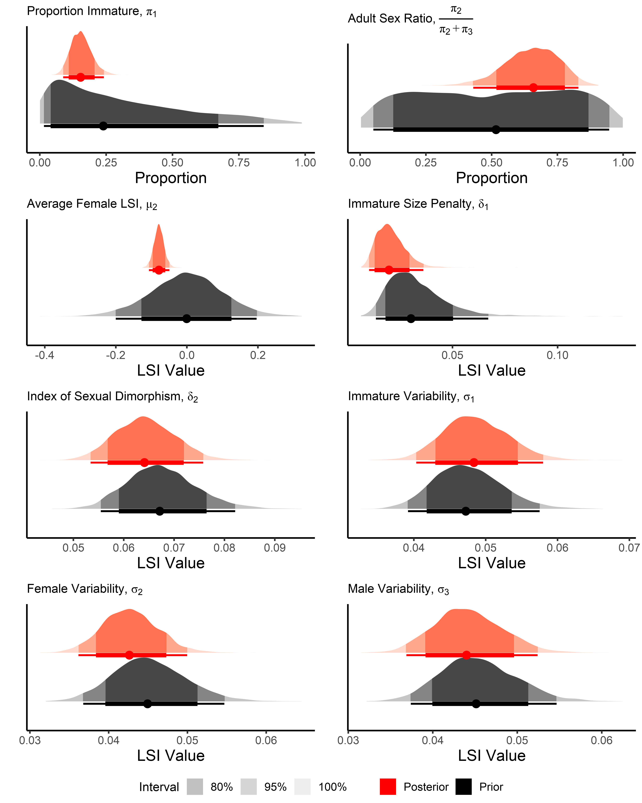
```

The prior distribution definitions for the size offsets ($\delta_{1}$ and $\delta_{2}$) and the size variability estimates ($\sigma_{1}$, $\sigma_{2}$, and $\sigma_{3}$) have a lot more overlap between the prior distributions and their respective posterior distributions. This overlap stresses the importance of using a Bayesian framework, particularly one relying on informative prior distributions, to produce meaningful parameter estimates from zooarchaeological data. But it also highlights the interpretive weight given to the reference population. However, the overlap is not necessarily a drawback of the model, as again the prior distribution definitions were designed as informative priors, specifically to ensure that the resulting parameter estimates would be biologically feasible. Further, the simulated population also has the same underlying biological population (the Shetland sheep population) that was used to develop the prior distributions, so it is possible that this overlap reflects that fact.

The parametric and compositional accuracy of both simulation tests are summarized in Table 8. The single assemblage model is well conditioned when examining parametric accuracy, though the multisite model overfits in this respect; this is driven by poor performance on size variability ($\sigma$) parameters–the model estimates average body size ($\mu$) parameters well. The multisite model also has a tendency to underfit when examining site-specific compositional accuracy. In both models, though, the compositional accuracy improves (in the sense of no longer underfitting) by using the modeled assemblages rather than the measured assemblages. This makes intuitive sense, as the measured assemblage is itself theoretically a sample from the modeled assemblage (based on the assumption that “measurability” is random). In these simulations, of course, this theory is held to be explicitly true, though the relationship between the measured and modeled assemblage is generally held to be true implicitly in zooarchaeology and can be explicitly tested (see Section 2.4).

The parametric and compositional accuracy of both simulation tests are summarized in Table 8. The single assemblage model is well conditioned when examining parametric accuracy, though the multisite model overfits in this respect; this is is driven by poor performance on size variability ($\sigma$) parameters--the model estimates average body size ($\mu$) parameters well. The multisite model also has a tendency to underfit when examining site-specific compositional accuracy. In both models, though, the compositional accuracy improves (in the sense of no longer underfitting) by using the modeled assemblages rather than the measured assemblages. This makes intuitive sense, as the measured assemblage is itself theoretically a sample from the modeled assemblage (based on the assumption that “measurability” is random). In these simulations, of course, this theory is held to be explicitly true, though the relationship between the measured and modeled assemblage is generally held to be true implicitly in zooarchaeology and can be explicitly tested (see Section 2.4).

```{r table_8, echo = FALSE}
kbl(table_8, caption = "Parametric accuracy rates and expected accuracy ranges for the simulation models compared to the population values from which the samples were drawn. Expected accuracy ranges are based on the number of parameters being evaluated. If the modeled accuracy rate is above the range, then the model has underfit to the data. If the modeled accuracy rate is below the range, then the model has overfit to the data.", booktabs = T, linesep = '') %>%
  kable_styling(latex_options = c("hold_position", "scale_down"))
```

Figures 6 and 7 show the posterior distributions of the site-level parameters for the single-assemblage and multisite simulations. Figures 6A and 7A show the posterior distributions for the mixing proportions ($\pi$ parameters), Figures 6B and 7B show the posterior distributions for the average body size ($\mu$ parameters), and Figures 6C and 7C show the posterior distributions for the size variability ($\sigma$ parameters) for immature (black), adult female (blue), and adult male (red) specimens in the assemblage. Vertical bars summarize the 80% and 95% credible intervals for the parameter, while the solid horizontal lines denote the “true” parameter value for the Shetland sheep population from which the assemblage was sampled, including any deviations made for the multisite simulation (see Table 5). The model excels at estimating the average body sizes of the animal groups, even when those body sizes are manipulated (Figures 6B and 7B). The multisite model’s estimates of the overall proportions tend to be conservative (Figure 7A); that is, underestimating the proportions for animal groups with extremely low “true” proportions (e.g., adult males in Sites 6-10, immature animals in Sites 11-15) while overestimating the proportions for animal groups with extremely high “true” proportions (e.g., adult females in Sites 6-10). This is likely due to the multilevel modeling structure “shrinking” estimates towards a global mean, though it may also reflect overfitting from small sample sizes. This is particularly the case when examining variability parameters ($\sigma$: Figure 7C), which the multilevel model tends to underestimate.

```{r figure_6, echo = FALSE, message = FALSE, warning = FALSE, fig.align = "center", out.width = "\\textwidth", fig.cap = "Posterior distributions of the mixture model hyper-parameters (assemblage-level estimates) for the simulated single assemblage. Horizontal lines denote the relevant parameter values from the Shetland sheep population from which the assemblage was sampled."}
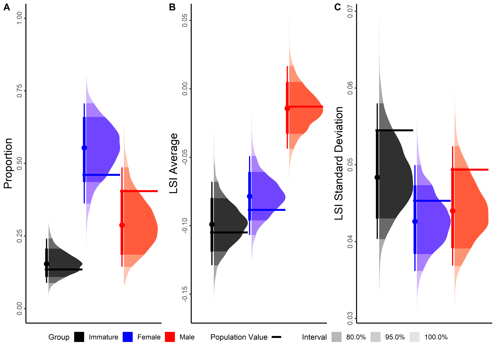
```

```{r figure_7, echo = FALSE, message = FALSE, warning = FALSE, fig.align = "center", out.width = "\\textwidth", fig.cap = "Posterior distributions of assemblage-level mixture model parameters for the simulated multisite assemblages. Horizontal lines denote the relevant parameter values from the Shetland sheep population from which the assemblage was sampled, including modifications to the composition and body size for some assemblages (see Table 4)."}
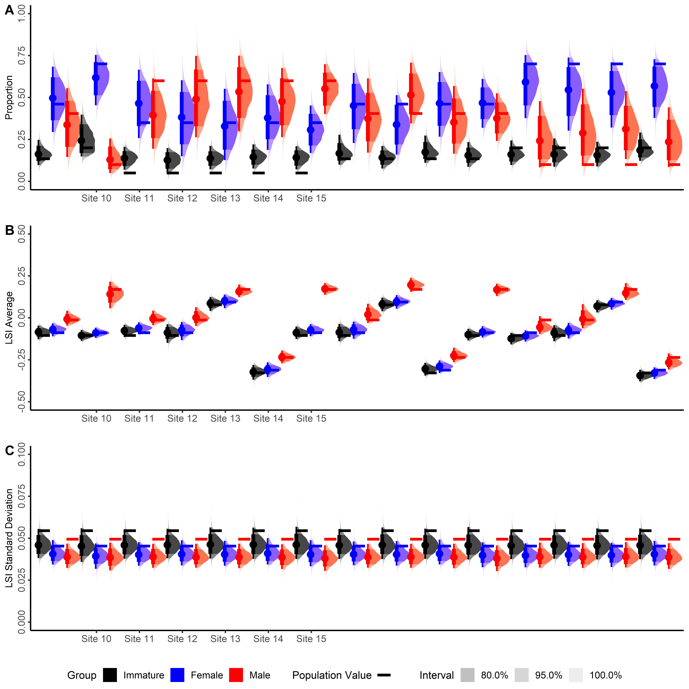
```

Figure 8 shows posterior distributions of simulated group-specific compositions for both the single-assemblage and total composition of the multisite models (i.e., all sites combined) alongside true counts for each group. The underfitting performance of the multisite simulation, particularly at the level of individual sites, may be a consequence of low statistical power due to small sample sizes. The median number of specimens per element portion is `r simulation_results$multisite_measured_specimen_median` for the measured assemblage and `r simulation_results$multisite_modeled_specimen_median` for the modeled assemblage. By contrast, the single-assemblage simulation has a median number of specimens per element portion of `r simulation_results$single_measured_specimen_median` for the measured assemblage and `r simulation_results$single_modeled_specimen_median` for the modeled assemblage. More important than overall sample sizes, though, is the group-specific element counts, where the contrast between the median number of specimens in the measured and modeled assemblages from the multisite simulation (measurement assemblage: `r simulation_results$multisite_measured_group_median`, modeled assemblage: `r simulation_results$multisite_modeled_group_median`) and the measured and modeled assemblages from the single-assemblage simulation (measurement assemblage: `r simulation_results$single_measured_group_median`, modeled assemblage: `r simulation_results$single_modeled_group_median`) is starker. The larger sample sizes in the modeled assemblages also partially explains the reduced underfitting relative to the measured assemblages.

```{r figure_8, echo = FALSE, message = FALSE, warning = FALSE, fig.align = "center", out.width = "\\textwidth", fig.cap = "Posterior distributions of simulated group-specific composition for the simulated assemblages. Top row: single assemblage model (A) measured assemblage, (B) modeled assemblage. Bottom row: multisite assemblage model (combined counts) (C) measured assemblages, (D) modeled assemblages. Horizontal lines denote the true group-specific composition of the relevant measured or modeled assemblage."}
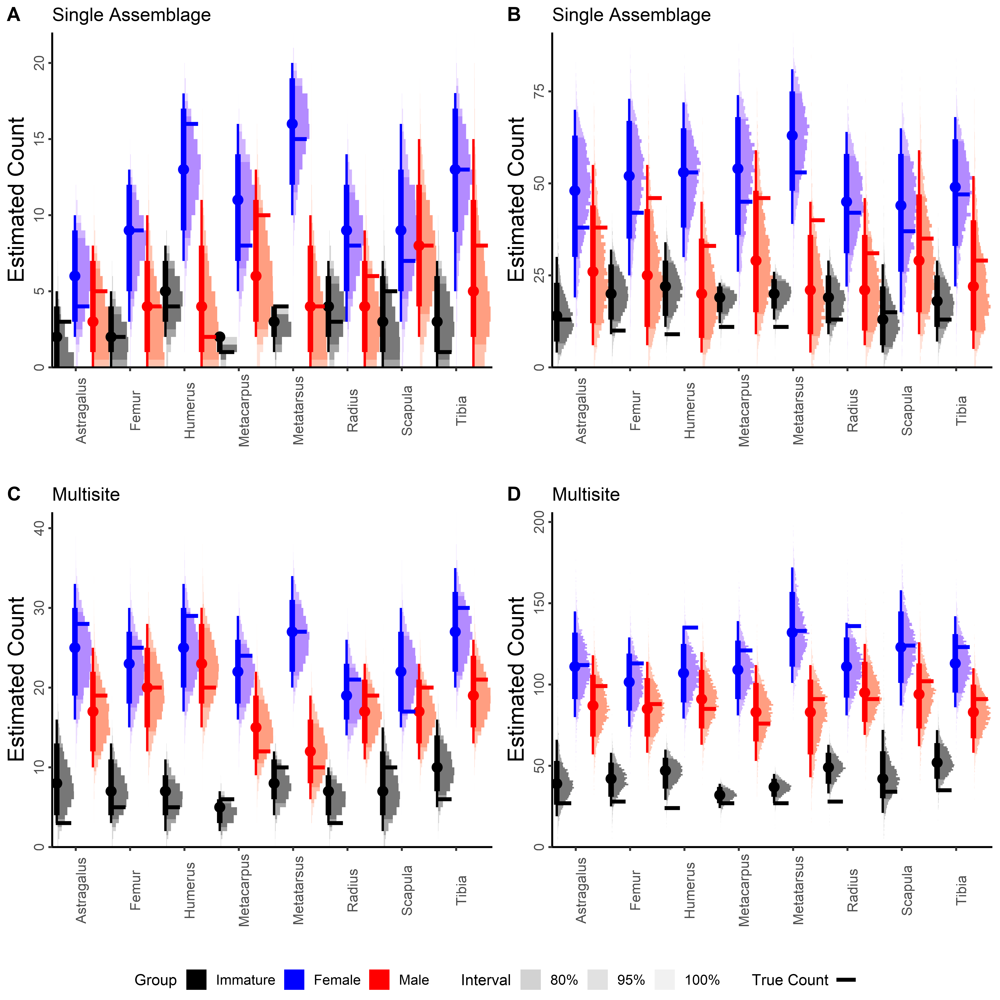
```

It is also noteworthy that the additional sampling to create the multisite simulation’s modeled assemblage resulted in seven newly observed element portions at certain sites. The model can estimate the composition of these element portions due to its multilevel structure, which estimates element-specific offsets and interaction terms ($\nu_{\operatorname{Element}}$ and $\nu_{\operatorname{Element}}$) for elements that are present in at least one site. The compositional accuracy of these newly observed element portions is well-calibrated (see Table 8), despite having no observed measured specimens from the element portion for those sites. That these element portions can be accurately modeled despite lacking observed measurements for the site lends support to the idea that researchers could extend the same multilevel model structure (element-specific offsets and interaction terms) to estimate the composition of unobserved (i.e., completely unmeasured) element portions in an assemblage.

### *4.2 Pinarbaşı B Sheep: The impact of immature specimens*

```{r pinarbasi model fit, include = FALSE, eval = TRUE}
#Format the data for Stan and run the analyses
pinarbasi_mixmod_standata <- list(
  #Sample sizes
  N_Specimens = pinarbasi_mixmod_data[, .N, Specimen_No][, .N],
  N_Measurements = pinarbasi_mixmod_data[, .N],
  N_Element_Portions = pinarbasi_mixmod_data[, .N, Element_Portion][, .N],
  N_Dimensions = pinarbasi_mixmod_data[, .N, Dimension][, .N],
  #Specimen observations
  Element_Portion = pinarbasi_mixmod_data[, .N, .(Specimen_No, Element_Portion, Immature)][order(Specimen_No), Element_Portion],
  Immature = pinarbasi_mixmod_data[, .N, .(Specimen_No, Element_Portion, Immature)][order(Specimen_No), Immature],
  Immature_Proportion = as.matrix(dcast(pinarbasi_mixmod_data[, .(Immature_Proportion = mean(Immature)), .(Site_No, Element_Portion)], Site_No ~ Element_Portion, value.var = "Immature_Proportion", fill = 0))[, 2:(pinarbasi_mixmod_data[, .N, Element_Portion][, .N] + 1)],
  #Measurement observations
  Measurement_obs = pinarbasi_mixmod_data[, Measurement_value],
  Measurement_sd = pinarbasi_mixmod_data[, Measurement_value * 0.01],
  Reference_obs = pinarbasi_mixmod_data[, .N, .(Dimension, Reference_value)][order(Dimension), Reference_value],
  Reference_sd = pinarbasi_mixmod_data[, .N, .(Dimension, Reference_value)][order(Dimension), Reference_value * 0.01],
  Dimension = pinarbasi_mixmod_data[, Dimension],
  Specimen = pinarbasi_mixmod_data[, Specimen_No],
  #Demographic observations
  Immature_obs = pinarbasi_demographic_observations[, N_Unfused],
  Immature_obs_n = pinarbasi_demographic_observations[, N_Ageable],
  Female_obs = pinarbasi_demographic_observations[, N_Female],
  Female_obs_n = pinarbasi_demographic_observations[, N_Sexable],
  #Prior distributions for hyper-parameters
  prior_theta_raw_1 = c(-0.5, 1.5),
  prior_theta_raw_2 = c(0, 1.5),
  prior_mu_female = c(0, 0.1),
  prior_logdelta_immature = c(-3.5, 0.4),
  prior_logdelta_male = c(-2.7, 0.1),
  prior_logsigma_immature = c(-3.05, 0.1),
  prior_logsigma_female = c(-3.1, 0.1),
  prior_logsigma_male = c(-3.1, 0.1)
)

singlesite_mixture_stanmodel <- cmdstan_model("./Scripts/LSI_mixture_model_singlesite.stan")
pinarbasi_samples <- singlesite_mixture_stanmodel$sample(
  data = pinarbasi_mixmod_standata,
  chains = 4,
  parallel_chains = 4,
  refresh = 250,
  adapt_delta = 0.90,
  seed = 1436453702,
  max_treedepth = 15
)
pinarbasi_stanfit <- rstan::read_stan_csv(pinarbasi_samples$output_files())
pinarbasi_post <- extract(pinarbasi_stanfit)
```

```{r nw anatolian model fit, include = FALSE, eval = TRUE}
nw_anatolian_mixmod_standata <- list(
  #Sample sizes
  N_Sites = nw_anatolian_mixmod_data[, .N, Site_No][, .N],
  N_Specimens = nw_anatolian_mixmod_data[, .N, Specimen_No][, .N],
  N_Measurements = nw_anatolian_mixmod_data[, .N],
  N_Element_Portions = nw_anatolian_mixmod_data[, .N, Element_Portion][, .N],
  N_Dimensions = nw_anatolian_mixmod_data[, .N, Dimension][, .N],
  #Specimen observations
  Site = nw_anatolian_mixmod_data[, .N, .(Specimen_No, Site_No, Element_Portion, Immature)][order(Specimen_No), Site_No],
  Element_Portion = nw_anatolian_mixmod_data[, .N, .(Specimen_No, Site_No, Element_Portion, Immature)][order(Specimen_No), Element_Portion],
  Immature = nw_anatolian_mixmod_data[, .N, .(Specimen_No, Site_No, Element_Portion, Immature)][order(Specimen_No), Immature],
  Immature_Proportion = as.matrix(dcast(nw_anatolian_mixmod_data[, .(Immature_Proportion = mean(Immature)), .(Site_No, Element_Portion)], Site_No ~ Element_Portion, value.var = "Immature_Proportion", fill = 0))[, 2:(nw_anatolian_mixmod_data[, .N, Element_Portion][, .N] + 1)],
  #Measurement observations
  Measurement_obs = nw_anatolian_mixmod_data[, Measurement_value],
  Measurement_sd = nw_anatolian_mixmod_data[, Measurement_value * 0.01],
  Reference_obs = nw_anatolian_mixmod_data[, .N, .(Dimension, Reference_value)][order(Dimension), Reference_value],
  Reference_sd = nw_anatolian_mixmod_data[, .N, .(Dimension, Reference_value)][order(Dimension), Reference_value * 0.01],
  Dimension = nw_anatolian_mixmod_data[, Dimension],
  Specimen = nw_anatolian_mixmod_data[, Specimen_No],
  #Demographic observations
  N_Immature_obs = nw_anatolian_demographic_observations[, .N],
  Immature_obs_site = nw_anatolian_demographic_observations[, Site_No],
  Immature_obs = nw_anatolian_demographic_observations[, N_Unfused],
  Immature_obs_n = nw_anatolian_demographic_observations[, N_Ageable],
  N_Female_obs = nw_anatolian_demographic_observations[, .N],
  Female_obs_site = nw_anatolian_demographic_observations[, Site_No],
  Female_obs = nw_anatolian_demographic_observations[, N_Female],
  Female_obs_n = nw_anatolian_demographic_observations[, N_Sexable],
  #Prior distributions for hyper-parameters
  prior_theta_raw_1 = c(-0.5, 1.5),
  prior_theta_raw_2 = c(0, 1.5),
  prior_mu_female = c(-0.1, 0.1),
  prior_logdelta_immature = c(-3.5, 0.5),
  prior_logdelta_male = c(-2, 0.5),
  prior_logsigma_immature = c(-3.05, 0.1),
  prior_logsigma_female = c(-3.1, 0.1),
  prior_logsigma_male = c(-3.1, 0.1)
)

multisite_mixture_stanmodel <- cmdstan_model("./Scripts/LSI_mixture_model_multisite.stan")
nw_anatolian_multisite_samples <- multisite_mixture_stanmodel$sample(
  data = nw_anatolian_mixmod_standata,
  chains = 4,
  parallel_chains = 4,
  refresh = 250,
  adapt_delta = 0.99,
  seed = 895278841,
  max_treedepth = 15
)
#
nw_anatolian_multisite_stanfit <- rstan::read_stan_csv(nw_anatolian_multisite_samples$output_files())
nw_anatolian_post <- extract(nw_anatolian_multisite_stanfit)
```

```{r functions for compositional analysis, include = FALSE, eval = TRUE}
#Composition analysis: simulate the composition of the assemblage(s) by sampling from probabilities#
#for measured specimens (with Specimen_No): the specific probabilities for that specimen
#for modeled specimens (no Specimen_No but has relevant Element_Portion): the probabilities for that Element_Portion (theta[1:3])
#for unmodeled specimens (no relevant Element_Portion): calculate new element_portion-specific theta values using the hyper-parameters

#Functions needed for the compositional analyses#
#(some of these are copies of those used for the simulations)

#Identify the relevant mixture components for a specimen
theta_finder <- function(Specimen_No, Element_Portion, Immature, Immature_Proportions, element_thetas, specimen_probs) {
  thetas <- rep(NA, 3)
  immature_proportion <- Immature_Proportions[Portion %in% Element_Portion, Immature_Proportion]
  thetas[1:3] <- ifelse(rep(!is.na(Specimen_No), 3),
                        specimen_probs[Specimen_No, 1:3],
                        ifelse(rep(Immature == 1, 3),
                               c(element_thetas[1, Element_Portion] / immature_proportion,
                                 element_thetas[2, Element_Portion] * immature_proportion,
                                 element_thetas[3, Element_Portion] * immature_proportion),
                               c(0,
                                 element_thetas[2, Element_Portion] / (1 - min(c(element_thetas[1, Element_Portion], 0.99999))), #fail-safe for extreme values
                                 element_thetas[3, Element_Portion] / (1 - min(c(element_thetas[1, Element_Portion], 0.99999)))))
  )
  list(p_immature = thetas[1] / sum(thetas), p_female = thetas[2] / sum(thetas), p_male = thetas[3] / sum(thetas))
}

#Sample a group identity from a set of specimen probabilities
ifm_sample <- function(p_immature, p_female, p_male) {
  sample(c("Immature", "Female", "Male"), 1, replace = T, prob = c(p_immature, p_female, p_male))
}

#Simulates the composition of an assemblage with Immature/Female/male probabilities
ifm_composition <- function(measured_specimens) {
  #simulate sex assignments
  measured_specimens[, Simulated_Group := sapply(1:.N, function(x) ifm_sample(p_immature[x], p_female[x], p_male[x]))]
  #counts of the different elements by group (make sure there's a 0 if a value is missing)
  melt(measured_specimens[, .(`Immature` = sum(Simulated_Group %in% "Immature"),
                              `Female` = sum(Simulated_Group %in% "Female"),
                              `Male` = sum(Simulated_Group %in% "Male")), .(Site_No, Element_Portion, Element)], id.vars = c("Site_No", "Element_Portion", "Element"), variable.name = "Simulated_Group", value.name = "N")[order(Site_No, Element_Portion, Simulated_Group)]
}

#Simulates the fusion rates for an assemblage with Immature/Female/male probabilities
ifm_fusion_rate <- function(measured_specimens) {
  #simulate sex assignments
  measured_specimens[, Simulated_Group := sapply(1:.N, function(x) ifm_sample(p_immature[x], p_female[x], p_male[x]))]
  #counts of the different elements by group and fusion status
  
  melt(measured_specimens[, .(`Immature` = sum(Simulated_Group %in% "Immature"),
                              `Female` = sum(Simulated_Group %in% "Female"),
                              `Male` = sum(Simulated_Group %in% "Male")), .(Site_No, Fusion_Element, Stage, Fusion)], id.vars = c("Site_No", "Fusion_Element", "Stage", "Fusion"), variable.name = "Simulated_Group", value.name = "N")[order(Site_No, Stage, Fusion_Element, Fusion, Simulated_Group)]
}

#function to get integer y-axis values only (source: https://gist.github.com/jhrcook/eb7b63cc57c683a6eb4986c4107a88ec)
integer_breaks <- function(n = 5, ...) {
  fxn <- function(x) {
    breaks <- floor(pretty(x, n, ...))
    names(breaks) <- attr(breaks, "labels")
    breaks
  }
  return(fxn)
}

#Plots the distributions of group-specific composition
archaeological_composition_analysis <- function(composition_data, site_no = 1, site_name = "Pinarbasi Measured Assemblage", full_element_name_key = pinarbasi_element_name_key) {
  ggplot(composition_data[Site_No %in% site_no, .(N = sum(N)), .(Iteration, Simulated_Group, Element, Element_Portion)][, .(Element, Element_Portion, group = Simulated_Group, Plot_Group = paste(Element, as.numeric(Simulated_Group), sep = "."), N)]) + aes(y = N, x = Plot_Group) +
    stat_slab(normalize = "groups", slab_type = "histogram", breaks = 0:(composition_data[Site_No %in% site_no, .(N = sum(N)), .(Iteration, Simulated_Group, Element, Element_Portion)][, max(N)]), aes(fill = group, fill_ramp = stat(cut_cdf_qi(cdf, .width = c(0.80, 0.95, 1), labels = scales::percent_format())))) +
    stat_pointinterval(.width = c(0.8, 0.95), aes(color = group), position = position_dodge(width = 0.2, preserve = "single")) +
    scale_fill_ramp_discrete(name = "Interval", range = c(0.5, 0.15), na.translate = F) +
    scale_color_manual(name = "Group", values = c("black", "blue", "red"), na.translate = F) +
    scale_fill_manual(name = "Group", values = c("black", "blue", "red"), na.translate = F) +
    scale_x_discrete(name = "Element", breaks = composition_data[, .N, .(Element, Element_Portion)][order(Element_Portion), paste(Element, ".2", sep = "")], labels = composition_data[, .N, .(Element, Element_Portion)][full_element_name_key, on = "Element"][!is.na(Element_Portion)][order(Element_Portion), Full_Element_Name]) +
    scale_y_continuous(name = "Estimated Count", breaks = integer_breaks()) + coord_cartesian(expand = FALSE) +
    labs(title = site_name) +
    theme_classic() + theme(legend.text = element_text(size = 10), legend.position = "bottom", legend.justification = c("center"), legend.box.just = "right", legend.margin = margin(6, 6, 6, 6), axis.text.x = element_text(size = 8, angle = -90, hjust = 0), axis.title = element_text(size = 12), axis.text.y = element_text(size = 8), axis.title.x = element_blank())
}

#create full assemblage for analysis
full_assemblage_maker <- function(original_data, biology_code, site_code, mixmod_data, element_list, full_elements, element_key) {
  full_assemblage <- original_data[`Has Biological Taxonomy [Label]` %in% biology_code & `Has anatomical identification [Label]` %in% full_elements, .(ID = paste(site_code, Label, sep = " "), Site = site_code, Anatomy = `Has anatomical identification [Label]`, `Proximal Fusion` = `Has fusion character [Proximal Label]`, `Distal Fusion` = `Has fusion character [Distal Label]`)]
  #Assign specimen numbers for the specimens that were modeled directly (measured specimens) in the modeled and full assemblages
  full_assemblage <- mixmod_data[, .N, .(ID, Specimen_No, Immature)][full_assemblage, on = "ID"]
  #Assign the element portion labels for specimens that weren't modeled directly (no measurements)
  for(i in 1:element_key[, .N]) {
    full_assemblage[Anatomy %in% element_key[i, `Anatomy Label`], Element := element_key[i, `Element Label`]]
    #Separate out proximal and distal element portions based on presence of later-fusing measurements (e.g., radius bone is proximal/distal based on presence of Bd measurement)
    if(element_key[i, `Element Label`] %in% c("Rad", "Mtc", "Fem", "Mtt")) {
      full_assemblage[Anatomy %in% element_key[i, `Anatomy Label`], Element := ifelse(`Distal Fusion` %in% "" == F, paste(element_key[i, `Element Label`], "dist", sep = "_"), paste(element_key[i, `Element Label`], "prox", sep = "_"))]
    }
    if(element_key[i, `Element Label`] %in% c("Tib")) {
      full_assemblage[Anatomy %in% element_key[i, `Anatomy Label`], Element := ifelse(`Proximal Fusion` %in% "" == F, paste(element_key[i, `Element Label`], "prox", sep = "_"), paste(element_key[i, `Element Label`], "dist", sep = "_"))]
    }
  }
  #Assign Element_Portion values that match the original sets (and add new ones for unmodeled element portions)
  full_assemblage <- element_list[, .N, .(Element, Element_Portion)][full_assemblage, on = "Element"]
  full_assemblage[Element %in% "Pel", Element_Portion := 17]
  full_assemblage[Element %in% "Uln", Element_Portion := 18]
  #Get the Immature variable (potentially immature status based on fusion)
  full_assemblage[is.na(Immature) & Element %in% c("Sca", "Ast"), Immature := 1] #does not fuse / subject to post-fusion growth and has no relevant fusion data to exclude immature status
  full_assemblage[is.na(Immature) & Element %in% c("Hum", "Cal", "PH1", "PH2"), Immature := as.numeric(`Proximal Fusion` %in% c("Proximal epiphysis fused", "Proximal epiphysis fusing") == F)]
  full_assemblage[is.na(Immature) & Element %in% c("Rad_prox", "Rad_dist", "Mtc_prox", "Mtc_dist", "Mtt_prox", "Mtt_dist"), Immature := as.numeric(`Distal Fusion` %in% c("Distal epiphysis fused", "Distal epiphysis fusing") == F)]
  full_assemblage[is.na(Immature) & Element %in% c("Uln", "Pel", "Fem_prox", "Fem_dist", "Tib_prox", "Tib_dist"), Immature := as.numeric((`Proximal Fusion` %in% c("Proximal epiphysis fused", "Proximal epiphysis fusing") | `Distal Fusion` %in% c("Distal epiphysis fused", "Distal epiphysis fusing")) == F)]
  #
  full_assemblage[, .(ID, Specimen_No, Site, Anatomy, Element, Element_Portion, Immature, `Proximal Fusion`, `Distal Fusion`)]
}

#creates the fusion assemblages from a full assemblage with fusion keys
fusion_assemblage_maker <- function(full_assemblage, element_stage_key) {
  full_assemblage[Element %in% "Rad_prox" & `Proximal Fusion` %in% "" == F, c("Fusion_Element", "Fusion") := .("Rad_prox", ifelse(`Proximal Fusion` %in% c("Proximal epiphysis fused", "Proximal epiphysis fusing"), "Fused", "Unfused"))]
  full_assemblage[Element %in% "Hum" & `Distal Fusion` %in% "" == F & `Proximal Fusion` %in% "", c("Fusion_Element", "Fusion") := .("Hum_dist", ifelse(`Distal Fusion` %in% c("Distal epiphysis fused", "Distal epiphysis fusing"), "Fused", "Unfused"))]
  full_assemblage[Element %in% "Pel" & (`Proximal Fusion` %in% "" == F | `Distal Fusion` %in% "" == F), c("Fusion_Element", "Fusion") := .("Pel", ifelse(`Proximal Fusion` %in% c("Proximal epiphysis fused", "Proximal epiphysis fusing") | `Distal Fusion` %in% c("Distal epiphysis fused", "Distal epiphysis fusing"), "Fused", "Unfused"))]
  full_assemblage[Element %in% "Sca" & `Distal Fusion` %in% "" == F, c("Fusion_Element", "Fusion") := .("Sca", ifelse(`Distal Fusion` %in% c("Distal epiphysis fused", "Distal epiphysis fusing"), "Fused", "Unfused"))]
  full_assemblage[Element %in% "PH1" & `Proximal Fusion` %in% "" == F, c("Fusion_Element", "Fusion") := .("PH1", ifelse(`Proximal Fusion` %in% c("Proximal epiphysis fused", "Proximal epiphysis fusing"), "Fused", "Unfused"))]
  full_assemblage[Element %in% "PH2" & `Proximal Fusion` %in% "" == F, c("Fusion_Element", "Fusion") := .("PH2", ifelse(`Proximal Fusion` %in% c("Proximal epiphysis fused", "Proximal epiphysis fusing"), "Fused", "Unfused"))]
  full_assemblage[Element %in% "Tib_dist" & `Distal Fusion` %in% "" == F, c("Fusion_Element", "Fusion") := .("Tib_dist", ifelse(`Distal Fusion` %in% c("Distal epiphysis fused", "Distal epiphysis fusing"), "Fused", "Unfused"))]
  full_assemblage[Element %in% "Mtc_dist" & `Distal Fusion` %in% "" == F, c("Fusion_Element", "Fusion") := .("Mtc_dist", ifelse(`Distal Fusion` %in% c("Distal epiphysis fused", "Distal epiphysis fusing"), "Fused", "Unfused"))]
  full_assemblage[Element %in% "Mtt_dist" & `Distal Fusion` %in% "" == F, c("Fusion_Element", "Fusion") := .("Mtt_dist", ifelse(`Distal Fusion` %in% c("Distal epiphysis fused", "Distal epiphysis fusing"), "Fused", "Unfused"))]
  full_assemblage[Element %in% "Cal" & `Proximal Fusion` %in% "" == F, c("Fusion_Element", "Fusion") := .("Cal", ifelse(`Proximal Fusion` %in% c("Proximal epiphysis fused", "Proximal epiphysis fusing"), "Fused", "Unfused"))]
  full_assemblage[Element %in% "Fem_prox" & `Proximal Fusion` %in% "" == F, c("Fusion_Element", "Fusion") := .("Fem_prox", ifelse(`Proximal Fusion` %in% c("Proximal epiphysis fused", "Proximal epiphysis fusing"), "Fused", "Unfused"))]
  full_assemblage[Element %in% "Fem_dist" & `Distal Fusion` %in% "" == F, c("Fusion_Element", "Fusion") := .("Fem_dist", ifelse(`Distal Fusion` %in% c("Distal epiphysis fused", "Distal epiphysis fusing"), "Fused", "Unfused"))]
  full_assemblage[Element %in% "Uln" & (`Proximal Fusion` %in% "" == F | `Distal Fusion` %in% "" == F), c("Fusion_Element", "Fusion") := .("Uln", ifelse(`Proximal Fusion` %in% c("Proximal epiphysis fused", "Proximal epiphysis fusing") | `Distal Fusion` %in% c("Distal epiphysis fused", "Distal epiphysis fusing"), "Fused", "Unfused"))]
  full_assemblage[Element %in% "Rad_dist" & `Distal Fusion` %in% "" == F, c("Fusion_Element", "Fusion") := .("Rad_dist", ifelse(`Distal Fusion` %in% c("Distal epiphysis fused", "Distal epiphysis fusing"), "Fused", "Unfused"))]
  full_assemblage[Element %in% "Tib_prox" & `Proximal Fusion` %in% "" == F, c("Fusion_Element", "Fusion") := .("Tib_prox", ifelse(`Proximal Fusion` %in% c("Proximal epiphysis fused", "Proximal epiphysis fusing"), "Fused", "Unfused"))]
  full_assemblage[Element %in% "Hum" & `Proximal Fusion` %in% "" == F, c("Fusion_Element", "Fusion") := .("Hum_prox", ifelse(`Proximal Fusion` %in% c("Proximal epiphysis fused", "Proximal epiphysis fusing"), "Fused", "Unfused"))]
  fusion_assemblage <- full_assemblage[, .(ID, Specimen_No, Site, Anatomy, Element, Element_Portion, Immature, `Proximal Fusion`, `Distal Fusion`, Fusion_Element, Fusion)][element_stage_key, on = "Fusion_Element"][!is.na(Fusion_Element) & !is.na(Fusion)]
  fusion_assemblage
}
```

```{r pinarbasi composition analysis, include = FALSE, eval = TRUE}
#Calculating five new sets of element_portion-specific mixing probabilities for unmodeled element portions
pinarbasi_unmodeled_element_portion_theta <- data.table(Iteration = rep(1:4000, 5),
                                                        Element_Portion = rep(11:15, each = 4000),
                                                        Element = rep(c("Rad_prox", "Mtc_prox", "Man", "Uln", "Pel"), each = 4000))
#specify hyper-parameter values for the model
for(i in 1:5) {
  element_theta_raw <- t(sapply(1:4000, function(x) MASS::mvrnorm(1, mu = pinarbasi_post$grand_theta_raw[x, 1:2], Sigma = diag(pinarbasi_post$element_sigma[x, 1:2]) %*% pinarbasi_post$Rho_element[x, 1:2, 1:2] %*% diag(pinarbasi_post$element_sigma[x, 1:2]))))
  pinarbasi_unmodeled_element_portion_theta[(4000 * (i - 1) + 1):(4000 * i), c("theta_raw_1", "theta_raw_2") := .(element_theta_raw[, 1], element_theta_raw[, 2])]
}
#perform stick-breaking procedure to turn theta_raw into theta values
pinarbasi_unmodeled_element_portion_theta[, theta_1 := boot::inv.logit(theta_raw_1 + log(0.5))]
pinarbasi_unmodeled_element_portion_theta[, theta_2 := (1 - theta_1) * boot::inv.logit(theta_raw_2 + log(1))]
pinarbasi_unmodeled_element_portion_theta[, theta_3 := (1 - (theta_1 + theta_2))]

#set up the datasets necessary to run the simulations for the three assemblages
pinarbasi_measured_immature_proportions <- pinarbasi_measured_assemblage[, .(Immature_Proportion = mean(Immature)), .(Portion = Element_Portion)][order(Portion)]
pinarbasi_modeled_immature_proportions <- pinarbasi_modeled_assemblage[, .(Immature_Proportion = mean(Immature)), .(Portion = Element_Portion)][order(Portion)]
pinarbasi_full_immature_proportions <- pinarbasi_full_assemblage[, .(Immature_Proportion = mean(Immature)), .(Portion = Element_Portion)][order(Portion)]

clusterExport(cl, list('data.table', 'melt', 'ifm_sample', 'theta_finder', 'ifm_composition', 'pinarbasi_measured_assemblage', 'pinarbasi_measured_immature_proportions', 'pinarbasi_modeled_assemblage', 'pinarbasi_modeled_immature_proportions', 'pinarbasi_full_assemblage', 'pinarbasi_full_immature_proportions', 'pinarbasi_post', 'pinarbasi_unmodeled_element_portion_theta'))

pinarbasi_measured_assemblage_simulated_composition <- rbindlist(parLapply(cl = cl, 1:4000, fun = function(x) ifm_composition(pinarbasi_measured_assemblage[, theta_finder(Specimen_No, Element_Portion, Immature, pinarbasi_measured_immature_proportions, element_thetas = pinarbasi_post$theta[x, , ], specimen_probs = pinarbasi_post$specimen_prob[x, , ]), .(ID, Specimen_No, Element, Element_Portion, Immature)][, .(ID, Specimen_No, Site_No = 1, Element, Element_Portion, Immature, p_immature, p_female, p_male)])[, .(Iteration = x, Site_No, Element_Portion, Element, Simulated_Group, N)]))
pinarbasi_modeled_assemblage_simulated_composition <- rbindlist(parLapply(cl = cl, 1:4000, fun = function(x) ifm_composition(pinarbasi_modeled_assemblage[, theta_finder(Specimen_No, Element_Portion, Immature, pinarbasi_modeled_immature_proportions, element_thetas = pinarbasi_post$theta[x, , ], specimen_probs = pinarbasi_post$specimen_prob[x, , ]), .(ID, Specimen_No, Element, Element_Portion, Immature)][, .(ID, Specimen_No, Site_No = 1, Element, Element_Portion, Immature, p_immature, p_female, p_male)])[, .(Iteration = x, Site_No, Element_Portion, Element, Simulated_Group, N)]))
pinarbasi_full_assemblage_simulated_composition <- rbindlist(parLapply(cl = cl, 1:4000, fun = function(x) ifm_composition(pinarbasi_full_assemblage[, theta_finder(Specimen_No, Element_Portion, Immature, pinarbasi_full_immature_proportions, element_thetas = cbind(pinarbasi_post$theta[x, , ], t(pinarbasi_unmodeled_element_portion_theta[Iteration %in% x, .(theta_1, theta_2, theta_3)])), specimen_probs = pinarbasi_post$specimen_prob[x, , ]), .(ID, Specimen_No, Element, Element_Portion, Immature)][, .(ID, Specimen_No, Site_No = 1, Element, Element_Portion, Immature, p_immature, p_female, p_male)])[, .(Iteration = x, Site_No, Element_Portion, Element, Simulated_Group, N)]))
```

```{r nw anatolian composition analysis, include = FALSE, eval = TRUE}
#Calculating three new sets of (site and) element_portion-specific mixing probabilities for unmodeled element portions
nw_anatolian_unmodeled_element_portion_theta <- data.table(Iteration = rep(rep(1:4000, 2), 4),
                                                           Site_Num = rep(1:4, each = 4000 * 2),
                                                           Element_Portion = rep(rep(17:18, each = 4000), 4),
                                                           Element = rep(rep(c("Pel", "Uln"), each = 4000), 4))
#specify hyper-parameter values for the model
for(j in 1:4) {
  for(i in 1:2) {
    element_theta_raw <- t(sapply(1:4000, function(x) nw_anatolian_post$grand_theta_raw[x, 1:2] + nw_anatolian_post$v_site[x, j, 1:2] + MASS::mvrnorm(1, mu = rep(0, 2), Sigma = diag(nw_anatolian_post$element_sigma[x, 1:2]) %*% nw_anatolian_post$Rho_element[x, 1:2, 1:2] %*% diag(nw_anatolian_post$element_sigma[x, 1:2])) + MASS::mvrnorm(1, mu = rep(0, 2), Sigma = diag(nw_anatolian_post$interaction_sigma[x, 1:2]) %*% nw_anatolian_post$Rho_interaction[x, 1:2, 1:2] %*% diag(nw_anatolian_post$interaction_sigma[x, 1:2]))))
    nw_anatolian_unmodeled_element_portion_theta[Site_Num %in% j & Element_Portion %in% (17:18)[i], c("theta_raw_1", "theta_raw_2") := .(element_theta_raw[, 1], element_theta_raw[, 2])]
  }
}
#perform stick-breaking procedure to turn theta_raw into theta values
nw_anatolian_unmodeled_element_portion_theta[, theta_1 := boot::inv.logit(theta_raw_1 + log(0.5))]
nw_anatolian_unmodeled_element_portion_theta[, theta_2 := (1 - theta_1) * boot::inv.logit(theta_raw_2 + log(1))]
nw_anatolian_unmodeled_element_portion_theta[, theta_3 := (1 - (theta_1 + theta_2))]

nw_anatolian_additional_elements <- c("innominate bone", "ulna") #additional elements for fusion analysis

#Create the full assemblages
barcin_full_assemblage <- full_assemblage_maker(original_data = barcin, biology_code = c("Bos taurus Linnaeus, 1758", "Bos primigenius"), site_code = "Barcin", mixmod_data = nw_anatolian_mixmod_data[Site %in% "Barcin"], element_list = nw_anatolian_mixmod_data[, .N, .(Element, Element_Portion)], full_elements = c(modeled_elements, "middle phalanx", nw_anatolian_additional_elements, "fused metacarpal bones 3 and 4; metacarpal bone of digit 3; metacarpal bone of digit 4; metacarpal bone of digit 5", "metatarsal bone of digit 5; metatarsal bone of digit 2; fused metatarsal bones 3 and 4"), element_key = rbind(barcin_element_key, data.table(`Anatomy Label` = c("innominate bone", "ulna"), `Element Label` = c("Pel", "Uln"))))
ilipinar1_full_assemblage <- full_assemblage_maker(original_data = ilipinar[Period %in% c("X", "IX", "IX/VIII", "VIII", "VII")], biology_code = c("Bos taurus Linnaeus, 1758", "Bos", "Bos primigenius"), site_code = "Ilipinar", mixmod_data = nw_anatolian_mixmod_data[Site %in% "Ilipinar 1 (Late Neolithic/Transitional)"], element_list = nw_anatolian_mixmod_data[, .N, .(Element, Element_Portion)], full_elements = c(modeled_elements, "middle phalanx", nw_anatolian_additional_elements), element_key = rbind(ilipinar_element_key, data.table(`Anatomy Label` = c("innominate bone", "ulna"), `Element Label` = c("Pel", "Uln"))))
ilipinar1_full_assemblage[, Site := "Ilipinar 1 (Late Neolithic/Transitional)"]
ilipinar2_full_assemblage <- full_assemblage_maker(original_data = ilipinar[Period %in% c("VI", "VI/VA", "VA", "VB")], biology_code = c("Bos taurus Linnaeus, 1758", "Bos", "Bos primigenius"), site_code = "Ilipinar", mixmod_data = nw_anatolian_mixmod_data[Site %in% "Ilipinar 2 (Early Chalcolithic)"], element_list = nw_anatolian_mixmod_data[, .N, .(Element, Element_Portion)], full_elements = c(modeled_elements, "middle phalanx", nw_anatolian_additional_elements), element_key = rbind(ilipinar_element_key, data.table(`Anatomy Label` = c("innominate bone", "ulna"), `Element Label` = c("Pel", "Uln"))))
ilipinar2_full_assemblage[, Site := "Ilipinar 2 (Early Chalcolithic)"]
mentese_full_assemblage <- full_assemblage_maker(original_data = mentese, biology_code = "Bos", site_code = "Mentese", mixmod_data = nw_anatolian_mixmod_data[Site %in% "Mentese"], element_list = nw_anatolian_mixmod_data[, .N, .(Element, Element_Portion)], full_elements = c(modeled_elements, "middle phalanx", nw_anatolian_additional_elements), element_key = rbind(mentese_element_key, data.table(`Anatomy Label` = c("innominate bone", "ulna"), `Element Label` = c("Pel", "Uln"))))
mentese_full_assemblage[Anatomy %in% "calcaneus", `Proximal Fusion` := ifelse(`Distal Fusion` %in% "Distal epiphysis unfused", "Proximal epiphysis unfused", ifelse(`Distal Fusion` %in% "Distal epiphysis fusing", "Proximal epiphysis fusing", ifelse(`Distal Fusion` %in% "Distal epiphysis fused", "Proximal epiphysis fused", ifelse(`Distal Fusion` %in% "", "", NA))))] #calcaneus fusion is listed as `Distal Fusion` but is `Proximal Fusion` in other sites/codes

#Step 2: estimate male and female fusion rates for earlier-fusing and later-fusing elements
bos_element_stage_key <- data.table(Fusion_Element = c("Rad_prox", "Hum_dist", "Pel", "Sca", "PH1", "PH2", "Tib_dist", "Mtc_dist", "Mtt_dist", "Cal", "Fem_prox", "Fem_dist", "Uln", "Rad_dist", "Tib_prox", "Hum_prox"), Stage = c(1, 1, 1, 1, 2, 2, 3, 3, 3, 3, 4, 4, 4, 4, 4, 4))
#
barcin_fusion_assemblage <- fusion_assemblage_maker(full_assemblage = barcin_full_assemblage, element_stage_key = bos_element_stage_key)
ilipinar1_fusion_assemblage <- fusion_assemblage_maker(full_assemblage = ilipinar1_full_assemblage, element_stage_key = bos_element_stage_key)
mentese_fusion_assemblage <- fusion_assemblage_maker(full_assemblage = mentese_full_assemblage, element_stage_key = bos_element_stage_key)
ilipinar2_fusion_assemblage <- fusion_assemblage_maker(full_assemblage = ilipinar2_full_assemblage, element_stage_key = bos_element_stage_key)
#
barcin_full_immature_proportions <- barcin_full_assemblage[, .(Immature_Proportion = mean(Immature)), .(Portion = Element_Portion)][order(Portion)]
ilipinar1_full_immature_proportions <- ilipinar1_full_assemblage[, .(Immature_Proportion = mean(Immature)), .(Portion = Element_Portion)][order(Portion)]
ilipinar2_full_immature_proportions <- ilipinar2_full_assemblage[, .(Immature_Proportion = mean(Immature)), .(Portion = Element_Portion)][order(Portion)]
mentese_full_immature_proportions <- mentese_full_assemblage[, .(Immature_Proportion = mean(Immature)), .(Portion = Element_Portion)][order(Portion)]

clusterExport(cl, list('data.table', 'melt', 'ifm_sample', 'theta_finder', 'ifm_fusion_rate', 'barcin_fusion_assemblage', 'barcin_full_immature_proportions', 'ilipinar1_fusion_assemblage', 'ilipinar1_full_immature_proportions', 'mentese_fusion_assemblage', 'mentese_full_immature_proportions', 'ilipinar2_fusion_assemblage', 'ilipinar2_full_immature_proportions', 'nw_anatolian_post', 'nw_anatolian_unmodeled_element_portion_theta'))

barcin_full_assemblage_simulated_fusion <- rbindlist(parLapply(cl = cl, 1:4000, fun = function(x) ifm_fusion_rate(barcin_fusion_assemblage[, .(ID, Site_No = 1, Specimen_No, Element, Element_Portion, Immature, Fusion_Element, Stage, Fusion)][, theta_finder(Specimen_No, Element_Portion, Immature, barcin_full_immature_proportions, element_thetas = cbind(nw_anatolian_post$theta[x, , 1, ], t(nw_anatolian_unmodeled_element_portion_theta[Iteration %in% x & Site_Num %in% 1, .(theta_1, theta_2, theta_3)])), specimen_probs = nw_anatolian_post$specimen_prob[x, , ]), .(ID, Specimen_No, Site_No, Element, Element_Portion, Immature, Fusion_Element, Stage, Fusion)])[, .(Iteration = x, Site_No, Fusion_Element, Stage, Fusion, Simulated_Group, N)]))
#
ilipinar1_full_assemblage_simulated_fusion <- rbindlist(parLapply(cl = cl, 1:4000, fun = function(x) ifm_fusion_rate(ilipinar1_fusion_assemblage[, .(ID, Site_No = 2, Specimen_No, Element, Element_Portion, Immature, Fusion_Element, Stage, Fusion)][, theta_finder(Specimen_No, Element_Portion, Immature, ilipinar1_full_immature_proportions, element_thetas = cbind(nw_anatolian_post$theta[x, , 2, ], t(nw_anatolian_unmodeled_element_portion_theta[Iteration %in% x & Site_Num %in% 2, .(theta_1, theta_2, theta_3)])), specimen_probs = nw_anatolian_post$specimen_prob[x, , ]), .(ID, Specimen_No, Site_No, Element, Element_Portion, Immature, Fusion_Element, Stage, Fusion)])[, .(Iteration = x, Site_No, Fusion_Element, Stage, Fusion, Simulated_Group, N)]))
#
mentese_full_assemblage_simulated_fusion <- rbindlist(parLapply(cl = cl, 1:4000, fun = function(x) ifm_fusion_rate(mentese_fusion_assemblage[, .(ID, Site_No = 3, Specimen_No, Element, Element_Portion, Immature, Fusion_Element, Stage, Fusion)][, theta_finder(Specimen_No, Element_Portion, Immature, mentese_full_immature_proportions, element_thetas = cbind(nw_anatolian_post$theta[x, , 3, ], t(nw_anatolian_unmodeled_element_portion_theta[Iteration %in% x & Site_Num %in% 3, .(theta_1, theta_2, theta_3)])), specimen_probs = nw_anatolian_post$specimen_prob[x, , ]), .(ID, Specimen_No, Site_No, Element, Element_Portion, Immature, Fusion_Element, Stage, Fusion)])[, .(Iteration = x, Site_No, Fusion_Element, Stage, Fusion, Simulated_Group, N)]))
#
ilipinar2_full_assemblage_simulated_fusion <- rbindlist(parLapply(cl = cl, 1:4000, fun = function(x) ifm_fusion_rate(ilipinar2_fusion_assemblage[, .(ID, Site_No = 4, Specimen_No, Element, Element_Portion, Immature, Fusion_Element, Stage, Fusion)][, theta_finder(Specimen_No, Element_Portion, Immature, ilipinar2_full_immature_proportions, element_thetas = cbind(nw_anatolian_post$theta[x, , 4, ], t(nw_anatolian_unmodeled_element_portion_theta[Iteration %in% x & Site_Num %in% 4, .(theta_1, theta_2, theta_3)])), specimen_probs = nw_anatolian_post$specimen_prob[x, , ]), .(ID, Specimen_No, Site_No, Element, Element_Portion, Immature, Fusion_Element, Stage, Fusion)])[, .(Iteration = x, Site_No, Fusion_Element, Stage, Fusion, Simulated_Group, N)]))
#

#combine the assemblages
nw_full_anatolian_fusion <- rbind(barcin_full_assemblage_simulated_fusion, ilipinar1_full_assemblage_simulated_fusion, mentese_full_assemblage_simulated_fusion, ilipinar2_full_assemblage_simulated_fusion)
```

```{r archaeological posterior summaries, include = FALSE, eval = TRUE}
#Analyses to summarize the archaeological material (for in-text numbers and figures)#
pinarbasi_full_assemblage_simulated_composition[, .(p_NoMale = mean(N[Simulated_Group %in% "Male"] == 0), p_NoFemale = mean(N[Simulated_Group %in% "Female"] == 0), p_NoAdult = mean(N[Simulated_Group %in% "Male"] == 0 & N[Simulated_Group %in% "Female"] == 0), p_NoImmature = mean(N[Simulated_Group %in% "Immature"] == 0)), .(Element_Portion, Element)][order(Element_Portion), .(Element_Portion, Element, p_NoImmature = round(p_NoImmature, 2), p_NoFemale = round(p_NoFemale, 2), p_NoMale = round(p_NoMale, 2), p_NoAdult = round(p_NoAdult, 2))][order(p_NoFemale)]

#table 9#
table_9 <- pinarbasi_full_assemblage_simulated_composition[, .(p_NoMale = mean(N[Simulated_Group %in% "Male"] == 0), p_NoFemale = mean(N[Simulated_Group %in% "Female"] == 0), p_NoAdult = mean(N[Simulated_Group %in% "Male"] == 0 & N[Simulated_Group %in% "Female"] == 0), p_NoImmature = mean(N[Simulated_Group %in% "Immature"] == 0)), .(Element_Portion, Element)][order(Element_Portion), .(Element_Portion, Element, p_NoImmature = round(p_NoImmature, 2), p_NoFemale = round(p_NoFemale, 2), p_NoMale = round(p_NoMale, 2), p_NoAdult = round(p_NoAdult, 2))][order(p_NoFemale), .(Element, p_NoImmature, p_NoAdult, p_NoFemale, p_NoMale)]

pinarbasi_element_name_key <- data.table(
  Element = c("Ast", "Cal", "Hum", "Mtc_dist", "Mtt_dist", "Mtt_prox", "PH1", "Rad_dist", "Tib_dist", "Tib_prox", "Rad_prox", "Mtc_prox", "Pel", "PH2", "Uln"),
  Full_Element_Name = c("Astragalus", "Calcaneus", "Humerus", "D. Metacarpal", "D. Metatarsal", "P. Metatarsal", "Proximal Phalanx", "D. Radius", "D. Tibia", "P. Tibia", "P. Radius", "P. Metacarpal", "Pelvis", "Middle Phalanx", "Ulna")
)

pinarbasi_pi_df <- data.table(Iteration = rep(1:4000, 3), 
                              Group = rep(c("Immature", "Female", "Male"), each = 4000),
                              theta = c(pinarbasi_post$grand_theta))
#
pinarbasi_element_pi_df <- data.table(Iteration = rep(rep(1:4000, 3), 10), 
                                      Group = rep(rep(factor(c("Immature", "Female", "Male"), levels = c("Immature", "Female", "Male")), each = 4000), 10),
                                      Element = rep(pinarbasi_mixmod_data[, .N, .(Element_Portion, Element)][order(Element_Portion), Element], each = 4000 * 3),
                                      Element_Portion = rep(pinarbasi_mixmod_data[, .N, .(Element_Portion, Element)][order(Element_Portion), Element_Portion], each = 4000 * 3),
                                      theta = c(pinarbasi_post$theta))
#
pinarbasi_mu_df <- data.table(Iteration = rep(1:4000, 3), 
                              Group = rep(c("Immature", "Female", "Male"), each = 4000),
                              mu = c(pinarbasi_post$grand_mu_immature, pinarbasi_post$grand_mu_female, pinarbasi_post$grand_mu_male))
#
pinarbasi_element_mu_df <- data.table(Iteration = rep(rep(1:4000, 10), 3),
                                      Group = rep(rep(factor(c("Immature", "Female", "Male"), levels = c("Immature", "Female", "Male")), each = 4000 * 10)),
                                      Element = rep(rep(pinarbasi_mixmod_data[, .N, .(Element_Portion, Element)][order(Element_Portion), Element], each = 4000), 3),
                                      Element_Portion = rep(rep(pinarbasi_mixmod_data[, .N, .(Element_Portion, Element)][order(Element_Portion), Element_Portion], each = 4000), 3),
                                      mu = c(pinarbasi_post$mu_immature, pinarbasi_post$mu_female, pinarbasi_post$mu_male))
#mu = c(pinarbasi_post$mu_immature, pinarbasi_post$mu_female, pinarbasi_post$mu_male)
#
nw_anatolian_site_mu_df <- data.table(Iteration = rep(rep(1:4000, 3), 4),
                                      Group = rep(factor(c("Immature", "Female", "Male"), levels = c("Immature", "Female", "Male")), each = 4000 * 4),
                                      Site = rep(rep(nw_anatolian_mixmod_data[, .N, .(Site, Site_No)][order(Site_No), Site], each = 4000), 3),
                                      Site_No = rep(rep(nw_anatolian_mixmod_data[, .N, .(Site, Site_No)][order(Site_No), Site_No], each = 4000), 3),
                                      mu = c(cbind(nw_anatolian_post$site_mu_immature, nw_anatolian_post$site_mu_female, nw_anatolian_post$site_mu_male)))
#
nw_anatolian_mu_contrasts <- nw_anatolian_site_mu_df[, .(Site = ifelse(Site_No %in% 1, "Barcin", ifelse(Site_No %in% 2, "Ilipinar_Neolithic", ifelse(Site_No %in% 3, "Mentese", "Ilipinar_Chalcolithic"))), Site_No, Barcin = mu - mu[Site_No %in% 1], Ilipinar_Neolithic = mu - mu[Site_No %in% 2], Mentese = mu - mu[Site_No %in% 3], Ilipinar_Chalcolithic = mu - mu[Site_No %in% 4]), .(Iteration, Group)]
nw_anatolian_mu_contrasts <- melt(nw_anatolian_mu_contrasts, id.vars = c("Iteration", "Group", "Site_No", "Site"), measure.vars = c("Barcin", "Ilipinar_Neolithic", "Mentese", "Ilipinar_Chalcolithic"), variable.name = "Comparand", value.name = "Contrast")[Site != Comparand]
nw_anatolian_mu_contrasts[, "Comparison" := .(paste(Comparand, Site, sep = "."))]
#
nw_anatolian_posterior_data <- data.table(Iteration = rep(1:4000, 4), Site_No = rep(1:4, each = 4000), Site = rep(nw_anatolian_mixmod_data[, .N, .(Site_No, Site)][order(Site_No), Site], each = 4000), p_immature = c(nw_anatolian_post$site_p_immature), sex_ratio = c(nw_anatolian_post$site_theta_female), mu_female = c(nw_anatolian_post$site_mu_female))
nw_anatolian_posterior_data[, euclidean_dist_demographic := .(sqrt((p_immature - mean(p_immature))^2 + (sex_ratio - mean(sex_ratio))^2)), Site_No]
#
hull_data <- rbind(
  rbindlist(lapply(1:4, function(x) data.table(Site_No = x, CI = 1.00, nw_anatolian_posterior_data[Site_No %in% x][chull(nw_anatolian_posterior_data[Site_No %in% x, .(p_immature, sex_ratio)]), .(p_immature, sex_ratio)]))),
  rbindlist(lapply(1:4, function(x) data.table(Site_No = x, CI = 0.95, nw_anatolian_posterior_data[Site_No %in% x & euclidean_dist_demographic <= quantile(euclidean_dist_demographic, 0.95)][chull(nw_anatolian_posterior_data[Site_No %in% x & euclidean_dist_demographic <= quantile(euclidean_dist_demographic, 0.95), .(p_immature, sex_ratio)]), .(p_immature, sex_ratio)]))),
  rbindlist(lapply(1:4, function(x) data.table(Site_No = x, CI = 0.80, nw_anatolian_posterior_data[Site_No %in% x & euclidean_dist_demographic <= quantile(euclidean_dist_demographic, 0.80)][chull(nw_anatolian_posterior_data[Site_No %in% x & euclidean_dist_demographic <= quantile(euclidean_dist_demographic, 0.80), .(p_immature, sex_ratio)]), .(p_immature, sex_ratio)])))
)
#
ilipinar2_mu2_contrasts <- nw_anatolian_mu_contrasts[Comparand %in% "Ilipinar_Chalcolithic" & Group %in% "Female", Contrast, Site]

#Summarizing the archaeological assemblages#
pinarbasi_posterior_summary <- list(
  pinarbasi_pi1_median = paste0(round(100 * median(pinarbasi_post$p_immature), 0), "%"),
  pinarbasi_pi1_95CI = paste0(round(100 * quantile(pinarbasi_post$p_immature, 0.025), 0), "-", round(100 * quantile(pinarbasi_post$p_immature, 0.975), 0), "%"),
  pinarbasi_age_observation = pinarbasi_demographic_observations[, paste0("(", N_Unfused, " / ", N_Ageable, " = ", round(100 * (N_Unfused / N_Ageable), 0), "%)")],
  pinarbasi_thetafemale_median = paste0(100 * round(median(pinarbasi_post$theta_female), 2), "%"),
  pinarbasi_thetafemale_95CI = paste0(round(100 * quantile(pinarbasi_post$theta_female, 0.025), 0), "-", round(100 * quantile(pinarbasi_post$theta_female, 0.975), 0), "%"),
  pinarbasi_thetafemale_over50 = paste0(round(100 * mean(pinarbasi_post$theta_female >= 0.5), 0), "%"),
  pinarbasi_thetafemale_over67  = paste0(round(100 * mean(pinarbasi_post$theta_female >= 0.67), 0), "%"),
  pinarbasi_measured_specimens_N = pinarbasi_measured_assemblage[, .N],
  pinarbasi_modeled_specimens_N = pinarbasi_modeled_assemblage[, .N],
  pinarbasi_full_specimens_N = pinarbasi_full_assemblage[, .N],
  pinarbasi_mtc_dist_pi1_median = paste0(100 * round(median(pinarbasi_post$theta[, 1, pinarbasi_mixmod_data[Element %in% "Mtc_dist", .N, Element_Portion][, Element_Portion]]), 2), "%"),
  pinarbasi_mtc_dist_pi1_95CI = paste0(100 * round(quantile(pinarbasi_post$theta[, 1, pinarbasi_mixmod_data[Element %in% "Mtc_dist", .N, Element_Portion][, Element_Portion]], 0.25), 2), "-", 100 * round(quantile(pinarbasi_post$theta[, 1, pinarbasi_mixmod_data[Element %in% "Mtc_dist", .N, Element_Portion][, Element_Portion]], 0.975), 2), "%"),
  pinarbasi_mtt_dist_pi1_median = paste0(100 * round(median(pinarbasi_post$theta[, 1, pinarbasi_mixmod_data[Element %in% "Mtt_dist", .N, Element_Portion][, Element_Portion]]), 2), "%"),
    pinarbasi_mtt_dist_pi1_95CI = paste0(100 * round(quantile(pinarbasi_post$theta[, 1, pinarbasi_mixmod_data[Element %in% "Mtt_dist", .N, Element_Portion][, Element_Portion]], 0.25), 2), "-", 100 * round(quantile(pinarbasi_post$theta[, 1, pinarbasi_mixmod_data[Element %in% "Mtt_dist", .N, Element_Portion][, Element_Portion]], 0.975), 2), "%")
)
#
pinarbasi_composition_summary <- list(
  pinarbasi_no_mature_select_elements = paste0(100 * round(pinarbasi_full_assemblage_simulated_composition[Element %in% c("Ast", "Cal", "Rad_prox", "Mtc_prox", "Pel"), .(p_NoAdult = mean(N[Simulated_Group %in% "Male"] == 0 & N[Simulated_Group %in% "Female"] == 0))], 2), "%"),
  pinarbasi_no_immature_max = paste0(ceiling(100 * pinarbasi_full_assemblage_simulated_composition[, .(p_NoImmature = mean(N[Simulated_Group %in% "Immature"] == 0)), Element][which.max(p_NoImmature), p_NoImmature]), "%"),
  pinarbasi_no_male_mp = paste0(100 * round(pinarbasi_full_assemblage_simulated_composition[Element %in% c("Mtc_dist", "Mtt_dist"), .(p_NoMale = mean(N[Simulated_Group %in% "Male"] == 0))], 2), "%"),
  pinarbasi_no_male_phx = paste0(100 * round(pinarbasi_full_assemblage_simulated_composition[Element %in% c("PH1", "PH2"), .(p_NoMale = mean(N[Simulated_Group %in% "Male"] == 0))], 2), "%"),
  pinarbasi_no_male_other = paste0(100 * round(pinarbasi_full_assemblage_simulated_composition[Element %in% c("Mtc_dist", "Mtt_dist", "PH1", "PH2") == F, .(p_NoMale = mean(N[Simulated_Group %in% "Male"] == 0))], 2), "%")
)
#
pinarbasi_LSI_summary <- list(
  pinarbasi_mature_LSI_median = round(pinarbasi_mixmod_data[Immature == 0, .(LSI = log(Measurement_value / Reference_value)), Specimen_No][, median(LSI)], 2),
  pinarbasi_female_LSI_95CI = paste0(round(quantile(pinarbasi_post$grand_mu_female, 0.025), 2), " - ", round(quantile(pinarbasi_post$grand_mu_female, 0.975), 2))
)
#from Wolfhagen, et al. 2021
catalhoyuk_posterior_comparison <- list(
  catalhoyuk_mature_LSI_median = -0.06,
  catalhoyuk_mature_N = 362,
  catalhoyuk_female_LSI_95CI = "-0.11 - -0.06"
)
#
nw_anatolian_posterior_summary <- list(
  ilipinar2_avg_contrast = ilipinar2_mu2_contrasts[, .(avg_contrast = mean(Contrast)), Site][, paste0(round(100 * min(avg_contrast), 0), "-", round(100 * max(avg_contrast), 0), "%")],
  ilipinar2_sex_fusion_bias = paste0(nw_full_anatolian_fusion[Stage %in% 4 & Site_No %in% 4, .(N = sum(N)), .(Iteration, Fusion, Simulated_Group)][Simulated_Group %in% c("Female", "Male"), .(Pct_Fused = N[Fusion %in% "Fused"] / sum(N)), .(Iteration, Simulated_Group)][, .(Female_Minus_Male = Pct_Fused[Simulated_Group %in% "Female"] - Pct_Fused[Simulated_Group %in% "Male"]), .(Iteration)][, round(100 * mean(Female_Minus_Male >= 0, na.rm = T), 0)], "%"),
  barcin_thetafemale_over60 = paste0(round(100 * mean(nw_anatolian_post$site_theta_female[, 1] >= 0.60), 0), "%"),
  barcin_thetafemale_over75 = paste0(round(100 * mean(nw_anatolian_post$site_theta_female[, 1] >= 0.75), 0), "%"),
  ilipinar1_thetafemale_over80 = paste0(round(100 * mean(nw_anatolian_post$site_theta_female[, 2] > 0.80), 0), "%")
)
```

```{r figure_9 construction, include = FALSE, eval = TRUE}
#Figure 9: Pinarbasi B Sheep proportions (overall and by element)
pinarbasi_pi_overall_df <- rbind(
  pinarbasi_pi_df[, .(Iteration, Group, Element = "Overall", Element_Portion = 0, theta)],
  pinarbasi_element_pi_df
)
#
figure_9 <- ggplot(pinarbasi_pi_overall_df[, .(Iteration, Group, Element, Element_Portion, theta, Plot_Group = paste(ifelse(Element_Portion >= 10, Element_Portion, paste0("0", Element_Portion)), as.numeric(Group), sep = "."))]) + aes(y = theta, x = Plot_Group) +
  stat_slab(normalize = "groups", aes(fill = Group, fill_ramp = stat(cut_cdf_qi(cdf, .width = c(1, 0.95, 0.80), labels = scales::percent_format())))) +
  stat_pointinterval(.width = c(0.8, 0.95), aes(color = Group), position = position_dodge(width = 0.2, preserve = "single")) +
  geom_vline(xintercept = 3.875, linetype = "dashed") +
  scale_fill_ramp_discrete(name = "Interval", range = c(0.8, 0.3), na.translate = F) +
  scale_color_manual(name = "Group", values = c("black", "blue", "red"), na.translate = F) +
  scale_fill_manual(name = "Group", values = c("black", "blue", "red"), na.translate = F) +
  scale_x_discrete(name = "", breaks = pinarbasi_pi_overall_df[, .N, .(Element, Element_Portion)][order(Element_Portion), paste(ifelse(Element_Portion >= 10, Element_Portion, paste0("0", Element_Portion)), ".2", sep = "")], labels = pinarbasi_pi_overall_df[, .N, .(Element, Element_Portion)][rbind(data.table(Element = "Overall", Full_Element_Name = "Overall"), pinarbasi_element_name_key), on = "Element"][!is.na(Element_Portion)][order(Element_Portion), Full_Element_Name]) +
  scale_y_continuous(name = "Proportion", labels = scales::percent, limits = c(0, 1.02)) + coord_cartesian(expand = FALSE) +
  theme_classic() + theme(legend.text = element_text(size = 10), legend.position = "bottom", legend.justification = c("center"), legend.box.just = "right", legend.margin = margin(6, 6, 6, 6), axis.text.x = element_text(size = 10, angle = -90, hjust = 0), axis.title = element_text(size = 16), axis.text.y = element_text(angle = 0, size = 10, hjust = 0.5))
#
Cairo(width = 10, height = 7, units = "in", file = "./Output/Figures/figure_9.png", type = "png", dpi = 600)
figure_9
dev.off()
```

```{r figure_10 construction, include = FALSE, eval = TRUE}
pinarbasi_mu_overall_df <- rbind(
  pinarbasi_mu_df[, .(Iteration, Group, Element = "Overall", Element_Portion = 0, mu)],
  pinarbasi_element_mu_df
)
#
figure_10 <- ggplot(pinarbasi_mu_overall_df[, .(Iteration, Group, Element, Element_Portion, mu, Plot_Group = paste(ifelse(Element_Portion >= 10, Element_Portion, paste0("0", Element_Portion)), as.numeric(Group), sep = "."))]) + aes(y = mu, x = Plot_Group) +
  stat_slab(normalize = "groups", aes(fill = Group, fill_ramp = stat(cut_cdf_qi(cdf, .width = c(1, 0.95, 0.80), labels = scales::percent_format())))) +
  stat_pointinterval(.width = c(0.8, 0.95), aes(color = Group), position = position_dodge(width = 0.2, preserve = "single")) +
  geom_vline(xintercept = 3.875, linetype = "dashed") +
  scale_fill_ramp_discrete(name = "Interval", range = c(0.8, 0.3), na.translate = F) +
  scale_color_manual(name = "Group", values = c("black", "blue", "red"), na.translate = F) +
  scale_fill_manual(name = "Group", values = c("black", "blue", "red"), na.translate = F) +
  scale_x_discrete(name = "", breaks = pinarbasi_pi_overall_df[, .N, .(Element, Element_Portion)][order(Element_Portion), paste(ifelse(Element_Portion >= 10, Element_Portion, paste0("0", Element_Portion)), ".2", sep = "")], labels = pinarbasi_pi_overall_df[, .N, .(Element, Element_Portion)][rbind(data.table(Element = "Overall", Full_Element_Name = "Overall"), pinarbasi_element_name_key), on = "Element"][!is.na(Element_Portion)][order(Element_Portion), Full_Element_Name]) +
  scale_y_continuous(name = "LSI Average") + coord_cartesian(ylim = c(-0.5, 0.25)) +
  theme_classic() + theme(legend.text = element_text(size = 10), legend.position = "bottom", legend.justification = c("center"), legend.box.just = "right", legend.margin = margin(6, 6, 6, 6), axis.text.x = element_text(size = 10, angle = -90, hjust = 0), axis.title = element_text(size = 16), axis.text.y = element_text(angle = 0, size = 10, hjust = 0.5))
#
Cairo(width = 10, height = 7, units = "in", file = "./Output/Figures/figure_10.png", type = "png", dpi = 600)
figure_10
dev.off()
```

```{r figure_11 construction, include = FALSE, eval = TRUE}
#Figure 11: Estimated composition of Pinarbasi B Measured, Modeled, and Full Assemblages
pinarbasi_measured_composition <- archaeological_composition_analysis(pinarbasi_measured_assemblage_simulated_composition, site_no = 1, site_name = "Measured Assemblage")
pinarbasi_modeled_composition <- archaeological_composition_analysis(pinarbasi_modeled_assemblage_simulated_composition, site_no = 1, site_name = "Modeled Assemblage")
pinarbasi_full_composition <- archaeological_composition_analysis(pinarbasi_full_assemblage_simulated_composition, site_no = 1, site_name = "Full Assemblage")
#
pinarbasi_composition_plots <- ggarrange(pinarbasi_measured_composition, pinarbasi_modeled_composition, pinarbasi_full_composition, nrow = 3, ncol = 1, common.legend = T, legend = "bottom")
#
figure_11 <- annotate_figure(pinarbasi_composition_plots, top = text_grob("Estimated Composition of Pinarbaşı B Sheep", face = "bold", size = 14))
#
Cairo(width = 10, height = 10, units = "in", file = "./Output/Figures/figure_11.png", type = "png", dpi = 600)
figure_11
dev.off()
```

```{r figure_12 construction, include = FALSE, eval = TRUE}
#Figure 12: NW Anatolian Body Size and Contrasts
size_plot <- ggplot(nw_anatolian_site_mu_df[Group %in% "Female", .(Iteration, Group, Site, Site_No, mu, Plot_Group = paste(Site_No, as.numeric(Group), sep = "."))]) + aes(y = mu, x = Plot_Group) +
  stat_slab(normalize = "groups", aes(fill = as.factor(Site_No), fill_ramp = stat(cut_cdf_qi(cdf, .width = c(1, 0.95, 0.80), labels = scales::percent_format())))) +
  stat_pointinterval(.width = c(0.8, 0.95), aes(color = as.factor(Site_No)), position = position_dodge(width = 0.2, preserve = "single")) +
  scale_fill_ramp_discrete(name = "Interval", range = c(0.8, 0.3), na.translate = F) +
  scale_color_manual(name = "Site", values = c("#e66101", "#b2abd2", "#fdb863", "#5e3c99"), labels = c("1" = "Barcın Höyük", "2" = "Neolithic Ilıpınar", "3" = "Menteşe Höyük", "4" = "Chalcolithic Ilıpınar"), drop = FALSE) +
  scale_fill_manual(name = "Site", values = c("#e66101", "#b2abd2", "#fdb863", "#5e3c99"), na.translate = F, labels = c("1" = "Barcın Höyük", "2" = "Neolithic Ilıpınar", "3" = "Menteşe Höyük", "4" = "Chalcolithic Ilıpınar"), drop = FALSE) +
  scale_y_continuous(name = "Female Average LSI Value") +
  scale_x_discrete(name = "Site", breaks = nw_anatolian_site_mu_df[, .N, .(Site, Site_No)][order(Site_No), paste(Site_No, ".2", sep = "")], labels = c("Barcın Höyük", "Neolithic Ilıpınar", "Menteşe Höyük", "Chalcolithic Ilıpınar")) +
  guides(color = guide_legend(nrow = 2, byrow = T), fill = guide_legend(nrow = 2, byrow = T)) +
  theme_classic() + theme(legend.text = element_text(size = 10), legend.position = "bottom", legend.justification = c("center"), legend.box.just = "right", legend.margin = margin(6, 6, 6, 6), axis.text.x = element_blank(), axis.title.x = element_blank(), axis.title = element_text(size = 12), axis.text.y = element_text(angle = 0, size = 10, hjust = 0.5))

#making contrasts for female body size
barcin_plot <- ggplot(nw_anatolian_mu_contrasts[Site_No %in% 1 & Group %in% "Female"]) + aes(x = Contrast, y = Comparand) +
  geom_vline(xintercept = 0) +
  stat_slab(normalize = "groups", aes(fill = Comparand, fill_ramp = stat(cut_cdf_qi(cdf, .width = c(1, 0.95, 0.80), labels = scales::percent_format())))) +
  stat_pointinterval(.width = c(0.8, 0.95), aes(color = Comparand), position = position_dodge(width = 0.2, preserve = "single")) +
  scale_fill_ramp_discrete(name = "Interval", range = c(0.8, 0.3), na.translate = F) +
  scale_color_manual(name = "Site", values = c("#e66101", "#b2abd2", "#fdb863", "#5e3c99"), labels = c("1" = "Barcın Höyük", "2" = "Neolithic Ilıpınar", "3" = "Menteşe Höyük", "4" = "Chalcolithic Ilıpınar"), drop = FALSE) +
  scale_fill_manual(name = "Site", values = c("#e66101", "#b2abd2", "#fdb863", "#5e3c99"), na.translate = F, labels = c("1" = "Barcın Höyük", "2" = "Neolithic Ilıpınar", "3" = "Menteşe Höyük", "4" = "Chalcolithic Ilıpınar"), drop = FALSE) +
  scale_x_continuous(name = "", limits = c(-0.15, 0.15)) +
  scale_y_discrete(name = element_blank()) +
  labs(subtitle = "Barcın Höyük") +
  guides(color = guide_legend(nrow = 2, byrow = T), fill = guide_legend(nrow = 2, byrow = T)) +
  theme_classic() + theme(legend.text = element_blank(), axis.ticks.y = element_blank(), axis.text.x = element_text(size = 10), axis.title = element_blank(), axis.text.y = element_blank())

ilipinar1_plot <- ggplot(nw_anatolian_mu_contrasts[Site_No %in% 2 & Group %in% "Female"]) + aes(x = Contrast, y = Comparand) +
  geom_vline(xintercept = 0) +
  stat_slab(normalize = "groups", aes(fill = Comparand, fill_ramp = stat(cut_cdf_qi(cdf, .width = c(1, 0.95, 0.80), labels = scales::percent_format())))) +
  stat_pointinterval(.width = c(0.8, 0.95), aes(color = Comparand), position = position_dodge(width = 0.2, preserve = "single")) +
  scale_fill_ramp_discrete(name = "Interval", range = c(0.8, 0.3), na.translate = F) +
  scale_color_manual(name = "Site", values = c("#e66101", "#b2abd2", "#fdb863", "#5e3c99"), labels = c("1" = "Barcın Höyük", "2" = "Neolithic Ilıpınar", "3" = "Menteşe Höyük", "4" = "Chalcolithic Ilıpınar"), drop = FALSE) +
  scale_fill_manual(name = "Site", values = c("#e66101", "#b2abd2", "#fdb863", "#5e3c99"), na.translate = F, labels = c("1" = "Barcın Höyük", "2" = "Neolithic Ilıpınar", "3" = "Menteşe Höyük", "4" = "Chalcolithic Ilıpınar"), drop = FALSE) +
  scale_x_continuous(name = "", limits = c(-0.15, 0.15)) +
  scale_y_discrete(name = element_blank()) +
  labs(subtitle = "Neolithic Ilıpınar") +
  guides(color = guide_legend(nrow = 2, byrow = T), fill = guide_legend(nrow = 2, byrow = T)) +
  theme_classic() + theme(legend.text = element_blank(), axis.ticks.y = element_blank(), axis.text.x = element_text(size = 10), axis.title = element_blank(), axis.text.y = element_blank())

mentese_plot <- ggplot(nw_anatolian_mu_contrasts[Site_No %in% 3 & Group %in% "Female"]) + aes(x = Contrast, y = Comparand) +
  geom_vline(xintercept = 0) +
  stat_slab(normalize = "groups", aes(fill = Comparand, fill_ramp = stat(cut_cdf_qi(cdf, .width = c(1, 0.95, 0.80), labels = scales::percent_format())))) +
  stat_pointinterval(.width = c(0.8, 0.95), aes(color = Comparand), position = position_dodge(width = 0.2, preserve = "single")) +
  scale_fill_ramp_discrete(name = "Interval", range = c(0.8, 0.3), na.translate = F) +
  scale_color_manual(name = "Site", values = c("#e66101", "#b2abd2", "#fdb863", "#5e3c99"), labels = c("1" = "Barcın Höyük", "2" = "Neolithic Ilıpınar", "3" = "Menteşe Höyük", "4" = "Chalcolithic Ilıpınar"), drop = FALSE) +
  scale_fill_manual(name = "Site", values = c("#e66101", "#b2abd2", "#fdb863", "#5e3c99"), na.translate = F, labels = c("1" = "Barcın Höyük", "2" = "Neolithic Ilıpınar", "3" = "Menteşe Höyük", "4" = "Chalcolithic Ilıpınar"), drop = FALSE) +
  scale_x_continuous(name = "", limits = c(-0.15, 0.15)) +
  scale_y_discrete(name = element_blank()) +
  labs(subtitle = "Menteşe Höyük") +
  guides(color = guide_legend(nrow = 2, byrow = T), fill = guide_legend(nrow = 2, byrow = T)) +
  theme_classic() + theme(legend.text = element_blank(), axis.ticks.y = element_blank(), axis.text.x = element_text(size = 10), axis.title = element_blank(), axis.text.y = element_blank())

ilipinar2_plot <- ggplot(nw_anatolian_mu_contrasts[Site_No %in% 4 & Group %in% "Female"]) + aes(x = Contrast, y = Comparand) +
  geom_vline(xintercept = 0) +
  stat_slab(normalize = "groups", aes(fill = Comparand, fill_ramp = stat(cut_cdf_qi(cdf, .width = c(1, 0.95, 0.80), labels = scales::percent_format())))) +
  stat_pointinterval(.width = c(0.8, 0.95), aes(color = Comparand), position = position_dodge(width = 0.2, preserve = "single")) +
  scale_fill_ramp_discrete(name = "Interval", range = c(0.8, 0.3), na.translate = F) +
  scale_color_manual(name = "Site", values = c("#e66101", "#b2abd2", "#fdb863", "#5e3c99"), labels = c("1" = "Barcın Höyük", "2" = "Neolithic Ilıpınar", "3" = "Menteşe Höyük", "4" = "Chalcolithic Ilıpınar"), drop = FALSE) +
  scale_fill_manual(name = "Site", values = c("#e66101", "#b2abd2", "#fdb863", "#5e3c99"), na.translate = F, labels = c("1" = "Barcın Höyük", "2" = "Neolithic Ilıpınar", "3" = "Menteşe Höyük", "4" = "Chalcolithic Ilıpınar"), drop = FALSE) +
  scale_x_continuous(name = "", limits = c(-0.15, 0.15)) +
  scale_y_discrete(name = element_blank()) +
  labs(subtitle = "Chalcolithic Ilıpınar") +
  guides(color = guide_legend(nrow = 2, byrow = T), fill = guide_legend(nrow = 2, byrow = T)) +
  theme_classic() + theme(legend.text = element_blank(), axis.ticks.y = element_blank(), axis.text.x = element_text(size = 10), axis.title = element_blank(), axis.text.y = element_blank())

contrast_plot <- ggarrange(barcin_plot, ilipinar1_plot, mentese_plot, ilipinar2_plot, nrow = 4, ncol = 1, common.legend = T, align = c("hv"), legend = "none")
contrast_plot <- annotate_figure(contrast_plot, bottom = "Size Contrast (LSI)")
#
figure_12 <- ggarrange(size_plot, contrast_plot, common.legend = T, legend = "bottom", labels = c("A", "B"), hjust = c(-0.5, 0.5))
#
Cairo(width = 10, height = 10, units = "in", file = "./Output/Figures/figure_12.png", type = "png", dpi = 600)
figure_12
dev.off()
```

```{r figure_13 construction, include = FALSE, eval = TRUE}
#Figure 13: NW Anatolian Age/Sex Parameters (Biplot)
#middle panel: bivariate plot
central_plot <- ggplot(nw_anatolian_posterior_data) + aes(x = p_immature, y = sex_ratio) +
  geom_point(data = nw_anatolian_posterior_data[, .(p_immature = mean(p_immature), sex_ratio = mean(sex_ratio), mu_female = mean(mu_female)), Site_No], aes(col = as.factor(Site_No))) +
  geom_polygon(data = hull_data[CI %in% 1.00], aes(fill = as.factor(Site_No), color = as.factor(Site_No)), alpha = 0.3) +
  geom_polygon(data = hull_data[CI %in% 0.95], aes(fill = as.factor(Site_No), color = as.factor(Site_No)), alpha = 0.20) + #should add up to alpha = 0.5
  geom_polygon(data = hull_data[CI %in% 0.80], aes(fill = as.factor(Site_No), color = as.factor(Site_No)), alpha = 0.30) + #should add up to alpha = 0.8
  scale_y_continuous(name = "Adult Sex Ratio (%Female)", labels = scales::percent, limits = c(0.00, 1.00)) +
  scale_x_continuous(name = "Proportion Immature (%Immature)", labels = scales::percent, limits = c(0.00, 1.00)) +
  scale_color_manual(name = "Site", values = c("#e66101", "#b2abd2", "#fdb863", "#5e3c99"), labels = c("1" = "Barcın Höyük", "2" = "Neolithic Ilıpınar", "3" = "Menteşe Höyük", "4" = "Chalcolithic Ilıpınar"), drop = FALSE) +
  scale_fill_manual(name = "Site", values = c("#e66101", "#b2abd2", "#fdb863", "#5e3c99"), na.translate = F, labels = c("1" = "Barcın Höyük", "2" = "Neolithic Ilıpınar", "3" = "Menteşe Höyük", "4" = "Chalcolithic Ilıpınar"), drop = FALSE) +
  coord_cartesian(expand = FALSE) +
  guides(color = guide_legend(nrow = 2, byrow = T), fill = guide_legend(nrow = 2, byrow = T)) +
  theme_classic() + theme(legend.text = element_text(size = 10), legend.position = "bottom", legend.justification = c("center"), legend.box.just = "right", legend.margin = margin(6, 6, 6, 6), axis.ticks.x = element_blank(), axis.text.x = element_text(angle = 270, size = 10, hjust = 0.05, vjust = 1), axis.title = element_text(size = 12), axis.text.y = element_text(angle = 45, size = 10, hjust = 0.5))
#
upper_plot <- ggplot(nw_anatolian_posterior_data) + aes(x = p_immature, y = as.factor(Site_No)) +
  stat_slab(normalize = "groups", aes(fill = as.factor(Site_No), fill_ramp = stat(cut_cdf_qi(cdf, .width = c(1, 0.95, 0.80), labels = scales::percent_format())))) +
  stat_pointinterval(.width = c(0.8, 0.95), aes(color = as.factor(Site_No)), position = position_dodge(width = 0.2, preserve = "single")) +
  scale_fill_ramp_discrete(name = "Interval", range = c(0.8, 0.3), na.translate = F) +
  scale_x_continuous(name = "", labels = scales::percent, limits = c(0.00, 1.00)) +
  scale_color_manual(name = "Site", values = c("#e66101", "#b2abd2", "#fdb863", "#5e3c99"), labels = c("1" = "Barcın Höyük", "2" = "Neolithic Ilıpınar", "3" = "Menteşe Höyük", "4" = "Chalcolithic Ilıpınar"), drop = FALSE) +
  scale_fill_manual(name = "Site", values = c("#e66101", "#b2abd2", "#fdb863", "#5e3c99"), na.translate = F, labels = c("1" = "Barcın Höyük", "2" = "Neolithic Ilıpınar", "3" = "Menteşe Höyük", "4" = "Chalcolithic Ilıpınar"), drop = FALSE) +
  coord_cartesian(expand = FALSE) +
  guides(color = guide_legend(nrow = 2, byrow = T), fill = guide_legend(nrow = 2, byrow = T)) +
  theme_classic() + theme(axis.line.y = element_blank(), axis.ticks = element_blank(), axis.text.x = element_blank(), axis.title = element_blank(), axis.text.y = element_blank())
#
side_plot <- ggplot(nw_anatolian_posterior_data) + aes(x = as.factor(Site_No), y = sex_ratio) +
  stat_slab(normalize = "groups", aes(fill = as.factor(Site_No), fill_ramp = stat(cut_cdf_qi(cdf, .width = c(1, 0.95, 0.80), labels = scales::percent_format())))) +
  stat_pointinterval(.width = c(0.8, 0.95), aes(color = as.factor(Site_No)), position = position_dodge(width = 0.2, preserve = "single")) +
  scale_fill_ramp_discrete(name = "Interval", range = c(0.8, 0.3), na.translate = F) +
  scale_y_continuous(name = "", labels = scales::percent, limits = c(0.00, 1.00)) +
  scale_color_manual(name = "Site", values = c("#e66101", "#b2abd2", "#fdb863", "#5e3c99"), labels = c("1" = "Barcın Höyük", "2" = "Neolithic Ilıpınar", "3" = "Menteşe Höyük", "4" = "Chalcolithic Ilıpınar"), drop = FALSE) +
  scale_fill_manual(name = "Site", values = c("#e66101", "#b2abd2", "#fdb863", "#5e3c99"), na.translate = F, labels = c("1" = "Barcın Höyük", "2" = "Neolithic Ilıpınar", "3" = "Menteşe Höyük", "4" = "Chalcolithic Ilıpınar"), drop = FALSE) +
  coord_cartesian(expand = FALSE) +
  guides(color = guide_legend(nrow = 2, byrow = T), fill = guide_legend(nrow = 2, byrow = T)) +
  theme_classic() + theme(axis.line.x = element_blank(), axis.ticks = element_blank(), axis.text.x = element_blank(), axis.title = element_blank(), axis.text.y = element_blank())
#
figure_13 <- ggarrange(upper_plot, NULL, central_plot, side_plot, ncol = 2, nrow = 2, heights = c(1, 2), widths = c(2, 1), align = "hv", common.legend = T, legend = "bottom")
#
Cairo(width = 10, height = 10, units = "in", file = "./Output/Figures/figure_13.png", type = "png", dpi = 600)
figure_13
dev.off()
```

```{r figure_14 construction, include = FALSE, eval = TRUE}
#Figure 14: NW Anatolian Sex-Specific Fusion Distributions
figure_14 <- ggplot(nw_full_anatolian_fusion[Stage %in% 3:4, .(N = sum(N)), .(Iteration, Site_No, Fusion, Simulated_Group)][, .(Pct_Fused = N[Fusion %in% "Fused"] / sum(N), N = sum(N)), .(Iteration, Site_No, group = Simulated_Group)][group %in% c("Female", "Male") & N > 0, .(Pct_Fused, group, Plot_Group = paste(Site_No, as.numeric(group), sep = "."))]) + aes(x = Plot_Group, y = Pct_Fused) +
  stat_slab(normalize = "groups", aes(fill = group, fill_ramp = stat(cut_cdf_qi(cdf, .width = c(1, 0.95, 0.80), labels = scales::percent_format())))) +
  stat_pointinterval(.width = c(0.8, 0.95), aes(color = group), position = position_dodge(width = 0.2, preserve = "single")) +
  scale_fill_ramp_discrete(name = "Interval", range = c(0.8, 0.3), na.translate = F) +
  scale_color_manual(name = "Group", values = c("blue", "red"), na.translate = F) +
  scale_fill_manual(name = "Group", values = c("blue", "red"), na.translate = F) +
  scale_x_discrete(name = "Assemblage", labels = c("1.3" = "Barcın Höyük", "2.3" = "Neolithic Ilıpınar", "3.3" = "Menteşe Höyük", "4.3" = "Chalcolithic Ilıpınar"), breaks = c("1.3", "2.3", "3.3", "4.3"),
                   limits = c("1.2", "1.3", "2.2", "2.3", "3.2", "3.3", "4.2", "4.3")) +
  scale_y_continuous(name = "Percentage Fused", labels = scales::percent, limits = c(0, 1.02)) +
  coord_cartesian(expand = FALSE) + labs(title = "Sex-Stratified Fusion Rates for Late-Fusing Epiphyseal Ends") +
  theme_classic() + theme(legend.text = element_text(size = 10), legend.position = "bottom", legend.justification = c("center"), legend.box.just = "right", legend.margin = margin(6, 6, 6, 6), axis.ticks.x = element_blank(), axis.text.x = element_text(angle = 270, size = 10, hjust = 0.05, vjust = 1), axis.title = element_text(size = 12), axis.text.y = element_text(angle = 45, size = 10, hjust = 0.5))
#
Cairo(width = 10, height = 10, units = "in", file = "./Output/Figures/figure_14.png", type = "png", dpi = 600)
figure_14
dev.off()
```

The first three distributions in Figure 9 show the posterior estimates of the assemblage-level proportion of immature, female, and male sheep at Pinarbaşı B. In general, the Pinarbaşı B sheep assemblage is overwhelmingly composed of immature animals (posterior $\mu_{\pi_{1}}$ median = `r pinarbasi_posterior_summary$pinarbasi_pi1_median`; 95% posterior credible interval for $\mu_{\pi_{1}}$ = `r pinarbasi_posterior_summary$pinarbasi_pi1_95CI`), somewhat lower than the observed fusion rate of proximal and middle phalanges `r pinarbasi_posterior_summary$pinarbasi_age_observation`. Even though the overall proportions of female and male animals in the assemblage is low relative to immature specimens, the Bayesian multilevel mixture model can produce a posterior distribution of the overall adult sex ratio that suggests that adult females are more common than adult males (median $\theta_{\operatorname{Female}}$ = `r pinarbasi_posterior_summary$pinarbasi_thetafemale_median`; 95% posterior credible interval for $\theta_{\operatorname{Female}}$ = `r pinarbasi_posterior_summary$pinarbasi_thetafemale_95CI`); the wide credible interval of this distribution reflects the small proportions of mature specimens in the assemblage overall. Despite this uncertainty, we can use this distribution to estimate the probability that adult females are more common than adult males (i.e., that $\theta_{\operatorname{Female}}$ is greater than 0.5); `r pinarbasi_posterior_summary$pinarbasi_thetafemale_over50` of the posterior $\theta_{\operatorname{Female}}$ samples are above 0.5, providing some confidence in the interpretation that the adult sex ratio is skewed towards females. Note that any threshold value could be chosen to test a hypothesis about the adult sex ratio—for instance, only `r pinarbasi_posterior_summary$pinarbasi_thetafemale_over67` of the posterior $\theta_{\operatorname{Female}}$ samples are above 0.67 (i.e., a 2:1 female:male ratio), providing poor support that the mature portion of the assemblage is heavily skewed towards females.

```{r figure_9, echo = FALSE, message = FALSE, warning = FALSE, fig.align = "center", out.width = "\\textwidth", fig.cap = "Posterior distributions of composition estimates ($\\pi$) for the Pinarbaşı B sheep assemblage. The three distributions to the left of the vertical line are the assemblage-level estimates, while the distributions to the right of the line show element-specific composition estimates."}
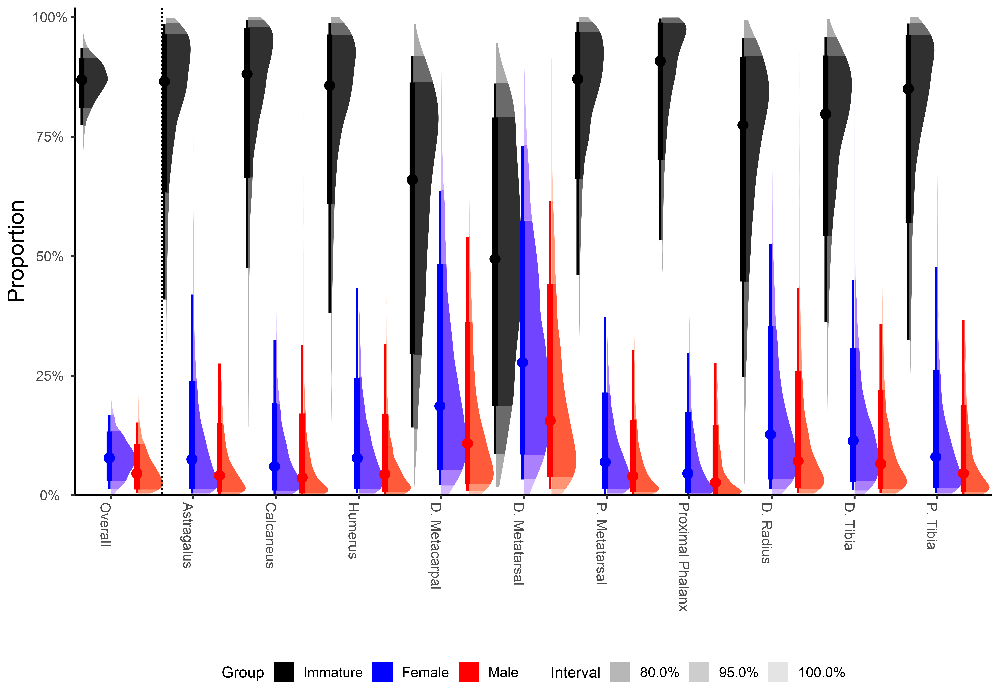
```

The other distributions show element-specific composition estimates for the Pinarbaşı B assemblage. Most of the element-specific proportions of immature animals ($\pi_{1}$) broadly match the overall estimates, with posterior medians over 75%. However, these element-specific distributions also have long tails extending into lower $\pi_{1}$ values, conveying less certainty about element-specific $\pi_{1}$ estimates relative to the assemblage-wide estimate. This likely owes to small element-specific sample sizes (the astragalus, calcaneus, and proximal phalanx have 9-10 specimens, all other element-specific samples sizes are 1-4, see Table 6) and to the presence of some element portions with lower modeled proportions of immature animals. Two element portions—the distal metacarpal and distal metatarsal–have posterior $\pi_{1}$ median values below 75%, though again have long tails that extend in both directions (Distal metacarpal: $\pi_{1}$ posterior median = `r pinarbasi_posterior_summary$pinarbasi_mtc_dist_pi1_median`, 95% posterior credible interval: `r pinarbasi_posterior_summary$pinarbasi_mtc_dist_pi1_95CI`; distal metatarsal: $\pi_{1}$ posterior median = `r pinarbasi_posterior_summary$pinarbasi_mtt_dist_pi1_median`, 95% posterior credible interval: `r pinarbasi_posterior_summary$pinarbasi_mtt_dist_pi1_95CI`). Notably, all measured specimens from these two element portions have fused distal epiphyses, meaning that the model considers it impossible for the specimens to be immature.

Figure 10 shows the same comparison (overall and element-specific distributions) for the average size of female animals ($\mu_{2}$) in the Pinarbaşı B assemblage. Average body sizes vary across elements, highlighting some allometric variation between Pinarbaşı B sheep and the standard sheep and the importance of using a multilevel model to account for allometric variation. The multilevel structure of the model provides a parameter ($\sigma_{\operatorname{Element}}[3]$) that directly estimates this variation: the posterior mean of this distribution is `r round(mean(pinarbasi_post$element_sigma[, 3]), 2)`, with an upper 95% quantile of `r round(quantile(pinarbasi_post$element_sigma[, 3], 0.95), 2)` on the $\operatorname{LSI}_{e}$ scale. Combining all the measurements into a single LSI analysis would confound this element-level variation with differences in composition, muddling the ability to compare the biometry of Pinarbaşı B sheep with sheep from contemporary assemblages.

```{r figure_10, echo = FALSE, message = FALSE, warning = FALSE, fig.align = "center", out.width = "\\textwidth", fig.cap = "Posterior distributions of average LSI value for female animals ($\\mu_2$) for the Pinarbaşı B sheep assemblage. The distribution to the left of the vertical line is the assemblage-level estimate, while the distributions to the right of the line show element-specific size estimates."}
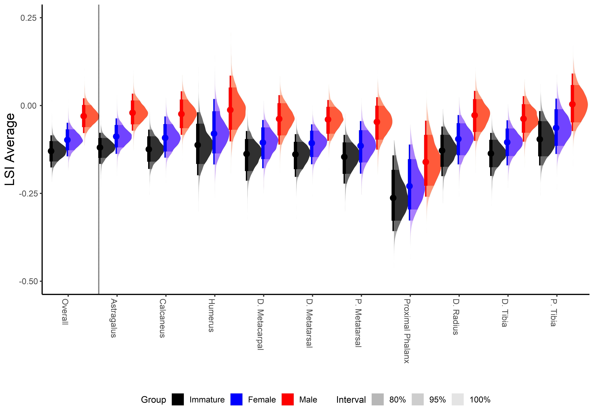
```

Figure 11 shows the distribution of simulated compositions for immature, female, and male specimens in three Pinarbaşı B assemblages: the measured assemblage (N = `r pinarbasi_posterior_summary$pinarbasi_measured_specimens_N`), the assemblage of modeled element portions (N = `r pinarbasi_posterior_summary$pinarbasi_modeled_specimens_N`), and the full sheep assemblage including five element portions that were not modeled due to lack of measurements (additional elements: proximal radius, ulna, proximal metacarpal, pelvis, and middle phalanx; total N = `r pinarbasi_posterior_summary$pinarbasi_full_specimens_N`). Beyond visualizing the group-specific composition of the assemblage, the simulated compositions provide more insight into the assemblage’s formation. Five element portions in the full assemblage (astragalus, calcaneus, proximal radius, proximal fused metacarpal bones 3 and 4, pelvis) contain no mature specimens in `r pinarbasi_composition_summary$pinarbasi_no_mature_select_elements` of the simulations; by contrast, no element portion has more than `r pinarbasi_composition_summary$pinarbasi_no_immature_max` of the simulations without immature specimens (see Table 9). Additionally, element portions vary in the probability that they contain male specimens: distal metapodials (no males in `r pinarbasi_composition_summary$pinarbasi_no_male_mp` of simulations) and phalanges (no males in `r pinarbasi_composition_summary$pinarbasi_no_male_phx` of simulations) contain males much more frequently than other element portions (no males in `r pinarbasi_composition_summary$pinarbasi_no_male_other` of simulations; Table 9). While this analysis focuses on appendicular elements, these results suggest that mature animals—particularly mature males—did not enter the assemblage as complete animals but potentially as raw materials for bone tools [e.g., distal metapodials, distal tibia: @russell_griffitts_2013] or on skins (e.g., proximal and middle phalanges). Immature animals, by contrast, appear to have entered the assemblage as complete animals: the element portions with the highest probability of missing immature specimens may be affected more by density-mediated attrition [e.g., proximal tibia: @symmons_2005] and identifiability of neonatal specimens (e.g., distal metapodials; see Discussion).

```{r figure_11, echo = FALSE, message = FALSE, warning = FALSE, fig.align = "center", out.width = "\\textwidth", fig.cap = "Posterior distributions of simulated group-specific composition for the Pinarbaşı B sheep (top) measured, (middle) modeled, and (bottom) full assemblages. The full assemblage includes five additional element portions compared to the measured and modeled assemblages (proximal metacarpal, pelvis, middle phalanx, proximal radius, ulna)."}
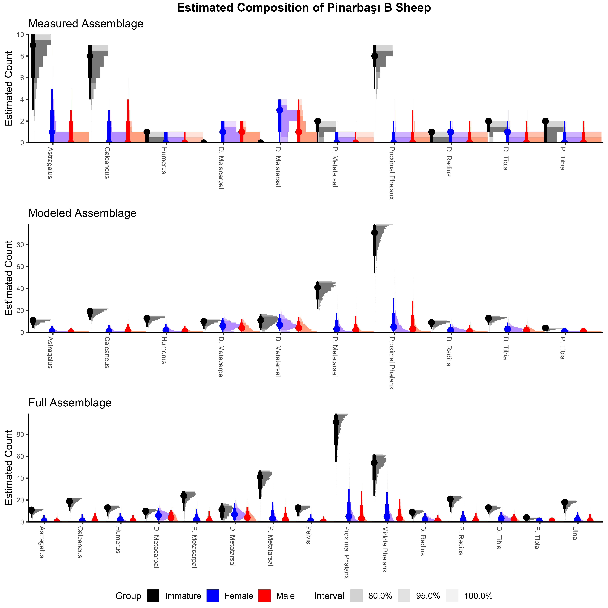
```

```{r table_9, echo = FALSE}
#reassign element portion names from codes to full names
table_9 <- table_9[pinarbasi_element_name_key, on = "Element"][order(p_NoFemale)]
table_9[, `p(No Immature)` := paste0(100 * p_NoImmature, "%")]
table_9[, `p(No Adults)` := paste0(100 * p_NoAdult, "%")]
table_9[, `p(No Females)` := paste0(100 * p_NoFemale, "%")]
table_9[, `p(No Males)` := paste0(100 * p_NoMale, "%")]
#
kbl(table_9[!is.na(p_NoImmature), .(Full_Element_Name, `p(No Immature)`, `p(No Adults)`, `p(No Females)`, `p(No Males)`)],
        col.names = c("Element Portion", "p(No Immature)", "p(No Adults)", "p(No Females)", "p(No Males)"),
    caption = "Percentage of simulated group-specific compositions of the full Pinarbaşı B sheep assemblage that exclude a different population category by element portion. Unmodeled element portions included in the composition analysis are proximal metacarpal, pelvis, middle phalanx, proximal radius, and ulna.",
    booktabs = T, linesep = '') %>%
  kable_styling(latex_options = c("hold_position", "scale_down"))

```

These results strongly reinforce the interpretation that Pinarbaşı B was used by herders as a camp where sheep gave birth, with on-site culling largely reflecting either the first seasonal cull of animals before winter or animals that died naturally in their first year of life [@carruthers_2005; @martin_etal_2015]. This method reinforces previous analyses, which is not surprising; however, the mixture modeling results go beyond these earlier interpretations by creating group-specific biometric estimates and providing a probabilistic framework to estimate a specimen’s membership into the three groups. The biometric estimates not only account for the presence of immature specimens in the assemblage but also for allometric variation across element portions. The probabilistic identifications allow analysts to simulate assemblage compositions, highlighting potential differences in the ways that bones from immature, adult female, and adult male entered the Pinarbaşı B assemblage.

### *4.3 7th-6th Millennium BCE Northwest Anatolian Cattle: Examining differences between assemblages*

Figure 12 shows the posterior distributions of average body sizes for female cattle ($\mu_{2}$) from the four analyzed assemblages. These distributions are produced from posterior samples; assemblage-specific estimates from a single posterior sample share the same relevant hyper-parameters ($\mu_{\mu_{2}}$ and $\sigma_{\operatorname{Site}}[3]$), meaning that they covary with one another to an extent. To compare these distributions, then, a contrast is necessary to account for this potential covariation. This is done by simply evaluating the difference between two parameters (e.g., between the average female $\operatorname{LSI}_{e}$ value $\mu_{2}$ for Barcın Höyük and $\mu_{2}$ for Neolithic Ilıpınar) in each posterior sample, shown in the right-hand panel of Figure 12. These contrasts show that the female cattle from Chalcolithic Ilıpınar are likely smaller, on average, than female cattle from the other sites. These cattle measurements are `r nw_anatolian_posterior_summary$ilipinar2_avg_contrast` smaller, on average, than those from the other northwestern Anatolian sites relative to the standard animal’s measurements. Thus, the mixture modeling approach not only identifies a size difference that was unrecognized when using standard LSI analysis [e.g., @buitenhuis_2008], it also reveals a diachronic trend in cattle body size that can be studied to evaluate factors like climate or herding practices that affected animal body size over time [e.g., @munro_etal_2022; @wright_vinerdaniels_2015]. Accounting for differences in the elemental and demographic composition of different assemblages provides more accurate reconstructions of body size that allow us to critically examine patterns of animal size change in the past [e.g., @arbuckle_kassebaum_2021; @manning_etal_2015].

```{r figure_12, echo = FALSE, message = FALSE, warning = FALSE, fig.align = "center", out.width = "\\textwidth", fig.cap = "Posterior distributions of site-specific average LSI value for female animals ($\\mu_{2}$) for the Northwest Anatolian cattle assemblages. The left-side panel (A) shows the distributions in broadly temporal order from left to right, while the right-side panel (B) shows site-specific contrasts for average female body size, indicating specific size differences between pairs of sites. The title describes the focal assemblage, while the color scheme for the distributions is consistent across both panels. If the contrast distribution is greater than zero, then the focal assemblage is larger than the displayed assemblage (e.g., the top-most distribution in the top panel shows that Barcın Höyük is significantly larger than Chalcolithic Ilıpınar Höyük)."}
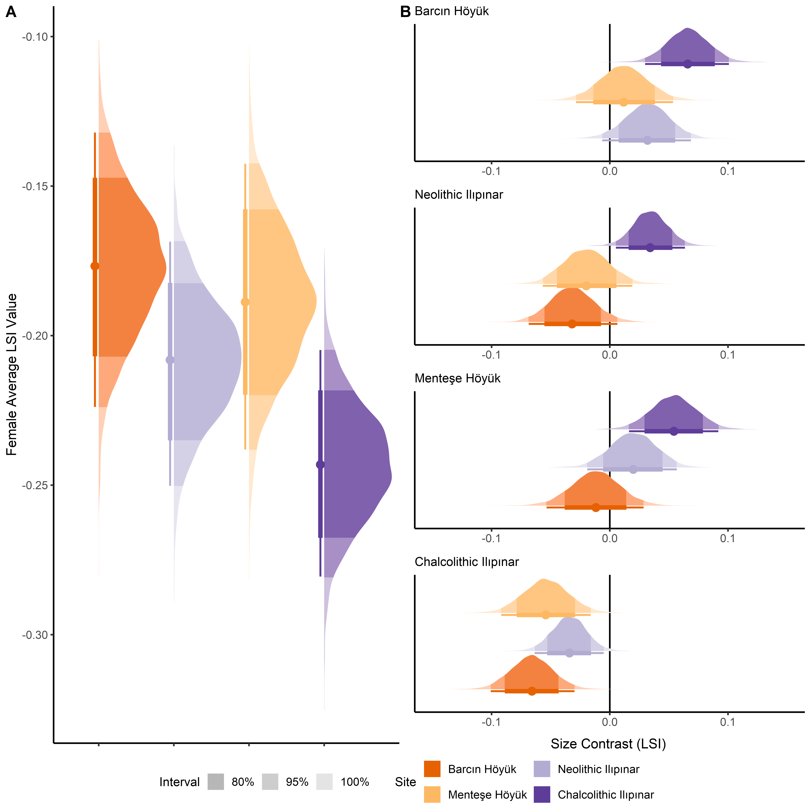
```

In addition to identifying size differences among the assemblages, the modeling results also reveals variation in the age and sex composition of the four assemblages. Figure 13 shows the distributions of assemblage-level demographic variables—the proportion of immature animals and the adult sex ratio (the proportion of adults that are female)—for the four Northwest Anatolian assemblages. The assemblages have broadly similar estimates for the adult sex ratio (right-hand panel of Figure 13), with strong evidence that they contain more females than males. However, modeling shows significant variation in the proportion of immature animals in the assemblages (top panel of Figure 13): the proportion of immature cattle in the Menteşe Höyük and Barcın Höyük assemblages is significantly higher than the proportions of immature cattle in either Ilıpınar Höyük assemblage. This difference between the sites could be investigated further to understand whether there are taphonomic factors that have selectively removed immature specimens from the Ilıpınar Höyük assemblage post-depositionally or whether herd management strategies differed among communities at these sites [e.g., @gillis_etal_2014; @gillis_etal_2015].

```{r figure_13, echo = FALSE, message = FALSE, warning = FALSE, fig.align = "center", out.width = "\\textwidth", fig.cap = "Comparison of posterior distributions of site-specific demographic parameters (proportion of immature $\\pi_{\\operatorname{Immature}}$ and adult sex ratio $\\theta_{\\operatorname{Female}}$) for the Northwest Anatolian cattle assemblages. Top panel shows the marginal plot for the proportion of immature specimens, while the right-hand panel shows the marginal plot for the adult sex ratio (in proportion of females among mature animals)."}
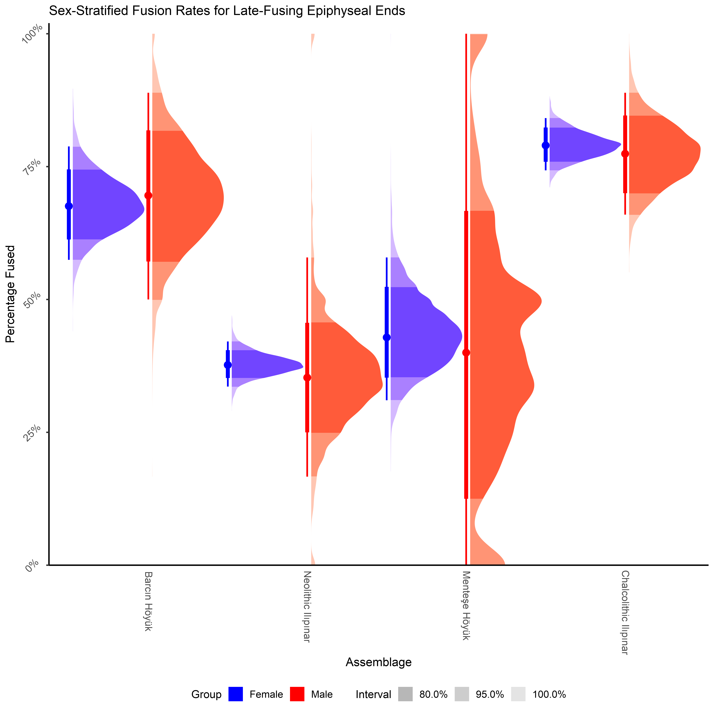
```

Simulating sex-specific fusion rates for late-fusing elements [proximal femur, distal femur, proximal humerus, distal radius, proximal tibia, proximal ulna: @grigson_1982] from the full Northwest Anatolian assemblages highlights the complexities of examining sex-specific fusion rates in zooarchaeological assemblages. In each assemblage, estimates of male fusion rates are extremely uncertain, owing to the small number of estimated males in each iteration and thus large potential shifts in the denominator for fusion rates (Figure 14). This uncertainty makes it difficult to clearly establish whether fusion rates differed between males and females; regardless, in `r nw_anatolian_posterior_summary$ilipinar2_sex_fusion_bias` of the posterior samples female fusion rates were higher than male fusion rates for Chalcolithic Ilıpınar. These results complicate regional syntheses that tie the presence of milk residues to milk-oriented cattle management [e.g., @evershed_etal_2008]; the ability to directly estimate sex-specific fusion rates allows researchers to test the validity of these exploitation models for past assemblages [e.g., @arbuckle_atici_2013].

```{r figure_14, echo = FALSE, message = FALSE, warning = FALSE, fig.align = "center", out.width = "\\textwidth", fig.cap = "Posterior distributions of simulated sex-specific fusion rates for late-fusing elements among Northwest Anatolian cattle full assemblages. Included element portions are distal tibia, distal metapodials, calcaneus, femur, proximal ulna, distal radius, proximal tibia, and proximal humerus."}
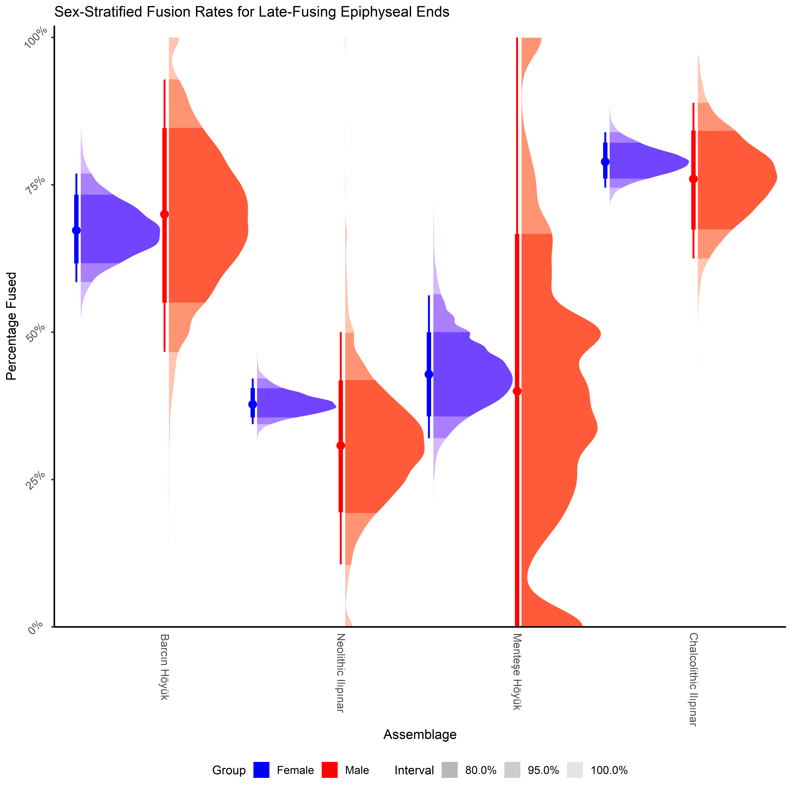
```

## 5. DISCUSSION

The simulation analyses show that the Bayesian multilevel mixture model presented here can accurately reconstruct age- and sex-specific biometry of a faunal population represented in a measured assemblage, while also producing relatively accurate estimates of the “demographic” (ontogenetic age and sex) composition of the assemblage. The archaeological applications of the mixture model demonstrate how the model can highlight meaningful variation in the composition and relative size of specimens across element portions. The results can point to potential differences in the how animals entered an assemblage, as between immature and mature sheep at Pinarbaşı B, or reveal variation in demographic proportions that could highlight taphonomic differences or variation in management strategies across the sites, as in the Northwest Anatolian cattle. While broadly supporting the earlier analyses of these assemblages, applying mixture models to the measurement assemblages also opened new lines of inquiry based on exploring the drivers of variation in body size and assemblage composition.

The performance of the Bayesian multilevel mixture models relies on the prior distributions, which provide constraints against overfitting and ensure that the model produces biologically reasonable parameter estimates. The prior distribution definitions in this paper were derived largely from the measurements of a herd of known-age, known-sex population of Shetland sheep [@popkin_etal_2012], though for the multisite cattle model some of the definitions were changed based on data on European aurochsen [@degerbol_1970]. It is important to note that prior distribution definitions can be derived from many different sources—including quantification based on one’s judgment [e.g., @gelman_etal_2008; @mccarthy_masters_2005]. This could allow researchers to use different kinds of demographic priors to adjust for their expectations about the ways that assemblages are created, for instance if one may expect catastrophic profiles [e.g., @stiner_1990]. More important than the source of one’s prior distribution definitions, is investigating the expectations of those prior distribution definitions by performing prior predictive checks as in the Model Supplement [@gabry_etal_2019; @gelman_etal_2020_bda3]. Further, emphasis should be paid to increasing the diversity of known-age, known-sex animal populations with individual measurement data [e.g., @lebenzon_munro_2022; @zeder_lemoine_2020], which could help develop prior distributions relevant to different taxa and to understand how variable different parameters, especially size variability ($\sigma$) parameters, are across populations.

One of the central tenets of the mixture model’s extension to modeled assemblages is the idea that “measurability” (adequate preservation to maintain a biometric dimension) is unrelated to a specimen’s status as immature, female, or male. Variation in the mixture proportions among elements, especially the proportion of immature specimens $\pi_{1}$ may highlight group-specific biases in the deposition of specimens but could also indicate issues with the assumption that “measurability” is random. The Pinarbaşı B sheep assemblage potentially demonstrates this issue, as the distal metapodials have much lower element-specific $\pi_{1}$ estimates than other element portions. While metapodial bones from mature sheep could have been selectively over-represented in the assemblage, it is also likely that distal metapodials from immature animals-particularly very young animals-are less likely to be measurable compared to adult animals. Because the distal breadth measurement requires both distal condyles to be present, distal metapodial specimens from neonatal or extremely juvenile individuals may be missed while those from other element portions (e.g., proximal metapodial, distal humerus) would still be theoretically measurable [@martin_garciagonzalez_2015]. The inclusion of condyle-specific measurements could address this issue, though would require identifying whether the isolated condyle is medial or lateral [e.g., width of condyle: @payne_1969].

The ability to create accurate simulated estimates of age and sex composition provides many opportunities for further analyses. For instance, comparison of the composition of animals in different depositional contexts could support contextual taphonomic analyses [e.g., @meier_2020]. Access to certain kinds of animals could highlight systems of provisioning or status-related restrictions [@arbuckle_2012; @twiss_2019: pp. 73-97]. Differences in the ontogenetic age and sex composition of different body parts could also highlight ritual behaviors reflected in the use of certain contexts or sites [e.g., @madgwick_mulville_2015]. In a similar vein, tracking adult sex ratios could identify the use of castrates to take advantage of secondary products like wool or labor; the models used here would identify castrates as males, though alternative prior distributions and measured dimensions could distinguish these groups [e.g., @popkin_etal_2012: Figure 7]. On a more practical level, providing specimen-specific probabilities of being immature, female, or male can provide a useful baseline for sampling strategies focused on ancient DNA or stable isotopes, allowing researchers to explore potential sex differences in diets [e.g., @post_etal_2001] or more easily identify male specimens to isolate Y-chromosomal DNA to explore sex-specific selection [e.g., @daly_etal_2021; @mcgrory_etal_2012].

The archaeological case studies highlight the importance of considering the presence of immature specimens and elemental variation in body size when summarizing the biometry and composition of an assemblage. Variation in the proportion of immature animals in the assemblage, as in the multisite case study for Northwest Anatolia, may point to differences in culling strategies or even the seasonality of animal presence at the sites. Most of the Pinarbaşı B material derives from immature specimens, which could complicate inter-assemblage biometric analyses that do not use sex-specific size estimates [e.g., @arbuckle_etal_2014; @helmer_etal_2005]. Restricting measurements only to fused specimens removes useful information, particularly when fusion rates may differ between male and female animals [@zeder_hesse_2000]; further, it does not resolve the problem of immature animals in the measurement assemblage if early-fusing elements like the distal humerus are still included because of post-fusion growth [@popkin_etal_2012]. The ability to create sex-specific biometric estimates is important to document large-scale spatial and temporal dynamics in animal body size [e.g., @arbuckle_etal_2016; @arbuckle_kassebaum_2021; @wolfhagen_etal_2021].

Examining $\operatorname{LSI}_{e}$ (or $\operatorname{LSI}_{10}$) values of Pinarbaşı B sheep without accounting for the impact of immature animals would mislead a researcher into believing that sheep were smaller, on average, than sheep from contemporaneous sites [e.g., late Çatalhöyük: @baird_etal_2011]. While stable isotopic analyses have suggested that the Pinarbaşı B and Çatalhöyük sheep had similar diets [e.g., @baird_etal_2011; @baird_etal_2018; @middleton_2018], biometric analyses had not previously supported the idea that these assemblages derived from the same animal population [e.g., @arbuckle_etal_2014: Figure 4]. Only eight measurements from the Pinarbaşı B sheep are excluded from being immature due to fusion status, four of which are distal metatarsals; the median $\operatorname{LSI}_{e}$ of these specimens is `r pinarbasi_LSI_summary$pinarbasi_mature_LSI_median`, compared to a median of `r catalhoyuk_posterior_comparison$catalhoyuk_mature_LSI_median` for the `r catalhoyuk_posterior_comparison$catalhoyuk_mature_N` Late Çatalhöyük sheep that must be mature based on fusion status [@wolfhagen_etal_2021]. Even though the mixture model’s estimate for the average $\operatorname{LSI}_{e}$ for female sheep ($\mu_{2}$) at Pinarbaşı B is relatively uncertain (95% credible interval: `r pinarbasi_LSI_summary$pinarbasi_female_LSI_95CI` $\operatorname{LSI}_{e}$), it still provides a useful reference point for comparison that supports the idea that these assemblages have similar biometries [95% credible interval of $\mu_{2}$ for late Çatalhöyük sheep: `r catalhoyuk_posterior_comparison$catalhoyuk_female_LSI_95CI` $\operatorname{LSI}_{e}$: @wolfhagen_etal_2021].

Examining $\operatorname{LSI}_{e}$ (or $\operatorname{LSI}_{10}$) values of Pinarbaşı B sheep without accounting for the impact of immature animals would mislead a researcher into believing that sheep were smaller, on average, than sheep from contemporaneous sites [e.g., late Çatalhöyük: @baird_etal_2011]. While stable isotopic analyses have suggested that the Pinarbaşı B and Çatalhöyük sheep had similar diets [e.g., @baird_etal_2011; @baird_etal_2018; @middleton_2018], biometric analyses had not previously supported the idea that these assemblages derived from the same animal population [e.g., @arbuckle_etal_2014: Figure 4]. Only eight measurements from the Pinarbaşı B sheep are excluded from being immature due to fusion status, four of which are distal metatarsals; the median $\operatorname{LSI}_{e}$ of these specimens is `r pinarbasi_LSI_summary$pinarbasi_mature_LSI_median`, compared to a median of `r catalhoyuk_posterior_comparison$catalhoyuk_mature_LSI_median` for the `r catalhoyuk_posterior_comparison$catalhoyuk_mature_N` Late Çatalhöyük sheep that must be mature based on fusion status [@wolfhagen_etal_2021]. Even though the mixture model’s estimate for the average $\operatorname{LSI}_{e}$ for female sheep ($\mu_{2}$) at Pinarbaşı B is relatively uncertain (95% credible interval: `r pinarbasi_LSI_summary$pinarbasi_female_LSI_95CI` $\operatorname{LSI}_{e}$), it still provides a useful reference point for comparison that supports the idea that these assemblages have similar biometries [95% credible interval of $\mu_{2}$ for late Çatalhöyük sheep: `r catalhoyuk_posterior_comparison$catalhoyuk_female_LSI_95CI` $\operatorname{LSI}_{e}$: @wolfhagen_etal_2021].

The increased ability to specify the ontogenetic age and sex composition of faunal assemblages with Bayesian multi-level mixture models also highlights the limitations of our current language used to describe and interpret these compositions. Results like the sex-specific fusion biases in Northwest Anatolian cattle complicate straightforward expectations of clear sex-specific patterns in archaeological assemblages, which is perhaps unsurprising. Many discussions that examine changes in the composition of faunal assemblages to identify shifts in exploitation patterns use terms like “prime-dominated age structure” [e.g., @stiner_1990], “dominance of females,” [e.g., @peters_etal_2005] or “young male slaughter/kill-off” [e.g., @zeder_hesse_2000; @arbuckle_atici_2013]. These terms are deceptive in their utility—they describe some empirical pattern but are ordinal-scale, thus it is up to the individual researcher to define the cut-off between a “dominant” and “non-dominant” assemblage (Wolverton et al. 2016). In the case of the adult sex ratio for Barcın Höyük, `r nw_anatolian_posterior_summary$barcin_thetafemale_over60` of the posterior samples are above 60% (1.5 females:1 male), but only `r nw_anatolian_posterior_summary$barcin_thetafemale_over75` of the posterior samples are over 75% (3 females:1 male). Meanwhile, `r nw_anatolian_posterior_summary$ilipinar1_thetafemale_over80` of the posterior samples for the adult sex ratio for Neolithic Ilıpınar are over 80% (4 females:1 male). Are both assemblages “dominated by females”? More formalized language in our hypotheses—or, rather, the adoption of statistical modeling frameworks [@mcelreath_2020_rethinkingbook: 4-17]—is necessary to clarify what changes in assemblage-level estimates of biometry and composition mean for past human-animal interactions.

## 6. CONCLUSIONS

This paper describes a new method for estimating the biometry and ontogenetic age and sex composition of faunal assemblages based on standard measurement data using Bayesian multilevel mixture modeling. The model produces accurate estimates of sex-specific biometry, which can provide a more useful framework for inter-assemblage analysis [e.g., @arbuckle_etal_2016; @helmer_etal_2005]. Such a framework could better explore broad spatial and chronological patterns in animal biometry while accounting for differences in assemblage composition across the assemblages, ensuring reliable comparisons of animal body size in relation to other variables. These analyses could investigate the processes behind size fluctuation in animals, particularly in relation to changing human-animal interactions and adaptation to new lifeways and anthropogenic environments.

Furthermore, the estimates of the age and sex composition of the assemblage can be used to simulate assemblages of specimens with known group assignment (immature, female, and male). These simulations are the baseline for comparing differences in the composition of sub-assemblages. Using these simulations allows researchers to make testable statements about the composition of the assemblage and to directly test hypotheses about differences in the age and sex composition of animal bones from different parts of a site, different fusion groups, or other categories. The Bayesian structure of the model allows researchers the flexibility to create hypotheses that can be tested directly, rather than relying on null hypothesis testing for inference [@otarolacastillo_torquato_2018; @otarolacastillo_etal_2022]. Thus, the mixture modeling framework described here provides a foundation for biometric and compositional analyses that operate at multiple scales and presents a new avenue for summarizing and comparing zooarchaeological assemblages.

##ACKNOWLEDGEMENTS

The initial modeling work was developed as part of my dissertation research, which as partially funded by a Wenner-Gren Foundation Dissertation Fieldwork Grant (Grant #9192). Thank you to R. Lee Lyman, Ryan Breslawski, and an anonymous reviewer for their dedicated and constructive feedback to improve this manuscript’s accessibility and argumentation. Thank you as well to Natalie Munro and the University of Connecticut Zooarchaeology Lab (Roxanne Lebenzon, Elic Weitzel, Nick Gonzalez, and Mario Mata-González--visiting from Universität Tübingen), whose members discussed an earlier version of this paper with me and provided insightful advice. I am grateful to the comments and insights on earlier versions of this manuscript from Chris W. Carleton, Zenobie Garrett, Ashley Lingle, Heather Lynch, Max D. Price, and Katheryn Twiss. Any errors are my own.

## References

<div id = "refs"></div>

\newpage

## Appendix 1 (Supplemental Table 6)

### *Posterior Summary Tables for Overall and Site-Level Model Parameters: Simulated Assemblages*

```{r simulated single assemblage posterior table, include = FALSE, eval = TRUE}
table_simulated_single_assemblage_model_parameters <- data.table(single_assemblage_samples$summary(c("grand_theta", "grand_mu_immature", "grand_mu_female", "grand_mu_male", "grand_sigma_immature", "grand_sigma_female", "grand_sigma_male")))[, .(`Posterior Mean` = round(mean, 2), `Posterior Median` = round(median, 2), `Posterior SD` = round(sd, 2), `$5\\%$ Quantile` = round(q5, 2), `$95\\%$ Quantile` = round(q95, 2), `$\\hat{R}$` = round(rhat, 2), `Effective Sample Size (Bulk)` = round(ess_bulk, 0), `Effective Sample Size (Tail)` = round(ess_tail, 0))]
parameter_names <- c("$\\theta_1$", "$\\theta_2$", "$\\theta_3$", "$\\mu_1$", "$\\mu_2$", "$\\mu_3$", "$\\sigma_1$", "$\\sigma_2$", "$\\sigma_3$")
single_assemblage_overall_name <- "Single Assemblage Model"
table_simulated_single_assemblage_model_parameters[, Parameter := c(sapply(parameter_names, function(x) paste(single_assemblage_overall_name, x, sep = " ")))]
```

```{r make simulated assemblage posterior table, echo = FALSE}
kbl(table_simulated_single_assemblage_model_parameters[, .(Parameter, `Posterior Mean`, `Posterior Median`, `Posterior SD`, `$5\\%$ Quantile`, `$95\\%$ Quantile`, `$\\hat{R}$`, `Effective Sample Size (Bulk)`, `Effective Sample Size (Tail)`)],
    col.names = c("Parameter", "Posterior Mean", "Posterior Median", "Posterior SD", "$5\\%$ Quantile", "$95\\%$ Quantile", "$\\hat{R}$", "Effective Sample Size (Bulk)", "Effective Sample Size (Tail)"),
    caption = "Posterior Fit Summaries for Model Parameters (Single Assemblage Simulation)",
    booktabs = T, escape = FALSE, linesep = c('', '', '\\addlinespace')) %>%
  kable_styling(latex_options = c("HOLD_position", "scale_down")) %>%
  column_spec(1, border_right = T) %>%
  row_spec(0, align = "c")
```

```{r simulated multisite posterior table, include = FALSE, eval = TRUE}
table_simulated_multisite_model_parameters <- data.table(multisite_samples$summary(c("grand_theta", "grand_mu_immature", "grand_mu_female", "grand_mu_male", "grand_sigma_immature", "grand_sigma_female", "grand_sigma_male")))[, .(`Posterior Mean` = round(mean, 2), `Posterior Median` = round(median, 2), `Posterior SD` = round(sd, 2), `$5\\%$ Quantile` = round(q5, 2), `$95\\%$ Quantile` = round(q95, 2), `$\\hat{R}$` = round(rhat, 2), `Effective Sample Size (Bulk)` = round(ess_bulk, 0), `Effective Sample Size (Tail)` = round(ess_tail, 0))]
multisite_overall_name <- "Multisite Model"
table_simulated_multisite_model_parameters[, Parameter := c(sapply(parameter_names, function(x) paste(multisite_overall_name, x, sep = " ")))]
#
table_simulated_multisite_site_parameters <- data.table(multisite_samples$summary(c("site_theta", "site_mu_immature", "site_mu_female", "site_mu_male", "site_sigma_immature", "site_sigma_female", "site_sigma_male")))[, .(`Posterior Mean` = round(mean, 2), `Posterior Median` = round(median, 2), `Posterior SD` = round(sd, 2), `$5\\%$ Quantile` = round(q5, 2), `$95\\%$ Quantile` = round(q95, 2), `$\\hat{R}$` = round(rhat, 2), `Effective Sample Size (Bulk)` = round(ess_bulk, 0), `Effective Sample Size (Tail)` = round(ess_tail, 0))]
simulated_multisite_site_names <- sapply(1:15, function(x) paste0("Site ", x))
table_simulated_multisite_site_parameters[, Parameter := c(sapply(parameter_names, function(x) paste(simulated_multisite_site_names, x, sep = " ")))]
```

```{r make simulated multisite posterior table, echo = FALSE}
kbl(table_simulated_multisite_model_parameters[, .(Parameter, `Posterior Mean`, `Posterior Median`, `Posterior SD`, `$5\\%$ Quantile`, `$95\\%$ Quantile`, `$\\hat{R}$`, `Effective Sample Size (Bulk)`, `Effective Sample Size (Tail)`)],
    col.names = c("Parameter", "Posterior Mean", "Posterior Median", "Posterior SD", "$5\\%$ Quantile", "$95\\%$ Quantile", "$\\hat{R}$", "Effective Sample Size (Bulk)", "Effective Sample Size (Tail)"),
    caption = "Posterior Fit Summaries for Model Parameters (Multisite Simulation)",
    booktabs = T, escape = FALSE, linesep = c('', '', '\\addlinespace')) %>%
  kable_styling(latex_options = c("HOLD_position", "scale_down")) %>%
  column_spec(1, border_right = T) %>%
  row_spec(0, align = "c")
```

```{r make simulated multisite site-level table, echo = FALSE}
kbl(table_simulated_multisite_site_parameters[, .(Parameter, `Posterior Mean`, `Posterior Median`, `Posterior SD`, `$5\\%$ Quantile`, `$95\\%$ Quantile`, `$\\hat{R}$`, `Effective Sample Size (Bulk)`, `Effective Sample Size (Tail)`)],
    col.names = c("Parameter", "Posterior Mean", "Posterior Median", "Posterior SD", "$5\\%$ Quantile", "$95\\%$ Quantile", "$\\hat{R}$", "Effective Sample Size (Bulk)", "Effective Sample Size (Tail)"),
    caption = "Posterior Fit Summaries for Site-Level Model Parameters (Multisite Simulation)",
    booktabs = T, longtable = T, escape = FALSE, linesep = c('', '', '', '', '\\addlinespace')) %>%
  kable_styling(latex_options = c("HOLD_position", "repeat_header")) %>%
  column_spec(1, border_right = T) %>%
  column_spec(2:6, width = "4em") %>%
  column_spec(7, width = "2em") %>%
  column_spec(8:9, width = "4em")
```

\newpage

## Appendix 2 (Supplemental Table 7)

### *Posterior Summary Tables for Overall and Site-Level Model Parameters: Archaeological Case Studies*

```{r Pinarbasi B sheep posterior table, include = FALSE, eval = TRUE}
table_pinarbasi_model_parameters <- data.table(pinarbasi_samples$summary(c("grand_theta", "grand_mu_immature", "grand_mu_female", "grand_mu_male", "grand_sigma_immature", "grand_sigma_female", "grand_sigma_male")))[, .(`Posterior Mean` = round(mean, 2), `Posterior Median` = round(median, 2), `Posterior SD` = round(sd, 2), `$5\\%$ Quantile` = round(q5, 2), `$95\\%$ Quantile` = round(q95, 2), `$\\hat{R}$` = round(rhat, 2), `Effective Sample Size (Bulk)` = round(ess_bulk, 0), `Effective Sample Size (Tail)` = round(ess_tail, 0))]
pinarbasi_overall_name <- "Pinarbaşı B Sheep"
table_pinarbasi_model_parameters[, Parameter := c(sapply(parameter_names, function(x) paste(pinarbasi_overall_name, x, sep = " ")))]
```

```{r make Pinarbasi B table, echo = FALSE}
kbl(table_pinarbasi_model_parameters[, .(Parameter, `Posterior Mean`, `Posterior Median`, `Posterior SD`, `$5\\%$ Quantile`, `$95\\%$ Quantile`, `$\\hat{R}$`, `Effective Sample Size (Bulk)`, `Effective Sample Size (Tail)`)],
    col.names = c("Parameter", "Posterior Mean", "Posterior Median", "Posterior SD", "$5\\%$ Quantile", "$95\\%$ Quantile", "$\\hat{R}$", "Effective Sample Size (Bulk)", "Effective Sample Size (Tail)"),
    caption = "Posterior Fit Summaries for Model Parameters (Pinarbaşı B Sheep)",
    booktabs = T, escape = FALSE, linesep = c('', '', '\\addlinespace')) %>%
  kable_styling(latex_options = c("HOLD_position", "scale_down")) %>%
  column_spec(1, border_right = T) %>%
  row_spec(0, align = "c")
```

```{r Northwest Anatolian cattle posterior table, include = FALSE, eval = TRUE}
table_nw_anatolian_model_parameters <- data.table(nw_anatolian_multisite_samples$summary(c("grand_theta", "grand_mu_immature", "grand_mu_female", "grand_mu_male", "grand_sigma_immature", "grand_sigma_female", "grand_sigma_male")))[, .(`Posterior Mean` = round(mean, 2), `Posterior Median` = round(median, 2), `Posterior SD` = round(sd, 2), `$5\\%$ Quantile` = round(q5, 2), `$95\\%$ Quantile` = round(q95, 2), `$\\hat{R}$` = round(rhat, 2), `Effective Sample Size (Bulk)` = round(ess_bulk, 0), `Effective Sample Size (Tail)` = round(ess_tail, 0))]
nw_anatolian_overall_name <- "NW Anatolian Cattle"
table_nw_anatolian_model_parameters[, Parameter := c(sapply(parameter_names, function(x) paste(nw_anatolian_overall_name, x, sep = " ")))]

#
table_nw_anatolian_site_parameters <- data.table(nw_anatolian_multisite_samples$summary(c("site_theta", "site_mu_immature", "site_mu_female", "site_mu_male", "site_sigma_immature", "site_sigma_female", "site_sigma_male")))[, .(`Posterior Mean` = round(mean, 2), `Posterior Median` = round(median, 2), `Posterior SD` = round(sd, 2), `$5\\%$ Quantile` = round(q5, 2), `$95\\%$ Quantile` = round(q95, 2), `$\\hat{R}$` = round(rhat, 2), `Effective Sample Size (Bulk)` = round(ess_bulk, 0), `Effective Sample Size (Tail)` = round(ess_tail, 0))]
nw_anatolian_site_names <- c("Barcın", "Neolithic Ilıpınar", "Menteşe", "Chalcolithic Ilıpınar")
table_nw_anatolian_site_parameters[, Parameter := c(sapply(parameter_names, function(x) paste(nw_anatolian_site_names, x, sep = " ")))]
```

```{r make Northwest Anatolian table, echo = FALSE}
kbl(table_nw_anatolian_model_parameters[, .(Parameter, `Posterior Mean`, `Posterior Median`, `Posterior SD`, `$5\\%$ Quantile`, `$95\\%$ Quantile`, `$\\hat{R}$`, `Effective Sample Size (Bulk)`, `Effective Sample Size (Tail)`)],
    col.names = c("Parameter", "Posterior Mean", "Posterior Median", "Posterior SD", "$5\\%$ Quantile", "$95\\%$ Quantile", "$\\hat{R}$", "Effective Sample Size (Bulk)", "Effective Sample Size (Tail)"),
    caption = "Posterior Fit Summaries for Model Parameters (Northwest Anatolian Cattle)",
    booktabs = T, escape = FALSE, linesep = c('', '', '\\addlinespace')) %>%
  kable_styling(latex_options = c("HOLD_position", "scale_down")) %>%
  column_spec(1, border_right = T) %>%
  row_spec(0, align = "c")
```

```{r make Northwest Anatolian site-level table, echo = FALSE}
kbl(table_nw_anatolian_site_parameters[, .(Parameter, `Posterior Mean`, `Posterior Median`, `Posterior SD`, `$5\\%$ Quantile`, `$95\\%$ Quantile`, `$\\hat{R}$`, `Effective Sample Size (Bulk)`, `Effective Sample Size (Tail)`)],
    col.names = c("Parameter", "Posterior Mean", "Posterior Median", "Posterior SD", "$5\\%$ Quantile", "$95\\%$ Quantile", "$\\hat{R}$", "Effective Sample Size (Bulk)", "Effective Sample Size (Tail)"),
    caption = "Posterior Fit Summaries for Site-Level Model Parameters (Northwest Anatolian Cattle)",
    booktabs = T, escape = FALSE, linesep = c('', '', '', '\\addlinespace')) %>%
  kable_styling(latex_options = c("HOLD_position", "scale_down")) %>%
  column_spec(1, border_right = T) %>%
  row_spec(0, align = "c")
```

\newpage

## Appendix 3 (Supplemental Figures 1-4)

### *Traceplots of Posterior Distributions of Overall Model Parameters*

```{r simulated single assemblage traceplot, include = FALSE, eval = TRUE}
single_assemblage_theta1_plot <- traceplot(single_assemblage_stanfit, pars = "grand_theta[1]") + labs(title = expression(paste(theta[1])), y = element_blank()) + theme(plot.title = element_text(hjust = 0.5))
single_assemblage_theta2_plot <- traceplot(single_assemblage_stanfit, pars = "grand_theta[2]") + labs(title = expression(paste(theta[2])), y = element_blank()) + theme(plot.title = element_text(hjust = 0.5))
single_assemblage_theta3_plot <- traceplot(single_assemblage_stanfit, pars = "grand_theta[3]") + labs(title = expression(paste(theta[3])), y = element_blank()) + theme(plot.title = element_text(hjust = 0.5))
single_assemblage_mu1_plot <- traceplot(single_assemblage_stanfit, pars = "grand_mu_immature") + labs(title = expression(paste(mu[1])), y = element_blank()) + theme(plot.title = element_text(hjust = 0.5))
single_assemblage_mu2_plot <- traceplot(single_assemblage_stanfit, pars = "grand_mu_female") + labs(title = expression(paste(mu[2])), y = element_blank()) + theme(plot.title = element_text(hjust = 0.5))
single_assemblage_mu3_plot <- traceplot(single_assemblage_stanfit, pars = "grand_mu_male") + labs(title = expression(paste(mu[3])), y = element_blank()) + theme(plot.title = element_text(hjust = 0.5))
single_assemblage_sigma1_plot <- traceplot(single_assemblage_stanfit, pars = "grand_sigma_immature") + labs(title = expression(paste(sigma[1])), y = element_blank()) + theme(plot.title = element_text(hjust = 0.5))
single_assemblage_sigma2_plot <- traceplot(single_assemblage_stanfit, pars = "grand_sigma_female") + labs(title = expression(paste(sigma[2])), y = element_blank()) + theme(plot.title = element_text(hjust = 0.5))
single_assemblage_sigma3_plot <- traceplot(single_assemblage_stanfit, pars = "grand_sigma_male") + labs(title = expression(paste(sigma[3])), y = element_blank()) + theme(plot.title = element_text(hjust = 0.5))
#
single_assemblage_trace_plot <- ggarrange(single_assemblage_theta1_plot, single_assemblage_theta2_plot, single_assemblage_theta3_plot, single_assemblage_mu1_plot, single_assemblage_mu2_plot, single_assemblage_mu3_plot, single_assemblage_sigma1_plot, single_assemblage_sigma2_plot, single_assemblage_sigma3_plot, common.legend = T, legend = "bottom")
#
figure_s1 <- annotate_figure(single_assemblage_trace_plot, top = text_grob("Single Assemblage Simulation", face = "bold", size = 14))
#
Cairo(width = 8, height = 8, units = "in", file = "./Output/Figures/figure_s1.png", type = "png", dpi = 600)
figure_s1
dev.off()
```

```{r simulated multisite traceplot, include = FALSE, eval = TRUE}
multisite_theta1_plot <- traceplot(multisite_stanfit, pars = "grand_theta[1]") + labs(title = expression(paste(theta[1])), y = element_blank()) + theme(plot.title = element_text(hjust = 0.5))
multisite_theta2_plot <- traceplot(multisite_stanfit, pars = "grand_theta[2]") + labs(title = expression(paste(theta[2])), y = element_blank()) + theme(plot.title = element_text(hjust = 0.5))
multisite_theta3_plot <- traceplot(multisite_stanfit, pars = "grand_theta[3]") + labs(title = expression(paste(theta[3])), y = element_blank()) + theme(plot.title = element_text(hjust = 0.5))
multisite_mu1_plot <- traceplot(multisite_stanfit, pars = "grand_mu_immature") + labs(title = expression(paste(mu[1])), y = element_blank()) + theme(plot.title = element_text(hjust = 0.5))
multisite_mu2_plot <- traceplot(multisite_stanfit, pars = "grand_mu_female") + labs(title = expression(paste(mu[2])), y = element_blank()) + theme(plot.title = element_text(hjust = 0.5))
multisite_mu3_plot <- traceplot(multisite_stanfit, pars = "grand_mu_male") + labs(title = expression(paste(mu[3])), y = element_blank()) + theme(plot.title = element_text(hjust = 0.5))
multisite_sigma1_plot <- traceplot(multisite_stanfit, pars = "grand_sigma_immature") + labs(title = expression(paste(sigma[1])), y = element_blank()) + theme(plot.title = element_text(hjust = 0.5))
multisite_sigma2_plot <- traceplot(multisite_stanfit, pars = "grand_sigma_female") + labs(title = expression(paste(sigma[2])), y = element_blank()) + theme(plot.title = element_text(hjust = 0.5))
multisite_sigma3_plot <- traceplot(multisite_stanfit, pars = "grand_sigma_male") + labs(title = expression(paste(sigma[3])), y = element_blank()) + theme(plot.title = element_text(hjust = 0.5))
#
multisite_assemblage_trace_plot <- ggarrange(multisite_theta1_plot, multisite_theta2_plot, multisite_theta3_plot, multisite_mu1_plot, multisite_mu2_plot, multisite_mu3_plot, multisite_sigma1_plot, multisite_sigma2_plot, multisite_sigma3_plot, common.legend = T, legend = "bottom")
#
figure_s2 <- annotate_figure(multisite_assemblage_trace_plot, top = text_grob("Multisite Simulation", face = "bold", size = 14))
#
Cairo(width = 8, height = 8, units = "in", file = "./Output/Figures/figure_s2.png", type = "png", dpi = 600)
figure_s2
dev.off()
```

```{r Pinarbasi B sheep traceplot, include = FALSE, eval = TRUE}
pinarbasi_theta1_plot <- traceplot(pinarbasi_stanfit, pars = "grand_theta[1]") + labs(title = expression(paste(theta[1])), y = element_blank()) + theme(plot.title = element_text(hjust = 0.5))
pinarbasi_theta2_plot <- traceplot(pinarbasi_stanfit, pars = "grand_theta[2]") + labs(title = expression(paste(theta[2])), y = element_blank()) + theme(plot.title = element_text(hjust = 0.5))
pinarbasi_theta3_plot <- traceplot(pinarbasi_stanfit, pars = "grand_theta[3]") + labs(title = expression(paste(theta[3])), y = element_blank()) + theme(plot.title = element_text(hjust = 0.5))
pinarbasi_mu1_plot <- traceplot(pinarbasi_stanfit, pars = "grand_mu_immature") + labs(title = expression(paste(mu[1])), y = element_blank()) + theme(plot.title = element_text(hjust = 0.5))
pinarbasi_mu2_plot <- traceplot(pinarbasi_stanfit, pars = "grand_mu_female") + labs(title = expression(paste(mu[2])), y = element_blank()) + theme(plot.title = element_text(hjust = 0.5))
pinarbasi_mu3_plot <- traceplot(pinarbasi_stanfit, pars = "grand_mu_male") + labs(title = expression(paste(mu[3])), y = element_blank()) + theme(plot.title = element_text(hjust = 0.5))
pinarbasi_sigma1_plot <- traceplot(pinarbasi_stanfit, pars = "grand_sigma_immature") + labs(title = expression(paste(sigma[1])), y = element_blank()) + theme(plot.title = element_text(hjust = 0.5))
pinarbasi_sigma2_plot <- traceplot(pinarbasi_stanfit, pars = "grand_sigma_female") + labs(title = expression(paste(sigma[2])), y = element_blank()) + theme(plot.title = element_text(hjust = 0.5))
pinarbasi_sigma3_plot <- traceplot(pinarbasi_stanfit, pars = "grand_sigma_male") + labs(title = expression(paste(sigma[3])), y = element_blank()) + theme(plot.title = element_text(hjust = 0.5))
#
pinarbasi_trace_plot <- ggarrange(pinarbasi_theta1_plot, pinarbasi_theta2_plot, pinarbasi_theta3_plot, pinarbasi_mu1_plot, pinarbasi_mu2_plot, pinarbasi_mu3_plot, pinarbasi_sigma1_plot, pinarbasi_sigma2_plot, pinarbasi_sigma3_plot, common.legend = T, legend = "bottom")
#
figure_s3 <- annotate_figure(pinarbasi_trace_plot, top = text_grob("Pinarbaşı B Sheep", face = "bold", size = 14))
#
Cairo(width = 8, height = 8, units = "in", file = "./Output/Figures/figure_s3.png", type = "png", dpi = 600)
figure_s3
dev.off()
```

```{r Northwest Anatolian cattle traceplot, include = FALSE, eval = TRUE}
nw_anatolian_theta1_plot <- traceplot(nw_anatolian_multisite_stanfit, pars = "grand_theta[1]") + labs(title = expression(paste(theta[1])), y = element_blank()) + theme(plot.title = element_text(hjust = 0.5))
nw_anatolian_theta2_plot <- traceplot(nw_anatolian_multisite_stanfit, pars = "grand_theta[2]") + labs(title = expression(paste(theta[2])), y = element_blank()) + theme(plot.title = element_text(hjust = 0.5))
nw_anatolian_theta3_plot <- traceplot(nw_anatolian_multisite_stanfit, pars = "grand_theta[3]") + labs(title = expression(paste(theta[3])), y = element_blank()) + theme(plot.title = element_text(hjust = 0.5))
nw_anatolian_mu1_plot <- traceplot(nw_anatolian_multisite_stanfit, pars = "grand_mu_immature") + labs(title = expression(paste(mu[1])), y = element_blank()) + theme(plot.title = element_text(hjust = 0.5))
nw_anatolian_mu2_plot <- traceplot(nw_anatolian_multisite_stanfit, pars = "grand_mu_female") + labs(title = expression(paste(mu[2])), y = element_blank()) + theme(plot.title = element_text(hjust = 0.5))
nw_anatolian_mu3_plot <- traceplot(nw_anatolian_multisite_stanfit, pars = "grand_mu_male") + labs(title = expression(paste(mu[3])), y = element_blank()) + theme(plot.title = element_text(hjust = 0.5))
nw_anatolian_sigma1_plot <- traceplot(nw_anatolian_multisite_stanfit, pars = "grand_sigma_immature") + labs(title = expression(paste(sigma[1])), y = element_blank()) + theme(plot.title = element_text(hjust = 0.5))
nw_anatolian_sigma2_plot <- traceplot(nw_anatolian_multisite_stanfit, pars = "grand_sigma_female") + labs(title = expression(paste(sigma[2])), y = element_blank()) + theme(plot.title = element_text(hjust = 0.5))
nw_anatolian_sigma3_plot <- traceplot(nw_anatolian_multisite_stanfit, pars = "grand_sigma_male") + labs(title = expression(paste(sigma[3])), y = element_blank()) + theme(plot.title = element_text(hjust = 0.5))
#
nw_anatolian_trace_plot <- ggarrange(nw_anatolian_theta1_plot, nw_anatolian_theta2_plot, nw_anatolian_theta3_plot, nw_anatolian_mu1_plot, nw_anatolian_mu2_plot, nw_anatolian_mu3_plot, nw_anatolian_sigma1_plot, nw_anatolian_sigma2_plot, nw_anatolian_sigma3_plot, common.legend = T, legend = "bottom")
#
figure_s4 <- annotate_figure(nw_anatolian_trace_plot, top = text_grob("Northwest Anatolian Cattle", face = "bold", size = 14))
#
Cairo(width = 8, height = 8, units = "in", file = "./Output/Figures/figure_s4.png", type = "png", dpi = 600)
figure_s4
dev.off()
```

```{r figure_s1 (single_assemblage_simulation_trace), echo = FALSE, message = FALSE, warning = FALSE, fig.align = "center", out.width = "\\textwidth", fig.cap = "Traceplots of Model Parameters (Single Assemblage Simulation)"}
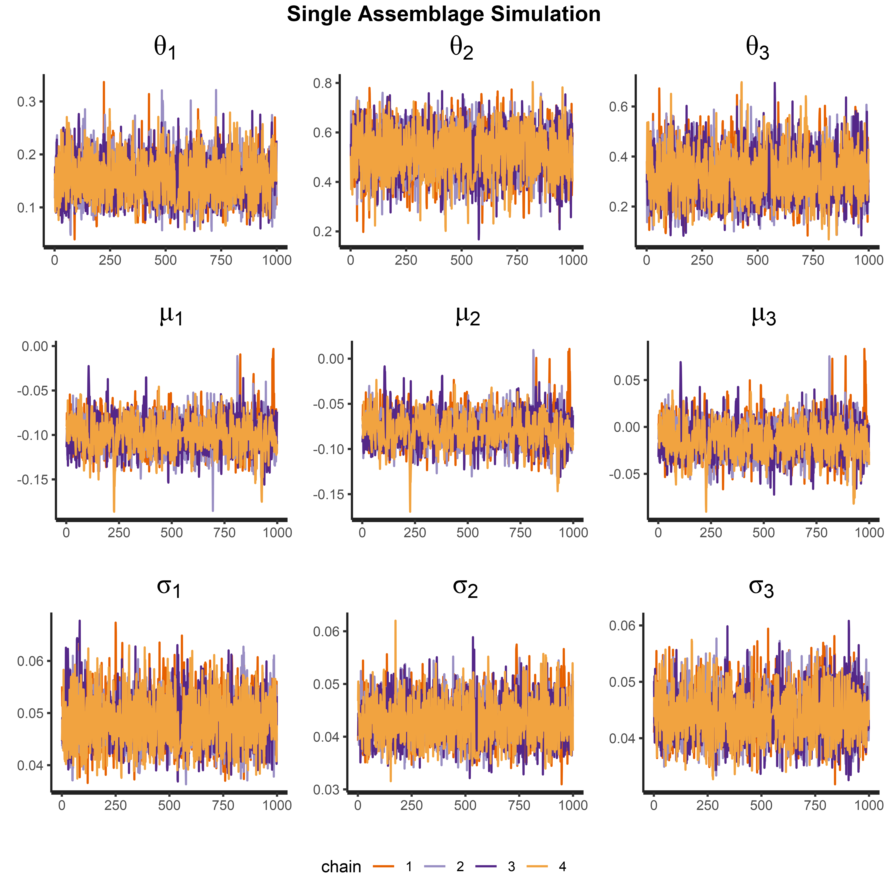
```

```{r figure_s2 (multisite_simulation_trace), echo = FALSE, message = FALSE, warning = FALSE, fig.align = "center", out.width = "\\textwidth", fig.cap = "Traceplots of Model Parameters (Multisite Simulation)"}
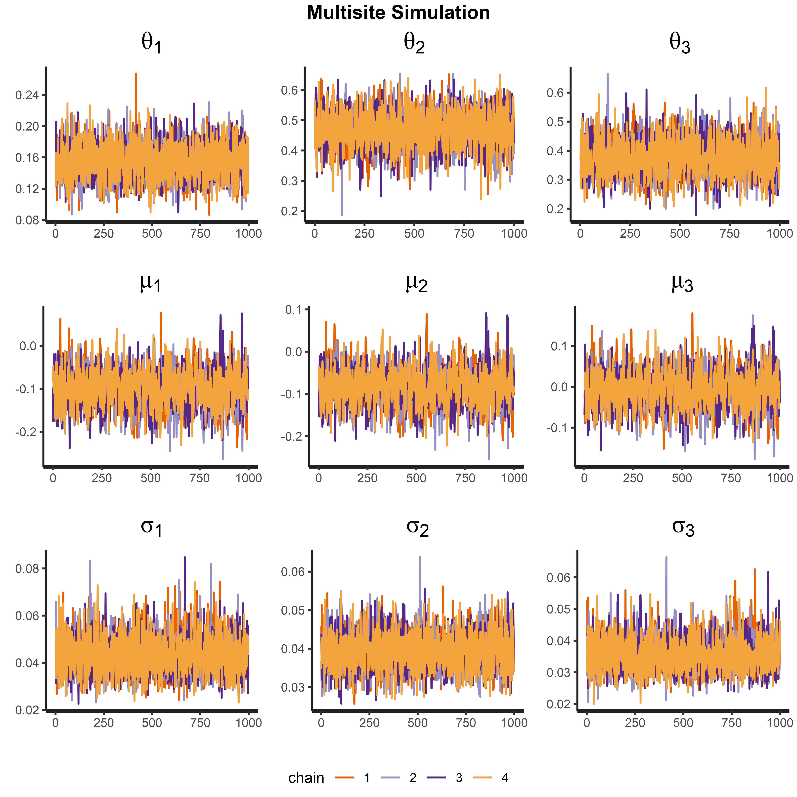
```

```{r figure_s3 (pinarbasi_trace), echo = FALSE, message = FALSE, warning = FALSE, fig.align = "center", out.width = "\\textwidth", fig.cap = "Traceplots of Model Parameters (Pinarbaşı B Sheep)"}
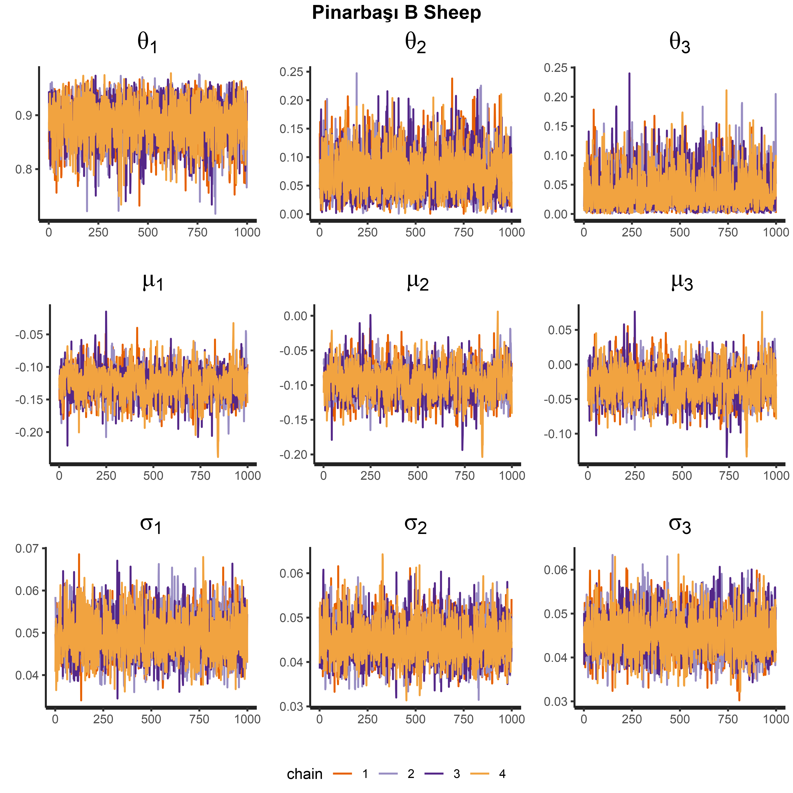
```

```{r figure_s4 (nw_anatolian_trace), echo = FALSE, message = FALSE, warning = FALSE, fig.align = "center", out.width = "\\textwidth", fig.cap = "Traceplots of Model Parameters (Northwest Anatolian Cattle)"}
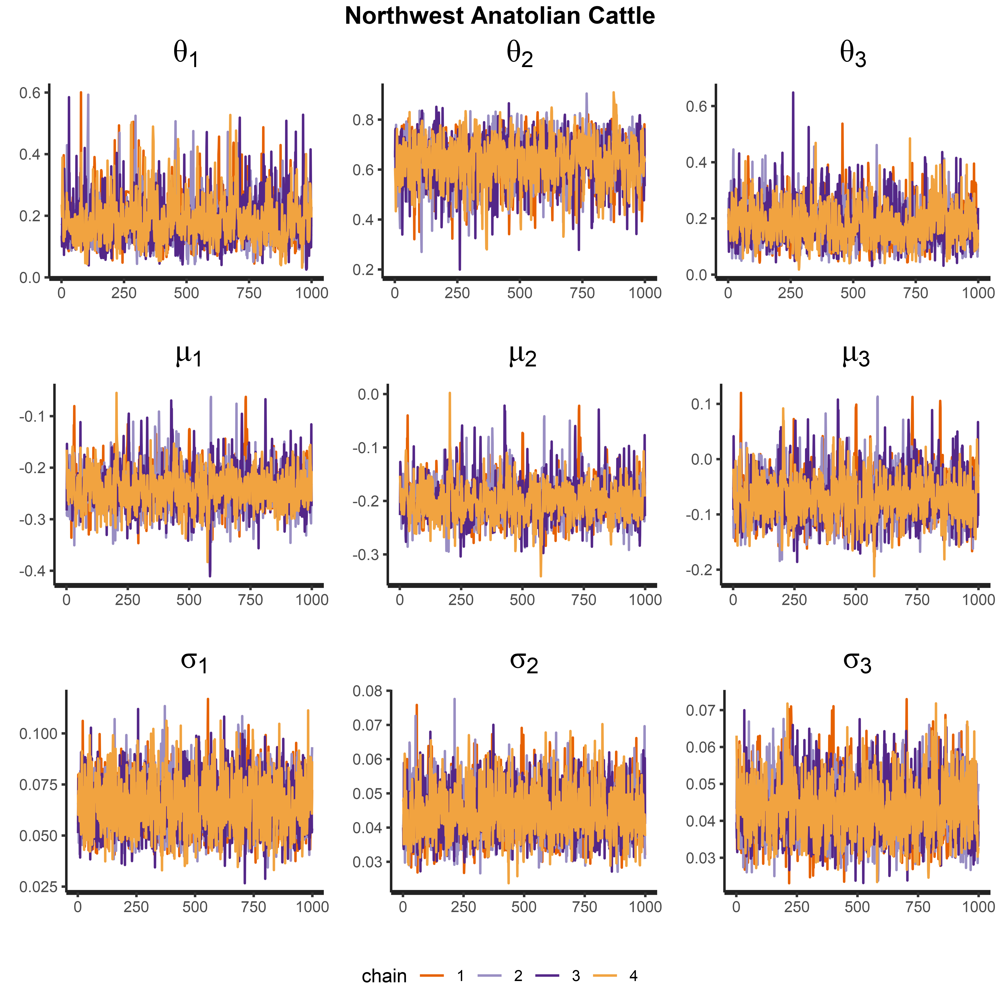
```

\newpage

## Appendix 4 (Supplemental Figures 5-7)

### *Prior-Posterior Comparisons for Multisite, Pinarbaşı B, and NW Anatolian Model Hyper-Parameters*

```{r making figure S5 (multisite prior-posterior comparison), include = FALSE, eval = TRUE}
#Figure S5: prior and posterior comparison of multisite simulation hyper-parameters
#Collect the prior and posterior estimates
multisite_p_immature_prior_samples <- boot::inv.logit(rnorm(4000, -0.5, 2.5) + log(0.5))
multisite_p_immature_posterior_samples <- multisite_post$p_immature
multisite_p_immature_priorposterior_data <- data.table(quantity = rep(c("Prior", "Posterior"), each = 4000), value = c(multisite_p_immature_prior_samples, multisite_p_immature_posterior_samples))
#
multisite_sex_ratio_prior_samples <- boot::inv.logit(rnorm(4000, 0, 2.5))
multisite_sex_ratio_posterior_samples <- multisite_post$theta_female
multisite_sex_ratio_priorposterior_data <- data.table(quantity = rep(c("Prior", "Posterior"), each = 4000), value = c(multisite_sex_ratio_prior_samples, multisite_sex_ratio_posterior_samples))
#
multisite_mu_female_prior_samples <- rnorm(4000, 0, 0.2)
multisite_mu_female_posterior_samples <- multisite_post$grand_mu_female
multisite_mu_female_priorposterior_data <- data.table(quantity = rep(c("Prior", "Posterior"), each = 4000), value = c(multisite_mu_female_prior_samples, multisite_mu_female_posterior_samples))
#
multisite_delta_immature_prior_samples <- exp(rnorm(4000, -3.5, 0.5))
multisite_delta_immature_posterior_samples <- multisite_post$grand_mu_female - multisite_post$grand_mu_immature
multisite_delta_immature_priorposterior_data <- data.table(quantity = rep(c("Prior", "Posterior"), each = 4000), value = c(multisite_delta_immature_prior_samples, multisite_delta_immature_posterior_samples))
#
multisite_delta_male_prior_samples <- exp(rnorm(4000, -2.7, 0.5))
multisite_delta_male_posterior_samples <- multisite_post$grand_mu_male - multisite_post$grand_mu_female
multisite_delta_male_priorposterior_data <- data.table(quantity = rep(c("Prior", "Posterior"), each = 4000), value = c(multisite_delta_male_prior_samples, multisite_delta_male_posterior_samples))
#
multisite_sigma_immature_prior_samples <- exp(rnorm(4000, -3.05, 0.25))
multisite_sigma_immature_posterior_samples <- multisite_post$grand_sigma_immature
multisite_sigma_immature_priorposterior_data <- data.table(quantity = rep(c("Prior", "Posterior"), each = 4000), value = c(multisite_sigma_immature_prior_samples, multisite_sigma_immature_posterior_samples))
#
multisite_sigma_female_prior_samples <- exp(rnorm(4000, -3.1, 0.2))
multisite_sigma_female_posterior_samples <- multisite_post$grand_sigma_female
multisite_sigma_female_priorposterior_data <- data.table(quantity = rep(c("Prior", "Posterior"), each = 4000), value = c(multisite_sigma_female_prior_samples, multisite_sigma_female_posterior_samples))
#
multisite_sigma_male_prior_samples <- exp(rnorm(4000, -3.1, 0.2))
multisite_sigma_male_posterior_samples <- multisite_post$grand_sigma_male
multisite_sigma_male_priorposterior_data <- data.table(quantity = rep(c("Prior", "Posterior"), each = 4000), value = c(multisite_sigma_male_prior_samples, multisite_sigma_male_posterior_samples))

#make the plots
multisite_p_immature_plot <-
  ggplot(multisite_p_immature_priorposterior_data) + aes(x = value, y = quantity) +
  stat_slab(normalize = "groups", aes(fill = quantity, fill_ramp = stat(cut_cdf_qi(cdf, .width = c(1, 0.95, 0.80), labels = scales::percent_format())))) +
  stat_pointinterval(.width = c(0.8, 0.95), aes(color = quantity), position = position_dodge(width = 0.2, preserve = "single")) +
  scale_fill_ramp_discrete(name = "Interval", range = c(0.7, 0.2), na.translate = F) +
  scale_color_manual(name = "", values = c("red", "black"), na.translate = F) +
  scale_fill_manual(name = "", values = c("red", "black"), na.translate = F) +
  scale_y_discrete(limits = c("Prior", "Posterior")) +
  labs(subtitle = expression(paste("Proportion Immature, ", pi[1])), x = "Proportion", y = "") +
  theme_classic() + theme(plot.title = element_text(size = 14), legend.text = element_text(size = 10), legend.position = "bottom", legend.justification = c("center"), legend.box.just = "right", legend.margin = margin(6, 6, 6, 6), axis.text.x = element_text(size = 10), axis.title = element_text(size = 14), axis.text.y = element_blank(), axis.ticks.y = element_blank())
#
multisite_sex_ratio_plot <-
  ggplot(multisite_sex_ratio_priorposterior_data) + aes(x = value, y = quantity) +
  stat_slab(normalize = "groups", aes(fill = quantity, fill_ramp = stat(cut_cdf_qi(cdf, .width = c(1, 0.95, 0.80), labels = scales::percent_format())))) +
  stat_pointinterval(.width = c(0.8, 0.95), aes(color = quantity), position = position_dodge(width = 0.2, preserve = "single")) +
  scale_fill_ramp_discrete(name = "Interval", range = c(0.7, 0.2), na.translate = F) +
  scale_color_manual(name = "", values = c("red", "black"), na.translate = F) +
  scale_fill_manual(name = "", values = c("red", "black"), na.translate = F) +
  scale_y_discrete(limits = c("Prior", "Posterior")) +
  labs(subtitle = expression(paste("Adult Sex Ratio, ", frac(pi[2], pi[2] + pi[3]))), x = "Proportion", y = "") +
  theme_classic() + theme(plot.title = element_text(size = 14), legend.text = element_text(size = 10), legend.position = "bottom", legend.justification = c("center"), legend.box.just = "right", legend.margin = margin(6, 6, 6, 6), axis.text.x = element_text(size = 10), axis.title = element_text(size = 14), axis.text.y = element_blank(), axis.ticks.y = element_blank())
#
multisite_mu_female_plot <-
  ggplot(multisite_mu_female_priorposterior_data) + aes(x = value, y = quantity) +
  stat_slab(normalize = "groups", aes(fill = quantity, fill_ramp = stat(cut_cdf_qi(cdf, .width = c(1, 0.95, 0.80), labels = scales::percent_format())))) +
  stat_pointinterval(.width = c(0.8, 0.95), aes(color = quantity), position = position_dodge(width = 0.2, preserve = "single")) +
  scale_fill_ramp_discrete(name = "Interval", range = c(0.7, 0.2), na.translate = F) +
  scale_color_manual(name = "", values = c("red", "black"), na.translate = F) +
  scale_fill_manual(name = "", values = c("red", "black"), na.translate = F) +
  scale_y_discrete(limits = c("Prior", "Posterior")) +
  labs(subtitle = expression(paste("Average Female LSI, ", mu[2])), x = "LSI Value", y = "") +
  theme_classic() + theme(plot.title = element_text(size = 14), legend.text = element_text(size = 10), legend.position = "bottom", legend.justification = c("center"), legend.box.just = "right", legend.margin = margin(6, 6, 6, 6), axis.text.x = element_text(size = 10), axis.title = element_text(size = 14), axis.text.y = element_blank(), axis.ticks.y = element_blank())
#
multisite_delta_immature_plot <-
  ggplot(multisite_delta_immature_priorposterior_data) + aes(x = value, y = quantity) +
  stat_slab(normalize = "groups", aes(fill = quantity, fill_ramp = stat(cut_cdf_qi(cdf, .width = c(1, 0.95, 0.80), labels = scales::percent_format())))) +
  stat_pointinterval(.width = c(0.8, 0.95), aes(color = quantity), position = position_dodge(width = 0.2, preserve = "single")) +
  scale_fill_ramp_discrete(name = "Interval", range = c(0.7, 0.2), na.translate = F) +
  scale_color_manual(name = "", values = c("red", "black"), na.translate = F) +
  scale_fill_manual(name = "", values = c("red", "black"), na.translate = F) +
  scale_y_discrete(limits = c("Prior", "Posterior")) +
  labs(subtitle = expression(paste("Immature Size Penalty, ", delta[1])), x = "LSI Value", y = "") +
  theme_classic() + theme(plot.title = element_text(size = 14), legend.text = element_text(size = 10), legend.position = "bottom", legend.justification = c("center"), legend.box.just = "right", legend.margin = margin(6, 6, 6, 6), axis.text.x = element_text(size = 10), axis.title = element_text(size = 14), axis.text.y = element_blank(), axis.ticks.y = element_blank())
#
multisite_delta_male_plot <-
  ggplot(multisite_delta_male_priorposterior_data) + aes(x = value, y = quantity) +
  stat_slab(normalize = "groups", aes(fill = quantity, fill_ramp = stat(cut_cdf_qi(cdf, .width = c(1, 0.95, 0.80), labels = scales::percent_format())))) +
  stat_pointinterval(.width = c(0.8, 0.95), aes(color = quantity), position = position_dodge(width = 0.2, preserve = "single")) +
  scale_fill_ramp_discrete(name = "Interval", range = c(0.7, 0.2), na.translate = F) +
  scale_color_manual(name = "", values = c("red", "black"), na.translate = F) +
  scale_fill_manual(name = "", values = c("red", "black"), na.translate = F) +
  scale_y_discrete(limits = c("Prior", "Posterior")) +
  labs(subtitle = expression(paste("Index of Sexual Dimorphism, ", delta[2])), x = "LSI Value", y = "") +
  theme_classic() + theme(plot.title = element_text(size = 14), legend.text = element_text(size = 10), legend.position = "bottom", legend.justification = c("center"), legend.box.just = "right", legend.margin = margin(6, 6, 6, 6), axis.text.x = element_text(size = 10), axis.title = element_text(size = 14), axis.text.y = element_blank(), axis.ticks.y = element_blank())
#
multisite_sigma_immature_plot <-
  ggplot(multisite_sigma_immature_priorposterior_data) + aes(x = value, y = quantity) +
  stat_slab(normalize = "groups", aes(fill = quantity, fill_ramp = stat(cut_cdf_qi(cdf, .width = c(1, 0.95, 0.80), labels = scales::percent_format())))) +
  stat_pointinterval(.width = c(0.8, 0.95), aes(color = quantity), position = position_dodge(width = 0.2, preserve = "single")) +
  scale_fill_ramp_discrete(name = "Interval", range = c(0.7, 0.2), na.translate = F) +
  scale_color_manual(name = "", values = c("red", "black"), na.translate = F) +
  scale_fill_manual(name = "", values = c("red", "black"), na.translate = F) +
  scale_y_discrete(limits = c("Prior", "Posterior")) +
  labs(subtitle = expression(paste("Immature Variability, ", sigma[1])), x = "LSI Value", y = "") +
  theme_classic() + theme(plot.title = element_text(size = 14), legend.text = element_text(size = 10), legend.position = "bottom", legend.justification = c("center"), legend.box.just = "right", legend.margin = margin(6, 6, 6, 6), axis.text.x = element_text(size = 10), axis.title = element_text(size = 14), axis.text.y = element_blank(), axis.ticks.y = element_blank())
#
multisite_sigma_female_plot <-
  ggplot(multisite_sigma_female_priorposterior_data) + aes(x = value, y = quantity) +
  stat_slab(normalize = "groups", aes(fill = quantity, fill_ramp = stat(cut_cdf_qi(cdf, .width = c(1, 0.95, 0.80), labels = scales::percent_format())))) +
  stat_pointinterval(.width = c(0.8, 0.95), aes(color = quantity), position = position_dodge(width = 0.2, preserve = "single")) +
  scale_fill_ramp_discrete(name = "Interval", range = c(0.7, 0.2), na.translate = F) +
  scale_color_manual(name = "", values = c("red", "black"), na.translate = F) +
  scale_fill_manual(name = "", values = c("red", "black"), na.translate = F) +
  scale_y_discrete(limits = c("Prior", "Posterior")) +
  labs(subtitle = expression(paste("Female Variability, ", sigma[2])), x = "LSI Value", y = "") +
  theme_classic() + theme(plot.title = element_text(size = 14), legend.text = element_text(size = 10), legend.position = "bottom", legend.justification = c("center"), legend.box.just = "right", legend.margin = margin(6, 6, 6, 6), axis.text.x = element_text(size = 10), axis.title = element_text(size = 14), axis.text.y = element_blank(), axis.ticks.y = element_blank())
#
multisite_sigma_male_plot <-
  ggplot(multisite_sigma_male_priorposterior_data) + aes(x = value, y = quantity) +
  stat_slab(normalize = "groups", aes(fill = quantity, fill_ramp = stat(cut_cdf_qi(cdf, .width = c(1, 0.95, 0.80), labels = scales::percent_format())))) +
  stat_pointinterval(.width = c(0.8, 0.95), aes(color = quantity), position = position_dodge(width = 0.2, preserve = "single")) +
  scale_fill_ramp_discrete(name = "Interval", range = c(0.7, 0.2), na.translate = F) +
  scale_color_manual(name = "", values = c("red", "black"), na.translate = F) +
  scale_fill_manual(name = "", values = c("red", "black"), na.translate = F) +
  scale_y_discrete(limits = c("Prior", "Posterior")) +
  labs(subtitle = expression(paste("Male Variability, ", sigma[3])), x = "LSI Value", y = "") +
  theme_classic() + theme(plot.title = element_text(size = 14), legend.text = element_text(size = 10), legend.position = "bottom", legend.justification = c("center"), legend.box.just = "right", legend.margin = margin(6, 6, 6, 6), axis.text.x = element_text(size = 10), axis.title = element_text(size = 14), axis.text.y = element_blank(), axis.ticks.y = element_blank())
#
figure_multisite_prior_posterior <- ggarrange(
  multisite_p_immature_plot, multisite_sex_ratio_plot,
  multisite_mu_female_plot, multisite_delta_immature_plot,
  multisite_delta_male_plot, multisite_sigma_immature_plot,
  multisite_sigma_female_plot, multisite_sigma_male_plot,
  ncol = 2, nrow = 4,
  common.legend = T, legend = "bottom")
#
figure_s5 <- annotate_figure(figure_multisite_prior_posterior, top = text_grob("Multisite Simulation", face = "bold", size = 14))
#
Cairo(width = 8, height = 10, units = "in", file = "./Output/Figures/figure_s5.png", type = "png", dpi = 600)
figure_s5
dev.off()
```

```{r making figure S6 (Pinarbasi prior-posterior comparison), include = FALSE, eval = TRUE}
#Figure 5: prior and posterior comparison of Pinarbasi Sheep model hyper-parameters
#Collect the prior and posterior estimates
pinarbasi_p_immature_prior_samples <- boot::inv.logit(rnorm(4000, -0.5, 1.5) + log(0.5))
pinarbasi_p_immature_posterior_samples <- pinarbasi_post$p_immature
pinarbasi_p_immature_priorposterior_data <- data.table(quantity = rep(c("Prior", "Posterior"), each = 4000), value = c(pinarbasi_p_immature_prior_samples, pinarbasi_p_immature_posterior_samples))
#
pinarbasi_sex_ratio_prior_samples <- boot::inv.logit(rnorm(4000, 0, 1.5))
pinarbasi_sex_ratio_posterior_samples <- pinarbasi_post$theta_female
pinarbasi_sex_ratio_priorposterior_data <- data.table(quantity = rep(c("Prior", "Posterior"), each = 4000), value = c(pinarbasi_sex_ratio_prior_samples, pinarbasi_sex_ratio_posterior_samples))
#
pinarbasi_mu_female_prior_samples <- rnorm(4000, 0, 0.1)
pinarbasi_mu_female_posterior_samples <- pinarbasi_post$grand_mu_female
pinarbasi_mu_female_priorposterior_data <- data.table(quantity = rep(c("Prior", "Posterior"), each = 4000), value = c(pinarbasi_mu_female_prior_samples, pinarbasi_mu_female_posterior_samples))
#
pinarbasi_delta_immature_prior_samples <- exp(rnorm(4000, -3.5, 0.4))
pinarbasi_delta_immature_posterior_samples <- pinarbasi_post$grand_mu_female - pinarbasi_post$grand_mu_immature
pinarbasi_delta_immature_priorposterior_data <- data.table(quantity = rep(c("Prior", "Posterior"), each = 4000), value = c(pinarbasi_delta_immature_prior_samples, pinarbasi_delta_immature_posterior_samples))
#
pinarbasi_delta_male_prior_samples <- exp(rnorm(4000, -2.7, 0.1))
pinarbasi_delta_male_posterior_samples <- pinarbasi_post$grand_mu_male - pinarbasi_post$grand_mu_female
pinarbasi_delta_male_priorposterior_data <- data.table(quantity = rep(c("Prior", "Posterior"), each = 4000), value = c(pinarbasi_delta_male_prior_samples, pinarbasi_delta_male_posterior_samples))
#
pinarbasi_sigma_immature_prior_samples <- exp(rnorm(4000, -3.05, 0.1))
pinarbasi_sigma_immature_posterior_samples <- pinarbasi_post$grand_sigma_immature
pinarbasi_sigma_immature_priorposterior_data <- data.table(quantity = rep(c("Prior", "Posterior"), each = 4000), value = c(pinarbasi_sigma_immature_prior_samples, pinarbasi_sigma_immature_posterior_samples))
#
pinarbasi_sigma_female_prior_samples <- exp(rnorm(4000, -3.1, 0.1))
pinarbasi_sigma_female_posterior_samples <- pinarbasi_post$grand_sigma_female
pinarbasi_sigma_female_priorposterior_data <- data.table(quantity = rep(c("Prior", "Posterior"), each = 4000), value = c(pinarbasi_sigma_female_prior_samples, pinarbasi_sigma_female_posterior_samples))
#
pinarbasi_sigma_male_prior_samples <- exp(rnorm(4000, -3.1, 0.1))
pinarbasi_sigma_male_posterior_samples <- pinarbasi_post$grand_sigma_male
pinarbasi_sigma_male_priorposterior_data <- data.table(quantity = rep(c("Prior", "Posterior"), each = 4000), value = c(pinarbasi_sigma_male_prior_samples, pinarbasi_sigma_male_posterior_samples))

#make the plots
pinarbasi_p_immature_plot <-
  ggplot(pinarbasi_p_immature_priorposterior_data) + aes(x = value, y = quantity) +
  stat_slab(normalize = "groups", aes(fill = quantity, fill_ramp = stat(cut_cdf_qi(cdf, .width = c(1, 0.95, 0.80), labels = scales::percent_format())))) +
  stat_pointinterval(.width = c(0.8, 0.95), aes(color = quantity), position = position_dodge(width = 0.2, preserve = "single")) +
  scale_fill_ramp_discrete(name = "Interval", range = c(0.7, 0.2), na.translate = F) +
  scale_color_manual(name = "", values = c("red", "black"), na.translate = F) +
  scale_fill_manual(name = "", values = c("red", "black"), na.translate = F) +
  scale_y_discrete(limits = c("Prior", "Posterior")) +
  labs(subtitle = expression(paste("Proportion Immature, ", pi[1])), x = "Proportion", y = "") +
  theme_classic() + theme(plot.title = element_text(size = 14), legend.text = element_text(size = 10), legend.position = "bottom", legend.justification = c("center"), legend.box.just = "right", legend.margin = margin(6, 6, 6, 6), axis.text.x = element_text(size = 10), axis.title = element_text(size = 14), axis.text.y = element_blank(), axis.ticks.y = element_blank())
#
pinarbasi_sex_ratio_plot <-
  ggplot(pinarbasi_sex_ratio_priorposterior_data) + aes(x = value, y = quantity) +
  stat_slab(normalize = "groups", aes(fill = quantity, fill_ramp = stat(cut_cdf_qi(cdf, .width = c(1, 0.95, 0.80), labels = scales::percent_format())))) +
  stat_pointinterval(.width = c(0.8, 0.95), aes(color = quantity), position = position_dodge(width = 0.2, preserve = "single")) +
  scale_fill_ramp_discrete(name = "Interval", range = c(0.7, 0.2), na.translate = F) +
  scale_color_manual(name = "", values = c("red", "black"), na.translate = F) +
  scale_fill_manual(name = "", values = c("red", "black"), na.translate = F) +
  scale_y_discrete(limits = c("Prior", "Posterior")) +
  labs(subtitle = expression(paste("Adult Sex Ratio, ", frac(pi[2], pi[2] + pi[3]))), x = "Proportion", y = "") +
  theme_classic() + theme(plot.title = element_text(size = 14), legend.text = element_text(size = 10), legend.position = "bottom", legend.justification = c("center"), legend.box.just = "right", legend.margin = margin(6, 6, 6, 6), axis.text.x = element_text(size = 10), axis.title = element_text(size = 14), axis.text.y = element_blank(), axis.ticks.y = element_blank())
#
pinarbasi_mu_female_plot <-
  ggplot(pinarbasi_mu_female_priorposterior_data) + aes(x = value, y = quantity) +
  stat_slab(normalize = "groups", aes(fill = quantity, fill_ramp = stat(cut_cdf_qi(cdf, .width = c(1, 0.95, 0.80), labels = scales::percent_format())))) +
  stat_pointinterval(.width = c(0.8, 0.95), aes(color = quantity), position = position_dodge(width = 0.2, preserve = "single")) +
  scale_fill_ramp_discrete(name = "Interval", range = c(0.7, 0.2), na.translate = F) +
  scale_color_manual(name = "", values = c("red", "black"), na.translate = F) +
  scale_fill_manual(name = "", values = c("red", "black"), na.translate = F) +
  scale_y_discrete(limits = c("Prior", "Posterior")) +
  labs(subtitle = expression(paste("Average Female LSI, ", mu[2])), x = "LSI Value", y = "") +
  theme_classic() + theme(plot.title = element_text(size = 14), legend.text = element_text(size = 10), legend.position = "bottom", legend.justification = c("center"), legend.box.just = "right", legend.margin = margin(6, 6, 6, 6), axis.text.x = element_text(size = 10), axis.title = element_text(size = 14), axis.text.y = element_blank(), axis.ticks.y = element_blank())
#
pinarbasi_delta_immature_plot <-
  ggplot(pinarbasi_delta_immature_priorposterior_data) + aes(x = value, y = quantity) +
  stat_slab(normalize = "groups", aes(fill = quantity, fill_ramp = stat(cut_cdf_qi(cdf, .width = c(1, 0.95, 0.80), labels = scales::percent_format())))) +
  stat_pointinterval(.width = c(0.8, 0.95), aes(color = quantity), position = position_dodge(width = 0.2, preserve = "single")) +
  scale_fill_ramp_discrete(name = "Interval", range = c(0.7, 0.2), na.translate = F) +
  scale_color_manual(name = "", values = c("red", "black"), na.translate = F) +
  scale_fill_manual(name = "", values = c("red", "black"), na.translate = F) +
  scale_y_discrete(limits = c("Prior", "Posterior")) +
  labs(subtitle = expression(paste("Immature Size Penalty, ", delta[1])), x = "LSI Value", y = "") +
  theme_classic() + theme(plot.title = element_text(size = 14), legend.text = element_text(size = 10), legend.position = "bottom", legend.justification = c("center"), legend.box.just = "right", legend.margin = margin(6, 6, 6, 6), axis.text.x = element_text(size = 10), axis.title = element_text(size = 14), axis.text.y = element_blank(), axis.ticks.y = element_blank())
#
pinarbasi_delta_male_plot <-
  ggplot(pinarbasi_delta_male_priorposterior_data) + aes(x = value, y = quantity) +
  stat_slab(normalize = "groups", aes(fill = quantity, fill_ramp = stat(cut_cdf_qi(cdf, .width = c(1, 0.95, 0.80), labels = scales::percent_format())))) +
  stat_pointinterval(.width = c(0.8, 0.95), aes(color = quantity), position = position_dodge(width = 0.2, preserve = "single")) +
  scale_fill_ramp_discrete(name = "Interval", range = c(0.7, 0.2), na.translate = F) +
  scale_color_manual(name = "", values = c("red", "black"), na.translate = F) +
  scale_fill_manual(name = "", values = c("red", "black"), na.translate = F) +
  scale_y_discrete(limits = c("Prior", "Posterior")) +
  labs(subtitle = expression(paste("Index of Sexual Dimorphism, ", delta[2])), x = "LSI Value", y = "") +
  theme_classic() + theme(plot.title = element_text(size = 14), legend.text = element_text(size = 10), legend.position = "bottom", legend.justification = c("center"), legend.box.just = "right", legend.margin = margin(6, 6, 6, 6), axis.text.x = element_text(size = 10), axis.title = element_text(size = 14), axis.text.y = element_blank(), axis.ticks.y = element_blank())
#
pinarbasi_sigma_immature_plot <-
  ggplot(pinarbasi_sigma_immature_priorposterior_data) + aes(x = value, y = quantity) +
  stat_slab(normalize = "groups", aes(fill = quantity, fill_ramp = stat(cut_cdf_qi(cdf, .width = c(1, 0.95, 0.80), labels = scales::percent_format())))) +
  stat_pointinterval(.width = c(0.8, 0.95), aes(color = quantity), position = position_dodge(width = 0.2, preserve = "single")) +
  scale_fill_ramp_discrete(name = "Interval", range = c(0.7, 0.2), na.translate = F) +
  scale_color_manual(name = "", values = c("red", "black"), na.translate = F) +
  scale_fill_manual(name = "", values = c("red", "black"), na.translate = F) +
  scale_y_discrete(limits = c("Prior", "Posterior")) +
  labs(subtitle = expression(paste("Immature Variability, ", sigma[1])), x = "LSI Value", y = "") +
  theme_classic() + theme(plot.title = element_text(size = 14), legend.text = element_text(size = 10), legend.position = "bottom", legend.justification = c("center"), legend.box.just = "right", legend.margin = margin(6, 6, 6, 6), axis.text.x = element_text(size = 10), axis.title = element_text(size = 14), axis.text.y = element_blank(), axis.ticks.y = element_blank())
#
pinarbasi_sigma_female_plot <-
  ggplot(pinarbasi_sigma_female_priorposterior_data) + aes(x = value, y = quantity) +
  stat_slab(normalize = "groups", aes(fill = quantity, fill_ramp = stat(cut_cdf_qi(cdf, .width = c(1, 0.95, 0.80), labels = scales::percent_format())))) +
  stat_pointinterval(.width = c(0.8, 0.95), aes(color = quantity), position = position_dodge(width = 0.2, preserve = "single")) +
  scale_fill_ramp_discrete(name = "Interval", range = c(0.7, 0.2), na.translate = F) +
  scale_color_manual(name = "", values = c("red", "black"), na.translate = F) +
  scale_fill_manual(name = "", values = c("red", "black"), na.translate = F) +
  scale_y_discrete(limits = c("Prior", "Posterior")) +
  labs(subtitle = expression(paste("Female Variability, ", sigma[2])), x = "LSI Value", y = "") +
  theme_classic() + theme(plot.title = element_text(size = 14), legend.text = element_text(size = 10), legend.position = "bottom", legend.justification = c("center"), legend.box.just = "right", legend.margin = margin(6, 6, 6, 6), axis.text.x = element_text(size = 10), axis.title = element_text(size = 14), axis.text.y = element_blank(), axis.ticks.y = element_blank())
#
pinarbasi_sigma_male_plot <-
  ggplot(pinarbasi_sigma_male_priorposterior_data) + aes(x = value, y = quantity) +
  stat_slab(normalize = "groups", aes(fill = quantity, fill_ramp = stat(cut_cdf_qi(cdf, .width = c(1, 0.95, 0.80), labels = scales::percent_format())))) +
  stat_pointinterval(.width = c(0.8, 0.95), aes(color = quantity), position = position_dodge(width = 0.2, preserve = "single")) +
  scale_fill_ramp_discrete(name = "Interval", range = c(0.7, 0.2), na.translate = F) +
  scale_color_manual(name = "", values = c("red", "black"), na.translate = F) +
  scale_fill_manual(name = "", values = c("red", "black"), na.translate = F) +
  scale_y_discrete(limits = c("Prior", "Posterior")) +
  labs(subtitle = expression(paste("Male Variability, ", sigma[3])), x = "LSI Value", y = "") +
  theme_classic() + theme(plot.title = element_text(size = 14), legend.text = element_text(size = 10), legend.position = "bottom", legend.justification = c("center"), legend.box.just = "right", legend.margin = margin(6, 6, 6, 6), axis.text.x = element_text(size = 10), axis.title = element_text(size = 14), axis.text.y = element_blank(), axis.ticks.y = element_blank())
#
figure_pinarbasi_prior_posterior <- ggarrange(
  pinarbasi_p_immature_plot, pinarbasi_sex_ratio_plot,
  pinarbasi_mu_female_plot, pinarbasi_delta_immature_plot,
  pinarbasi_delta_male_plot, pinarbasi_sigma_immature_plot,
  pinarbasi_sigma_female_plot, pinarbasi_sigma_male_plot,
  ncol = 2, nrow = 4,
  common.legend = T, legend = "bottom")
#
figure_s6 <- annotate_figure(figure_pinarbasi_prior_posterior, top = text_grob("Pinarbaşı B Sheep", face = "bold", size = 14))
#
Cairo(width = 8, height = 10, units = "in", file = "./Output/Figures/figure_s6.png", type = "png", dpi = 600)
figure_s6
dev.off()
```

```{r making figure S7 (NW Anatolian prior-posterior comparison), include = FALSE, eval = TRUE}
#Figure S5: prior and posterior comparison of NW Anatolian cattle model hyper-parameters
#Collect the prior and posterior estimates
nw_anatolian_p_immature_prior_samples <- boot::inv.logit(rnorm(4000, -0.5, 2.5) + log(0.5))
nw_anatolian_p_immature_posterior_samples <- nw_anatolian_post$p_immature
nw_anatolian_p_immature_priorposterior_data <- data.table(quantity = rep(c("Prior", "Posterior"), each = 4000), value = c(nw_anatolian_p_immature_prior_samples, nw_anatolian_p_immature_posterior_samples))
#
nw_anatolian_sex_ratio_prior_samples <- boot::inv.logit(rnorm(4000, 0, 2.5))
nw_anatolian_sex_ratio_posterior_samples <- nw_anatolian_post$theta_female
nw_anatolian_sex_ratio_priorposterior_data <- data.table(quantity = rep(c("Prior", "Posterior"), each = 4000), value = c(nw_anatolian_sex_ratio_prior_samples, nw_anatolian_sex_ratio_posterior_samples))
#
nw_anatolian_mu_female_prior_samples <- rnorm(4000, -0.1, 0.1)
nw_anatolian_mu_female_posterior_samples <- nw_anatolian_post$grand_mu_female
nw_anatolian_mu_female_priorposterior_data <- data.table(quantity = rep(c("Prior", "Posterior"), each = 4000), value = c(nw_anatolian_mu_female_prior_samples, nw_anatolian_mu_female_posterior_samples))
#
nw_anatolian_delta_immature_prior_samples <- exp(rnorm(4000, -3.5, 0.5))
nw_anatolian_delta_immature_posterior_samples <- nw_anatolian_post$grand_mu_female - nw_anatolian_post$grand_mu_immature
nw_anatolian_delta_immature_priorposterior_data <- data.table(quantity = rep(c("Prior", "Posterior"), each = 4000), value = c(nw_anatolian_delta_immature_prior_samples, nw_anatolian_delta_immature_posterior_samples))
#
nw_anatolian_delta_male_prior_samples <- exp(rnorm(4000, -2, 0.5))
nw_anatolian_delta_male_posterior_samples <- nw_anatolian_post$grand_mu_male - nw_anatolian_post$grand_mu_female
nw_anatolian_delta_male_priorposterior_data <- data.table(quantity = rep(c("Prior", "Posterior"), each = 4000), value = c(nw_anatolian_delta_male_prior_samples, nw_anatolian_delta_male_posterior_samples))
#
nw_anatolian_sigma_immature_prior_samples <- exp(rnorm(4000, -3.05, 0.25))
nw_anatolian_sigma_immature_posterior_samples <- nw_anatolian_post$grand_sigma_immature
nw_anatolian_sigma_immature_priorposterior_data <- data.table(quantity = rep(c("Prior", "Posterior"), each = 4000), value = c(nw_anatolian_sigma_immature_prior_samples, nw_anatolian_sigma_immature_posterior_samples))
#
nw_anatolian_sigma_female_prior_samples <- exp(rnorm(4000, -3.1, 0.2))
nw_anatolian_sigma_female_posterior_samples <- nw_anatolian_post$grand_sigma_female
nw_anatolian_sigma_female_priorposterior_data <- data.table(quantity = rep(c("Prior", "Posterior"), each = 4000), value = c(nw_anatolian_sigma_female_prior_samples, nw_anatolian_sigma_female_posterior_samples))
#
nw_anatolian_sigma_male_prior_samples <- exp(rnorm(4000, -3.1, 0.2))
nw_anatolian_sigma_male_posterior_samples <- nw_anatolian_post$grand_sigma_male
nw_anatolian_sigma_male_priorposterior_data <- data.table(quantity = rep(c("Prior", "Posterior"), each = 4000), value = c(nw_anatolian_sigma_male_prior_samples, nw_anatolian_sigma_male_posterior_samples))

#make the plots
nw_anatolian_p_immature_plot <-
  ggplot(nw_anatolian_p_immature_priorposterior_data) + aes(x = value, y = quantity) +
  stat_slab(normalize = "groups", aes(fill = quantity, fill_ramp = stat(cut_cdf_qi(cdf, .width = c(1, 0.95, 0.80), labels = scales::percent_format())))) +
  stat_pointinterval(.width = c(0.8, 0.95), aes(color = quantity), position = position_dodge(width = 0.2, preserve = "single")) +
  scale_fill_ramp_discrete(name = "Interval", range = c(0.7, 0.2), na.translate = F) +
  scale_color_manual(name = "", values = c("red", "black"), na.translate = F) +
  scale_fill_manual(name = "", values = c("red", "black"), na.translate = F) +
  scale_y_discrete(limits = c("Prior", "Posterior")) +
  labs(subtitle = expression(paste("Proportion Immature, ", pi[1])), x = "Proportion", y = "") +
  theme_classic() + theme(plot.title = element_text(size = 14), legend.text = element_text(size = 10), legend.position = "bottom", legend.justification = c("center"), legend.box.just = "right", legend.margin = margin(6, 6, 6, 6), axis.text.x = element_text(size = 10), axis.title = element_text(size = 14), axis.text.y = element_blank(), axis.ticks.y = element_blank())
#
nw_anatolian_sex_ratio_plot <-
  ggplot(nw_anatolian_sex_ratio_priorposterior_data) + aes(x = value, y = quantity) +
  stat_slab(normalize = "groups", aes(fill = quantity, fill_ramp = stat(cut_cdf_qi(cdf, .width = c(1, 0.95, 0.80), labels = scales::percent_format())))) +
  stat_pointinterval(.width = c(0.8, 0.95), aes(color = quantity), position = position_dodge(width = 0.2, preserve = "single")) +
  scale_fill_ramp_discrete(name = "Interval", range = c(0.7, 0.2), na.translate = F) +
  scale_color_manual(name = "", values = c("red", "black"), na.translate = F) +
  scale_fill_manual(name = "", values = c("red", "black"), na.translate = F) +
  scale_y_discrete(limits = c("Prior", "Posterior")) +
  labs(subtitle = expression(paste("Adult Sex Ratio, ", frac(pi[2], pi[2] + pi[3]))), x = "Proportion", y = "") +
  theme_classic() + theme(plot.title = element_text(size = 14), legend.text = element_text(size = 10), legend.position = "bottom", legend.justification = c("center"), legend.box.just = "right", legend.margin = margin(6, 6, 6, 6), axis.text.x = element_text(size = 10), axis.title = element_text(size = 14), axis.text.y = element_blank(), axis.ticks.y = element_blank())
#
nw_anatolian_mu_female_plot <-
  ggplot(nw_anatolian_mu_female_priorposterior_data) + aes(x = value, y = quantity) +
  stat_slab(normalize = "groups", aes(fill = quantity, fill_ramp = stat(cut_cdf_qi(cdf, .width = c(1, 0.95, 0.80), labels = scales::percent_format())))) +
  stat_pointinterval(.width = c(0.8, 0.95), aes(color = quantity), position = position_dodge(width = 0.2, preserve = "single")) +
  scale_fill_ramp_discrete(name = "Interval", range = c(0.7, 0.2), na.translate = F) +
  scale_color_manual(name = "", values = c("red", "black"), na.translate = F) +
  scale_fill_manual(name = "", values = c("red", "black"), na.translate = F) +
  scale_y_discrete(limits = c("Prior", "Posterior")) +
  labs(subtitle = expression(paste("Average Female LSI, ", mu[2])), x = "LSI Value", y = "") +
  theme_classic() + theme(plot.title = element_text(size = 14), legend.text = element_text(size = 10), legend.position = "bottom", legend.justification = c("center"), legend.box.just = "right", legend.margin = margin(6, 6, 6, 6), axis.text.x = element_text(size = 10), axis.title = element_text(size = 14), axis.text.y = element_blank(), axis.ticks.y = element_blank())
#
nw_anatolian_delta_immature_plot <-
  ggplot(nw_anatolian_delta_immature_priorposterior_data) + aes(x = value, y = quantity) +
  stat_slab(normalize = "groups", aes(fill = quantity, fill_ramp = stat(cut_cdf_qi(cdf, .width = c(1, 0.95, 0.80), labels = scales::percent_format())))) +
  stat_pointinterval(.width = c(0.8, 0.95), aes(color = quantity), position = position_dodge(width = 0.2, preserve = "single")) +
  scale_fill_ramp_discrete(name = "Interval", range = c(0.7, 0.2), na.translate = F) +
  scale_color_manual(name = "", values = c("red", "black"), na.translate = F) +
  scale_fill_manual(name = "", values = c("red", "black"), na.translate = F) +
  scale_y_discrete(limits = c("Prior", "Posterior")) +
  labs(subtitle = expression(paste("Immature Size Penalty, ", delta[1])), x = "LSI Value", y = "") +
  theme_classic() + theme(plot.title = element_text(size = 14), legend.text = element_text(size = 10), legend.position = "bottom", legend.justification = c("center"), legend.box.just = "right", legend.margin = margin(6, 6, 6, 6), axis.text.x = element_text(size = 10), axis.title = element_text(size = 14), axis.text.y = element_blank(), axis.ticks.y = element_blank())
#
nw_anatolian_delta_male_plot <-
  ggplot(nw_anatolian_delta_male_priorposterior_data) + aes(x = value, y = quantity) +
  stat_slab(normalize = "groups", aes(fill = quantity, fill_ramp = stat(cut_cdf_qi(cdf, .width = c(1, 0.95, 0.80), labels = scales::percent_format())))) +
  stat_pointinterval(.width = c(0.8, 0.95), aes(color = quantity), position = position_dodge(width = 0.2, preserve = "single")) +
  scale_fill_ramp_discrete(name = "Interval", range = c(0.7, 0.2), na.translate = F) +
  scale_color_manual(name = "", values = c("red", "black"), na.translate = F) +
  scale_fill_manual(name = "", values = c("red", "black"), na.translate = F) +
  scale_y_discrete(limits = c("Prior", "Posterior")) +
  labs(subtitle = expression(paste("Index of Sexual Dimorphism, ", delta[2])), x = "LSI Value", y = "") +
  theme_classic() + theme(plot.title = element_text(size = 14), legend.text = element_text(size = 10), legend.position = "bottom", legend.justification = c("center"), legend.box.just = "right", legend.margin = margin(6, 6, 6, 6), axis.text.x = element_text(size = 10), axis.title = element_text(size = 14), axis.text.y = element_blank(), axis.ticks.y = element_blank())
#
nw_anatolian_sigma_immature_plot <-
  ggplot(nw_anatolian_sigma_immature_priorposterior_data) + aes(x = value, y = quantity) +
  stat_slab(normalize = "groups", aes(fill = quantity, fill_ramp = stat(cut_cdf_qi(cdf, .width = c(1, 0.95, 0.80), labels = scales::percent_format())))) +
  stat_pointinterval(.width = c(0.8, 0.95), aes(color = quantity), position = position_dodge(width = 0.2, preserve = "single")) +
  scale_fill_ramp_discrete(name = "Interval", range = c(0.7, 0.2), na.translate = F) +
  scale_color_manual(name = "", values = c("red", "black"), na.translate = F) +
  scale_fill_manual(name = "", values = c("red", "black"), na.translate = F) +
  scale_y_discrete(limits = c("Prior", "Posterior")) +
  labs(subtitle = expression(paste("Immature Variability, ", sigma[1])), x = "LSI Value", y = "") +
  theme_classic() + theme(plot.title = element_text(size = 14), legend.text = element_text(size = 10), legend.position = "bottom", legend.justification = c("center"), legend.box.just = "right", legend.margin = margin(6, 6, 6, 6), axis.text.x = element_text(size = 10), axis.title = element_text(size = 14), axis.text.y = element_blank(), axis.ticks.y = element_blank())
#
nw_anatolian_sigma_female_plot <-
  ggplot(nw_anatolian_sigma_female_priorposterior_data) + aes(x = value, y = quantity) +
  stat_slab(normalize = "groups", aes(fill = quantity, fill_ramp = stat(cut_cdf_qi(cdf, .width = c(1, 0.95, 0.80), labels = scales::percent_format())))) +
  stat_pointinterval(.width = c(0.8, 0.95), aes(color = quantity), position = position_dodge(width = 0.2, preserve = "single")) +
  scale_fill_ramp_discrete(name = "Interval", range = c(0.7, 0.2), na.translate = F) +
  scale_color_manual(name = "", values = c("red", "black"), na.translate = F) +
  scale_fill_manual(name = "", values = c("red", "black"), na.translate = F) +
  scale_y_discrete(limits = c("Prior", "Posterior")) +
  labs(subtitle = expression(paste("Female Variability, ", sigma[2])), x = "LSI Value", y = "") +
  theme_classic() + theme(plot.title = element_text(size = 14), legend.text = element_text(size = 10), legend.position = "bottom", legend.justification = c("center"), legend.box.just = "right", legend.margin = margin(6, 6, 6, 6), axis.text.x = element_text(size = 10), axis.title = element_text(size = 14), axis.text.y = element_blank(), axis.ticks.y = element_blank())
#
nw_anatolian_sigma_male_plot <-
  ggplot(nw_anatolian_sigma_male_priorposterior_data) + aes(x = value, y = quantity) +
  stat_slab(normalize = "groups", aes(fill = quantity, fill_ramp = stat(cut_cdf_qi(cdf, .width = c(1, 0.95, 0.80), labels = scales::percent_format())))) +
  stat_pointinterval(.width = c(0.8, 0.95), aes(color = quantity), position = position_dodge(width = 0.2, preserve = "single")) +
  scale_fill_ramp_discrete(name = "Interval", range = c(0.7, 0.2), na.translate = F) +
  scale_color_manual(name = "", values = c("red", "black"), na.translate = F) +
  scale_fill_manual(name = "", values = c("red", "black"), na.translate = F) +
  scale_y_discrete(limits = c("Prior", "Posterior")) +
  labs(subtitle = expression(paste("Male Variability, ", sigma[3])), x = "LSI Value", y = "") +
  theme_classic() + theme(plot.title = element_text(size = 14), legend.text = element_text(size = 10), legend.position = "bottom", legend.justification = c("center"), legend.box.just = "right", legend.margin = margin(6, 6, 6, 6), axis.text.x = element_text(size = 10), axis.title = element_text(size = 14), axis.text.y = element_blank(), axis.ticks.y = element_blank())
#
figure_nw_anatolian_prior_posterior <- ggarrange(
  nw_anatolian_p_immature_plot, nw_anatolian_sex_ratio_plot,
  nw_anatolian_mu_female_plot, nw_anatolian_delta_immature_plot,
  nw_anatolian_delta_male_plot, nw_anatolian_sigma_immature_plot,
  nw_anatolian_sigma_female_plot, nw_anatolian_sigma_male_plot,
  ncol = 2, nrow = 4,
  common.legend = T, legend = "bottom")
#
figure_s7 <- annotate_figure(figure_nw_anatolian_prior_posterior, top = text_grob("Northwest Anatolian Cattle", face = "bold", size = 14))
#
Cairo(width = 8, height = 10, units = "in", file = "./Output/Figures/figure_s7.png", type = "png", dpi = 600)
figure_s7
dev.off()
```


```{r figure_s5 (multisite_prior_posterior), echo = FALSE, message = FALSE, warning = FALSE, fig.align = "center", out.width = "\\textwidth", fig.cap = "Prior-Posterior Comparison of Multisite Simulation Model Hyper-Parameters"}
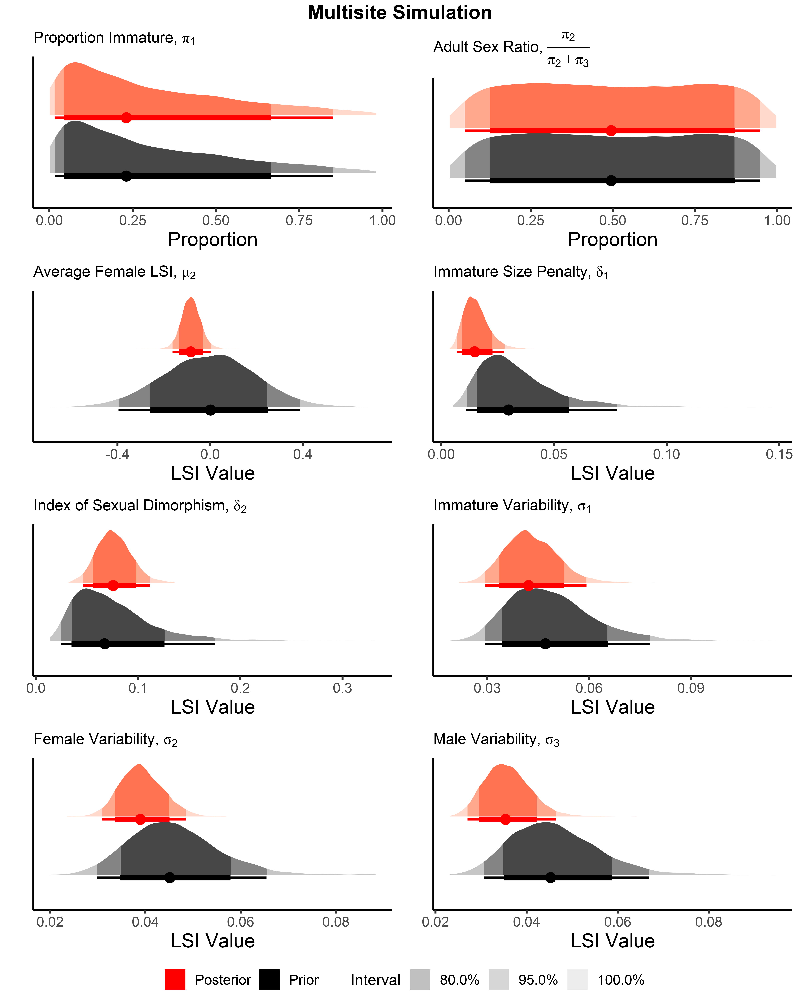
```

```{r figure_s6 (pinarbasi_prior_posterior), echo = FALSE, message = FALSE, warning = FALSE, fig.align = "center", out.width = "\\textwidth", fig.cap = "Prior-Posterior Comparison of Pinarbaşı B Sheep Model Hyper-Parameters"}
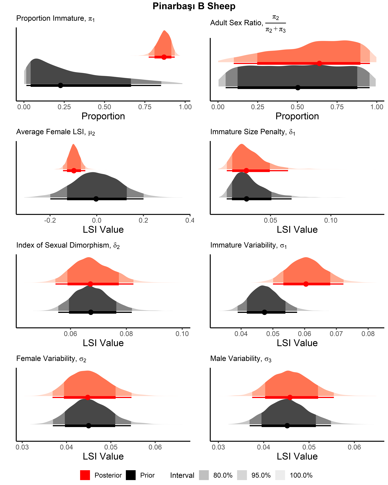
```

```{r figure_s7 (nw_anatolian_prior_posterior), echo = FALSE, message = FALSE, warning = FALSE, fig.align = "center", out.width = "\\textwidth", fig.cap = "Prior-Posterior Comparison of NW Anatolian Cattle Model Hyper-Parameters"}
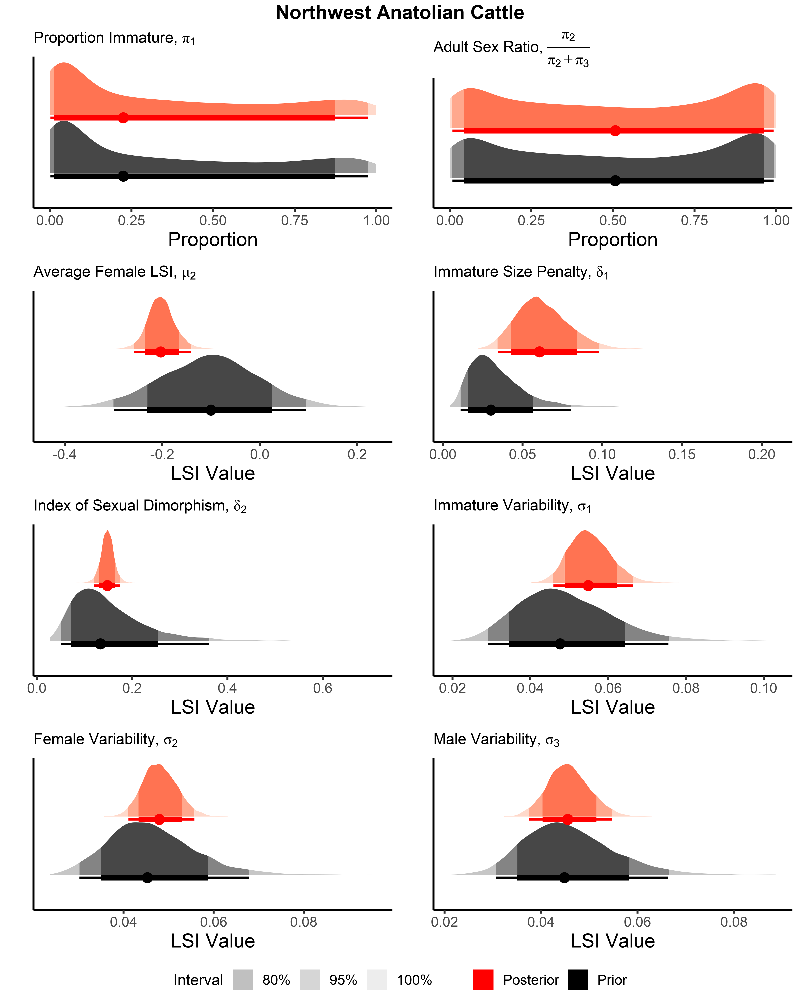
```

\newpage

```{r child= "ZooarchMixMod Model Supplement.Rmd"}

```